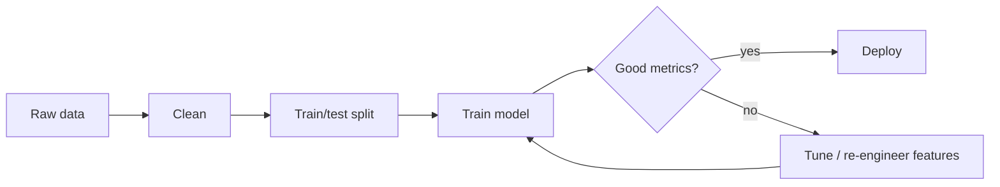

# Beginner-Friendly Style Guide

> The contract every module README/leaf file should follow when explaining a new concept.
>
> Goal: a smart non-technical friend should be able to read any topic file and **understand the idea before hitting the math**.

## Why this guide exists

The bootcamp's existing files are already well-organized study notes — but they speak the language of someone with technical background. Words like *PMF*, *OLS*, *standardization*, *residual* appear without warm-up, and a layman bounces off page 1.

This guide defines the **beginner upgrade pattern**: a fixed sequence of layers we add so the file works for both a complete beginner and a returning learner who just wants the formula.

---

## The 6-layer pattern

Every conceptual section in a module should be structured in this order:

```
┌─────────────────────────────────────────┐
│  1. Real-world analogy   (1-2 sentences)│  ← non-technical hook
│  2. The intuition        (3-4 sentences)│  ← what it means in plain English
│  3. Worked numerical example (mini)     │  ← actual numbers, no symbols
│  4. The diagram          (ASCII/Mermaid)│  ← visual model
│  5. The formula          (LaTeX)         │  ← math, with every symbol named
│  6. The code             (Python/SQL)    │  ← runnable snippet
└─────────────────────────────────────────┘
   (Optional 7th: "Why you should care" — when relevance isn't obvious)
```

A reader can stop at any layer based on their goal:
- Layman → reads layers 1–3
- Practitioner → reads 1–4 and 6
- Researcher / interview prep → reads all 6

---

## Layer 1 — Real-world analogy

**Rule**: every new concept gets a non-technical comparison **before** any jargon.

| Concept | Bad (textbook) | Good (analogy) |
|---|---|---|
| Variance | "The expected value of squared deviations from the mean." | "If a basketball team's scores are 60, 62, 61 — variance is tiny. If they're 30, 90, 60 — variance is huge. Same average, very different consistency." |
| Dropout | "A regularization technique that zeroes activations stochastically during training." | "Imagine a study group where on every Zoom call, 30% of members are randomly muted. Each member can't depend on anyone specific being there, so everyone has to actually learn the material." |
| Gradient descent | "An iterative first-order optimization method." | "You're blindfolded on a hill and want to reach the bottom. You feel which direction slopes down most, take a small step, then feel again. That's it." |

Aim for 1–2 sentences. If the analogy needs a paragraph, it's the wrong analogy.

---

## Layer 2 — The intuition (plain English)

**Rule**: explain *what* and *why* before *how*. No symbols here.

Pattern: **What it does → why we need it → when to use it**.

Example for *normal distribution*:

> A **normal distribution** is the bell-shaped curve where most values cluster near the average and rare values trail off symmetrically on both sides. It shows up everywhere — heights, exam scores, measurement noise — because of a deep mathematical reason (the Central Limit Theorem). We care about it because **most statistical tests assume the data is roughly normal**, so checking this assumption is step one of any analysis.

Three short paragraphs max. If the reader stops here, they should be able to explain the concept to someone else in one sentence.

---

## Layer 3 — Worked numerical example

**Rule**: pick the smallest non-trivial dataset that shows the mechanics.

Use **real numbers** the reader can hand-compute. No "let X be a random variable…" Show the actual computation step by step.

Example for *mean / variance*:

```
Scores: [70, 80, 90, 100]

Mean:           (70 + 80 + 90 + 100) / 4 = 85

Deviations:     70 - 85 = -15
                80 - 85 =  -5
                90 - 85 =   5
               100 - 85 =  15

Squared:        225, 25, 25, 225

Variance:       (225 + 25 + 25 + 225) / 4 = 125

Std deviation:  √125 ≈ 11.2     ← typical distance from average
```

The reader sees the formula in motion before seeing the formula.

---

## Layer 4 — The diagram

Use whichever style fits best. A file can mix all three.

### ASCII art (works everywhere — preferred for inline diagrams)

```
Right-skewed             Symmetric            Left-skewed
   ████▆▄▂▁                ▁▂▄▆██▆▄▂▁              ▁▂▄▆████
  skew > 0                 skew ≈ 0                skew < 0
  mean > median            mean ≈ median           mean < median
```

### Mermaid (renders as a real graphic on GitHub)

Use for flow, architecture, decision trees, sequence:

````markdown

````

### Annotated diagrams (ASCII with labels and arrows)

Best for showing how parts fit together:

```
   Input ─► [Linear ─► ReLU] ─► [Linear ─► ReLU] ─► [Linear] ─► Softmax ─► Probs
              hidden 1            hidden 2          output
```

---

## Layer 5 — The formula

**Rule**: every symbol must be named the line below the equation.

```
y = β₀ + β₁ · x + ε

  y   — outcome we're predicting (e.g., house price)
  x   — input feature (e.g., square footage)
  β₀  — intercept: predicted y when x = 0
  β₁  — slope: how much y changes per unit of x
  ε   — random error / noise we can't explain
```

Add **dimension hints** for vectors/matrices:

```
h_t = tanh(W_xh · x_t + W_hh · h_{t-1} + b_h)

  x_t       (embed_dim,)         input at time t
  h_{t-1}   (hidden_dim,)        previous memory
  W_xh      (hidden_dim, embed_dim)   input → hidden
  W_hh      (hidden_dim, hidden_dim)  memory → memory
```

---

## Layer 6 — The code

**Rule**: minimal, runnable, and matches the formula 1-to-1 when possible.

```python
import numpy as np

scores = np.array([70, 80, 90, 100])

mean    = scores.mean()           # 85.0
var     = scores.var()            # 125.0
std_dev = scores.std()            # 11.18
```

For framework code (sklearn / PyTorch), keep it to the **bare canonical pattern**:

```python
from sklearn.linear_model import LinearRegression

model = LinearRegression().fit(X, y)
print(model.intercept_, model.coef_)
```

If a snippet has more than ~15 lines, it probably belongs in a notebook, not the README.

---

## Layer 7 — "Why you should care" (only when relevance isn't obvious)

For abstract topics (e.g., chi-squared, eigenvalues, KL divergence), add a short box:

> **Why this matters for you**: chi-squared is what tells you whether observed and expected counts differ *more than chance*. Whenever you compare counts (e.g., conversions in A vs B), this is the test. Without it, "our experiment had more clicks!" is meaningless.

---

## Glossary footer

Every leaf file ends with a glossary of every jargon term used in the file:

```markdown
## Glossary

| Term | Plain meaning |
|------|---------------|
| Residual | The gap between what the model predicted and what actually happened |
| OLS | "Ordinary Least Squares" — the math trick of choosing line parameters that minimize total squared residuals |
| PMF | "Probability Mass Function" — for discrete things, the chance of each specific outcome |
```

If a term appears in 3+ files, hoist it to a module-wide glossary in the module's `README.md`.

---

## Tone rules

1. **Address the reader as "you"**, not "one" or "the user".
2. **Active voice over passive**. "We compute the mean" beats "the mean is computed".
3. **No filler words**: actually, basically, simply, just, very. Cut them.
4. **No "easy" / "obvious"** — they shame the beginner.
5. **Define every acronym on first use**, even common ones (ML, DL, NN, RNN, CNN).
6. **Avoid "etc." and "and so on"** — list what you mean, or don't list at all.
7. **Lead with the answer**, then justify. Inverted-pyramid style.
8. **No emojis** in technical content. They distort tone in a serious reference.
9. **Cross-link** related concepts via markdown links: `[backprop](../02-training/01-backprop-gradient-descent.md)`.

---

## File structure template

Every leaf `.md` file should have this skeleton:

```markdown
# <Topic Name>

## Lectures covered
- <bullet list of source lectures from the brochure>

## In one sentence
<plain-English summary that fits in a tweet>

## Real-world analogy
<1-2 sentences>

## The intuition
<3-4 sentences in plain English>

## Worked example
<small dataset, hand-computed>

## Diagram
<ASCII / Mermaid>

## Formula
<LaTeX with named symbols>

## Code
<minimal runnable snippet>

## Common pitfalls
- <bullet>
- <bullet>

## Glossary
| Term | Plain meaning |
|---|---|

## Further reading
- <links to other files in this module or external>
```

Not every file needs every section. **In one sentence**, **The intuition**, **Diagram**, and **Glossary** are the non-negotiable four.

---

## Checklist for any upgrade

Before marking a leaf file done, verify:

- [ ] Layer 1 (analogy) appears before any formula
- [ ] No undefined acronyms
- [ ] At least one diagram (ASCII, Mermaid, or annotated)
- [ ] At least one worked example with concrete numbers
- [ ] Code snippet matches the formula
- [ ] Glossary covers every jargon term used in the file
- [ ] Cross-links to related files in the module
- [ ] No "obviously / simply / just / etc."
- [ ] Reader could stop at the intuition section and still walk away with the right mental model

---

## Reference example

The deep-learning [architectures-and-math.md](core/07-deep-learning/architectures-and-math.md) is the prototype for this style — it covers FFN + RNN with all six layers (analogy implicit, intuition, worked example, diagram, formula, code) and a glossary-style closing reference table. New upgrades should aim for that quality bar.
