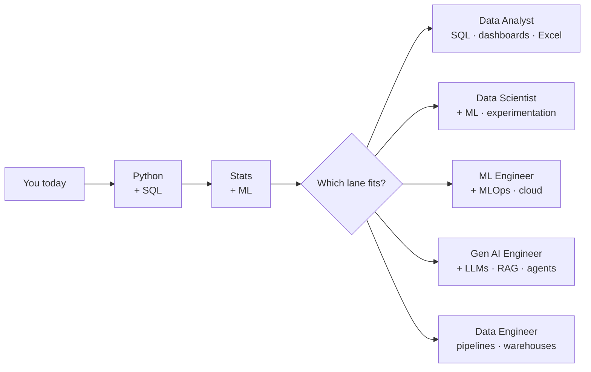

# Part 1 — Welcome, Career Fit, Why This Bootcamp

## Lectures covered
1. Career Benefits of Learning AI and Data Science in 2025
2. How do I know If the Data Scientist / AI Engineer role is suitable for me?
3. Why this Bootcamp vs. other bootcamps?

---

## In one sentence
Before spending 9 months and $196 on this bootcamp, this part helps you decide if the **role** suits you and if **this bootcamp** is the right vehicle to get you there.

## The roadmap of roles you could land

You don't have to pick today. The bootcamp covers all five lanes; specialization comes naturally as you build projects.

---

## 1. Career benefits of AI / Data Science in 2025

### What's actually in demand right now
- **Data Analyst** — SQL + Python + Excel + dashboards (Power BI / Tableau). Entry tier, lots of openings.
- **Data Scientist** — analyst skills + statistics + classical ML + experimentation.
- **ML Engineer** — DS skills + production code + MLOps + cloud.
- **AI / GenAI Engineer** — LLM apps, RAG, agents, vector DBs, orchestration. Newest, fastest-growing.
- **Data Engineer** — pipelines, warehouses, dbt, Spark. The plumbing without which nothing else works.

### Why "AI + Data Science" together (and why this bootcamp combines them)
The line between "data science" and "AI engineering" has blurred. A 2025 hire is expected to:
- Pull data with SQL, clean it in Python
- Train a baseline ML model
- Know when to skip ML and just call an LLM with the right prompt
- Build a small RAG system or agent when the problem fits
- Deploy a Streamlit / FastAPI app and not be afraid of git

The bootcamp is structured to make you that hybrid person.

### Salary anchors (rough, vary by country)
- India: ₹6–25 LPA (entry to mid)
- US: $90k–$200k+
- Europe: €50k–€100k+

> Don't pick this field for the salary. Pick it because you like the work. The salary follows skill, not credentials.

---

## 2. Is this role for me?

### Green flags
- You enjoy poking at data more than you enjoy building UIs
- You're patient with broken pipelines and confusing notebooks
- You like the loop: hypothesis → data → analysis → conclusion → next hypothesis
- You can sit with ambiguity (the "right" answer is rarely obvious)
- You're willing to write SQL, Python, *and* tell stakeholders what the numbers mean

### Yellow flags (workable, but be honest)
- "I just like math." — you'll need way more than math.
- "I want to do AI research." — that's a separate path (PhD-ish). This bootcamp targets industry.
- "I don't like coding." — half the job is coding.
- "I want to skip stats and go straight to LLMs." — LLM apps still need eval, and eval is statistics.

### Red flags (consider another path)
- You don't enjoy any kind of coding, even when it works
- You can't tolerate writing reports / explaining your work to non-technical people
- You want a single deterministic answer for every problem

### Self-honesty exercise
Pick one and write 3 sentences:
1. Why I want this role specifically (not just "tech / good salary")
2. The kind of problem I'd love to spend a Saturday on
3. The one thing I'd quit over

---

## 3. Why this bootcamp vs. others

### What Codebasics commits to
- **Cinematic, story-driven content** — characters (Peter, Tony, Natasha) walk through real business problems. This is the antidote to "watch a sleepy lecturer read slides."
- **Real datasets, real mess** — millions of records, NULLs, outliers, schema drift. Not the iris dataset.
- **Domains you can claim on a resume** — F&B, banking, healthcare, finance, hospitality, automotive, real estate, logistics.
- **Job-placement track that runs in parallel** — not a tacked-on appendix. Resume, portfolio, LinkedIn, mock interviews, applications.
- **Two virtual internships** — Stale Fruit Detector (CV) and PubMed RAG Q&A (NLP/Gen AI).
- **Lifetime access** — go back when you forget something a year later.
- **Doubt clearance via Discord** — not "we'll get back in 48 hours."
- **30-day refund + price-difference protection.**

### What this bootcamp is *not*
- It's not a free college degree — you pay for it (~$196).
- It's not a guaranteed-placement program — assistance ≠ guarantee.
- It's not a substitute for *practice*. You can finish all lectures and still flunk an interview if you didn't open a notebook yourself.

### Honest comparison vs. alternatives
| Alternative | Pros | Cons vs. Codebasics |
|---|---|---|
| Free YouTube + Kaggle | Free, infinite breadth | No structure, no projects with stakes, no community accountability |
| University master's | Credential, deep theory | 2 years, $20–80k, often less practical |
| Premium bootcamps ($5–15k) | Live cohorts, mentors | 30–80× cost; same content density |
| Coursera specializations | Cheap, certs | Mostly toy datasets, weak job-track |

---

## My notes from this part

_(fill as you watch)_

- Most useful insight:
- Most surprising thing:
- Question I still have:

## Self-check

- [ ] Can I list 5 different roles AI/DS people get hired into?
- [ ] Have I written my "honesty exercise" answers down somewhere?
- [ ] Do I understand what specifically Codebasics offers that free YouTube doesn't?

---

## Glossary

| Term | Plain meaning |
|------|---------------|
| **Data Analyst** | Pulls data, makes dashboards, writes reports — the "tell stakeholders what's going on" role |
| **Data Scientist** | Analyst + statistics + ML modelling. Frames vague business problems as math problems. |
| **ML Engineer** | Data scientist who can also ship — production code, MLOps, cloud, monitoring |
| **AI / GenAI Engineer** | Builds LLM-powered apps: RAG, agents, prompt engineering, evals. Newest specialty. |
| **Data Engineer** | Builds the pipelines and warehouses that feed every other role |
| **MLOps** | "ML + DevOps" — automating training, deployment, monitoring of ML models |
| **RAG** | Retrieval-Augmented Generation — gives an LLM access to your private documents |
| **Agent** | An LLM that can use tools (call APIs, run code, search) to complete multi-step tasks |
| **Vector DB** | Database storing text as numerical vectors for semantic search (Chroma, Pinecone, pgvector) |
| **Cinematic content** | Codebasics' style — story-driven characters walking through real business problems |
| **Practice Room / Practice Arena** | Interactive coding environments inside the Codebasics platform |
| **ATS (Applicant Tracking System)** | Software companies use to filter resumes — the bootcamp's resume builder optimizes for this |
| **Build in public** | Posting your learning weekly so recruiters/peers can see a trail of work |
| **Virtual Internship** | A long-form project simulating real workplace deliverables (not a real job) |

## Further reading
- Next: [02-learning-method-support.md](02-learning-method-support.md)
- Module 2: [../02-online-credibility/README.md](../02-online-credibility/README.md) — how to set up LinkedIn / GitHub before applying
- Module 3: [../03-build-in-public/README.md](../03-build-in-public/README.md) — the philosophy + git fundamentals
