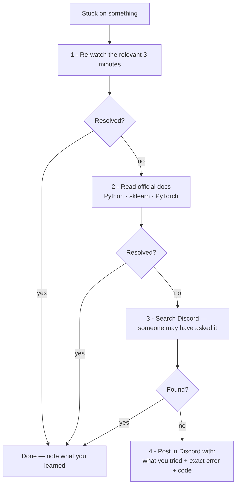

# Part 2 — Learning Method & Support Infrastructure

## Lectures covered
4. What kind of Job Assistance Do You Provide?
5. How Do I Get Doubt-Clearance Support?
6. Unlock Discord Channels
13. How Will I Be Informed About Monthly Live Webinars?
14. System Requirements

---

## In one sentence
The bootcamp gives you **content + doubt-clearance + job-assistance**, but only the second one is "free" — the first needs you to show up daily, the third needs you to actually apply.

## When you're stuck — the help-seeking loop

Following this order saves time and respects everyone else's time. Skipping straight to step 4 floods Discord and slows you down.

---

## 1. Job assistance — what's actually included

| Tool / Service | What it does | When to use |
|---|---|---|
| **ATS Resume Builder** | Generates an ATS-friendly resume from a structured form | Before applying anywhere |
| **Project Portfolio Website** | Auto-generates a portfolio site from your projects | When you have ≥3 projects |
| **Online Credibility module** | LinkedIn + GitHub setup + posting templates | Started early, refined throughout |
| **Smart Job Assistance Portal** | Talent team reviews resume/portfolio/LinkedIn; tracks applications | When you start applying |
| **Job Application Playbook** | Strategies that actually work; saves ~30 days of trial-and-error | Right before applying |
| **LinkedIn Optimizer** | AI scoring + section-specific feedback | After your first LinkedIn revision |
| **Mock Interview** | Two 1-on-1 sessions when a real interview is scheduled | After clearing first screen |
| **Interview Question Bank** | Module-wise (Python, Stats, ML, NLP, DL, Gen AI) | Throughout, especially before interviews |
| **Interview Playbook** | Step-by-step preparation framework | Before each interview |

> **Read this twice**: assistance is *real* but it's not placement. Showing up with a half-built portfolio and zero LinkedIn activity is the #1 way people get stuck.

---

## 2. Doubt-clearance — how it actually works

### Discord (primary channel)
- Unlimited chat support
- Channels organized by module (#python, #sql, #math-stats, #ml, etc.)
- Mentors + fellow learners answer
- Etiquette: search before asking, post code in code blocks, attach the error message *and* what you tried

### Live webinars (monthly)
- Two AI/DS problem-solving sessions per month
- Recorded; one-year access from enrollment
- Topics: real production AI systems — RAG, agents, ML pipelines, LLM eval

### Quiz / checkpoints
- End of each module
- Mandatory before unlocking next module

### Self-help loop (the order I should try)
1. Re-watch the relevant ~3 minutes
2. Read the official docs (Python, scikit-learn, PyTorch)
3. Search Discord — someone asked the same question
4. Ask in Discord with: *what I'm trying to do*, *what I tried*, *exact error message*

---

## 3. Discord — getting set up

- [ ] Click the unlock link in module 1, lecture 6
- [ ] Set username to *real name* (not "x_user_x") — recruiters lurk
- [ ] Join channels for active modules + #general + #showcase
- [ ] Post one #introduction message in week 1
- [ ] Aim for ≥1 useful contribution per week (answer someone, share a fix, post a project)

> The students who network on Discord land jobs faster. Not coincidence — referrals.

---

## 4. Live webinars — staying informed

- Codebasics announces dates by email + Discord pings
- Add a recurring 90-min block in your calendar for "Codebasics live session"
- Watch live if possible; you can ask questions
- If you miss it, watch recording within a week — the *current* session always references the previous one

---

## 5. System requirements

### Minimum hardware
- **RAM**: 8 GB (16 GB strongly recommended once you hit DL)
- **Storage**: 50 GB free
- **CPU**: any modern dual-core
- **GPU**: not required for ML; helpful for DL — but Google Colab's free GPU works for the bootcamp

### Software stack (will install over the course)
- **Python 3.10+**
- **VS Code** (or PyCharm)
- **Jupyter / JupyterLab**
- **MySQL Workbench** or **DBeaver**
- **Git** + **GitHub Desktop** (optional)
- **Anaconda** or **uv / venv** for environment management

### Cloud accounts to create early
- GitHub (mandatory)
- Kaggle (free GPUs, great datasets)
- Google Colab (free)
- Hugging Face (will need it for NLP / Gen AI)
- AWS Free Tier (for the AgentCore project later)

### What I should *not* worry about yet
- Buying a fancy GPU
- Paid LLM API credits — early modules don't need them
- Cloud-deploy infrastructure

---

## My setup checklist

- [ ] Discord joined, intro posted
- [ ] GitHub account created, profile name = real name
- [ ] Python 3.x installed and `python --version` works
- [ ] VS Code or PyCharm installed
- [ ] Calendar block: 1 hour/day, 5 days/week minimum
- [ ] Calendar block: 2 hours/week for live webinar
- [ ] Note-taking system picked (this folder!)

## Self-check

- [ ] Where do I post a doubt at 11pm and expect an answer by morning?
- [ ] What's the difference between Discord support and the Smart Job Portal?
- [ ] Do I have all required software installed?

---

## Glossary

| Term | Plain meaning |
|------|---------------|
| **Doubt clearance** | Indian-English for "answering your questions" — the support function |
| **Discord** | A chat platform; Codebasics organizes mentorship there by module channel |
| **Practice Room** | An interactive coding sandbox built into the Codebasics platform |
| **Practice Arena** | Bigger challenge sets — the "gym" version of practice rooms |
| **Smart Job Portal** | The dashboard where the Talent team reviews your resume + tracks applications |
| **ATS Resume Builder** | Tool that writes a resume optimized for Applicant Tracking Systems |
| **Live Webinar** | Monthly recorded sessions on real production AI/DS systems — RAG, agents, eval |
| **System Requirements** | Bare-minimum hardware/software you need to run the bootcamp's tools |
| **Anaconda** | A Python distribution that ships pre-installed with most data libraries |
| **uv / venv** | Modern lightweight virtual-environment tools — alternative to Anaconda |
| **MySQL Workbench** | Free GUI for running SQL against MySQL databases |
| **DBeaver** | Free GUI alternative to MySQL Workbench, supports many databases |
| **Hugging Face** | The "GitHub for ML models" — open-source models, datasets, demos |
| **Kaggle** | Data-science competition + free GPU + dataset hub site |
| **Google Colab** | Free Jupyter notebooks in the browser with optional GPU/TPU |
| **AWS Free Tier** | Amazon's free quota for cloud services — used in the AgentCore project later |

## Further reading
- Next: [03-time-projects-soft-skills.md](03-time-projects-soft-skills.md)
- Setup specifics: [../01-python/01-basics/01-installation.md](../01-python/01-basics/01-installation.md)
