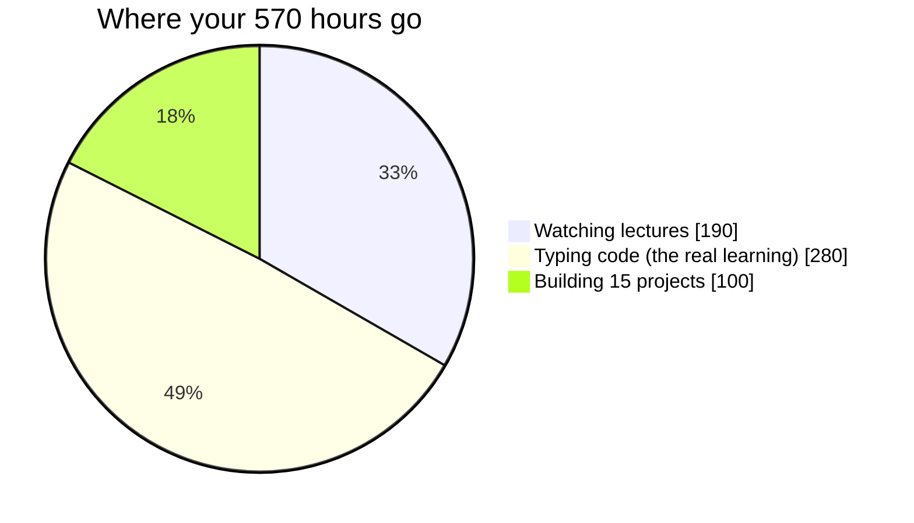

# Part 3 — Time, Projects, Soft Skills

## Lectures covered
7. Quality over Quantity
8. How Much Time Do I Need to Complete The Bootcamp?
9. How Many Business Projects Will I Complete?
10. What are the Soft Skills I Will Acquire?
11. Pricing, EMI and Refund
12. Bootcamp Syllabus Overview

---

## In one sentence
This part is the brutal-honesty math: roughly **570 hours** of total work, **15 portfolio projects**, and the soft skills that only develop because the bootcamp forces presentations and stakeholder feedback into every project.

## Where the time actually goes

The 30% / 70% rule from §1: lectures are recognition, code-typing is production. If you only watched lectures, you'd "know" everything and be unable to build anything.

---

## 1. Quality over quantity

**The trap**: watching 10 hours of lectures, then opening Netflix.
**The fix**: 1 hour watching + 2 hours typing the code yourself + 1 hour explaining it (Discord post / LinkedIn / blog).

Codebasics' philosophy here: a single deeply-built project beats a dozen half-built ones. **One hospitality-EDA project you can defend in an interview > five Kaggle notebooks you forgot the next day.**

### The 70/30 split
- 30% video lectures
- 70% typing code yourself, breaking things, re-running, exercises, projects

If your ratio inverts, you're learning to *recognize* concepts (passive) instead of *produce* them (active). Recognition feels like understanding. It isn't.

---

## 2. Time commitment

### Realistic timelines (based on hours/week)

| Pace | Hours/week | Bootcamp length |
|---|---|---|
| Light (parallel to full-time job) | 6–8 | 9–12 months |
| Moderate | 10–14 | 6–8 months |
| Aggressive | 20+ | 3–4 months |

### Per-module ballparks (rough)

| Module | Lecture hours | + Practice (~2×) | Realistic total |
|---|---|---|---|
| Bootcamp Intro | 2 | 0 | 2h |
| Python | 18 | 36 | ~54h |
| SQL | 12 (basic+advanced) | 24 | ~36h |
| Math & Stats | 13 | 26 | ~39h |
| Machine Learning | 30 (est.) | 60 | ~90h |
| Deep Learning | 25 (est.) | 50 | ~75h |
| NLP | 15 (est.) | 30 | ~45h |
| Gen AI & Agentic | 25 (est.) | 50 | ~75h |
| Internship 1 + 2 | 30 (est.) | 60 | ~90h |
| Career track + practice rooms | 20+ | 40 | ~60h |
| **Total** | **~190h** | **~380h** | **~570h** |

That's roughly **9 months at 15 h/week** or **3.5 months at 40 h/week**.

> Don't try to finish in 6 weeks. Retention matters more than speed.

### Daily / weekly rhythm I'm committing to

- **Daily**: 60–90 min, same time slot
- **Weekly**: 1 deep practice block (3 hours, weekend) for projects
- **Monthly**: Live webinar + retrospective ("what did I retain?")

---

## 3. Business projects — what I'll build

### Python (2 projects)
1. **Hospitality Domain EDA** — pandas, matplotlib, fact/dim tables, star schema
2. **Expense Tracking System** — FastAPI backend + Streamlit frontend + MySQL

### SQL (2 projects)
3. **Finance & Top-N Insights** — UDFs, stored procedures, views
4. **Supply Chain Analytics & Optimisation** — helper tables, triggers, query tuning

### Math & Stats (1 project)
5. **AtliQo Bank — Credit Card Launch** — 50k+ records, target market identification, hypothesis testing, A/B test design

### Machine Learning (3 projects)
6. **Healthcare Premium Prediction** (regression)
7. **Credit Risk Modelling** (classification, NBFC domain, KS Stat, Gini)
8. **Beverage Price Range Prediction** (classification on survey data)

### Deep Learning (1 project)
9. **Car Damage Detection using CNN** (transfer learning, Streamlit + FastAPI)

### Gen AI / Agentic AI (4 projects)
10. **Real Estate Assistant using RAG** (Chroma DB)
11. **E-Commerce Chatbot** (semantic routing + SQLite)
12. **Agentic AI HR Onboarding** (MCP + Claude)
13. **Customer Care AI Agent** (Amazon Bedrock AgentCore, full lifecycle)

### Virtual Internships (2)
14. **Stale Fruit Detector** (CNN, agri-tech logistics)
15. **PubMed RAG Q&A System** (healthcare LLM, Llama 3)

> By the end I'll have **15 portfolio-worthy projects** spanning F&B, banking, healthcare, finance, hospitality, automotive, real estate, and logistics.

---

## 4. Soft skills built along the way

The bootcamp is structured to develop these without making them explicit "soft skills lessons":

### Story-telling with data
Every project ends with stakeholder presentation / written insights. Practice = built-in.

### Stakeholder management
Project chapters include "Phase 1 feedback meeting with stakeholders" etc. — you watch the dynamic.

### Project management
Kanban + JIRA setup is taught inside the AtliQo Bank module. Real PM, not theoretical.

### Build-in-public communication
Posting weekly forces you to articulate work for non-technical audiences.

### Debugging mindset
The cinematic format shows characters *getting stuck and recovering* — not airbrushed solutions.

### Asking for help
Discord etiquette teaches the right way to ask, which translates directly to professional environments.

---

## 5. Pricing, EMI, refund

- **One-time price**: ~$196 (≈ ₹16,000 — varies by region/promotions)
- **EMI**: available via local providers in India
- **30-day full refund** — no questions asked
- **Pay-the-difference protection** — if Codebasics adds a major module, you can upgrade by paying just the delta

> This is unusual for online courses. Most lock you in. The 30-day refund is a real trust signal.

---

## 6. Syllabus at a glance

10 core modules, each covered in its own folder under `core/`:

0. Bootcamp Introduction (this one)
1. Python
2. Online Credibility
3. Build In Public
4. SQL
5. Math & Statistics
6. Machine Learning
7. Deep Learning
8. NLP
9. Gen AI & Agentic AI

Plus: Career track, Internships, Practice Rooms, Supplementary.

---

## My personal commitments

Filling these in is the point of this part:

- I will study **___ hours / week**.
- My daily slot is **___ to ___**.
- I'll finish by approximately **___ (date)**.
- I will post **___ build-in-public posts / week** (minimum 1).
- My target role is **___**.
- I commit to building **all 15 projects** before applying for jobs.

## Self-check

- [ ] Have I picked my weekly hours target and put it on a calendar?
- [ ] Can I name the 13–15 projects without looking?
- [ ] Do I know the refund window?

---

## Glossary

| Term | Plain meaning |
|------|---------------|
| **Recognition vs production** | Knowing it when you see it (passive) vs. being able to build it from scratch (active) |
| **70/30 rule** | 30% lectures, 70% typing/practising code |
| **Quality over quantity** | One deeply-built project beats five half-built ones |
| **Star schema** | A database design with one fact table surrounded by dimension tables (taught in Hospitality EDA) |
| **Fact / Dimension table** | Fact = transactions/measurements; Dimension = descriptive attributes (date, product, customer) |
| **Streamlit** | Python library for building data apps with no front-end code |
| **FastAPI** | Modern Python framework for building APIs quickly with auto-validation and docs |
| **NBFC** | Non-Banking Financial Company — credit-risk project domain |
| **KS Stat / Gini** | Credit-risk model evaluation metrics (related to ROC-AUC) |
| **WOE / IV** | Weight of Evidence and Information Value — credit-scoring feature engineering technique |
| **CNN** | Convolutional Neural Network — the architecture for image tasks |
| **Transfer learning** | Reusing a pre-trained model and fine-tuning it on your smaller dataset |
| **Chroma DB** | Open-source vector database used in the Real Estate RAG project |
| **MCP** | Model Context Protocol — Anthropic's standard for connecting LLMs to tools and data |
| **AgentCore** | Amazon Bedrock's framework for production AI agents |
| **EMI** | Equated Monthly Installment — paying tuition in monthly chunks |
| **Live webinar** | Real-time recorded session, included in the bootcamp price |
| **Pay-the-difference protection** | If Codebasics adds modules later, you pay only the price delta |
| **Story-telling with data** | Communicating analytical findings as a narrative, not a wall of charts |

## Further reading
- Next: [04-build-in-public-intro.md](04-build-in-public-intro.md)
- Project list with file links: [README.md](README.md) under "Projects" section
