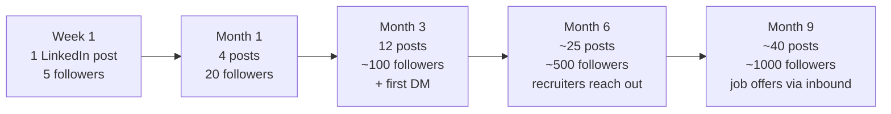

# Part 4 — Build In Public (Introduction)

> This is just the intro inside Module 0. The full **Build In Public** module is Module 3 in `core/03-build-in-public/`.

## Lectures covered
- What is Build In Public?

---

## In one sentence
**Build In Public** = posting tiny weekly artifacts of your learning (a chart, a bug, a fix, a project) so that by month 6 you have a public *trail* of work that does the job-hunting for you.

## Real-world analogy
A chef who cooks alone in their kitchen for 9 months is invisible — no matter how good the food is. A chef who posts one dish a week on Instagram has a **portfolio of receipts** for everything they made. Same skill, completely different outcome when applying for jobs. Build-in-public is putting your code on Instagram.

## At-a-glance — the compounding curve

The first 10 posts feel useless. They're not — they're the foundation. The compounding kicks in after ~12 posts.

---

## What "Build In Public" means

**Default**: learn alone → finish a course → maybe upload one project → apply for jobs and get ignored.

**Build In Public**: every week you post a small thing publicly — a chart, a bug, a fix, a learning, a project. By month 6 there's a *trail* of work that:
- recruiters can scan in 90 seconds
- your future self can reference
- attracts mentors and peers organically
- compounds — early posts become discoverable assets

## Why it works

1. **Accountability** — you can't quietly fall behind when ~200 LinkedIn followers know you started.
2. **Feedback loop** — public mistakes get corrected by strangers; private mistakes harden into bad habits.
3. **Network effect** — referrals come from "I saw your post about X" 10× more than cold applications.
4. **Memory consolidation** — the act of writing/explaining is when learning sticks (Feynman technique, formalized).
5. **Optionality** — one viral post can change your trajectory. Zero private posts can't.

## What "in public" actually looks like

The trap: thinking you need a clean blog with custom domain before posting. You don't.

**Minimum viable build-in-public**:
- LinkedIn post: 1/week (most leverage for job hunt)
- GitHub commits: 3+/week (the green-square trail)
- A README on every repo, with screenshots
- (Optional) X/Twitter thread when you finish a milestone
- (Optional) Blog (Medium / Hashnode / personal site) when something's worth a long write-up

## Templates I'll keep handy

### "Just learned X" post
> Just understood [concept] today.
>
> Quick summary in my words:
> – [bullet 1]
> – [bullet 2]
> – [bullet 3]
>
> [Diagram, screenshot, or 5-line code snippet.]
>
> What was the moment YOU finally got [concept]?

### "Project done" post
> Finished [project] — [one-line problem statement].
>
> Approach: [3 bullets]
> Tech: [stack]
> What surprised me: [1 honest insight]
>
> Repo: [link]   ·  Demo: [link if any]

### "Stuck" post
> Stuck on [problem]. Here's what I tried: [1, 2, 3]. Hypothesis I'm testing: [...]. Open to suggestions.
>
> (Yes, you can post when you're stuck. It's the most valuable kind of post for the community and the most credible for you.)

## Common pushback (and the honest answer)

| Worry | Honest answer |
|---|---|
| "What if my post is wrong?" | Then someone corrects you and you learn faster. Public mistakes get corrected; private ones don't. |
| "I'll wait until I'm ready." | You won't be ready. Post now anyway. |
| "I don't have a big network." | Neither did anyone, until they posted. |
| "I'm an introvert." | Posting is *async writing*, not networking. Different skill. |
| "Everyone will copy my work." | Recruiters care about your *thinking*, which can't be copied. |

## What I'm committing to

- Minimum **1 LinkedIn post per week** for the rest of the bootcamp.
- Cadence over polish.
- Honest tone — share when stuck, not just when winning.
- Use tags + relevant communities (#datascience #buildinpublic #100DaysOfData).

## My first build-in-public post

> Today I started the Codebasics Gen AI & Data Science Bootcamp 3.0.
>
> The plan: 9 months, 15 real-world projects across hospitality, banking, healthcare, e-commerce, and AI agents.
>
> I'll post a learning every week — what clicked, what didn't, what I shipped.
>
> First module starts now. Following along welcome.
>
> #buildinpublic #datascience #aiengineering

_(replace with my own draft when I post for real)_

## Self-check

- [ ] Have I posted my "starting the bootcamp" post on LinkedIn?
- [ ] Is my GitHub username = my real name (or close)?
- [ ] Do I know the difference between a `repo README` and a `LinkedIn post`?
- [ ] Did I save the templates above somewhere I'll reuse them?

---

## Glossary

| Term | Plain meaning |
|------|---------------|
| **Build in public** | Sharing your work-in-progress publicly on a regular cadence |
| **Cadence** | How often you post — consistency matters more than virality |
| **Compounding** | Each post helps future posts get more reach (followers, search ranking, referrals) |
| **Inbound** | Recruiters reaching out to you (vs. you applying) — the dream outcome of build-in-public |
| **Referral** | Someone inside a company recommending you for a role — the highest-conversion job source |
| **Feynman technique** | Learning by explaining a topic in simple terms; build-in-public formalizes this |
| **README** | The `README.md` file at the top of a GitHub repo — the project's front door |
| **#100DaysOfData / #buildinpublic** | Common LinkedIn / X hashtags that boost your reach in DS communities |
| **Optionality** | One viral post can change your career; zero private posts can't |
| **Polish vs cadence** | Posting weekly with rough work beats posting once with perfect work |
| **Async writing** | Posting and engaging on your own schedule (vs synchronous "networking" — different skill) |

## Further reading
- Next: [05-enhance-learning.md](05-enhance-learning.md)
- Full module: [../03-build-in-public/README.md](../03-build-in-public/README.md)
- Setup LinkedIn / GitHub: [../02-online-credibility/README.md](../02-online-credibility/README.md)
