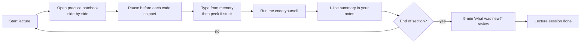

# Part 5 — Enhance Your Learning Experience + The Agreement

## Lectures covered
- Setting Video Resolution and Video Speed Globally (**mandatory**)
- An Agreement Between You and Me
- Checkpoint (Quiz)

---

## In one sentence
Tune your video player once, sign the "Agreement Between You and Me" honestly, and pass the checkpoint quiz — these three small acts decide whether the next 9 months are productive or drift.

## The learning hygiene loop



This is the Codebasics-recommended ritual. The single biggest predictor of who finishes the bootcamp.

---

## 1. Video player — set it once, forget it

### Why this is mandatory
Codebasics' video is shot at high resolution; default browser playback often defaults *down*. Bad image quality of code = misread variable names = bugs.

### Settings to configure (do this once on the Codebasics player)
- **Resolution**: 1080p (or highest your bandwidth allows)
- **Speed**: 1.0x to start; 1.25x once you know the instructor's cadence
- **Captions**: ON if non-native English; helps catch technical vocab
- **Autoplay next**: OFF (kills retention; each lecture should end with intentional reflection)

### My speed-tuning rules
- New concept: 1.0x
- Re-watch: 1.5x – 1.75x
- Code-along (typing while watching): 1.0x or pause
- Familiar topic refresh: 2.0x acceptable

### Notebook-while-watching ritual
1. Open lecture and the relevant practice notebook side-by-side
2. Pause the video before typing a snippet
3. Type from memory first, then peek
4. After each lecture: write 1-line summary in my notes
5. End of section: 5-minute "what was new?" review

---

## 2. The Agreement Between You and Me

This lecture is a verbal contract between Codebasics and the learner. It boils down to:

### Codebasics commits to
- Quality content, regularly updated
- Discord-based unlimited doubt support
- Real-world projects with public datasets where possible
- Job-assistance tooling (resume, portfolio, LinkedIn, mock interviews)
- Lifetime access; pay-difference protection on upgrades
- 30-day full refund if you're unhappy

### I commit to (this is the part I sign)

- [ ] **Show up consistently** — daily blocks beat weekend marathons
- [ ] **Type the code myself** — no copy-paste
- [ ] **Do every exercise and quiz** — the boring ones especially
- [ ] **Build all the projects** — no skipping
- [ ] **Post in public** — at least weekly
- [ ] **Ask for help when stuck for >30 min** — Discord exists for this
- [ ] **Help others when I can** — answering builds my own retention
- [ ] **Re-watch when fuzzy, not when comfortable** — re-watching what I already know is procrastination dressed up as effort
- [ ] **Don't compare timelines** — someone else finishing first means nothing
- [ ] **Be honest in self-check questions** — fooling myself wastes my own money

> Sign this in my own words: write a 3-sentence "what I commit to" statement and pin it where I study.

### My signed agreement

```
I, [name], commit to:
1. ...
2. ...
3. ...

If I miss a week, I forgive myself and resume — I do not quit.

Signed: [date]
```

---

## 3. Checkpoint (quiz)

The end-of-module quiz checks I've absorbed the operational details. Typical questions:

- How many monthly live webinars are included?
- What's the refund window?
- Where do I get unlimited doubt support?
- How many business projects are in the bootcamp?
- What's "Build In Public" in one sentence?

**Pass condition**: usually 70%+ to unlock the next module. If I fail, I re-watch the relevant lecture, not the entire module.

---

## What's next

After the checkpoint quiz unlocks, the next module is **Python: Beginner to Advanced for Data Professionals** (Module 1). Open `core/01-python/README.md` to see the plan there.

## Self-check

- [ ] Have I configured my video player (resolution / speed / captions)?
- [ ] Have I written my own version of "the agreement" and saved it visibly?
- [ ] Did I pass the Module 0 checkpoint quiz?
- [ ] Am I ready (mentally + logistically) for Python?

---

## Glossary

| Term | Plain meaning |
|------|---------------|
| **1080p** | High-definition video resolution — read-able variable names in code screenshots |
| **Captions / subtitles** | Text version of spoken audio — useful for technical vocabulary even if English is your first language |
| **Autoplay next** | Player feature that auto-jumps to the next lecture — turn it OFF to retain content |
| **Code-along** | Typing code while watching the lecture, instead of after |
| **Active recall** | Trying to remember something from memory before peeking — strongest learning technique |
| **Spaced repetition** | Reviewing material at increasing intervals — what the "5-min 'what was new?'" review starts |
| **Checkpoint quiz** | End-of-module quiz, ~70% pass mark, gates the next module |
| **Pay-difference protection** | If Codebasics adds modules, you can upgrade at delta cost only |

## Further reading
- Begin Module 1: [../01-python/README.md](../01-python/README.md)
- Big-picture self-check: [README.md](README.md)
