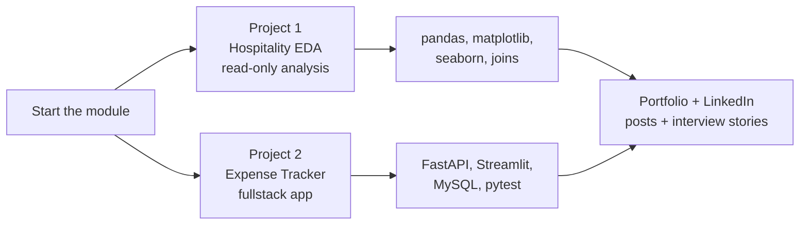

# Section 1+2 — Welcome & Project Description

## Lectures covered
- **Section 1**: Course Content Overview
- **Section 2**: Project 1 (Hospitality Domain Data Analysis), Project 2 (Expense Tracking System)

---

## In one sentence
You will learn Python by building two real things — a hotel-revenue analysis notebook and a small fullstack expense-tracker app — instead of grinding through abstract syntax drills.

## Real-world analogy
Think of learning to cook. One way: memorize a list of 200 ingredients before touching a pan. Another way: pick two recipes (a stir-fry and a stew) and learn each ingredient when the recipe calls for it. Codebasics picks the second way — you meet `pandas.groupby` while answering a real hotel revenue question, not before.

## The intuition (plain English)
The module is **project-driven**, not topic-driven. Two real builds are previewed first so every later lecture has a place to land. Project 1 is a **read-only analysis** of hotel data (the "Data Analyst" mode). Project 2 is a **read-write app with a UI** for tracking expenses (the "Software Engineer who works with data" mode). Together they prove you can do both — exactly what entry-level data jobs ask for.

## Mini worked example
A typical Project 1 question and the kind of answer you produce:

```
Question:  Which city's hotels generate the most revenue?
Code:      df.groupby("city")["revenue_realized"].sum().sort_values(ascending=False)

Output:
  Mumbai      24,500,000
  Bangalore   18,200,000
  Hyderabad   12,700,000
  Delhi       10,900,000

Insight (the actual deliverable):
  "Mumbai drives 41% of total revenue from only 28% of bookings.
   Protect this segment — it is the cash cow."
```

The code is one line. The **insight sentence** is the deliverable.

## At-a-glance



## Why this matters
- Recruiters hire on portfolios, not certificates — both projects become GitHub repos you can show.
- Building first means every concept (groupby, joins, FastAPI routes) lands on a real use case.
- The pair covers the two flavors of Python data work, so you stay flexible during job hunts.

---

## What this section actually does

It frames the module as **project-driven**, not topic-driven. Two real builds are previewed *before* you write a single line of Python — so when you later learn `pandas.groupby`, you already know which project you'll use it in.

This is the right way to learn programming: **build first, theorize second**.

---

## Project 1 — Hospitality Domain Data Analysis

### Domain
The hotel industry — multiple properties, room categories, bookings, occupancy, revenue. The dataset reflects this with **fact tables** (bookings, ratings) and **dimension tables** (hotels, rooms, dates).

### Business questions you'll answer
- What's the average occupancy rate per city / per property type?
- Which property categories generated highest revenue last quarter?
- How does weekday vs weekend revenue compare?
- Which booking channels (direct, OTA, others) underperform on rating?
- What's the cancellation rate by property and what does it cost?

### Skills you'll practice end-to-end
- pandas: `read_csv`, `merge`, `groupby`, `pivot_table`, `apply`
- matplotlib + seaborn for plots
- Star-schema concepts (Fact + Dim)
- ETL flow: extract → transform → load (here: clean + reshape)
- OLTP vs OLAP distinction
- Insight generation (i.e., translating numbers into a sentence a stakeholder cares about)

### What "done" looks like
A Jupyter notebook that:
1. Loads 5+ CSVs
2. Joins them into a single analytical frame
3. Cleans (NA handling, type coercion, duplicate removal)
4. Produces 8–12 visualizations
5. Ends with a "Top 5 insights for the GM" markdown summary

> **The output is not the code — the output is the markdown summary.** Stakeholders never read your notebook. They read your conclusions.

---

## Project 2 — Expense Tracking System

### Why this is unusual for a "Python for data" course
Most data-Python courses end at pandas. Codebasics intentionally takes you further: a **fullstack app**. You'll build:

- **Backend**: FastAPI service with CRUD endpoints
- **Frontend**: Streamlit UI
- **Storage**: MySQL via SQLAlchemy / mysql-connector
- **Validation**: Pydantic models
- **Tests**: pytest unit + integration
- **Logging**: structured logs with the `logging` module
- **Packaging**: README + `requirements.txt`

### Functional features
- Log a new expense (date, category, amount, notes)
- Update / delete an expense
- View expenses for a date range
- Category-wise + month-wise analytics with charts
- A clean Streamlit dashboard

### Architecture preview

```
┌──────────────────┐     HTTP     ┌──────────────────┐     SQL      ┌─────────────┐
│   Streamlit UI   │ ───────────> │   FastAPI        │ ───────────> │   MySQL     │
│  (frontend)      │              │   (backend)      │              │  (storage)  │
└──────────────────┘ <─────────── └──────────────────┘ <─────────── └─────────────┘
                       JSON                              rows
```

Layers and where they live in the bootcamp:

| Layer | Section that teaches it |
|---|---|
| Pydantic models for request/response | Section 14 |
| FastAPI endpoints | Section 13 |
| SQL CRUD + connection | Section 14 |
| Pytest tests | Section 14 |
| Streamlit UI | Section 15 |
| Logging | Section 14 |
| README / requirements.txt | Section 15 |

### What "done" looks like
A Git repo I can show in interviews containing:
- `backend/` — FastAPI code
- `frontend/` — Streamlit code
- `tests/` — pytest suite
- `requirements.txt`
- `README.md` with screenshots and run instructions
- A short demo video (optional, big plus)

---

## Why these two projects in particular

The pair is chosen deliberately:

1. **Project 1** = **read-only analytics** with messy data. The "Data Analyst" skin.
2. **Project 2** = **read-write transactional system** with a UI. The "Software Engineer who knows data" skin.

Together they prove you can do both — which is exactly what entry-level data jobs require.

## My notes from this section

- Initial reaction:
- Which project excites me more, and why:
- Concerns / unknowns:

## Self-check

- [ ] Can I summarize each project in 30 seconds?
- [ ] Do I understand the *business* value of each, not just the tech?
- [ ] Do I know which sections of this module map to which project?

---

## Glossary

| Term | Plain meaning |
|------|---------------|
| **EDA** (Exploratory Data Analysis) | The first pass over a new dataset — look at shapes, missing values, distributions, relationships before any modeling |
| **OLTP** (Online Transaction Processing) | The "running the business" database — many small writes (a booking, a sale) |
| **OLAP** (Online Analytical Processing) | The "understanding the business" database — large analytical reads (revenue by city) |
| **ETL** (Extract, Transform, Load) | The pipeline shape: pull data from sources, clean and reshape it, write to a warehouse |
| **Fact table** | The events table — bookings, sales, clicks. Numbers you can sum live here. |
| **Dimension table** | Context tables — hotels, products, dates. Adjectives that describe the events. |
| **Star schema** | One fact table joined to flat dim tables — the standard analytics layout |
| **CRUD** | Create, Read, Update, Delete — the four operations any storage system supports |
| **FastAPI** | A Python web framework for building HTTP APIs quickly with auto-generated docs |
| **Streamlit** | A Python library that turns scripts into web apps with no HTML/JS |
| **MySQL** | A widely used open-source relational database |
| **Pydantic** | A Python library that checks incoming data matches the shape you expect |
| **pytest** | The standard Python testing framework — runs functions starting with `test_` |
| **GM** (General Manager) | The non-technical decision-maker your insights are written for |
| **Stakeholder** | The person who acts on your analysis — they read the conclusion, not the code |
| **Insight** | A sentence connecting a number to a business decision (not just a number) |
| **pandas** | Python's main library for working with tabular data (DataFrames) |
| **matplotlib / seaborn** | Python's main charting libraries |

## Further reading
- Next: [01-basics/01-installation.md](01-basics/01-installation.md) — set up your tools
- Project 1 deep-dive: [02-projects/01-hospitality-eda.md](02-projects/01-hospitality-eda.md)
- Project 2 deep-dive: [02-projects/02-expense-tracker.md](02-projects/02-expense-tracker.md)
- Style guide this file follows: [../../BEGINNER-STYLE-GUIDE.md](../../BEGINNER-STYLE-GUIDE.md)
