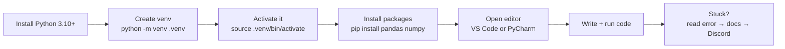

# Section 3 — Python Installation & Environment

## Lectures covered
- Peter Pandey's Journey and Need to Learn Python
- Python Installation — Windows
- Python Installation — Linux
- Python Installation — Mac
- How to Download Code and Get Help

---

## In one sentence
You install Python, create an isolated **virtual environment** for each project, and pick an editor (VS Code or PyCharm) so your code can run and your projects do not break each other.

## Real-world analogy
A virtual environment is like having a separate kitchen for each recipe. If one recipe needs a 2024 spice blend and another needs a 2018 spice blend, you do not mix them in one pantry — you keep two pantries side by side. That is exactly what `python -m venv` does for Python packages.

## The intuition (plain English)
Python is a language interpreter, plus thousands of installable libraries (pandas, NumPy, FastAPI). If you install everything globally, two projects will eventually fight over a library version and one will break. The fix is to **create a fresh folder per project**, install libraries inside it, and activate that folder before working. Editors like VS Code make this almost invisible. Notebooks (Jupyter) are where most data work happens — you write code in cells and see output below each cell.

## Mini worked example
A new project from zero on macOS or Linux:

```bash
mkdir my-first-project && cd my-first-project
python3 -m venv .venv               # create the isolated kitchen
source .venv/bin/activate           # step inside it
which python                        # → .../my-first-project/.venv/bin/python
pip install pandas                  # installs only inside .venv
python -c "import pandas; print(pandas.__version__)"
deactivate                          # step back out
```

Delete the `.venv` folder and the project is fully reset — no leftovers anywhere.

## At-a-glance



## Why this matters
- Without a venv, pip installs leak into the system Python and eventually break it.
- A clean install lets you follow Codebasics' code without "ModuleNotFoundError".
- Knowing where your interpreter lives (`which python`) saves hours of debugging "wrong version" issues.

---

## 1. Why Python (5-second version)

Three reasons it dominates data work:
1. **Readable syntax** — closer to pseudocode than any other production language
2. **Ecosystem** — pandas, NumPy, scikit-learn, PyTorch, FastAPI, Streamlit, LangChain. All Python, all interoperable.
3. **Community** — every error message has a Stack Overflow answer

It's not the fastest language, but for anything that's "slow because of Python" you can drop down to NumPy/Cython/Rust at the bottleneck only.

---

## 2. Installation by OS

### Windows
```powershell
# Option A: official installer
# Download from https://www.python.org/downloads/
# Tick "Add Python to PATH" during install.

python --version
pip --version
```

If `python` opens the Microsoft Store, you forgot the PATH checkbox. Re-run installer with the checkbox.

### macOS
```bash
# Option A: Homebrew (recommended)
brew install python@3.12

# Option B: pyenv (best for managing multiple versions)
brew install pyenv
pyenv install 3.12.0
pyenv global 3.12.0

python3 --version
pip3 --version
```

> macOS has a system Python — never modify it. Always use a brew/pyenv install.

### Linux (Ubuntu/Debian)
```bash
sudo apt update
sudo apt install python3 python3-pip python3-venv
python3 --version
```

For RHEL/Fedora: use `dnf install python3 python3-pip`.

---

## 3. Virtual environments — non-negotiable

Never `pip install` into system Python. Always:

```bash
# create
python3 -m venv .venv

# activate
source .venv/bin/activate     # Mac/Linux
.venv\Scripts\activate        # Windows PowerShell

# verify
which python   # should point inside .venv/

# install packages
pip install pandas numpy matplotlib seaborn jupyterlab
```

Modern alternative: **uv** (fast, written in Rust):
```bash
pip install uv
uv venv
uv pip install pandas numpy
```

For data-science specific: **conda** / **miniconda**.

---

## 4. IDE choice

Two recommended for this bootcamp:

| IDE | When to use |
|---|---|
| **PyCharm Community** (free) | When you want a heavyweight IDE with refactoring, debugging UI, run configs |
| **VS Code** | When you want lightweight + Jupyter-in-editor + works for everything else (JS, Markdown, etc.) |

Codebasics demos PyCharm in the early lectures (PyCharm install is its own lecture in Section 5).

### VS Code minimal setup
- Install: VS Code from https://code.visualstudio.com
- Extensions: **Python** (Microsoft), **Jupyter**, **Pylance**
- Settings: enable "Format on Save" with Black or Ruff

---

## 5. Jupyter Notebook / JupyterLab

Most data-science work in the bootcamp is in notebooks.

```bash
pip install jupyterlab notebook
jupyter lab        # opens browser at localhost:8888
```

In VS Code, you can open `.ipynb` files directly and run cells without launching a separate Jupyter server.

### Notebook hygiene
- Restart-and-run-all before sharing — proves the notebook actually executes top-to-bottom
- Clear all outputs before committing to git (or use `nbstripout`)
- Use markdown cells liberally — your future self / interviewer reads them

---

## 6. Downloading code & getting help

### Codebasics' code
Each lecture's code is in their public GitHub: https://github.com/codebasics

```bash
git clone https://github.com/codebasics/py.git
```

### Help loop (the order I should try)
1. **Read the error message** — Python errors are unusually clear; the *last line* names the problem
2. **Re-watch the relevant 3 minutes** of the lecture
3. **Read the docs** — https://docs.python.org/3/
4. **Search Discord #python channel** — your question was probably asked
5. **Post in Discord** with: code, error, what you tried

---

## 7. Folder convention I'll use for this bootcamp

```
~/Documents/data-scient-bootcamp/
└── practice/
    └── python/
        ├── section-04-variables/
        │   └── notebook.ipynb
        ├── section-05-lists-loops/
        ├── ...
```

Mirroring the bootcamp's section structure makes it easy to find old work later.

---

## Self-check

- [ ] `python --version` prints 3.10 or higher
- [ ] I know what a venv is and can create / activate one
- [ ] I have JupyterLab or VS Code + Jupyter extension working
- [ ] I've cloned the Codebasics public repo and run one of their notebooks
- [ ] I know where to ask for help (Discord, docs, error message)

---

## Glossary

| Term | Plain meaning |
|------|---------------|
| **Python interpreter** | The program (`python` or `python3`) that runs your `.py` files |
| **PATH** | The list of folders the OS searches when you type a command — must include Python |
| **pip** | Python's package installer — fetches libraries from PyPI |
| **PyPI** | The public registry of Python packages, at pypi.org |
| **Virtual environment (venv)** | An isolated folder with its own Python + packages, separate from system Python |
| **Activate / deactivate** | Tells your shell to use the venv's Python (`source .venv/bin/activate`) and stop using it |
| **Homebrew (`brew`)** | A package manager for macOS — `brew install python@3.12` |
| **pyenv** | A tool for installing and switching between Python versions |
| **conda / miniconda** | An alternative environment + package manager popular in data science |
| **uv** | A fast modern replacement for `pip` and `venv`, written in Rust |
| **IDE** (Integrated Development Environment) | An editor with code intelligence, debugger, and run buttons (PyCharm, VS Code) |
| **VS Code** | Microsoft's free editor with a Python extension and Jupyter support |
| **PyCharm** | JetBrains' Python IDE — the one used in Codebasics demos |
| **Jupyter Notebook / JupyterLab** | A browser-based environment for writing code in cells with output below each |
| **`.ipynb`** | The file extension for Jupyter notebooks |
| **`requirements.txt`** | A plain-text list of packages and versions for a project |
| **`nbstripout`** | A tool that wipes notebook outputs before commits — keeps git diffs small |
| **REPL** | Read-Eval-Print Loop — the interactive `python` prompt where you type code and see results live |

## Further reading
- Next: [02-variables-numbers-strings.md](02-variables-numbers-strings.md)
- Module overview: [../00-welcome-and-projects.md](../00-welcome-and-projects.md)
- Style guide: [../../../BEGINNER-STYLE-GUIDE.md](../../../BEGINNER-STYLE-GUIDE.md)
