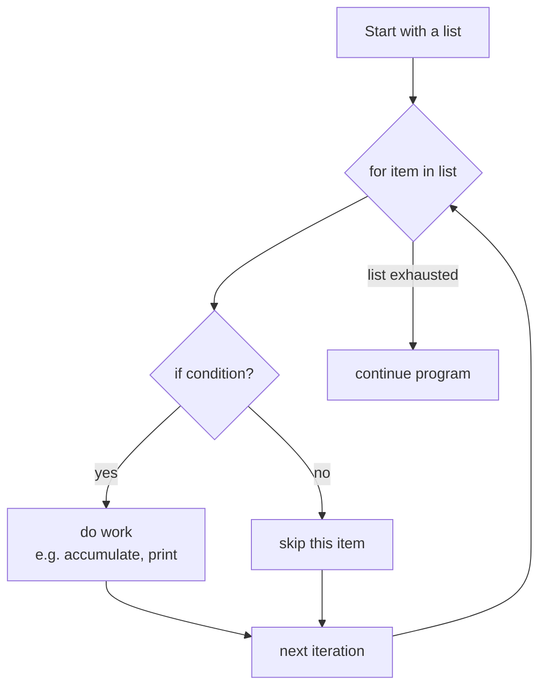

# Section 5 — Lists, If Condition, For Loop

## Lectures covered
- Lists · Install PyCharm · If Condition · For Loop · Quiz · "Peter Found Something Interesting to Practice" · Exercise · Chapter Summary

---

## In one sentence
**Lists** hold an ordered collection of values, **if** picks one branch based on a condition, and **for** repeats a block of code once per item — together they unlock every algorithm you will write.

## Real-world analogy
A list is your shopping list — items in order, you can add, remove, or replace them. An `if` is a fork in the road: "if it is raining, take an umbrella, otherwise don't." A `for` loop is going down the shopping list one item at a time and ticking each off. With these three you can describe almost any everyday task.

## The intuition (plain English)
A list is created with square brackets `[1, 2, 3]` and is **mutable** — you can change it after creation. Use `if` / `elif` / `else` to make decisions. Use `for x in items:` to walk every item without managing an index. Python uses **truthiness** — empty things (`[]`, `""`, `0`, `None`) count as `False`, so `if my_list:` reads as "if the list has anything in it." `enumerate` gives you both index and item, `zip` walks two lists in parallel.

## Mini worked example
A grocery total calculator:

```python
items  = ["apple", "bread", "milk", "egg"]
prices = [0.50,    2.00,    1.50,   0.20]

total = 0
for name, price in zip(items, prices):     # walk both lists in parallel
    if price >= 1.00:
        total += price                     # only count items >= $1
        print(f"counted {name} (${price})")

print(f"Total: ${total:.2f}")
# counted bread ($2.0)
# counted milk  ($1.5)
# Total: $3.50
```

Three concepts (list, if, for) doing one realistic job in 6 lines.

## At-a-glance



## Why this matters
- Almost every data task is "loop over rows, decide something, accumulate a result."
- Truthiness and `is None` checks show up in every interview and every codebase.
- Knowing `enumerate` and `zip` is the line between writing Python and writing Java-in-Python.

---

## 1. Lists

### Creation & basic ops
```python
nums = [1, 2, 3, 4, 5]
mixed = [1, "hello", 3.14, True]   # lists can mix types

len(nums)           # 5
nums[0]             # 1
nums[-1]            # 5
nums[1:4]           # [2, 3, 4]   slicing
nums + [6, 7]       # concatenation (returns new list)
nums * 2            # [1, 2, 3, 4, 5, 1, 2, 3, 4, 5]
3 in nums           # membership
```

### Mutation methods (in-place — modify the list, return None)
```python
nums.append(6)              # add to end
nums.insert(0, 0)           # insert at index
nums.extend([7, 8])         # append multiple
nums.remove(3)              # remove first occurrence
popped = nums.pop()         # remove + return last
popped = nums.pop(0)        # remove + return at index
nums.sort()                 # in-place sort
nums.reverse()              # in-place reverse
nums.clear()                # empty the list
```

### Pure methods (return new value, don't mutate)
```python
sorted(nums)                # new sorted list
sorted(nums, reverse=True)
sorted(nums, key=abs)       # custom key
list(reversed(nums))        # new reversed list
nums.count(2)               # # of occurrences
nums.index(2)               # first index of 2
```

### The classic mutable-default-argument trap
```python
def add_item(item, target=[]):     # ← BUG
    target.append(item)
    return target

print(add_item("a"))   # ['a']
print(add_item("b"))   # ['a', 'b']  ← shared default!

# Fix:
def add_item(item, target=None):
    if target is None:
        target = []
    target.append(item)
    return target
```

This shows up in every senior Python interview.

---

## 2. If condition

### Basic shape
```python
score = 87
if score >= 90:
    grade = "A"
elif score >= 80:
    grade = "B"
elif score >= 70:
    grade = "C"
else:
    grade = "F"
```

### Truthiness — what counts as `False`
```python
bool(None)        # False
bool(0)           # False
bool("")          # False
bool([])          # False
bool({})          # False
bool(0.0)         # False
# everything else is True
```

So `if my_list:` checks "not empty". Idiomatic.

### Conditional expression (ternary)
```python
status = "pass" if score >= 50 else "fail"
```

### `is` vs `==`
- `==` — value equality
- `is` — same object in memory

```python
a = [1, 2, 3]
b = [1, 2, 3]
a == b      # True (same value)
a is b      # False (different objects)

x = None
if x is None:        # ← always use `is None`, never `== None`
    ...
```

### Chained comparisons
```python
if 0 < x < 100:           # equivalent to (0 < x) and (x < 100)
    ...
```

---

## 3. For loop

### Basic
```python
for n in [1, 2, 3, 4, 5]:
    print(n)
```

### `range`
```python
for i in range(5):           # 0..4
    print(i)
for i in range(2, 8):        # 2..7
    print(i)
for i in range(0, 20, 2):    # 0,2,4,...,18 — step
    print(i)
```

### Iterating with index — `enumerate` (don't use `range(len(x))`)
```python
items = ["apple", "banana", "cherry"]

# bad
for i in range(len(items)):
    print(i, items[i])

# good
for i, item in enumerate(items):
    print(i, item)
```

### Iterating in parallel — `zip`
```python
names = ["Alice", "Bob"]
ages = [30, 25]
for n, a in zip(names, ages):
    print(f"{n} is {a}")
```

### `break`, `continue`, `else`
```python
for n in range(20):
    if n == 7:
        break          # exit loop
    if n % 2 == 0:
        continue       # skip rest of iteration
    print(n)
else:
    print("loop completed without break")    # runs only if loop wasn't break-ed
```

### While loop
```python
n = 0
while n < 5:
    print(n)
    n += 1
```

Use `for` whenever possible; reach for `while` only when you don't know iteration count upfront.

---

## 4. Install PyCharm (lecture aside)

If you're following Codebasics' demos exactly:
1. Download PyCharm Community (free) from JetBrains
2. New Project → choose interpreter (your venv)
3. Right-click file → Run

VS Code works equally well — see [01-installation.md](01-installation.md).

---

## 5. Practice exercises

### Find duplicates
```python
nums = [1, 2, 3, 2, 4, 5, 1]
seen, dupes = set(), set()
for n in nums:
    if n in seen:
        dupes.add(n)
    seen.add(n)
print(dupes)   # {1, 2}
```

### FizzBuzz (interview classic)
```python
for n in range(1, 21):
    if n % 15 == 0:   print("FizzBuzz")
    elif n % 3 == 0:  print("Fizz")
    elif n % 5 == 0:  print("Buzz")
    else:             print(n)
```

### Average of marks above 50
```python
marks = [42, 78, 91, 33, 65]
above = [m for m in marks if m >= 50]      # comprehension preview
avg = sum(above) / len(above) if above else 0
```

---

## 6. Common pitfalls

| Bug | Why | Fix |
|---|---|---|
| Modifying a list while iterating it | indices shift, items skipped | iterate over copy: `for x in list_:`  → `for x in list_[:]:` |
| `if x = 5:` | assignment, not comparison | use `==` or `is` |
| Off-by-one in `range(1, n)` | exclusive upper bound | `range(1, n+1)` if you want `n` |
| `if x == None:` | works but unidiomatic | `if x is None:` |

## Self-check

- [ ] How do I find the index of "banana" in `["apple", "banana", "cherry"]`?
- [ ] What's the bug in `def f(x=[]):`?
- [ ] When should I use `enumerate` vs `range(len(x))`?
- [ ] What's the difference between `nums.sort()` and `sorted(nums)`?
- [ ] Write FizzBuzz from memory.
- [ ] Why is `if my_list:` preferred over `if len(my_list) > 0:`?

---

## Glossary

| Term | Plain meaning |
|------|---------------|
| **List** | An ordered, mutable sequence — `[1, 2, 3]` |
| **Mutable** | Can be changed after creation |
| **Index** | Position number, starting at 0 — `nums[0]` is the first item |
| **Negative index** | Counts from the end — `nums[-1]` is the last |
| **Slicing** | A range of a list — `nums[1:4]` takes positions 1, 2, 3 |
| **Membership (`in`)** | Tests presence — `3 in nums` |
| **In-place method** | Modifies the list and returns `None` — `nums.sort()` |
| **Pure function** | Returns a new value without modifying input — `sorted(nums)` |
| **`append`** | Add one item to the end |
| **`extend`** | Add many items to the end |
| **`pop`** | Remove and return an item |
| **Mutable default argument** | The classic Python trap — `def f(x=[]):` shares one list across calls |
| **`if` / `elif` / `else`** | Branching keywords |
| **Truthiness** | Implicit conversion to bool: `0`, `""`, `[]`, `None` are falsy; everything else is truthy |
| **Ternary expression** | One-line if: `"pass" if score >= 50 else "fail"` |
| **`is None`** | The idiomatic way to test "this is None" — never use `== None` |
| **Chained comparison** | `0 < x < 100` reads naturally and works as expected |
| **`for` loop** | Walks every item in an iterable |
| **`while` loop** | Repeats while a condition is true |
| **`range(start, stop, step)`** | Generates numbers from `start` up to (not including) `stop` |
| **`enumerate`** | Gives `(index, value)` pairs as you iterate |
| **`zip`** | Pairs items from two or more iterables in lockstep |
| **`break`** | Exit a loop early |
| **`continue`** | Skip to the next iteration |
| **`for ... else`** | The `else` runs only if the loop finished without `break` |
| **Iterable** | Anything you can loop over with `for` |
| **Off-by-one error** | Loop runs one too many or too few times — common with `range` |
| **List comprehension** | A compact loop that builds a list — `[m for m in marks if m >= 50]` |

## Further reading
- Next: [04-functions-dict-tuples-files.md](04-functions-dict-tuples-files.md)
- Comprehensions in depth: [../03-advanced/01-comprehensions-sets.md](../03-advanced/01-comprehensions-sets.md)
- These structures power [06-numpy.md](06-numpy.md) and [07-eda-pandas-matplotlib-seaborn.md](07-eda-pandas-matplotlib-seaborn.md)
