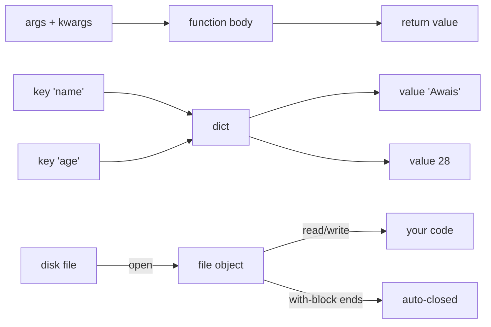

# Section 6 — Functions, Dictionaries, Tuples, File Handling

## Lectures covered
- Functions · Dictionary and Tuples · Modules and Pip · File Handling · Quiz · Peter's Request to Tony · Exercise · "Two Deadly Viruses Infecting Learners" · Chapter Summary

---

## In one sentence
**Functions** package reusable logic, **dictionaries** store labeled data, **tuples** are fixed mini-records, and **file handling** lets your code read and write to disk — together they turn Python from calculator into program.

## Real-world analogy
A function is a coffee machine: you put inputs in (water + beans) and get an output (coffee). A dictionary is a phone book: look up a name and find a number. A tuple is a fixed luggage tag — once you write it, you do not edit it. File handling is opening and closing a notebook to read or jot something down.

## The intuition (plain English)
You define a function with `def name(args):` and call it with `name(values)`. Functions can have **default arguments** so callers do not have to fill in everything. Dictionaries map **keys to values** — `person["name"]` returns the name. Tuples look like lists with parentheses but they are **immutable**, which makes them safe as dict keys and great for "this row of data won't change." Files are opened with `with open(...) as f:` so they always close even on errors.

## Mini worked example
A tiny "save user to file" pipeline:

```python
def make_user(name, age, role="learner"):           # default arg
    return {"name": name, "age": age, "role": role}

user = make_user("Awais", 28)                       # uses default role
print(user)                                          # {'name': 'Awais', 'age': 28, 'role': 'learner'}

# write user to file as one line of JSON-ish text
with open("user.txt", "w") as f:
    f.write(f"{user['name']},{user['age']},{user['role']}\n")

# read it back
with open("user.txt") as f:
    line = f.read().strip()
    name, age, role = line.split(",")               # tuple-style unpacking
    print(name, age, role)                          # Awais 28 learner
```

A function builds a dict, a `with` block writes a file, unpacking restores the values.

## At-a-glance



## Why this matters
- Every Python program is a graph of functions — naming work makes it reusable and testable.
- Dictionaries are the backbone of JSON, API responses, and pandas internals.
- Knowing `with open(...)` saves you from leaking file handles, the most common file bug.

---

## 1. Functions

### Definition + return
```python
def greet(name):
    return f"Hello, {name}!"

print(greet("Awais"))
```

### Default arguments
```python
def greet(name, greeting="Hello"):
    return f"{greeting}, {name}!"

greet("Awais")               # Hello, Awais!
greet("Awais", "Hi")         # Hi, Awais!
```

### Keyword args (clearer at call site)
```python
def make_user(name, age, role="learner"):
    ...
make_user(name="Awais", age=27, role="data_scientist")
```

### `*args` and `**kwargs`
```python
def total(*nums):                 # args → tuple
    return sum(nums)

total(1, 2, 3)                    # 6

def info(**fields):               # kwargs → dict
    for k, v in fields.items():
        print(k, v)

info(name="Awais", age=27)
```

### Type hints (recommended)
```python
def add(a: int, b: int) -> int:
    return a + b
```

Pure cosmetics for the runtime, but editor + `mypy` use them to catch bugs.

### Local vs global scope
```python
x = 10

def f():
    x = 20            # creates a local x
    print(x)          # 20

f()
print(x)              # 10  — global untouched
```

To modify global: `global x` (rarely a good idea — pass values explicitly).

### Functions are first-class
```python
def square(x): return x * x

ops = [square, lambda y: y + 1]
for op in ops:
    print(op(5))           # 25, 6
```

`lambda` is just an inline anonymous function. Use sparingly — name your functions when they're reused.

---

## 2. Dictionaries

### Creation
```python
person = {"name": "Awais", "age": 27, "role": "DS"}
person = dict(name="Awais", age=27)
```

### Access
```python
person["name"]              # KeyError if missing
person.get("email")          # None
person.get("email", "n/a")   # default
```

### Mutation
```python
person["email"] = "x@y.com"     # add/update
del person["age"]                # remove
person.pop("role")               # remove + return
person.update({"city": "Lahore", "age": 28})
```

### Iteration
```python
for k in person:                       # keys
    ...
for k, v in person.items():            # (key, value)
    ...
for v in person.values():              # values
    ...
```

### Common patterns
```python
# count occurrences
counts = {}
for word in text.split():
    counts[word] = counts.get(word, 0) + 1

# better: collections.Counter
from collections import Counter
counts = Counter(text.split())

# group by
from collections import defaultdict
by_dept = defaultdict(list)
for emp in employees:
    by_dept[emp["dept"]].append(emp)
```

### Dict keys must be hashable
- Hashable: `int`, `float`, `str`, `tuple` of hashables, `frozenset`
- Not hashable: `list`, `dict`, `set` (mutable)

```python
d = {[1,2]: "x"}    # TypeError: unhashable type: 'list'
d = {(1,2): "x"}    # OK
```

---

## 3. Tuples

### Why they exist when we have lists
- **Immutable** — fixed once created, hashable, can be dict keys
- **Conventionally** used for heterogeneous fixed-size records (a row from a DB)
- Slightly less memory than lists

```python
point = (3, 4)
x, y = point                # tuple unpacking
```

### Tuple unpacking is everywhere
```python
a, b = 1, 2                 # multiple assignment
a, b = b, a                 # swap (no temp variable)
first, *rest = [1, 2, 3, 4] # first=1, rest=[2,3,4]
```

### NamedTuple — when you want struct-like
```python
from collections import namedtuple
Point = namedtuple("Point", ["x", "y"])
p = Point(3, 4)
p.x, p.y                    # 3, 4 — better than p[0], p[1]
```

For richer data, use `dataclasses` (Section 7).

---

## 4. Modules and pip

### Importing
```python
import math
math.sqrt(16)               # 4.0

from math import sqrt, pi
sqrt(16)                    # 4.0

import numpy as np          # alias — community convention
import pandas as pd
```

### `pip` — the package installer
```bash
pip install requests              # latest
pip install "pandas==2.2.0"       # exact version
pip install -r requirements.txt   # from file
pip list                          # installed
pip freeze > requirements.txt     # export
pip uninstall requests
```

### Always use a venv (covered in installation lecture)

### Writing your own module
```
my_project/
├── main.py
└── utils.py        # has  def double(x): return x*2
```

```python
# in main.py
from utils import double
print(double(5))
```

---

## 5. File handling

### Read
```python
with open("data.txt", "r") as f:
    contents = f.read()             # entire file as string

with open("data.txt") as f:
    for line in f:                   # iterate line-by-line — memory-efficient
        print(line.rstrip())
```

The `with` block guarantees the file is closed even if an exception happens.

### Write / append
```python
with open("out.txt", "w") as f:      # 'w' overwrites
    f.write("Line 1\n")

with open("log.txt", "a") as f:      # 'a' appends
    f.write("New entry\n")
```

### CSV
```python
import csv

with open("data.csv") as f:
    reader = csv.DictReader(f)
    for row in reader:
        print(row["name"], row["age"])

with open("out.csv", "w", newline="") as f:
    writer = csv.DictWriter(f, fieldnames=["name", "age"])
    writer.writeheader()
    writer.writerow({"name": "Awais", "age": 27})
```

For data analysis, you'll use **pandas** (Section 9) — much higher level.

### Modern: `pathlib`
```python
from pathlib import Path

p = Path("data") / "users.csv"
text = p.read_text()
p.write_text("hello")
p.exists()
p.parent
p.suffix             # ".csv"
```

Prefer `pathlib` over string concatenation for paths.

---

## 6. The "Two Deadly Viruses" lecture

The narrative names two patterns that kill learners:

### Virus 1 — Tutorial Hell
Watching content endlessly without typing. Symptom: "I understand it, I just can't write it from scratch."
**Cure**: forced reps. Type every example without copy-paste. Build something tiny on your own after each section.

### Virus 2 — Perfectionism
Refusing to move on until "fully understanding" something. Symptom: stuck on lecture 14 for two weeks.
**Cure**: 80/20. Move on at 80% understanding. The remaining 20% will fill in when you use the concept later.

---

## 7. Common pitfalls

| Bug | Cause | Fix |
|---|---|---|
| `KeyError` on dict access | key missing | use `.get(key, default)` |
| Forgetting to close a file | no `with` block | always use `with open(...) as f` |
| `from module import *` | namespace pollution | explicit imports |
| Modifying tuple | immutable | use list if you need mutation |
| `lambda` doing too much | hard to read | name the function with `def` |

## Self-check

- [ ] Difference between `dict.get(k)` and `dict[k]`?
- [ ] How does tuple unpacking `a, *b = [1, 2, 3]` work?
- [ ] When would I use a tuple instead of a list?
- [ ] What does `with open(...) as f:` do that `f = open(...)` doesn't?
- [ ] Write a function that returns the most common word in a string. (use `collections.Counter`)
- [ ] How do I install `pandas` version 2.2 specifically?

---

## Glossary

| Term | Plain meaning |
|------|---------------|
| **Function** | A named, reusable block of code: `def name(args): ...` |
| **Argument / parameter** | The values you pass into a function |
| **Default argument** | A fallback value used when the caller skips that parameter |
| **Keyword argument** | Passing by name: `make_user(name="Awais")` |
| **`*args`** | Captures any number of positional args into a tuple |
| **`**kwargs`** | Captures any number of keyword args into a dict |
| **Type hint** | Annotation that tells editors and type-checkers what types to expect |
| **Local scope** | Variables created inside a function, invisible outside |
| **Global scope** | Variables at module level, visible everywhere |
| **First-class function** | Functions can be passed around like values |
| **`lambda`** | An inline anonymous function: `lambda x: x*2` |
| **Dictionary (`dict`)** | A mapping of keys to values: `{"name": "Awais"}` |
| **Key** | The lookup label in a dict |
| **`.get(key, default)`** | Safe lookup that returns a default instead of `KeyError` |
| **Hashable** | A value that can be a dict key — `int`, `str`, `tuple`, `frozenset` |
| **`Counter`** | A subclass of dict from `collections` that counts occurrences |
| **`defaultdict`** | A dict that auto-creates a default value for missing keys |
| **Tuple** | An immutable ordered sequence: `(3, 4)` |
| **Tuple unpacking** | Splitting a tuple into named variables: `x, y = point` |
| **`namedtuple`** | A tuple where fields have names — `Point.x` instead of `Point[0]` |
| **`dataclass`** | The modern way to make small struct-like classes (next chapter) |
| **Module** | A `.py` file you can `import` |
| **`pip`** | The Python package installer |
| **`requirements.txt`** | A pinned list of packages for a project |
| **File mode** | `"r"` read, `"w"` write/overwrite, `"a"` append |
| **`with` block (context manager)** | Guarantees cleanup (file closed) even on exceptions |
| **CSV** | Comma-Separated Values — a plain-text tabular format |
| **`pathlib.Path`** | The modern object-oriented way to handle file paths |

## Further reading
- Next: [05-classes-exceptions.md](05-classes-exceptions.md)
- Dictionary patterns power [07-eda-pandas-matplotlib-seaborn.md](07-eda-pandas-matplotlib-seaborn.md)
- Comprehensions reshape data faster: [../03-advanced/01-comprehensions-sets.md](../03-advanced/01-comprehensions-sets.md)
- File-based JSON: [../03-advanced/02-json-generators-decorators.md](../03-advanced/02-json-generators-decorators.md)
