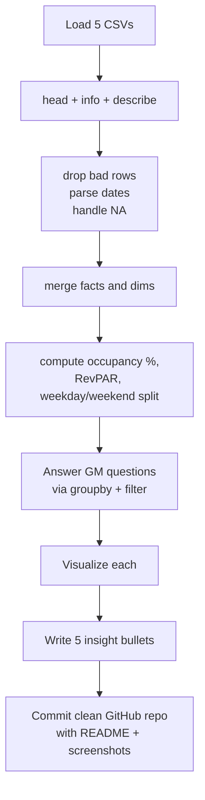

# Project 1 — Hospitality Domain EDA

## Lectures covered (Section 10)
- Problem Statement, OLTP vs OLAP, ETL, Data Warehouse
- Data Understanding: CSV Files
- Data Understanding: Fact vs Dim table, Star vs Snowflake Schema
- Data Exploration
- Data Cleaning
- Data Transformation
- Insights Generation

---

## In one sentence
You play data analyst for a hotel chain — load five CSVs, clean and join them, answer five business questions with charts, and write a five-bullet insight summary that a non-technical General Manager can act on.

## Real-world analogy
Imagine you are the new analyst on a hotel chain's revenue team. The CFO drops a folder of spreadsheets on your desk and says, "Mumbai feels off, weekends feel underpriced, MakeYourTrip cancellations seem high — figure it out and tell me what to do." Your job is not to write fancy code; it is to turn raw rows into one page of decisions the CFO can sign off on Monday.

## The intuition (plain English)
You are given a small **star schema**: fact tables (bookings, daily aggregates) plus dimension tables (hotels, rooms, dates). Load each CSV with pandas, clean obvious bad rows (negative revenue, impossible guest counts), join the facts to the dimensions, then run `groupby` over the questions you care about. The output is **not** a notebook — the output is a markdown summary like *"Mumbai Luxury drives 41% of revenue from 28% of bookings — protect this segment."* That sentence is the deliverable.

## Mini worked example
A typical question, end to end:

```python
import pandas as pd

bookings = pd.read_csv("fact_bookings.csv")
hotels   = pd.read_csv("dim_hotels.csv")

# 1. clean
bookings = bookings[bookings["revenue_realized"] >= 0]

# 2. join fact + dim
df = bookings.merge(hotels, on="property_id", how="left")

# 3. answer the GM's question
revenue_by_city = (
    df.groupby("city")["revenue_realized"]
      .sum()
      .sort_values(ascending=False)
)
print(revenue_by_city.head())

# 4. translate to insight
# "Mumbai contributes 41% of total revenue.
#  Recommend protecting that segment in any pricing test."
```

The numbers come from `groupby`. The **sentence** is what gets shipped.

## At-a-glance — the analyst's loop



## Why this matters
- This project is the resume piece — recruiters open the repo and read the README first.
- It teaches the **fact + dim** mental model used in every BI / analytics role.
- The skill being graded is "translate numbers into a stakeholder-ready sentence" — the rare skill that gets you hired.

---

## 1. The business problem

A hotel chain with multiple properties across cities wants answers to:
- Which properties are profitable? Which are losing money?
- What's our occupancy rate vs. the competition?
- Are we charging the right prices? Where are we leaving money on the table?
- Which booking channels are healthy vs. broken?
- What's the relationship between rating and revenue?

The output is a **set of insights for the GM** — not a model, not an app. A markdown summary backed by charts.

---

## 2. The dataset (typical Codebasics shape)

Multiple CSVs that together form a small star schema:

### Fact tables (transactions)
- `fact_bookings.csv` — every booking: booking_id, hotel_id, room_id, booking_date, check_in, check_out, no_guests, revenue_realized, ratings_given, booking_status, booking_platform
- `fact_aggregated_bookings.csv` — daily summary: hotel_id, check_in_date, room_category, successful_bookings, capacity

### Dimension tables
- `dim_hotels.csv` — hotel_id, property_name, category (Luxury/Business), city
- `dim_rooms.csv` — room_id, room_class (Standard/Elite/Premium/Presidential)
- `dim_date.csv` — date, day, week_no, day_type (weekday/weekend)

This shape is the *business analytics standard*. Master it now — you'll see it again in every BI / DS role.

---

## 3. Concepts taught alongside the project

### OLTP vs OLAP
| | OLTP (Online Transaction Processing) | OLAP (Online Analytical Processing) |
|---|---|---|
| Purpose | Run the business (writes) | Understand the business (reads) |
| Volume | Many small transactions | Few large queries |
| Schema | Highly normalized | Star/snowflake — denormalized for speed |
| Examples | MySQL behind the booking site | Snowflake / BigQuery / Redshift |

This project simulates OLAP: the CSVs come *from* an OLTP system and we shape them for analysis.

### ETL (Extract, Transform, Load)
- **Extract**: read CSVs (in real life: Kafka, S3, APIs, DBs)
- **Transform**: clean, join, aggregate, derive
- **Load**: write back to a warehouse / BI tool

For this project: ETL happens entirely inside one notebook with pandas.

### Data warehouse
A central database optimized for analytics. Stores history, denormalized, columnar where possible. The fact + dim CSVs come from one.

### Fact vs Dimension tables
- **Fact** — the *events* (bookings, sales, sessions). Numerical, additive measures live here.
- **Dimension** — the *context* (who, what, where, when). Descriptive attributes.

You join facts to dims to ask analytical questions.

### Star vs Snowflake
- **Star schema** — dimensions are flat (one table per dim, all attributes denormalized in)
- **Snowflake** — dimensions are themselves normalized (e.g., a `dim_hotel` joins to `dim_city` joins to `dim_country`)

Star is faster to query, easier to teach. Codebasics uses star.

---

## 4. Walkthrough — the steps you'll do in the notebook

### Step 1: Data understanding
```python
import pandas as pd

bookings = pd.read_csv("fact_bookings.csv")
hotels = pd.read_csv("dim_hotels.csv")
rooms = pd.read_csv("dim_rooms.csv")
dates = pd.read_csv("dim_date.csv")

for df in [bookings, hotels, rooms, dates]:
    print(df.shape)
    df.head()
```

Note row counts, dtypes, weird values.

### Step 2: Data cleaning
```python
# negative or impossible values
bookings = bookings[bookings["no_guests"] > 0]
bookings = bookings[bookings["revenue_realized"] >= 0]

# outliers in revenue (extreme high)
q_high = bookings["revenue_realized"].quantile(0.995)
bookings = bookings[bookings["revenue_realized"] <= q_high]

# missing ratings — flag, don't fill
bookings["has_rating"] = bookings["ratings_given"].notna()

# parse dates
bookings["booking_date"] = pd.to_datetime(bookings["booking_date"])
```

### Step 3: Joins (build the analytical frame)
```python
df = (
    bookings
      .merge(hotels, on="property_id", how="left")
      .merge(rooms,  on="room_id",     how="left")
)

# audit
assert df.shape[0] == bookings.shape[0]
```

### Step 4: Derived metrics
```python
# Occupancy = successful / capacity (uses fact_aggregated_bookings)
agg = pd.read_csv("fact_aggregated_bookings.csv")
agg["occupancy_pct"] = agg["successful_bookings"] / agg["capacity"] * 100

# Revenue per available room (RevPAR)
revpar = agg.assign(revpar=lambda d: d["revenue"] / d["capacity"])

# RGI / MPI — leave as homework if not in syllabus
```

### Step 5: Analysis — the GM's questions
```python
# 1. Revenue by city
df.groupby("city")["revenue_realized"].sum().sort_values(ascending=False)

# 2. Occupancy by property category
agg.merge(hotels, on="property_id").groupby("category")["occupancy_pct"].mean()

# 3. Weekday vs weekend revenue
df.merge(dates, left_on="booking_date", right_on="date").groupby("day_type")["revenue_realized"].sum()

# 4. Top 5 platforms by revenue
df.groupby("booking_platform")["revenue_realized"].sum().nlargest(5)

# 5. Cancellation rate by property
df.groupby("property_id").apply(lambda g: (g["booking_status"] == "Cancelled").mean())
```

### Step 6: Visualizations
For each question above, a chart — bar, box, line, scatter. Save with consistent styling.

### Step 7: Insights summary (the actual deliverable)
```markdown
## Top 5 insights for the GM

1. **Mumbai Luxury properties drive 41% of revenue but only 28% of bookings** — protect this segment.
2. **Weekend revenue is 2.3× weekday** despite roughly equal occupancy — pricing power, not volume.
3. **Booking platform "MakeYourTrip" has a 19% cancellation rate** — investigate; competitors are at 8–10%.
4. **Presidential suites have 67% occupancy in Q3** — likely overpriced or under-marketed; test 10% discount.
5. **Properties with rating < 3.5 lose $480k/yr in lost rebookings** — service quality is the lever.
```

---

## 5. Repo structure I should produce

```
hospitality-eda/
├── data/
│   ├── fact_bookings.csv
│   ├── fact_aggregated_bookings.csv
│   ├── dim_hotels.csv
│   ├── dim_rooms.csv
│   └── dim_date.csv
├── notebook.ipynb            # the main analysis
├── reports/
│   └── insights.md            # GM-ready summary
├── images/                    # plots saved here
├── README.md                  # what / why / how to run
└── requirements.txt
```

### README must answer
- Problem statement (1 paragraph)
- Dataset description (small table)
- Tools used
- Top 5 insights (copy from `insights.md`)
- How to run the notebook
- Screenshots of 2–3 best charts

This is the version recruiters see. Polish it.

---

## 6. Self-check

- [ ] Can I explain OLTP vs OLAP to a non-technical friend?
- [ ] Can I spot a fact table vs a dim table from column names?
- [ ] Can I write the join chain to build the analytical frame from memory?
- [ ] Did I produce ≥5 written insights backed by charts?
- [ ] Is my GitHub repo's README clean enough to defend in an interview?
- [ ] Have I posted at least 1 LinkedIn post about this project?

---

## Glossary

| Term | Plain meaning |
|------|---------------|
| **Hospitality domain** | The hotel industry — properties, rooms, bookings, guests, ratings |
| **Property** | One hotel location |
| **Booking** | One reservation transaction |
| **Occupancy rate** | Rooms booked / rooms available, expressed as a percentage |
| **Revenue realized** | Actual revenue from a booking (after cancellations / discounts) |
| **RevPAR** | Revenue Per Available Room — total room revenue / total available rooms |
| **OTA** (Online Travel Agent) | Booking platforms like MakeMyTrip, Booking.com |
| **OLTP** (Online Transaction Processing) | "Run the business" databases — many small writes |
| **OLAP** (Online Analytical Processing) | "Understand the business" warehouses — few large reads |
| **ETL** (Extract, Transform, Load) | Pull data from sources, reshape it, write to a warehouse |
| **Data warehouse** | A central analytics database storing history in a query-friendly shape |
| **Fact table** | The events table — bookings, daily aggregates. Numbers you sum live here. |
| **Dimension table** | Context tables — hotels, rooms, dates. Adjectives describing the events. |
| **Star schema** | One fact table joined to flat dim tables — the BI standard |
| **Snowflake schema** | Star schema where dims are themselves normalized into more tables |
| **Normalization** | Splitting data across tables to reduce redundancy |
| **Denormalization** | Pre-joining data into wider tables for analytics speed |
| **`merge` / join** | Combine two tables on a shared key |
| **Inner / left / outer join** | Which rows survive when keys do not match in both tables |
| **`groupby`** | Pandas split-apply-combine across categories |
| **Quantile** | A cut point: 0.99 quantile = the value below which 99% of data sits |
| **Outlier** | An extreme value that distorts averages |
| **Cancellation rate** | Cancelled bookings / total bookings |
| **Insight** | A sentence connecting a number to a business decision |
| **Stakeholder / GM** | The non-technical decision-maker who reads your conclusion, not your code |
| **Notebook** | A `.ipynb` file mixing code, output, and markdown |

## Further reading
- Foundations used here: [../01-basics/07-eda-pandas-matplotlib-seaborn.md](../01-basics/07-eda-pandas-matplotlib-seaborn.md)
- Distribution + outlier theory: [../../05-math-statistics/01-foundations/04-distributions.md](../../05-math-statistics/01-foundations/04-distributions.md)
- The other project: [02-expense-tracker.md](02-expense-tracker.md)
- BI-style hypothesis testing on lifts: [../../05-math-statistics/03-inferential/02-hypothesis-testing.md](../../05-math-statistics/03-inferential/02-hypothesis-testing.md)
