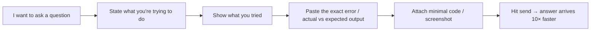

# Section 1 — Unlock Discord Channels

## Lectures covered
- Unlock Discord Channels

---

## In one sentence
Treat the Codebasics Discord as the **fourth pillar** of the bootcamp (alongside videos, projects, quizzes) — students who post + answer there finish faster and land jobs faster than those who don't.

## Asking a good question — at-a-glance



> 90% of "I asked but no one helped" cases are bad question structure, not unhelpful community.

---

## What this lecture does

Walks you through joining the Codebasics Discord server, verifying your enrollment, and unlocking the private channels reserved for paid bootcamp learners.

## Why Discord matters for your bootcamp outcome

The number-one differentiator between students who ship 15 projects and students who quit is **community gravity**. Discord is where:
- Doubts get answered the same day (often within an hour)
- Mentors and senior learners share job leads
- "I'm stuck" turns into "let me show you" 10× faster than email
- You meet peers who become long-term collaborators / referrers

> Treat Discord as the *fourth pillar* of the bootcamp, alongside videos, projects, and quizzes.

---

## Setup steps (do these once)

1. **Click the unlock link** in the lecture (or the welcome email)
2. **Verify enrollment** — the bot will ask for your Codebasics email
3. **Set Discord profile**:
   - Username: real name (or close to it). `xx_dark_lord_xx` impresses no one.
   - Avatar: same headshot as LinkedIn / GitHub
   - Bio: 1 line — "Learning AI/DS via Codebasics Bootcamp 3.0"
4. **Read the rules channel** — be human, no spam, no DMs to mentors uninvited
5. **Post in `#introductions`** — single short paragraph (template below)

---

## Channels worth joining (typical setup)

| Channel | What it's for |
|---|---|
| `#introductions` | first-week post |
| `#general` | non-technical chat |
| `#announcements` | webinar dates, new lectures, etc. (read-only) |
| `#python` | Python-specific doubts |
| `#sql` | SQL doubts |
| `#math-and-stats` | stats doubts |
| `#machine-learning` | ML doubts |
| `#deep-learning` | DL doubts |
| `#nlp` | NLP doubts |
| `#gen-ai` | LLMs / RAG / agents |
| `#career-track` | resume / portfolio / interviews |
| `#projects-showcase` | post when you finish a project |
| `#jobs-internships` | shared opportunities |

Mute high-traffic channels you don't actively need; don't drown in pings.

---

## Introduction post template

```
Hi everyone — I'm [Name], from [city, country].

Background: [1 line — current role / studies]
Goal: [target role e.g. "Data Scientist in healthcare" — be specific]
Currently on: Module [X] of the bootcamp

Excited to learn alongside this community. Happy to chat with anyone working on similar projects 👋
```

This is enough. Don't overshare or undersell.

---

## How to ask a good question (saves you hours)

Pattern: **what + what tried + what hoped**.

### Bad question
> Code not working pls help

### Good question
> Trying to merge two pandas DataFrames on `customer_id`. Expected ~10k rows, getting 47k. Suspect duplicates in df_b. Tried `df_b.duplicated().sum()` — returns 0. Stuck. Code + screenshot of result attached.

The good version:
- States what you're trying to do
- Shows what you tried
- Shows actual vs expected
- Includes minimal code
- Makes it easy for a helper to spot the issue

> 90% of "I asked but no one helped" cases are bad question structure, not unhelpful community.

---

## How to be useful in Discord (and benefit yourself)

- Answer easy questions early — explaining cements your own learning (Feynman technique)
- React with ✅ when an answer fixed your problem — closes the loop
- Share resources you found useful in the relevant channel
- Post your project demos in `#projects-showcase` — you'll get feedback and visibility
- Don't snipe job posts — share back to the channel

---

## DM etiquette (important)

- Never DM a mentor a homework question — use the public channel; everyone benefits
- DM is OK for: scheduling 1:1, sharing private CV review, longer mentorship requests *they invited*
- Don't ghost — if you ask for time, show up
- Don't sell or recruit in DMs

---

## Self-check

- [ ] Joined Codebasics Discord
- [ ] Username = my real name
- [ ] Posted in `#introductions`
- [ ] Joined ≥3 module-relevant channels
- [ ] Read the rules
- [ ] Saved the "good question" template somewhere I'll reuse
- [ ] Reacted to at least one answer that helped me this week

---

## Glossary

| Term | Plain meaning |
|------|---------------|
| **Discord** | Real-time chat platform organized into servers and channels |
| **Server** | A whole Discord workspace (Codebasics has one for the bootcamp) |
| **Channel** | A topic-specific room inside a server (`#python`, `#sql`, etc.) |
| **Mute / unmute channel** | Hide notifications from chatty channels you don't follow daily |
| **DM (Direct Message)** | Private 1-to-1 message — use sparingly, never DM mentors with homework |
| **Avatar** | Your profile picture |
| **Bio** | One-line description on your Discord profile |
| **Code block** | Triple-backtick wrapper around code so it renders correctly |
| **Reaction (emoji)** | Quick acknowledgment without writing a full reply (✅ "this helped") |
| **MEE6 / Carl-bot** | Common Discord bots that handle role assignment / verification |
| **Verification** | One-time enrollment check to unlock paid-learner channels |
| **Feynman technique** | Learning by explaining — answering Discord questions cements your own knowledge |
| **#good-first-issue** | Slang for issues open-source projects label as beginner-friendly |
| **Snipe (anti-pattern)** | Privately DMing a job lead so others don't see — bad community behavior |

## Further reading
- Next: [02-credibility-opensource.md](02-credibility-opensource.md)
- Help-seeking flow: [../00-bootcamp-introduction/02-learning-method-support.md](../00-bootcamp-introduction/02-learning-method-support.md)
