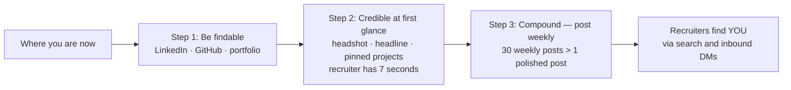

# Section 2 — Online Credibility & Open-Source Contribution

## Lectures covered
- Introduction to online credibility / open-source contribution

---

## In one sentence
**Online credibility** is the trail of public artifacts (LinkedIn, GitHub, blog) that does the job-hunting *for* you — and contributing to open-source projects, even tiny doc fixes, is the highest-credibility-per-effort move you can make as a beginner.

## The 3-step framework — at-a-glance

You can't shortcut step 3. The first 10 posts feel pointless; consistency is what wins.

---

## The pitch

You are competing against thousands of other applicants for every entry-level role. Your **resume + cover letter** is one signal. Your **online footprint** is a stronger one. The footprint is built deliberately — not accidentally.

Codebasics frames this around a 3-step framework, plus 5 advanced tips, plus 10 post templates.

---

## The 3-step credibility framework

### Step 1 — Become findable
If a recruiter Googles your name + "data science", they should land on:
1. Your LinkedIn profile (#1 search result ideally)
2. Your GitHub profile
3. Your portfolio website
4. (Optional) Your blog / Medium / Hashnode
5. (Optional) Your X / Twitter

If steps 1 and 2 are missing, you don't exist professionally — regardless of what's on your laptop.

### Step 2 — Be credible at first glance
You have **7 seconds** when a recruiter clicks. Answer:
- Who is this person? (name, headshot, headline)
- What do they do? (role / target role)
- What can they actually do? (pinned projects, skills, demo links)

If they have to scroll to figure these out, you've lost them.

### Step 3 — Compound — post regularly
A profile with 1 post is "okay." A profile with 30 weekly posts over the past 8 months is *evidence*. Recruiters can't fake-detect long-term consistency.

---

## 5 advanced tips for super-growth

### 1. Pick a niche, not just "data"
"Data scientist" is generic. "Data scientist for retail forecasting" is searchable. Codebasics' AtliQ business projects give you 6 ready niches: hospitality, banking, healthcare, supply chain, finance, e-commerce. Pick one to lean into.

### 2. Document your projects publicly
Each finished project = at least:
- 1 LinkedIn post with screenshot/Loom
- 1 GitHub repo with proper README
- 1 paragraph on your portfolio site

If you do all three for all 15 bootcamp projects, you have **45 credibility artifacts**.

### 3. Comment thoughtfully, don't just broadcast
Engagement compounds. A 4-sentence comment on a senior data scientist's post outperforms 10 of your own posts in the early days.

### 4. Mix project posts with learning posts
80% projects/learnings, 20% personality. Don't be a pure billboard.

### 5. Be honest about being early-career
"I'm in week 12 of a 9-month bootcamp; here's what I learned this week" is way more compelling than pretending to be senior.

---

## 10 post templates (start with these)

### A — "Just shipped X"
> Just shipped [project]. Problem: [1 line]. Approach: [3 bullets]. Tools: [stack]. Repo: [link]. What surprised me: [1 honest insight].

### B — "Just understood X"
> Spent the week on [topic]. Finally clicked when I [analogy or aha moment]. Here's the 3-bullet version for anyone struggling: ...

### C — "Stuck on X — open to ideas"
> Stuck on [problem] for 2 days. Tried X, Y, Z. Hypothesis: [...]. If anyone has dealt with this — would love a pointer.

### D — "Mistake I made"
> Spent 4 hours debugging [issue]. Root cause: [embarrassing one-liner]. Lesson: [transferable]. Posting so others avoid this.

### E — "Comparing X vs Y"
> Tried both [tool A] and [tool B] on the same problem. Here's what surprised me about each. [Table or screenshots.]

### F — "Mini tutorial"
> Five-minute write-up: how to do [task] in [tool]. With screenshots. [Steps.]

### G — "Project retrospective"
> Finished [project]. Looking back, here's what I'd do differently next time. [3 things.]

### H — "Resource I loved"
> Best [book/video/article] I read this week on [topic]. Why it's worth your time: [1 paragraph].

### I — "Question to the community"
> What's the one tool you wish you'd learned earlier in your DS journey?

### J — "Milestone"
> Just finished module [X] of [bootcamp]. Halfway there. What's worked: [...]. What hasn't: [...]. On to [next].

---

## Open-source contribution — entry path

You don't have to fix Linux kernel bugs to contribute. Entry-level OSS = low-friction, high-credibility:

### Easiest first contributions
1. **Fix a typo** in a popular project's README — your name appears in their commit log
2. **Improve docs** — add a missing example to a function
3. **Add a test case** for an existing function
4. **Open a "good first issue"** ticket (most repos label these)
5. **Translate** docs to your native language

### Where to find good-first-issues
- https://goodfirstissues.com
- GitHub label search: `is:issue label:"good first issue"` in any repo you use
- Codebasics' own GitHub: https://github.com/codebasics

### Etiquette
- Comment on the issue *before* coding to avoid duplicate work
- Read the project's `CONTRIBUTING.md`
- Smaller PRs merge faster — don't refactor 2,000 lines on a typo fix
- Be patient — maintainers are volunteers

### What it gets you
- Real Git workflow (fork, branch, PR, review)
- A green-square trail of work
- A talking point in interviews ("I contributed to scikit-learn / pandas docs")
- Network — reviewers often become contacts

The full Build In Public module (Module 3) goes deeper into Git/GitHub mechanics.

---

## Curated list — people to follow / connect with

(Codebasics provides their own list inside the lecture; here's a starter set every learner should follow)

### Educators & content
- **Dhaval Patel** (Codebasics) — your instructor
- **Hemanand Vadivel** — your instructor
- **Krish Naik** — DS/ML/AI tutorials
- **Andrew Ng** — DeepLearning.AI
- **Andrej Karpathy** — DL fundamentals from first principles
- **Yann LeCun** — Meta AI Chief Scientist

### Industry / building
- **Chip Huyen** — ML systems / AI engineering
- **Cassie Kozyrkov** — decision intelligence
- **Hadley Wickham** — data tools
- **Jeremy Howard** — fast.ai
- **Eugene Yan** — applied ML, recsys
- **Levels.fyi / data engineers' threads on X**

### Companies' AI eng accounts
- DeepMind, OpenAI, Anthropic, Hugging Face, Meta AI, Vercel AI

Connect *with a personal note*, not the default LinkedIn message.

---

## Self-check

- [ ] Did I write down which niche / domain I'll lean into?
- [ ] Did I save the 10 post templates somewhere I'll reuse?
- [ ] Have I starred at least 5 GitHub repos I might contribute to?
- [ ] Have I followed at least 5 of the recommended people on LinkedIn?
- [ ] Have I commented thoughtfully on at least one post this week?

---

## Glossary

| Term | Plain meaning |
|------|---------------|
| **Online credibility** | The publicly verifiable trail of your work — LinkedIn, GitHub, portfolio, blog |
| **Findable** | Step 1 of credibility: you appear in Google + LinkedIn search for your name + role |
| **Compounding (posts)** | Each post helps the next — discoverability + followers + referrals all stack |
| **Niche** | A specific domain you specialize in (retail forecasting > generic data science) |
| **Pinned project** | A repo highlighted at the top of your GitHub profile (max 6 allowed) |
| **OSS (Open Source Software)** | Code with a public license that anyone can read, use, and contribute to |
| **good first issue** | GitHub label for issues maintainers consider beginner-friendly |
| **PR (Pull Request)** | A proposed code change submitted to a repo for review |
| **Fork** | Your own copy of someone else's repo, where you can experiment without affecting theirs |
| **Branch** | A parallel line of work inside a repo |
| **CONTRIBUTING.md** | The "house rules" file for contributing to a project — read before submitting a PR |
| **Maintainer** | The volunteer(s) who review PRs and steer the project's direction |
| **Green-square trail** | The GitHub contributions calendar — recruiters notice consistent activity |
| **Inbound** | Recruiters reaching out to you (vs. you applying) — outcome of credibility done right |
| **Engagement** | Comments + reactions on others' posts — accelerates your own reach |
| **Loom video** | A quick screen-recording with voiceover — high-credibility project demo format |
| **Featured section (LinkedIn)** | A profile area where you pin links/posts/articles |
| **Skill Assessment (LinkedIn)** | Free badge tests for Python, SQL, etc. that boost profile visibility |

## Further reading
- Next: [03-linkedin-profile-banner.md](03-linkedin-profile-banner.md)
- GitHub mechanics deep dive: [../03-build-in-public/02-git-fundamentals.md](../03-build-in-public/02-git-fundamentals.md)
- OSS contribution flow: [../03-build-in-public/05-finding-oss-projects.md](../03-build-in-public/05-finding-oss-projects.md)
