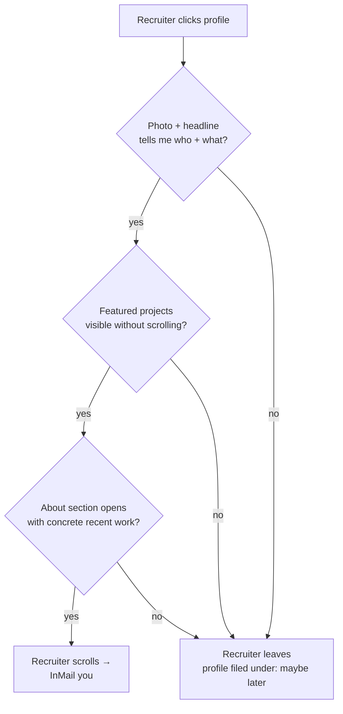

# Section 3 — LinkedIn Profile + Banner Setup

## Lectures covered
- Set Up Your LinkedIn Profile
- LinkedIn Banners

---

## In one sentence
LinkedIn is the **dominant funnel** for data/AI roles — a recruiter spends 7 seconds on your profile, so the headline, banner, and pinned projects need to do all the heavy lifting up front.

## The 7-second test — at-a-glance



If any of those "no" branches fires, you don't get the InMail. Fix them in this order: photo → headline → banner → pinned/Featured → About first paragraph.

---

## Why LinkedIn first

For data / AI roles, LinkedIn is **the dominant funnel**:
- 90%+ of recruiters search there before email/phone
- Your profile is searchable on Google (free SEO if you optimize it)
- Most "warm intros" go through LinkedIn DMs
- "Open to work" badge is a free signal that converts

If you do nothing else this week, fix LinkedIn.

---

## The 10-section profile audit

### 1. Profile photo
- **Clear face**, neutral background, professional or smart-casual
- 400×400 px minimum
- No group crops, no sunglasses, no filters
- Same photo as GitHub + Discord (consistency matters)

### 2. Banner image
- 1584×396 px (default LinkedIn banner size)
- Shows what you do, *not* a stock photo
- Three options that work:
  - Code-on-screen aesthetic with your tagline
  - Clean text banner with role + 3 keyword skills
  - Project screenshot (a chart from your hospitality EDA, for example)
- Free tools: **Canva** (templates) or **Figma**

### 3. Headline (the most-read line)
The default is your job title. Override it. Formula:

```
[Target role] | [Stack/specialization] | [Domain or value]
```

Examples:
- ❌ "Student at XYZ University"
- ✅ "Aspiring Data Scientist | Python · SQL · Machine Learning | Building 12+ business projects through Codebasics Bootcamp"
- ✅ "Data Analyst (open to work) | SQL · Pandas · Power BI | Hospitality & Retail domains"

### 4. About section (your 3-paragraph pitch)

Structure:
1. **Who you are now + transition story** (2–3 lines)
2. **What you can do** (skills + 1–2 specific projects with measurable outcomes)
3. **What you're looking for + how to reach you** (1–2 lines)

Example:
> Mechanical engineer transitioning to data science via the Codebasics Gen AI & DS Bootcamp 3.0. Currently 5 modules deep — Python, SQL, Math/Stats — with 4 projects shipped.
>
> Recent work: built a hospitality-domain EDA producing 5 GM-ready insights from 100k+ booking records, and a fullstack expense tracker (FastAPI + Streamlit + MySQL). Strong in pandas, comfortable with FastAPI and SQL.
>
> Looking for entry-level Data Analyst / Data Scientist roles in retail / hospitality. Open to remote and Pakistan-based positions. Reach me at: m.awaisshah228@gmail.com.

### 5. Experience
- Reverse chronological
- Each role: 1-line context, 3–5 achievement bullets
- Bullet shape: **action verb + what + how + measurable impact**
- For "no work experience yet": list the bootcamp as a position, with project bullets

### 6. Education
- Degree, institution, graduation year, GPA only if strong
- Add Codebasics bootcamp as a separate education entry if not already

### 7. Skills (LinkedIn shows top 3 prominently)
Top 3 should be your most-relevant: Python, SQL, Machine Learning. Then: Pandas, NumPy, scikit-learn, FastAPI, Streamlit, MySQL, etc.

Take LinkedIn's free **Skill Assessment** for Python and SQL — you get a badge that boosts profile visibility.

### 8. Featured section
Pin your best 3–6 items:
- LinkedIn post about your project
- Link to GitHub project
- Link to portfolio site
- Certificate
- Article you wrote

### 9. Recommendations
Ask 2–3 people who've worked / studied with you. Even "I learned alongside this person in the Codebasics bootcamp; their work on X impressed me" works.

### 10. Custom URL
`linkedin.com/in/firstname-lastname` — no random digits. Edit at `Edit public profile & URL`.

---

## Banner — what content actually works

Bad banner: stock photo of "code on a laptop" you didn't make.

Good banner has 1 of these:
- Your name + tagline
- Top 3 keyword skills (Python · SQL · ML)
- A real screenshot of your work
- A subtle illustration that signals your domain (hospital cross, finance graph, etc.)

### Canva quick-build steps
1. Open Canva → search "LinkedIn Banner"
2. Pick a clean template (avoid busy ones)
3. Replace placeholder text with **your tagline + 3 keywords**
4. Use brand colors (or LinkedIn-friendly: white background, dark text, one accent)
5. Export PNG, 1584×396

---

## Profile copy — three concrete examples

### A — Total beginner, no DS experience
- Headline: "Aspiring Data Analyst | Python · SQL · Power BI | Codebasics Bootcamp 3.0"
- About paragraph 1: "Coming from [previous field], pivoting into data through hands-on projects."
- About paragraph 2: "Recent: [first project] showing X."

### B — Some experience, switching domains
- Headline: "Software Engineer → Data Scientist | Python · ML · Building 12+ projects"
- About paragraph 1: "5 years of full-stack development, now applying engineering rigor to data science."
- About paragraph 2: "Recent: built X model achieving Y%."

### C — Already data-adjacent (analyst → scientist)
- Headline: "Data Analyst → Data Scientist | SQL · Python · Statistics · ML | Healthcare domain"
- About paragraph 1: "3 years analyzing healthcare data; deepening into ML modeling."
- About paragraph 2: "Recent: ML model predicting Z with accuracy A."

---

## Common pitfalls

| Mistake | Fix |
|---|---|
| Headline = "Looking for opportunities" | Replace with role + keywords |
| About starts with "I'm passionate about data" | Cliché. Lead with concrete recent work. |
| 0 projects featured | Pin at least 3 |
| Skills list is 30+ items | Trim to top 10 — quality > breadth |
| Photo from a wedding cropped | Take a fresh one against a plain wall |
| Default URL with random digits | Customize to `firstname-lastname` |
| English typos | Run through Grammarly |

---

## After-setup actions (week 1)

- [ ] Click **Open to work** → set target roles + locations (visible to recruiters only)
- [ ] Send 5 personalized connection requests/week to people in your target field
- [ ] Post your first build-in-public update
- [ ] Engage with 5 thoughtful comments / day for 2 weeks (warms up your reach)

---

## Self-check

- [ ] Headline ≠ "Student"
- [ ] Custom banner uploaded
- [ ] About section has 3 structured paragraphs
- [ ] At least 3 items in Featured
- [ ] At least 10 skills, top-3 set deliberately
- [ ] Custom URL set
- [ ] First post live

---

## Glossary

| Term | Plain meaning |
|------|---------------|
| **Headline** | The most-read line on your profile — under your name. Override the default. |
| **Banner** | The big image at the top of your profile (1584×396 px) |
| **About section** | Your 3-paragraph pitch under the photo |
| **Featured section** | Profile area for pinning your best 3-6 posts/projects/articles |
| **Open to Work** | LinkedIn badge signaling you want recruiter outreach (visible to recruiters only) |
| **Skill Assessment** | Free LinkedIn quiz that earns a verified badge for Python/SQL/etc. |
| **Recommendation** | A LinkedIn endorsement written by someone who's worked with you |
| **Custom URL** | `linkedin.com/in/firstname-lastname` (no random digits) — set in profile editor |
| **InMail** | LinkedIn's paid messaging feature recruiters use to reach you |
| **Connection request** | A request to add someone to your network — always personalize the note |
| **Endorsements** | One-click skill validations from your network — less weighty than recommendations |
| **Profile completeness** | LinkedIn's score; aim for 80%+ — drives search visibility |
| **Canva / Figma** | Free design tools for making banners |
| **400×400 / 1584×396** | Recommended sizes for LinkedIn photo and banner |
| **ATS-friendly** | Resume formatted so applicant tracking systems can parse all sections |
| **SEO (Search Engine Optimization)** | Optimizing what shows up when someone Googles your name + role |
| **Personal note (connection)** | The 1-2 sentence message attached to a connection request — vastly improves accept rate |
| **Niche** | Domain specialization that makes you searchable for specific roles |

## Further reading
- Next: [04-python-projects-to-github.md](04-python-projects-to-github.md)
- Build-in-public templates: [../00-bootcamp-introduction/04-build-in-public-intro.md](../00-bootcamp-introduction/04-build-in-public-intro.md)
