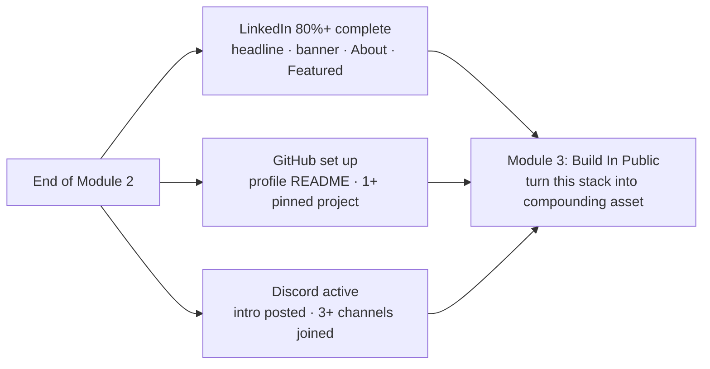

# Section 5 — What's Next? (Knowledge Check + Checkpoint)

## Lectures covered
- Knowledge Check (Quiz)
- Checkpoint (Quiz)
- Transition to Build In Public

---

## In one sentence
You finish Module 2 with a **functioning credibility stack** (LinkedIn + GitHub + Discord) — Module 3 then teaches you the engine (Git/GitHub workflows + posting cadence) that keeps that stack alive long-term.

## What you have at this point — at-a-glance

---

## Quiz — typical question shapes

(The exact questions vary; these are representative.)

1. Which platform is the **primary** doubt-clearance channel for the bootcamp?
   - Email · Discord · Phone · Forum

2. What's the recommended LinkedIn banner size?
   - 800×200 · 1584×396 · 1920×1080 · 1200×630

3. Which is **not** a good first contribution to OSS?
   - Fixing a typo in README · Improving docs · Refactoring 2,000 lines · Adding a test case

4. Which is the best place to pin your bootcamp projects for max recruiter visibility?
   - Google Drive · GitHub (pinned) · Personal hard drive · Discord

5. What does a Profile README repo on GitHub do?
   - Nothing · Appears at the top of your GitHub profile · Replaces your bio · Hides your repos

---

## Pre-quiz review checklist

- [ ] I know the 3-step credibility framework (findable → credible → compounding)
- [ ] I have my LinkedIn at >80% complete (LinkedIn shows you the % in profile editor)
- [ ] I know what a "good first issue" is and where to find them
- [ ] I have at least one project on GitHub with a real README
- [ ] My GitHub username = my real name (or close)

---

## Transition to Build In Public (Module 3)

The next module deepens what you started here. Online Credibility was about **making yourself findable + presentable**. Build In Public is about **the engine that keeps it growing** — Git workflows, GitHub mastery, OSS contribution patterns, and the social mechanics of consistent posting.

Specifically, Module 3 covers:
1. What Build In Public actually means (philosophy + cadence)
2. Git fundamentals (init, add, commit, push, branches)
3. Git collaboration (clone, fork, pull, merge, conflicts)
4. GitHub repo anatomy (issues, PRs, projects, actions, releases)
5. Finding open-source projects that match your level

---

## Mini-action plan before you click "Next module"

- [ ] LinkedIn profile completion ≥ 80%
- [ ] GitHub: profile README live, ≥1 project pinned
- [ ] Discord: introduced, joined 3+ relevant channels
- [ ] At least 1 build-in-public post on LinkedIn
- [ ] Saved the 10 post templates and the "good question" template
- [ ] Followed ≥5 of the recommended educators on LinkedIn

When all six are checked, move to Module 3.

---

## Self-check

- [ ] I passed the checkpoint quiz
- [ ] My LinkedIn search ranking improved (Google "[my name] data science")
- [ ] I'm comfortable explaining what Build In Public means in my own words
- [ ] I'm ready for Module 3

---

## Glossary

| Term | Plain meaning |
|------|---------------|
| **Checkpoint quiz** | Mandatory end-of-module quiz, ~70% pass to unlock the next module |
| **Knowledge Check** | A lighter mid-module quiz, no gating |
| **Profile completeness** | LinkedIn's % score for filled-in sections (target ≥80%) |
| **Search ranking** | Where you appear when someone Googles `<your name> data science` |
| **Inbound** | Recruiters reaching out to you — the goal of Module 2's setup |
| **3-step credibility framework** | Findable → Credible at first glance → Compounding |
| **Action plan** | The checklist of things to verify before clicking "Next module" |

## Further reading
- Next: [../03-build-in-public/README.md](../03-build-in-public/README.md)
- Recap: [01-discord.md](01-discord.md), [02-credibility-opensource.md](02-credibility-opensource.md), [03-linkedin-profile-banner.md](03-linkedin-profile-banner.md), [04-python-projects-to-github.md](04-python-projects-to-github.md)
