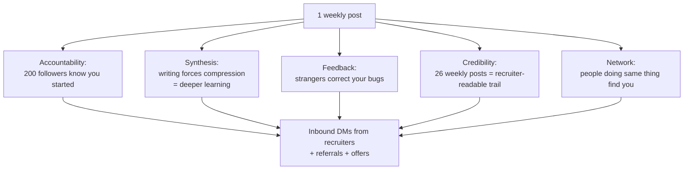

# Session 1 — What is Build In Public?

## In one sentence
**Build In Public** = posting one tiny weekly artifact of your work (chart, code, fix, lesson) — and the math says **26 such posts beat 200 cold applications** for a junior data role.

## At-a-glance — the five forces

The five forces compound. None of them work in isolation.

---

## What it actually is

**Build In Public** = doing your work *visibly* — sharing progress, decisions, mistakes, and outcomes as you go, instead of waiting to unveil a polished final product.

It applies to **anything** you're building: a course, a side project, a startup, a portfolio. It's not just for indie hackers.

For a learner: it means **every week, post one artifact** of your learning — a chart, a code snippet, a mini-tutorial, a "stuck" note, a project demo.

---

## The five forces that make it work

### 1. Public commitment → Accountability
You can't quietly fall behind when 200 people know you started.

### 2. Posting → Synthesis
Writing forces you to compress a concept into something explainable. **The act of writing is when learning sticks.** Feynman technique, applied at scale.

### 3. Audience → Feedback
A stranger spots your bug in a screenshot. A senior dev points you to a better library. None of this happens privately.

### 4. Trail → Credibility
After 6 months you have ~25 LinkedIn posts + ~50 GitHub commits + ~5 project READMEs. Every recruiter sees this. **It's far harder to fake than a resume claim.**

### 5. Network → Opportunity
You become discoverable to people doing the same thing. Some of them work at companies hiring. They DM you.

---

## The math of build-in-public

If 1 LinkedIn post reaches 200 people on average, after 26 weekly posts:
- **5,200 weighted impressions**
- ~5–15% are recruiters / engineering managers / data leads
- → 250–800 relevant eyeballs

Compare to: 200 cold applications with no public footprint = ~2% callback rate = 4 callbacks.

The math is brutal in favor of building in public.

---

## What to post (concretely)

### High-leverage formats
| Format | Why it works |
|---|---|
| **Project announcement** with screenshot/Loom | Visual proof of work; great for sharing |
| **"I just understood X"** | Universally relatable; sparks discussion |
| **Stuck post** | Shows honesty; gets help; humanizes you |
| **Comparison** ("tried A vs B") | Decision aid for others; signals taste |
| **Mini-tutorial** | Highest-engagement format; builds authority |
| **Mistake / debug story** | Memorable, share-worthy |

### Low-leverage (avoid these)
- Generic motivational quotes
- Reposts without commentary
- "I just enrolled" without follow-up
- Pure self-promotion

---

## Cadence

The right cadence is **what you can sustain for 9 months**, not the maximum you can do for 2 weeks.

Recommended for bootcamp learners:
- **LinkedIn**: 1 substantive post / week + 5 thoughtful comments / week
- **GitHub**: 3+ commits / week (this is automatic if you're studying)
- **X/Twitter (optional)**: daily fragments — 1–2 sentences each
- **Blog**: 1 long-form post / 2 weeks (Medium / Hashnode / personal site)

Pick a fixed weekly slot ("Sunday morning, 30 min, post the week's win"). Calendar block it.

---

## The "boring discipline" that beats viral posts

Most bootcamp graduates land jobs from posts that got **30–80 likes**, not viral 10k-like posts. Recruiters and hiring managers scroll your *recent activity* — they look for **signal of recent, consistent work**. Five 50-like posts > one 500-like fluke.

---

## Three traps to avoid

### Trap 1 — Polish paralysis
You don't post until it's "perfect." Three months go by. Nothing posted.
**Fix**: post at 80% polish. Accept friction.

### Trap 2 — Engagement obsession
You start chasing likes. You post viral-bait. You stop talking about your actual work.
**Fix**: tie metrics to *career outcomes*, not vanity. If hiring managers comment, that's the signal — not 1000 likes.

### Trap 3 — Silent decay
You post for 3 weeks then quit because "nothing's happening."
**Fix**: pre-commit to 12 weekly posts before evaluating impact. Compounding is invisible at first.

---

## Templates I'll keep handy

(Same as Module 2 — copy them into a personal `templates.md` for quick reuse.)

### Project completed
> Just shipped [project] — [one-line problem statement].
>
> Approach: [3 bullets]
> Tech: [stack]
> What surprised me: [1 honest insight]
>
> Repo: [link]   ·   Demo: [link]

### Learning post
> Today I (finally) understood [concept].
>
> [One paragraph in plain English.]
> [Code snippet, diagram, or analogy.]
>
> What clicked it for you?

### Stuck post
> Stuck on [problem]. Tried X, Y, Z. Hypothesis: [...]. Open to suggestions.

### Reflection / milestone
> Just finished [milestone]. What worked: [...]. What didn't: [...]. Next: [...].

---

## My personal commitments

- I will post **___ time(s)** per week.
- My posting day/time is **___**.
- I will track posts in `progress.md` weekly.
- I will not stop until at least 12 consecutive weekly posts.
- I will reply to every comment within 24 hours.

## Self-check

- [ ] Can I explain Build In Public in 60 seconds to my mom?
- [ ] Have I picked my weekly posting slot and put it on the calendar?
- [ ] Have I committed (publicly!) to 12 weeks minimum?
- [ ] Have I saved the templates somewhere I'll reuse them?
- [ ] Did I post my "starting Module 3" update on LinkedIn?

---

## Glossary

| Term | Plain meaning |
|------|---------------|
| **Build in Public** | Sharing work-in-progress publicly on a regular cadence |
| **Cadence** | How often you post — consistency matters more than virality |
| **Compounding** | Each post helps the next reach more people; effect is invisible early on |
| **Polish paralysis** | Refusing to post until something is "perfect" — kills momentum |
| **Engagement obsession** | Optimizing for likes instead of career outcomes |
| **Silent decay** | Posting for a few weeks then quitting — second-most-common failure |
| **Vanity metrics** | Likes / followers — feel good but don't drive job offers |
| **Hiring-manager comment** | A senior person commenting on your post — the real signal you want |
| **Stuck post** | Sharing what you're stuck on — counter-intuitively the highest-credibility format |
| **Mini-tutorial** | Short how-to-do-X post; highest-engagement format |
| **Comparison post** | "Tried A vs B, here's what surprised me" — signals taste + judgment |
| **Reflection post** | End-of-milestone post: what worked, what didn't, what's next |
| **Loom** | Quick screen-recording with voiceover for project demos |
| **Hashtag strategy** | 3-5 relevant tags; too many looks spammy |
| **Inbound** | Recruiters reaching out to you (vs. you applying) — the goal |
| **Async writing** | Posting + engaging on your own schedule (different skill from networking) |

## Further reading
- Next: [02-git-fundamentals.md](02-git-fundamentals.md)
- Templates recap: [../00-bootcamp-introduction/04-build-in-public-intro.md](../00-bootcamp-introduction/04-build-in-public-intro.md)
- Credibility prerequisites: [../02-online-credibility/02-credibility-opensource.md](../02-online-credibility/02-credibility-opensource.md)
