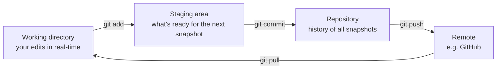

# Session 2 — Getting Started with Git

## In one sentence
**Git is a time machine + save-state system for code** — every commit is a snapshot you can rewind to, branch from, and share with collaborators.

## Real-world analogy
Think of Git like the **save points in a video game**: you make a checkpoint (commit) before each tough section, can branch off into "what if I tried this differently?" (a branch), and if your experiment fails you load the last save (`git restore`). Without Git, every refactor feels like Russian roulette.

## Mini worked example — your first repo

```bash
mkdir hello-git && cd hello-git
git init                                   # start tracking this folder
echo "# Hello Git" > README.md
git add README.md                          # stage the file
git commit -m "init: README"               # save snapshot #1

echo "import pandas as pd" > app.py
git add app.py
git commit -m "add app skeleton"           # snapshot #2

git log --oneline                          # see both snapshots
# 8a4f2c1 add app skeleton
# 3e9d12a init: README
```

Two snapshots, fully recoverable. That's the entire mental model.

## At-a-glance — the three areas Git tracks



The **staging area** is the part most beginners skip — but it's why Git is more powerful than just "ctrl-S with a date stamp."

## Why this matters
- **Recover from disasters**: accidental delete? `git restore` it.
- **Try risky changes safely**: branch off, experiment, throw away if it fails.
- **Collaborate**: your teammate's changes merge into yours without overwriting.
- **Build credibility**: a green-square commits graph on GitHub is recruiter catnip.

---

## Why Git, in one paragraph

Git is a **time machine + collaboration tool** for your code. Every save (commit) is a snapshot. You can rewind, branch off into experiments, merge them back, and share with others. Without Git, every team would lose work daily and every solo dev would be terrified of refactoring.

For data work specifically: Git is how you version notebooks, scripts, model code, configs, and (cautiously) data.

---

## Install + first-time setup

### Install
- **macOS**: comes with Xcode CLI; or `brew install git`
- **Windows**: https://git-scm.com — installs Git Bash + Git GUI
- **Linux**: `sudo apt install git`

### Configure once
```bash
git config --global user.name "Awais Shah"
git config --global user.email "m.awaisshah228@gmail.com"
git config --global init.defaultBranch main
git config --global pull.rebase false
git config --global core.editor "code --wait"   # VS Code as editor
```

These live in `~/.gitconfig`.

### Optional: better defaults
```bash
git config --global push.autoSetupRemote true   # less typing on first push
git config --global core.autocrlf input          # consistent line endings
```

---

## The mental model — three areas

```
working dir   ──(git add)──>   staging   ──(git commit)──>   repo (history)
```

- **Working directory** — your files on disk
- **Staging area** (a.k.a. "index") — what *will* go into the next commit
- **Repository** — the history of committed snapshots

The staging area is the part most people skip mentally — but it's why Git is more powerful than just "save a snapshot."

---

## The 8 commands you'll use 95% of the time

```bash
git init                              # 1. start a repo
git status                            # 2. what's changed? what's staged?
git add file.py                       # 3. stage specific file
git add .                             # 3b. stage everything new/modified
git commit -m "add EDA notebook"      # 4. snapshot the staged stuff
git log                               # 5. see history
git diff                              # 6. unstaged changes
git diff --staged                     # 6b. staged changes
git push                              # 7. send commits to remote
git pull                              # 8. fetch + merge from remote
```

Master these, then layer in branches and remotes.

---

## A complete first-repo walk-through

```bash
mkdir my-eda-project && cd my-eda-project

git init
echo "# My EDA Project" > README.md
echo "data/raw/" > .gitignore

git add README.md .gitignore
git status                   # both staged
git commit -m "init: README + gitignore"

# do work
echo "import pandas as pd" > notebook.py
git add notebook.py
git commit -m "add notebook skeleton"

git log --oneline             # see your two commits
```

---

## `.gitignore` — what NOT to commit

A file in your repo that lists patterns Git should ignore.

### Python project boilerplate
```
.venv/
__pycache__/
*.pyc
.ipynb_checkpoints/
.pytest_cache/
.env
.DS_Store
*.log
node_modules/
```

### Data-science specific
```
data/raw/             # large raw inputs
*.csv                 # if your CSVs are huge — better store in DVC / S3
*.parquet
models/*.pkl          # large pickled models
mlruns/               # MLflow tracking
.streamlit/secrets.toml
```

> Always commit a `.gitignore` *before* your first real commit, so you don't accidentally check in a 500MB CSV that's hard to remove later.

### Quick template generator
- https://github.com/github/gitignore — pre-made templates for every language

---

## Branches — the experiment system

```bash
git branch                          # list branches
git branch feature-eda              # create branch (doesn't switch)
git switch feature-eda              # switch to it (modern; replaces checkout)
git switch -c feature-eda           # create + switch in one step
git switch main                     # back to main
git branch -d feature-eda           # delete after merging
```

Older syntax (still common in the wild):
```bash
git checkout -b feature-eda         # same as switch -c
git checkout main
```

### Why branch
- Keep `main` stable and shippable
- Try a refactor in a side branch — discard if it doesn't work
- Work on multiple features in parallel
- Mandatory for team workflows (PRs)

---

## Inspecting history

```bash
git log                                  # full log
git log --oneline                        # one line per commit
git log --oneline --graph --all          # ascii branch graph
git log --author="Awais"                 # filter by author
git log --since="2 weeks ago"
git log --grep="TODO"                    # commits whose message matches
git show <commit-hash>                   # full diff of one commit
git blame file.py                        # who last touched each line
```

---

## Undoing things (the safety net)

| Situation | Command |
|---|---|
| Unstage a file (keep changes) | `git restore --staged file.py` |
| Discard unstaged changes in file | `git restore file.py` |
| Discard ALL unstaged changes | `git restore .` (careful!) |
| Edit the most recent commit message | `git commit --amend` |
| Add forgotten file to last commit | `git add forgot.py && git commit --amend --no-edit` |
| Undo last commit, keep changes staged | `git reset --soft HEAD~1` |
| Undo last commit, keep changes unstaged | `git reset --mixed HEAD~1` |
| Undo last commit, **discard** changes | `git reset --hard HEAD~1` (dangerous) |

> If you mess up: `git reflog` shows everything you've done. You can almost always recover by checking out a previous reflog entry.

---

## Notebooks + Git — the friction

`.ipynb` files are JSON with embedded outputs and metadata. Diffs look like binary noise. Two solutions:

### Option A — Strip outputs before commit (easiest)
```bash
pip install nbstripout
nbstripout --install     # configures git filter for current repo
```
Now outputs are stripped on commit; your local notebook still has them.

### Option B — Pair `.ipynb` with `.py` via Jupytext
```bash
pip install jupytext
```
Edit `.ipynb`, sync to `.py`, commit both. Diffs are clean.

### Option C — Keep notebooks for exploration, move final code to `.py`
The mature path. Notebook = scratchpad. `.py` modules = real code.

---

## Common pitfalls

| Mistake | What goes wrong | Fix |
|---|---|---|
| Committing without `.gitignore` | huge files / secrets in history | use BFG or `git filter-repo` (painful) |
| Committing `.env` with API keys | secrets exposed | rotate keys, remove from history |
| `git add -A` blindly | accidentally stages unwanted files | `git status` before commit |
| Vague commit messages ("fix") | future-you can't read the log | use imperative ("add", "fix X by doing Y") |
| Not branching | `main` becomes a graveyard | always work on a branch for non-trivial changes |

## Self-check

- [ ] What's the difference between working dir, staging, and repo?
- [ ] How do I undo `git add file.py`?
- [ ] What's in a `.gitignore` for a Python project?
- [ ] How do I create + switch to a new branch in one command?
- [ ] If I accidentally `git reset --hard`, what command saves me?
- [ ] How do I commit only some of my modified files?
- [ ] What's the right way to write a commit message?
- [ ] Why are notebooks tricky for Git, and what fixes it?

---

## Glossary

| Term | Plain meaning |
|------|---------------|
| **Git** | A version control system that tracks file changes as snapshots |
| **Repository (repo)** | A folder Git is tracking |
| **Working directory** | The actual files on your disk |
| **Staging area / index** | The "selection" of changes you've prepared for the next commit |
| **Commit** | A saved snapshot with a message |
| **Hash** | The unique 40-character ID for each commit (often shown as 7 chars) |
| **HEAD** | A pointer to your current commit (where you are in history) |
| **Branch** | A parallel line of work — `main` is the default |
| **`main` / `master`** | The default trunk branch (newer repos use `main`) |
| **`.gitignore`** | A file listing patterns Git should NOT track (secrets, large data, caches) |
| **`.gitconfig`** | Your global Git settings file (`~/.gitconfig`) |
| **`git init`** | One-time command to start tracking a folder |
| **`git status`** | Shows what's changed and what's staged |
| **`git add`** | Move changes from working directory to staging |
| **`git commit -m`** | Save staged changes as a snapshot with a message |
| **`git log`** | Show the history of commits |
| **`git diff`** | Show the actual line changes |
| **`git restore`** | Undo file changes (modern command for `checkout` of file) |
| **`git switch`** | Move between branches (modern command, replaces `checkout`) |
| **`git reset --soft`** | Move HEAD back, keep changes staged |
| **`git reset --mixed`** | Move HEAD back, keep changes unstaged (default) |
| **`git reset --hard`** | Move HEAD back, **discard** changes — dangerous |
| **`git reflog`** | Hidden log of every action — your safety net for recovering lost work |
| **`git amend`** | Edit the most recent commit |
| **Commit message** | A 1-3 line description of the change; imperative mood ("Add X") |
| **`nbstripout`** | Tool that strips notebook outputs before commit so diffs are clean |
| **Jupytext** | Tool that pairs `.ipynb` with a `.py` for version-control-friendly diffs |
| **BFG / `git filter-repo`** | Tools to permanently delete large files or secrets from history |

## Further reading
- Next: [03-git-collaboration.md](03-git-collaboration.md)
- GitHub-specific anatomy: [04-github-anatomy.md](04-github-anatomy.md)
- LFS for big files (when needed): see [04-github-anatomy.md](04-github-anatomy.md)
