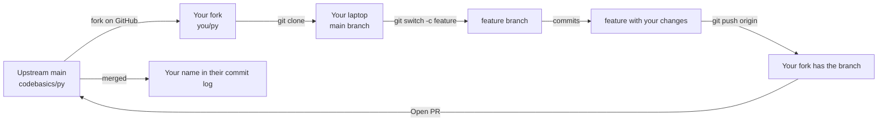

# Session 3 — Fundamentals of Git Collaboration

## In one sentence
Solo Git is linear; **team / OSS Git is parallel** — and this session covers the four primitives that make parallel work safe: branches, remotes, pull requests, and merge-conflict resolution.

## Real-world analogy
Imagine a Google Doc where 5 people are editing simultaneously. Most edits don't collide — but two people editing the *same sentence* need to negotiate. Git's branches + PRs + conflict resolution are exactly that, formalized for code: everyone works on their own copy (branch / fork), proposes changes (PR), and two people editing the same line forces a manual merge.

## Mini worked example — your first OSS-style PR

```bash
# 1. Fork the repo on github.com (button top-right)
# 2. Clone your fork
git clone https://github.com/<you>/codebasics-py.git
cd codebasics-py

# 3. Connect upstream so you can pull future updates
git remote add upstream https://github.com/codebasics/py.git

# 4. Branch off main for your change
git switch -c fix-readme-typo

# 5. Edit README.md → fix the typo

# 6. Commit + push
git add README.md
git commit -m "Fix typo: 'recieve' -> 'receive' in README intro"
git push -u origin fix-readme-typo

# 7. Open a PR on GitHub: fix-readme-typo  →  codebasics/py:main
```

Done. You're now an open-source contributor with a merged PR you can put on your resume.

## At-a-glance — fork → branch → PR



## Why this matters
- **Every job has team git** — solo skills aren't enough.
- **PRs = code review training**: you'll do this every day in a real role.
- **Conflicts will happen**; learning to resolve them confidently is a leveling-up moment.
- **Forking + PRing** is the default OSS contribution flow — a high-credibility resume line.

---

## What changes when you collaborate

Solo Git: linear history, you commit and push, done.
Team / OSS Git: multiple people work in parallel → branches → pull requests → conflicts.

This session covers everything between "I have a local repo" and "my PR is merged into someone else's project."

---

## Remotes — the link between your laptop and the world

A **remote** is a named pointer to a Git server (GitHub, GitLab, Bitbucket).

```bash
git remote -v                          # list remotes
git remote add origin https://github.com/you/repo.git
git remote remove origin
git remote rename origin upstream
```

Conventions:
- `origin` = your repo (or your fork)
- `upstream` = the original repo you forked from

---

## Cloning vs forking — the difference

### Cloning
You're a **direct contributor** with write access. Just download:
```bash
git clone https://github.com/yourorg/repo.git
cd repo
```

### Forking
You're an **outside contributor** without write access (e.g., contributing to OSS). The flow:
1. **Fork** the repo on GitHub (button top-right) — creates `you/repo`
2. **Clone your fork** locally
3. **Add the original as `upstream`** so you can pull updates

```bash
git clone https://github.com/you/repo.git
cd repo
git remote add upstream https://github.com/original/repo.git
git remote -v
# origin     https://github.com/you/repo.git   (fetch+push)
# upstream   https://github.com/original/repo.git (fetch+push, but you don't push there)
```

---

## The standard contribution workflow

```
upstream/main  ──────────────────────────────────────────
                          ↑
                          │ (PR merged)
                          │
                          │
your fork/main ─────────┐ │ ┌─────────  ↑
                        │ │ │           │ git pull upstream main
                        ↓ │ ↓
                  your branch:  feature-x ── (commits) ── push to origin
```

### Step by step

```bash
# 1) Sync your fork with upstream
git switch main
git fetch upstream
git merge upstream/main         # or: git pull upstream main
git push origin main            # update your fork

# 2) Create a branch for your change
git switch -c fix-typo-in-readme

# 3) Make changes, commit
edit README.md
git add README.md
git commit -m "Fix typo in README intro"

# 4) Push the branch to your fork
git push -u origin fix-typo-in-readme

# 5) Open a PR on GitHub from fix-typo-in-readme → upstream/main
```

---

## Push, pull, fetch — the three sync commands

| Command | What it does |
|---|---|
| `git fetch` | Download remote commits **without** merging. Updates `origin/main` reference. |
| `git pull` | `git fetch` + `git merge` (or rebase, if configured) |
| `git push` | Send your local commits to the remote |

> Prefer `git fetch` then `git merge` (or `git rebase`) over `git pull` when you want to *see* what's coming before merging.

---

## Merge conflicts — when two branches edit the same line

Git can auto-merge most things. When two branches change the *same* lines, Git stops and asks you to resolve.

### The conflict markers
```
<<<<<<< HEAD
my version of the line
=======
their version of the line
>>>>>>> feature-branch
```

### Resolution
1. Open the file
2. Decide what the merged version should be
3. Delete the markers
4. `git add file.py`
5. `git commit` — Git generates a merge commit message

### `git status` is your friend
It tells you which files are conflicted.

### VS Code / PyCharm
Both have visual merge tools. Use them — fighting markers manually is error-prone.

---

## Merge vs rebase — two ways to combine branches

### Merge — preserves history with a merge commit
```
A---B---C---M  (main)
     \     /
      D---E   (feature)
```
- `M` is a merge commit; `D` and `E` stay as-is
- History is "true" but messy

```bash
git switch main
git merge feature
```

### Rebase — replays your commits on top
```
A---B---C---D'---E'  (main)
```
- `D'` and `E'` are *new* commits with the same content
- History is linear, easier to read

```bash
git switch feature
git rebase main      # replays D, E on top of latest main
git switch main
git merge feature    # fast-forward
```

### Which to use
- **Public history** (after pushing): merge. Don't rewrite shared history.
- **Local cleanup**: rebase to keep your branch tidy before opening a PR.

> Rule of thumb: **never rebase commits you've already pushed and others have pulled**. It rewrites their reference and breaks them.

---

## Stash — save uncommitted work temporarily

```bash
git stash                      # set aside all unstaged + staged changes
git stash list                 # see saved stashes
git stash pop                  # apply most recent stash and remove
git stash apply stash@{1}      # apply specific stash, keep it
git stash drop stash@{0}       # delete a stash
git stash branch new-branch    # turn stash into a branch
```

Useful when you need to switch branches but aren't ready to commit.

---

## Pull requests (PRs) — the team workflow primitive

A **PR** is a request to merge your branch into someone else's branch. On GitHub it's a thread for code review, CI checks, and discussion.

### Anatomy of a good PR
- **Title**: imperative, short ("Add dark mode toggle")
- **Description**:
  - What this changes (1–2 lines)
  - Why (link to issue if applicable)
  - How tested
  - Screenshots / logs if UI / output changed
- **Small** — easier to review
- **Linked to an issue** with `Closes #123` (auto-closes on merge)

### Reviewing process
1. Reviewers comment / suggest changes
2. You push more commits to the branch — they auto-update the PR
3. Once approved + CI passes, merge

### Merge strategies (usually a repo setting)
- **Merge commit** — preserves all branch commits + adds merge commit
- **Squash and merge** — combines all branch commits into one (cleanest history; most teams default to this)
- **Rebase and merge** — replays commits onto target branch (linear history)

---

## Practical exercise — your first OSS contribution

Goal: fix a typo in the Codebasics public Git repo (or any OSS repo's README).

```bash
# 1) Fork on GitHub
# 2) Clone your fork
git clone https://github.com/<you>/codebasics-py.git
cd codebasics-py

# 3) Add upstream
git remote add upstream https://github.com/codebasics/py.git

# 4) Sync
git fetch upstream
git switch main
git merge upstream/main

# 5) Branch
git switch -c fix-readme-typo

# 6) Edit README.md to fix a real typo

# 7) Commit + push
git add README.md
git commit -m "Fix typo: 'recieve' -> 'receive' in README"
git push -u origin fix-readme-typo

# 8) Open PR via GitHub UI from fix-readme-typo → codebasics/py:main
```

This will probably be merged. You're now an official open-source contributor. Add the link to your portfolio.

---

## Common pitfalls

| Mistake | Effect | Fix |
|---|---|---|
| Working on `main` directly | Can't open a PR; messy history | Always create a feature branch |
| Committing many things in one PR | Hard to review, often rejected | Split into multiple small PRs |
| Force-pushing to a shared branch | Rewrites others' history; breaks them | Never `--force` on shared branches; use `--force-with-lease` if you must |
| Long-lived branches drift | Conflicts pile up | Rebase / merge upstream into your branch frequently |
| PR without description | Reviewers have no context | Always explain *why*, not just *what* |

## Self-check

- [ ] Difference between fork and clone — and when to use each?
- [ ] What does `git fetch upstream` do?
- [ ] How do I resolve a merge conflict?
- [ ] When should I rebase vs merge?
- [ ] What's a "good first issue" and where do I find it?
- [ ] What's `git stash` for?
- [ ] What does `Closes #42` in a PR description do?
- [ ] Have I opened my first PR yet?

---

## Glossary

| Term | Plain meaning |
|------|---------------|
| **Remote** | A named pointer to a Git server URL (`origin`, `upstream`) |
| **`origin`** | Convention for *your* fork or the main repo if you have direct access |
| **`upstream`** | Convention for the *original* repo you forked from |
| **Clone** | Download a copy of a remote repo with full history (`git clone`) |
| **Fork** | A GitHub-side copy of someone else's repo into your account |
| **`git fetch`** | Download remote commits without merging |
| **`git pull`** | Fetch + merge (or rebase) in one command |
| **`git push`** | Upload your commits to the remote |
| **Pull Request (PR)** | Formal proposal to merge your branch into someone else's branch |
| **Merge** | Combine two branches; creates a merge commit |
| **Fast-forward merge** | When the target branch hasn't diverged — simply moves the pointer |
| **Rebase** | Replay your commits on top of another branch — keeps history linear |
| **Merge commit** | The extra commit Git creates when combining diverged branches |
| **Merge conflict** | When Git can't auto-combine because two branches edited the same lines |
| **Conflict markers** | The `<<<<<<<`, `=======`, `>>>>>>>` lines Git inserts in conflicted files |
| **`git stash`** | Set aside uncommitted work temporarily so you can switch branches |
| **`git stash pop`** | Reapply the most recent stash and remove it |
| **CODEOWNERS** | A file mapping paths → reviewers, auto-assigned on PR |
| **Squash and merge** | PR merge strategy that combines all branch commits into one |
| **Force-push** | Overwrites remote history (`--force`) — never on shared branches |
| **`--force-with-lease`** | Safer force-push — fails if someone else pushed since you last fetched |
| **CI (Continuous Integration)** | Automated tests/checks that run on every push or PR |
| **Closes #42** | Magic phrase in a PR description that auto-closes issue #42 on merge |
| **Triage** | The work of labeling, prioritizing, and routing issues |

## Further reading
- Next: [04-github-anatomy.md](04-github-anatomy.md)
- Finding repos to contribute to: [05-finding-oss-projects.md](05-finding-oss-projects.md)
