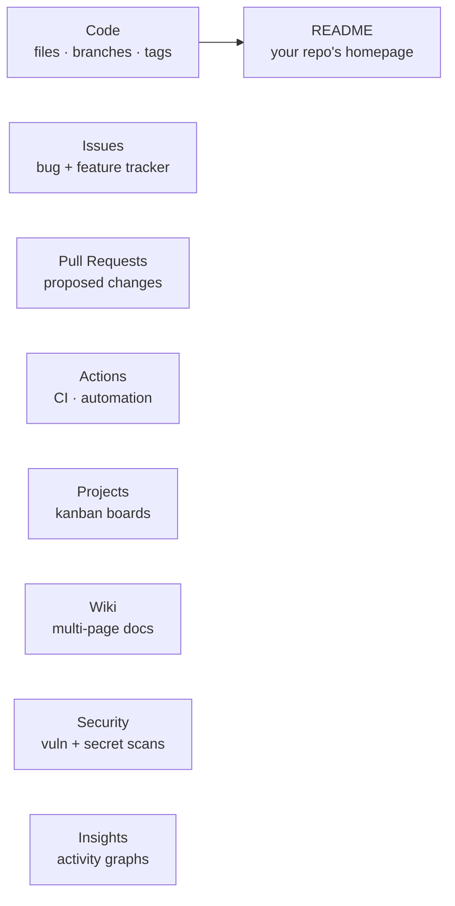

# Session 4 — Anatomy of GitHub Repository

## In one sentence
A GitHub repo is **far more than a code folder** — it's a project hub bundling code, docs, issues, PRs, automation (Actions), and a public face — and knowing each tab makes you 10× faster at navigating any OSS repo and shipping clean ones of your own.

## Real-world analogy
A GitHub repo is like a **building** with multiple floors:
- Ground floor (Code) — the apartment itself
- Visitor's notice board (Issues) — bug reports & feature requests
- Mailroom (Pull Requests) — proposed changes under review
- Security desk (Actions) — auto-checks every visitor
- Concierge directory (README) — first thing every visitor reads
- Building rules (CONTRIBUTING.md, LICENSE) — posted on the door

Most learners use only the ground floor. Power users know every floor.

## At-a-glance — the 8 main tabs



## Mini worked example — a 5-minute repo polish

For any project repo:

```
1. Repo description (one-liner under title)            ← 30 seconds
2. Topics (`data-analysis`, `python`, `pandas`)        ← 30 seconds
3. README with screenshot + how-to-run                 ← 2 minutes
4. LICENSE file (MIT)                                  ← 1 click
5. .gitignore for Python                               ← 1 click via GitHub
6. Pin the repo to your profile                        ← 1 click
```

Six tiny actions = a recruiter-ready repo. Most people skip them and wonder why their GitHub looks empty.

## Why this matters
- **First-glance trust**: a polished repo signals you understand professional engineering norms.
- **Speed**: knowing keyboard shortcuts (`t`, `.`, `g i`, `g p`) makes navigation effortless.
- **Automation**: a 10-line GitHub Actions workflow means every push runs your tests automatically.
- **Discoverability**: topics + description = your repo appears in GitHub search + Google.

---

## Overview

A GitHub repo is more than a code folder. It's a project hub with:
- Code (with branches, tags, releases)
- Documentation (README, Wiki, GitHub Pages)
- Issues (bug + feature tracker)
- Pull Requests (code review)
- Projects (Kanban / roadmaps)
- Actions (CI/CD automation)
- Discussions (forum)
- Security (alerts, secrets)
- Insights (graphs, traffic)

Knowing each piece makes you fast at navigating *any* OSS repo and shipping clean ones of your own.

---

## 1. Code tab

### Files & folders
- Click any folder/file to drill in
- "Go to file" search (`t` shortcut) — fastest navigation
- Hit `.` while on any repo → opens in github.dev (web VS Code)

### Branch / tag dropdown (top-left of file tree)
Switch view to a branch / tag. Defaults to `main`.

### "Code" button (green, top-right)
Gives clone URL (HTTPS / SSH) or "Open with GitHub Desktop" or "Download ZIP."

### Commit graph
`Insights → Network` shows the branch/merge graph.

---

## 2. README — your repo's homepage

Auto-rendered as Markdown on the repo home. Quality of README often correlates with how welcoming the repo feels.

Already covered in [Module 2 — Python Projects on GitHub](../02-online-credibility/04-python-projects-to-github.md). Recap:

- Title + 1-line tagline
- Demo screenshot
- Problem statement
- Tools / stack
- How to run
- Top results / insights
- License

---

## 3. Issues — bug & feature tracker

### Anatomy of an issue
- Title — short, imperative
- Body — Markdown; include reproduction steps for bugs
- Labels — `bug`, `enhancement`, `good first issue`, `help wanted`
- Assignees — who's working on it
- Milestone — which release it targets
- Comments — discussion thread

### Useful issue-creation patterns

**Bug report**:
```markdown
## Steps to reproduce
1. Run `python notebook.py` with `data/sample.csv`
2. ...

## Expected
Should print summary stats.

## Actual
Crashes with `KeyError: 'amount'`.

## Environment
Python 3.11.4, pandas 2.2.0, macOS 14.

## Stack trace
\`\`\`
Traceback (most recent call last):
  ...
\`\`\`
```

**Feature request**:
```markdown
## Problem
Currently the notebook reads CSV only. Many enterprise users have parquet.

## Proposal
Add `read_parquet` branch in `load_data()`.

## Alternatives considered
- Tell users to convert offline (rejected: friction)
```

### Templates
Repo owners can add `.github/ISSUE_TEMPLATE/*.md` files to standardize this.

---

## 4. Pull Requests

Already covered in [03-git-collaboration.md](03-git-collaboration.md). Quick reference:

- **Files changed** tab shows the diff
- **Conversation** tab is the thread
- **Checks** tab shows CI status
- **Commits** tab shows individual commits in the PR
- Reviewers can:
  - Comment on specific lines
  - Suggest changes (clickable code suggestions)
  - Approve / Request changes / Comment

### CODEOWNERS
A `CODEOWNERS` file in the repo auto-assigns reviewers based on which files changed.

---

## 5. Projects — kanban / roadmap

GitHub Projects (the new "Projects v2") is a flexible board:
- Kanban: Todo / In Progress / Done
- Table view
- Roadmap (timeline)

You can link issues + PRs onto cards. For your bootcamp portfolio, even a simple personal project board ("12 bootcamp projects") is great. **Used in the AtliQo Bank module too** (Module 5 covers Kanban + JIRA setup).

---

## 6. Wiki

Per-repo collaborative docs. Useful for:
- Multi-page tutorials
- Reference material that doesn't fit in README
- Architecture decisions

For most personal projects, you can skip Wiki and just use README + a `docs/` folder.

---

## 7. Actions — CI/CD

GitHub-hosted runners that execute YAML workflows when events happen (push, PR, schedule).

### Minimal Python workflow (`.github/workflows/test.yml`)
```yaml
name: Tests

on: [push, pull_request]

jobs:
  test:
    runs-on: ubuntu-latest
    steps:
      - uses: actions/checkout@v4
      - uses: actions/setup-python@v5
        with:
          python-version: "3.12"
      - run: pip install -r requirements.txt
      - run: pytest -v
```

After this lands in `main`, every push runs your tests automatically. You'll see green ✅ / red ❌ on every commit and PR.

### What people use Actions for
- Run tests / linters / type-checks on every PR
- Build + publish a Python package
- Deploy a Streamlit / FastAPI app
- Auto-format code (`black`, `ruff`)
- Run weekly maintenance scripts (cron)

### Free tier
- Public repos: unlimited Actions minutes
- Private repos: 2,000 free minutes/month

---

## 8. Releases & tags

- A **tag** is a named pointer to a specific commit (`v1.0.0`)
- A **release** is a UI on top of a tag with notes + downloadable assets

```bash
git tag v1.0.0
git push origin v1.0.0
```

Then on GitHub: Releases → Draft a new release → choose tag → write notes.

For your bootcamp projects: tag a `v1.0` when you finish, attach a screenshot, write a short release note. Looks professional in interviews.

---

## 9. Security tab

- **Dependabot alerts** — flags vulnerable dependencies
- **Secret scanning** — alerts if you committed an API key
- **Code scanning** — runs CodeQL or other static analyzers

Free for public repos. Worth turning on.

---

## 10. Insights tab

- **Pulse**: weekly activity summary
- **Contributors**: who committed what
- **Commits**: per-week graph
- **Code frequency**: lines added/removed
- **Network**: branch/merge graph
- **Forks**: who forked your repo
- **Traffic**: clones + visitors (last 14 days)

For the bootcamp: keep an eye on the **commits graph** — green daily activity is gold for recruiters.

---

## 11. Settings tab — repo configuration

### Things worth setting on personal repos
- Description + topics + website (top of repo page)
- Social preview image (auto-grabbed by LinkedIn when shared)
- "Wiki", "Discussions", "Projects" — enable/disable as you need
- "Branches" → require PR review before merge to main (good habit even solo)
- "Pages" → host static site from `/docs` folder or `gh-pages` branch
- "Secrets and variables" → for Actions

---

## 12. Special files GitHub recognizes

| File | Purpose |
|---|---|
| `README.md` | Repo home page |
| `LICENSE` | Open-source license (MIT, Apache 2.0) |
| `CONTRIBUTING.md` | How to contribute (rendered on PR/issue creation) |
| `CODE_OF_CONDUCT.md` | Community rules |
| `SECURITY.md` | How to report vulns |
| `.github/ISSUE_TEMPLATE/` | Issue templates |
| `.github/PULL_REQUEST_TEMPLATE.md` | PR template |
| `.github/workflows/` | Actions workflows |
| `CODEOWNERS` | Auto-assign reviewers |
| `FUNDING.yml` | Sponsorship buttons |
| `.gitignore` | Files Git should skip |

---

## 13. GitHub keyboard shortcuts (worth memorizing)

| Key | Action |
|---|---|
| `?` | Show help |
| `t` | Open file finder in any repo |
| `s` | Focus search |
| `g` then `i` | Go to Issues |
| `g` then `p` | Go to Pull Requests |
| `.` | Open repo in github.dev (web VS Code) |
| `[` / `]` | Prev / next file in a diff |
| `y` | Get permalink to current line |

---

## Self-check

- [ ] Can I navigate to Issues, PRs, Actions, Settings without thinking?
- [ ] Do my repos have descriptions + topics set?
- [ ] Have I added a LICENSE file?
- [ ] Have I set up at least one GitHub Action (even just running pytest)?
- [ ] Have I created my first release with notes + screenshot?
- [ ] Have I starred ≥10 repos relevant to my niche?
- [ ] Do I know what `CODEOWNERS` does without looking?

---

## Glossary

| Term | Plain meaning |
|------|---------------|
| **Repo (repository)** | A project's GitHub home — code + docs + issues + history |
| **README.md** | The first thing visitors see; rendered as your repo's home page |
| **Issues** | The bug + feature tracker tab |
| **Labels** | Tags like `bug`, `good first issue`, `help wanted` for filtering issues |
| **Milestone** | Group of issues targeting a release |
| **Pull Request (PR)** | Proposed code change under review |
| **Files changed** | The diff view in a PR |
| **Conversation** | The discussion thread in a PR or issue |
| **Checks** | CI pipeline status on a PR (green = passing, red = failing) |
| **Actions** | GitHub's CI/CD platform — runs YAML workflows on events |
| **Workflow** | A YAML file in `.github/workflows/` defining automation |
| **Runner** | The virtual machine that executes a workflow (Ubuntu, macOS, Windows) |
| **Projects (v2)** | GitHub's flexible Kanban / table / roadmap boards |
| **Wiki** | Per-repo collaborative docs (alternative to a `docs/` folder) |
| **Releases** | UI on top of a tag — adds notes + downloadable assets |
| **Tag** | A named pointer to a specific commit, e.g. `v1.0.0` |
| **Dependabot** | Bot that flags vulnerable dependencies and proposes upgrade PRs |
| **Secret scanning** | GitHub auto-detection of API keys committed to public repos |
| **CodeQL** | GitHub's static analysis tool for finding vulnerabilities |
| **Insights tab** | Per-repo analytics — Pulse, Contributors, Commits, Network |
| **github.dev** | Web VS Code launched by hitting `.` on any repo |
| **Topic** | A tag attached to a repo for discoverability (`data-science`) |
| **CODEOWNERS** | A file auto-assigning reviewers to PRs based on which files changed |
| **CONTRIBUTING.md** | Project guidelines for new contributors — read before opening a PR |
| **CODE_OF_CONDUCT.md** | Community-behavior rules |
| **LICENSE** | Legal terms for reuse — MIT and Apache 2.0 are common defaults |
| **GitHub Pages** | Free static-site hosting from a `gh-pages` branch or `/docs` folder |
| **Permalink (`y`)** | Stable URL to a specific commit's version of a line — survives edits |

## Further reading
- Next: [05-finding-oss-projects.md](05-finding-oss-projects.md)
- Push your projects to GitHub: [../02-online-credibility/04-python-projects-to-github.md](../02-online-credibility/04-python-projects-to-github.md)
