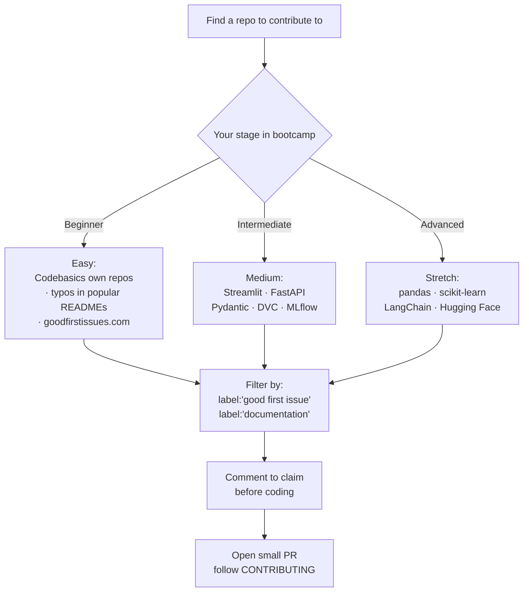

# Session 5 — Finding Open-Source Projects to Contribute On

## In one sentence
**3 small merged PRs** to real OSS projects de-risks the "have you ever worked in a team codebase?" interview question — and finding them is mostly a labels-and-search exercise, not a talent one.

## Real-world analogy
Think of OSS contribution as **stepping into someone else's kitchen** to help cook. You don't barge in and rebuild the menu — you start by washing one dish (typo fix), watching the head chef's rules (CONTRIBUTING.md), then offering to help with a small task (good-first-issue ticket). After 3 dishes done well, you're trusted with bigger work.

## Mini worked example — your 30-day OSS plan

```
Week 1: Pick 3 candidate repos at 3 difficulty levels.
        Star them. Read README + CONTRIBUTING.md.

Week 2: Find 5 'good first issue' tickets.
        Shortlist 1. Comment to claim it.

Week 3: Set up dev env, run tests locally,
        open your first PR.

Week 4: Address review feedback, get merged.
        Start the next issue while waiting.

Result: 1 merged PR + 1 in-flight + a LinkedIn post about it.
```

## At-a-glance — where to look



## Why this matters
- **Resume gold**: "Contributed to scikit-learn" works far harder than "I built a tutorial project."
- **Real workflow**: forks, branches, PRs, code review = exactly what a real job uses.
- **Network**: maintainers become contacts; some have hired contributors directly.
- **Confidence**: surviving your first review feedback is a one-way door — you'll never fear PRs again.

---

## Why OSS contributions matter for your job hunt

A merged PR — even a tiny one — does several things at once:
- Proves you know the **Git/PR workflow** beyond a tutorial
- Shows **collaboration etiquette** (issue discussion, code review)
- Adds your **name to a real public project** — a strong resume line
- Often leads to **mentor connections** with maintainers

For a junior data person, even **3 small OSS contributions** drastically de-risks the "have you ever worked in a team codebase?" interview question.

---

## What counts as a contribution

You don't have to ship a feature. All these count:

| Type | Difficulty | Visibility |
|---|---|---|
| Fix a typo in README | trivial | small |
| Improve docs / add example | easy | medium |
| Add a test for an existing function | easy-medium | strong |
| Write a tutorial in `examples/` | medium | strong |
| Fix a "good first issue" bug | medium | strong |
| Add a small feature (with maintainer agreement) | medium-hard | very strong |
| Translate docs | easy | strong + community love |
| Triage issues (label, close dupes) | easy | medium |

Start at the top, work down as confidence builds.

---

## Where to find good projects (matched to your stage)

### Bootcamp-relevant repos

#### Codebasics' own
- https://github.com/codebasics — practice notebooks, course code
- Easy contribution: docstrings, additional example exercises

#### Foundations you already use
- **pandas** — https://github.com/pandas-dev/pandas — has many "good first issue" docs tasks
- **numpy** — https://github.com/numpy/numpy
- **scikit-learn** — https://github.com/scikit-learn/scikit-learn — strong "Documentation" labels for newbies
- **matplotlib** — https://github.com/matplotlib/matplotlib
- **seaborn** — https://github.com/mwaskom/seaborn

#### Small / medium repos (more approachable)
- **Streamlit** — https://github.com/streamlit/streamlit
- **FastAPI** — https://github.com/fastapi/fastapi — Sebastián Ramírez is famously friendly
- **Pydantic** — https://github.com/pydantic/pydantic
- **DVC** — https://github.com/iterative/dvc — data versioning, perfect topic for DS
- **MLflow** — https://github.com/mlflow/mlflow

#### Gen AI / agents (later in bootcamp)
- **LangChain** — https://github.com/langchain-ai/langchain — fast-moving, lots of doc PRs
- **LlamaIndex** — https://github.com/run-llama/llama_index
- **Hugging Face Transformers** — https://github.com/huggingface/transformers

---

## Finding "good first issues"

### GitHub label search
On any repo: **Issues tab → Labels** → click `good first issue` (also `help wanted`, `documentation`, `easy`).

### Aggregators
- https://goodfirstissues.com — newest "good first issue" tickets across many repos
- https://up-for-grabs.net — by language / project
- https://www.firsttimersonly.com — beginner-friendly projects
- https://github.com/topics/hacktoberfest — annual October contribution event
- GitHub's own **Explore** → "Topics" → e.g. `data-science`, `nlp`, `pytorch`

### Search syntax
On GitHub search bar:
- `is:issue is:open label:"good first issue" language:python` → fresh tickets in Python
- `is:issue is:open label:"help wanted" language:python created:>2025-01-01`

---

## Reading `CONTRIBUTING.md` — the unwritten rule

Every serious project has one. **Always read it before opening a PR.** It typically tells you:
- How to set up dev env
- Code style (formatter, linter)
- Branch + commit conventions
- How to run tests
- Whether to open an issue before a PR
- How long reviews take
- What labels mean

Skipping `CONTRIBUTING.md` and going straight to a PR is the #1 way contributions get auto-rejected.

---

## The "claim, then code" etiquette

```
1. Find an issue you like (good first issue, help wanted)
2. Read the comments — is someone already working on it?
3. Comment: "Hi, I'd like to work on this — is it still open?"
4. Wait for maintainer to assign you (usually fast)
5. THEN code
```

Don't open a 500-line PR for an issue you didn't claim. It's likely a duplicate of someone else's in-progress work.

---

## Anatomy of a clean first PR

### Branch name
`fix-readme-typo` · `add-example-for-groupby` · not `patch-1`.

### Commit message
`Fix typo "recieve" → "receive" in README intro`

### PR title
Short, imperative — **same shape as the commit message**.

### PR description template
```markdown
## What
Fixes a typo in the introduction section of README.md.

## Why
Currently "recieve" appears twice; flagged in passing while reading docs.

## Testing
N/A (docs change)

## Related issue
Closes #123  (only if there's an issue)
```

### Size
Small. **One logical change per PR.** If you spot 3 things to fix, open 3 PRs.

---

## What to do when your PR gets review feedback

- **Read it carefully** — don't get defensive
- **Push more commits** to the same branch — they'll appear in the PR automatically
- **Mark suggested-change comments as "resolved"** when you address them
- **Ask for clarification** if something's ambiguous — better than guessing
- **Be patient** — maintainers are volunteers

---

## What if your PR sits without a review

- After **1 week**: gentle ping in the PR comments
- After **2 weeks**: tag the maintainer or last reviewer in a comment
- After **a month**: maintainers may be busy/MIA. Move on; the work isn't wasted (it's still on your fork + your contribution graph).

---

## Build the public artifact — talk about your contribution

Every merged PR is a LinkedIn post. Template:

```
Just merged my first PR to [project name] 🎉

Change: [1-line summary]
Why it matters: [1-line]
Repo: [link to PR]

Lesson learned about the maintainers' workflow: [1 honest insight]

#opensource #buildinpublic #python
```

---

## A 30-day plan to your first 3 contributions

| Day | Goal |
|---|---|
| 1–3 | Pick 3 candidate repos (one easy, one medium, one stretch). Star them. Read their README + CONTRIBUTING. |
| 4–7 | Find 5 "good first issue" tickets across them. Shortlist 1. |
| 8–10 | Set up dev env per CONTRIBUTING. Run their tests locally. |
| 11–14 | Comment on the issue, get assigned, start coding. |
| 15–18 | Open PR. Address feedback. |
| 19–21 | While waiting for review, start the next issue elsewhere. |
| 22–30 | Aim to have 1 merged + 1 in-flight. Post about it. |

After 30 days you have your first OSS line on the resume.

---

## Common pitfalls

| Mistake | Effect | Fix |
|---|---|---|
| Skipping CONTRIBUTING.md | PR rejected for style/format | Read it. Always. |
| 500-line refactor PR | Won't get reviewed | Split into small PRs |
| Working on `main` of your fork | Can't submit a PR | Always branch |
| Pushing without testing locally | CI fails on PR | Run tests / linter before push |
| Vague PR description | Reviewers can't help | Use the template |
| Going silent after feedback | PR dies | Acknowledge feedback within a few days |

## Self-check

- [ ] I've identified 3 candidate repos for contribution
- [ ] I've read CONTRIBUTING.md for at least one of them
- [ ] I've commented on / claimed at least one issue
- [ ] I've opened my first PR (even a typo fix)
- [ ] I've posted about my first OSS contribution publicly
- [ ] I have a 30-day plan for the next 3 contributions

---

## Glossary

| Term | Plain meaning |
|------|---------------|
| **OSS (Open Source Software)** | Code released under a license that allows anyone to read, use, and contribute |
| **`good first issue`** | GitHub label maintainers use for beginner-friendly tickets |
| **`help wanted`** | Issues where the maintainer is open to outside contributors |
| **`hacktoberfest`** | Annual October event encouraging OSS contributions; great for first-timers |
| **CONTRIBUTING.md** | Project's rules-of-the-house file — read before opening a PR |
| **CODE_OF_CONDUCT.md** | Community behavior expectations |
| **Maintainer** | The volunteer(s) running the project — often unpaid |
| **Fork** | Your own copy of a repo on GitHub where you experiment |
| **Upstream** | The original repo you forked from |
| **Claim (an issue)** | Comment "I'd like to work on this" before coding to avoid duplicates |
| **Triage** | The work of sorting / labeling / closing duplicate issues |
| **CodeQL / Codescene** | Automated tools projects use to scan PRs for issues |
| **Sebastián Ramírez** | Creator of FastAPI; famously friendly to first-time contributors |
| **goodfirstissues.com** | Aggregator site for fresh good-first-issue tickets across many repos |
| **up-for-grabs.net** | Browse OSS by language and project for beginner work |
| **firsttimersonly.com** | Curated list of beginner-friendly OSS projects |
| **Closes #N** | PR description phrase that auto-closes issue N when merged |
| **CI failing** | The automated tests on your PR didn't pass; fix locally and re-push |
| **Squash and merge** | Most common merge strategy — combines all PR commits into one |
| **Hacktoberfest swag** | Free T-shirts / stickers for ≥4 merged PRs in October |

## Further reading
- Recap of git collaboration mechanics: [03-git-collaboration.md](03-git-collaboration.md)
- Repo polish for showcasing your own projects: [04-github-anatomy.md](04-github-anatomy.md)
- Posting about your first PR: [01-build-in-public-philosophy.md](01-build-in-public-philosophy.md)
