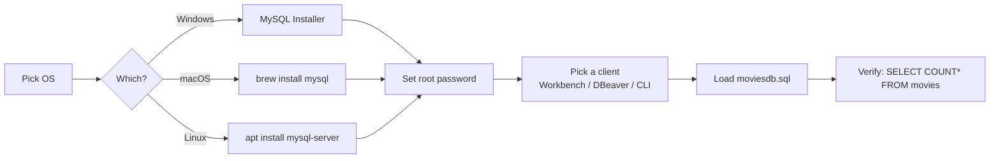

# Section 1+2 — MySQL Setup & Movies Dataset Import

## Lectures covered
- How much SQL is Needed for a Data Scientist / AI Engineer?
- Install MySQL: Windows / Linux / Mac
- Import Movies Dataset in MySQL

---

## In one sentence
You install **MySQL** (a database engine), pick a **client** (a tool to talk to it), and load the **moviesdb** sample data — that's the toolbox every later SQL chapter writes against.

## Real-world analogy
Think of MySQL as a giant filing cabinet that lives on your computer. The **client** (Workbench, DBeaver, or the command line) is the librarian you ask for files. **Importing the moviesdb data** is like dropping a pre-organized box of folders into the cabinet so you have something to practice on.

## The intuition (plain English)
A database is a place to store **tables** — grids of rows and columns, like a stricter spreadsheet. MySQL is one popular database engine; Postgres, SQLite, and SQL Server are others. You don't read the files directly — you send a database **query** (a `SELECT` statement) and the engine returns rows. Setting it up has three steps: install the engine, install a client, then load some data so you can practice. Once that's done, you spend the rest of the module writing queries against the same little movie dataset.

## Mini worked example — what's actually in the box

After running the import, the `moviesdb` schema holds a small `movies` table that looks like this:

```
movie_id | title              | industry  | release_year | imdb_rating
---------+--------------------+-----------+--------------+------------
       1 | The Godfather      | Hollywood |         1972 |         9.2
       2 | Sholay             | Bollywood |         1975 |         8.5
       3 | Inception          | Hollywood |         2010 |         8.8
       4 | Bahubali 2         | Bollywood |         2017 |         8.2
       5 | Forrest Gump       | Hollywood |         1994 |         8.8
```

Once loaded, you confirm the import with one query:

```sql
USE moviesdb;
SELECT COUNT(*) FROM movies;   -- ~50 rows
SELECT * FROM movies LIMIT 3;
```

If you see rows, the toolbox is ready.

## At-a-glance — the install path



## Why this matters
- Every later SQL lecture assumes the `moviesdb` schema is loaded — without it you can't follow along.
- A working **MySQL + client + sample data** combo on your laptop is the same setup most data analyst interviews assume.
- This is the bridge to the [pandas EDA file](../../01-python/01-basics/07-eda-pandas-matplotlib-seaborn.md): once you can pull rows with SQL, you load them into a DataFrame and analyze.

---

## How much SQL do you need?

For data roles in 2025:
- **Data Analyst**: SQL is your daily driver — comfort + speed required.
- **Data Scientist**: comfortable with intermediate SQL (joins, aggregates, windows). Most companies pull data with SQL before any Python.
- **ML Engineer**: read-comfort with SQL; rarely write complex queries.
- **AI / GenAI Engineer**: SQL appears in RAG-over-databases and tool-use scenarios. Read-comfort + ability to verify what an LLM agent wrote.

The bootcamp targets ~80% mastery — enough for any analytical interview.

---

## MySQL installation

### Windows
1. Download "MySQL Installer" from https://dev.mysql.com/downloads/installer/
2. Choose "Developer Default" (installs server + Workbench + sample DBs)
3. Set a strong root password — *write it down*
4. Verify in PowerShell: `mysql --version`

### macOS
```bash
brew install mysql
brew services start mysql       # auto-start on boot
mysql_secure_installation        # set root password, drop test DB
mysql -u root -p
```

### Linux (Ubuntu/Debian)
```bash
sudo apt update
sudo apt install mysql-server
sudo systemctl start mysql
sudo systemctl enable mysql
sudo mysql_secure_installation
sudo mysql -u root -p
```

---

## Clients — what to use

| Tool | When |
|---|---|
| **MySQL CLI** (`mysql -u root -p`) | Quick, scriptable; how production engineers connect |
| **MySQL Workbench** | GUI, free, official; great for ERDs + visual query results |
| **DBeaver** | GUI, free, multi-DB (works with Postgres, BigQuery too) |
| **VS Code SQLTools extension** | If you live in VS Code |

The bootcamp demos Workbench. Use whichever you like — the SQL is the same.

---

## Importing the Movies dataset (Codebasics standard)

### What's in it
A `moviesdb` schema with 6 tables: `movies`, `actors`, `movie_actor`, `studios`, `financials`, `languages`. Sandbox-style — small enough to query interactively, real enough to teach joins.

### Two import paths

#### Path A — Using a `.sql` dump (fastest)
1. Download `moviesdb.sql` from Codebasics' GitHub
2. In MySQL Workbench: Server → Data Import → "Import from Self-Contained File" → choose the `.sql` → Default Target Schema (or new) → Start Import
3. Or via CLI:
   ```bash
   mysql -u root -p < moviesdb.sql
   ```

#### Path B — Using individual CSVs
1. Create the schema: `CREATE DATABASE moviesdb;`
2. Run `CREATE TABLE` statements per CSV
3. Load each CSV: `LOAD DATA INFILE '/path/to/movies.csv' INTO TABLE movies FIELDS TERMINATED BY ',' IGNORE 1 LINES;`

> `LOAD DATA INFILE` requires a `--secure-file-priv` setting; if it errors, copy the CSV into the MySQL upload folder shown by `SHOW VARIABLES LIKE "secure_file_priv";`.

---

## Verifying the import

```sql
USE moviesdb;
SHOW TABLES;

-- typical output:
-- actors
-- financials
-- languages
-- movie_actor
-- movies
-- studios

SELECT COUNT(*) FROM movies;        -- ~50 rows
SELECT * FROM movies LIMIT 5;
```

If counts look right and `SELECT *` returns sensible rows, you're good.

---

## Quick orientation — what each table looks like

```sql
-- movies (the fact-ish table)
DESCRIBE movies;
-- movie_id, title, industry, release_year, imdb_rating, studio, language_id

-- actors
DESCRIBE actors;
-- actor_id, name, birth_year

-- movie_actor (junction table — many-to-many)
DESCRIBE movie_actor;
-- movie_id, actor_id

-- financials
DESCRIBE financials;
-- movie_id, budget, revenue, unit, currency

-- studios
DESCRIBE studios;
-- studio (PK), city, founded

-- languages
DESCRIBE languages;
-- language_id, name
```

This is the dataset every later lecture references. Worth a 5-minute browse.

---

## Workbench — the 4 tabs you'll use

1. **Schemas panel (left)** — your databases & tables
2. **Query editor (top)** — write SQL, hit Ctrl+Enter to run
3. **Results grid (bottom)** — query output
4. **Output / Action panel** — error messages, execution time

Tip: right-click a table → "Select Rows - Limit 1000" gives you a quick SELECT *.

---

## Common pitfalls

| Mistake | Effect | Fix |
|---|---|---|
| Forgot `USE moviesdb;` | "Table doesn't exist" errors | always set the active DB first |
| Case-sensitivity surprises | macOS default is case-sensitive | use lowercase table names consistently |
| `LOAD DATA` permission denied | `secure_file_priv` setting | move CSV to the allowed dir, or use Workbench's import wizard |
| Different CSV separators | comma vs tab | adjust `FIELDS TERMINATED BY` |
| Forgot to `IGNORE 1 LINES` | header row imported as data | always specify |

## Self-check

- [ ] `mysql --version` works
- [ ] I can connect with my root password
- [ ] `moviesdb` schema is loaded; `SHOW TABLES;` shows 6 tables
- [ ] `SELECT * FROM movies LIMIT 5;` returns rows
- [ ] I picked a primary client (Workbench / DBeaver / CLI)
- [ ] My password is stored somewhere safe — and not committed to Git

---

## Glossary

| Term | Plain meaning |
|------|---------------|
| **Database** | An organized container for related data, sitting on disk and managed by a database engine |
| **MySQL** | A popular open-source database engine. Runs as a service on your machine |
| **Schema** | A named container *inside* MySQL that holds tables. In MySQL, "schema" and "database" are the same word |
| **Table** | A grid of rows and columns — like a spreadsheet with a fixed shape |
| **Row** | One record in a table (one movie, one customer) |
| **Column** | One attribute of every row (title, release_year, imdb_rating) |
| **Client** | A program you use to send SQL to MySQL — could be a GUI (Workbench, DBeaver) or the command line |
| **Workbench** | MySQL's official free GUI client — query editor, results grid, ERD tool, all in one |
| **DBeaver** | A free GUI client that works with MySQL, Postgres, BigQuery, and more |
| **CLI** | Command-Line Interface — the text-only `mysql` program you run in a terminal |
| **Root user** | The all-powerful admin account in MySQL. Don't use it for daily work |
| **Query** | A SQL statement you send to the database (most start with `SELECT`) |
| **SELECT** | The SQL keyword for "give me rows that match this filter" |
| **USE** | The SQL keyword that switches your active schema: `USE moviesdb;` |
| **moviesdb** | The Codebasics sample dataset — a 6-table movie database used throughout the bootcamp |
| **`.sql` dump** | A text file containing the SQL needed to recreate a database (CREATE TABLE + INSERT statements) |
| **CSV** | Comma-separated values — a plain-text file format for tabular data |
| **LOAD DATA INFILE** | The MySQL command for bulk-loading a CSV into a table |
| **secure_file_priv** | A MySQL setting that restricts which folders `LOAD DATA INFILE` can read from |
| **DESCRIBE** | Shows a table's column names and types: `DESCRIBE movies;` |
| **SHOW TABLES** | Lists every table in the current schema |

## Further reading
- Next: [02-single-table-retrieval.md](02-single-table-retrieval.md) — your first real queries
- Pandas equivalent: [../../01-python/01-basics/07-eda-pandas-matplotlib-seaborn.md](../../01-python/01-basics/07-eda-pandas-matplotlib-seaborn.md) — once you can SELECT, you can `read_sql_query` into a DataFrame
- Style guide: [../../../BEGINNER-STYLE-GUIDE.md](../../../BEGINNER-STYLE-GUIDE.md)
