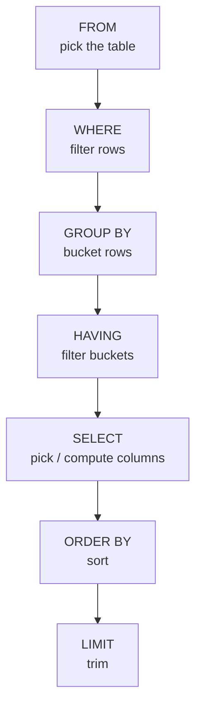

# Section 2 — Data Retrieval: Single Table

## Lectures covered
- Retrieve Data Using Text Query (`SELECT`, `WHERE`, `DISTINCT`, `LIKE`)
- Retrieve Data Using Numeric Query (`BETWEEN`, `IN`, `ORDER BY`, `LIMIT`, `OFFSET`)
- Summary Analytics (`MIN`, `MAX`, `AVG`, `GROUP BY`)
- `HAVING` clause
- Calculated Columns (`IF`, `CASE`, `YEAR`, `CURYEAR`)
- "The Data God's Blessing" + Quiz

---

## In one sentence
You give SQL a recipe — *which table, filter, group, then sort* — and the engine returns the matching rows; learning this chapter is learning how to translate any business question into that recipe.

## Real-world analogy
Querying a single table is like asking a librarian: *"Pull all Bollywood movies released after 2010, sort by rating, and give me the top 5."* Each part of that sentence — pick the shelf, filter, sort, limit — has a SQL keyword that does exactly that.

## The intuition (plain English)
Every query is built from the same few moves: pick a table (`FROM`), filter rows (`WHERE`), bucket them (`GROUP BY`), filter the buckets (`HAVING`), choose what to show (`SELECT`), sort (`ORDER BY`), and trim (`LIMIT`). The trick is that you *write* the query starting with `SELECT`, but the engine *runs* the steps in a different order. Memorizing that order explains why some queries error out and others give surprises.

## Mini worked example — top-rated Bollywood films

Sample 5 rows from a `movies` table:

```
movie_id | title         | industry  | release_year | imdb_rating
---------+---------------+-----------+--------------+------------
       1 | Sholay        | Bollywood |         1975 |         8.5
       2 | Bahubali 2    | Bollywood |         2017 |         8.2
       3 | 3 Idiots      | Bollywood |         2009 |         8.4
       4 | Dangal        | Bollywood |         2016 |         8.3
       5 | The Godfather | Hollywood |         1972 |         9.2
```

Question: "Top 2 Bollywood movies after 2010, by rating."

```sql
SELECT title, imdb_rating
FROM movies
WHERE industry = "Bollywood"
  AND release_year > 2010
ORDER BY imdb_rating DESC
LIMIT 2;
```

Result:

```
title     | imdb_rating
----------+------------
Dangal    |         8.3
Bahubali 2|         8.2
```

The engine ran: `FROM movies` -> `WHERE industry='Bollywood' AND release_year>2010` -> `SELECT title, imdb_rating` -> `ORDER BY imdb_rating DESC` -> `LIMIT 2`.

## At-a-glance — order of execution



You write `SELECT` first; the engine runs it 5th. That single fact explains 90% of beginner errors.

## Why this matters
- Every "data analyst" interview opens with single-table SQL — speed here is the floor for every later topic.
- This is the **same translation skill** you'll reuse in pandas: `WHERE` becomes `df[...]`, `GROUP BY` becomes `groupby`, `ORDER BY` becomes `sort_values`.
- Misreading "filter rows" vs "filter groups" (`WHERE` vs `HAVING`) is the most common live-coding error — drilling it now saves embarrassment later.

---

## 1. The mental model — order of execution

This is the single most useful thing to memorize:

```
1.  FROM        which table(s)
2.  WHERE       filter rows
3.  GROUP BY    bucket rows
4.  HAVING      filter buckets
5.  SELECT      pick / compute columns
6.  ORDER BY    sort
7.  LIMIT       trim
```

You **write** `SELECT` first; the engine **executes** it 5th. This explains 90% of "why is this not working?" moments.

---

## 2. SELECT, WHERE, DISTINCT, LIKE

### The basic shape
```sql
SELECT col1, col2
FROM table
WHERE condition
ORDER BY col1
LIMIT 10;
```

### Selecting columns
```sql
SELECT * FROM movies;
SELECT title, release_year FROM movies;
SELECT title AS movie_name, release_year AS year FROM movies;
SELECT title, release_year, release_year * 2 FROM movies;   -- expressions allowed
```

### Filtering with WHERE
```sql
SELECT * FROM movies WHERE industry = "Bollywood";
SELECT * FROM movies WHERE imdb_rating > 8.0;
SELECT * FROM movies WHERE imdb_rating BETWEEN 7 AND 9;     -- inclusive
SELECT * FROM movies WHERE industry IN ("Bollywood", "Hollywood");
SELECT * FROM movies WHERE industry NOT IN ("Bollywood");
SELECT * FROM movies WHERE imdb_rating IS NULL;
SELECT * FROM movies WHERE imdb_rating IS NOT NULL;
```

### Combining conditions
```sql
SELECT * FROM movies
WHERE industry = "Bollywood" AND imdb_rating > 8;

SELECT * FROM movies
WHERE industry = "Bollywood" OR imdb_rating > 9;

SELECT * FROM movies
WHERE NOT (industry = "Bollywood" AND release_year < 2000);
```

> Use parentheses to be explicit about precedence: `AND` binds tighter than `OR`.

### DISTINCT — unique values
```sql
SELECT DISTINCT industry FROM movies;
SELECT DISTINCT industry, language_id FROM movies;          -- distinct combinations
```

### LIKE — pattern match
```sql
SELECT * FROM movies WHERE title LIKE "The%";          -- starts with "The"
SELECT * FROM movies WHERE title LIKE "%love%";        -- contains "love"
SELECT * FROM movies WHERE title LIKE "_oy";           -- single-char wildcard: matches "Boy", "Toy"
```
Wildcards: `%` = any number of chars; `_` = exactly one.

### Case-insensitive matching
MySQL is **case-insensitive by default for non-binary string columns**. To force case-sensitivity:
```sql
SELECT * FROM movies WHERE BINARY title = "the godfather";
```

---

## 3. BETWEEN, IN, ORDER BY, LIMIT, OFFSET

### Range
```sql
SELECT * FROM movies WHERE release_year BETWEEN 2010 AND 2020;
```

### Set membership
```sql
SELECT * FROM movies WHERE studio IN ("Marvel Studios", "Pixar");
```

### Ordering
```sql
SELECT title, imdb_rating FROM movies ORDER BY imdb_rating DESC;
SELECT * FROM movies ORDER BY industry ASC, imdb_rating DESC;
```

### Pagination
```sql
SELECT * FROM movies ORDER BY imdb_rating DESC LIMIT 10;
SELECT * FROM movies ORDER BY imdb_rating DESC LIMIT 10 OFFSET 20;     -- rows 21–30
```

> Always pair `LIMIT` with an explicit `ORDER BY` — without ordering, the "first 10" rows are *whatever the engine returns*, which is non-deterministic.

---

## 4. Summary analytics

### Aggregate functions
```sql
SELECT MIN(imdb_rating) FROM movies;
SELECT MAX(imdb_rating) FROM movies;
SELECT AVG(imdb_rating) FROM movies;
SELECT COUNT(*) FROM movies;
SELECT COUNT(imdb_rating) FROM movies;       -- ignores NULLs
SELECT COUNT(DISTINCT industry) FROM movies;
SELECT SUM(revenue) FROM financials;
```

### COUNT(*) vs COUNT(col) — the gotcha
- `COUNT(*)` — number of rows (NULLs included)
- `COUNT(col)` — number of *non-NULL* values in that column

### GROUP BY — collapse rows by a key
```sql
-- avg rating per industry
SELECT industry, AVG(imdb_rating) AS avg_rating
FROM movies
GROUP BY industry;

-- multi-key
SELECT industry, release_year, COUNT(*) AS movie_count
FROM movies
GROUP BY industry, release_year;
```

### Rule: every non-aggregated SELECT column must appear in GROUP BY
```sql
-- WRONG — title isn't aggregated and not in GROUP BY
SELECT title, AVG(imdb_rating) FROM movies GROUP BY industry;
```

---

## 5. HAVING — filtering groups

`WHERE` filters rows *before* grouping. `HAVING` filters groups *after*.

```sql
-- studios with more than 5 movies
SELECT studio, COUNT(*) AS n
FROM movies
GROUP BY studio
HAVING n > 5;

-- industries whose average rating exceeds 7
SELECT industry, AVG(imdb_rating) AS avg_r
FROM movies
GROUP BY industry
HAVING avg_r > 7;
```

> Common mistake: trying `WHERE COUNT(*) > 5` — this fails because `COUNT(*)` is computed *after* `WHERE`.

---

## 6. Calculated columns

### IF (single condition → 2 outcomes)
```sql
SELECT title,
       imdb_rating,
       IF(imdb_rating > 8, "good", "average") AS rating_tier
FROM movies;
```

### CASE (multi-branch, more general)
```sql
SELECT title, imdb_rating,
       CASE
         WHEN imdb_rating >= 9 THEN "excellent"
         WHEN imdb_rating >= 7 THEN "good"
         WHEN imdb_rating >= 5 THEN "average"
         ELSE "poor"
       END AS rating_tier
FROM movies;
```

### Date functions — `YEAR`, `CURDATE`, etc.
```sql
SELECT title, release_year, YEAR(CURDATE()) - release_year AS age_years
FROM movies;

SELECT title FROM movies WHERE release_year = YEAR(CURDATE());

-- common date functions
SELECT NOW();              -- current datetime
SELECT CURDATE();          -- today's date
SELECT YEAR(NOW()), MONTH(NOW()), DAY(NOW());
SELECT DATE_ADD(NOW(), INTERVAL 7 DAY);
SELECT DATEDIFF("2025-12-31", NOW());
```

### Numeric / string helpers
```sql
SELECT ROUND(avg_rating, 2), CEIL(price), FLOOR(price), ABS(-5);
SELECT UPPER(title), LOWER(title), CONCAT(title, " (", release_year, ")");
SELECT SUBSTRING(title, 1, 5);
SELECT REPLACE(title, "The ", "");
```

---

## 7. Putting it together — typical analyst query

```sql
-- "Top 5 highest-grossing Bollywood movies released after 2010,
--  excluding those without revenue data"
SELECT m.title, m.release_year, f.revenue
FROM movies m
JOIN financials f ON m.movie_id = f.movie_id   -- (joins next section)
WHERE m.industry = "Bollywood"
  AND m.release_year > 2010
  AND f.revenue IS NOT NULL
ORDER BY f.revenue DESC
LIMIT 5;
```

> "Question to query" translation is the core analyst skill. Practice it on Codebasics' exercises until it's reflexive.

---

## 8. "The Data God's Blessing" — Codebasics' aside

Cinematic side-story; the takeaway: **read every business question twice before writing SQL**. Half of mis-written queries are mis-read questions, not bad SQL.

---

## 9. Common pitfalls

| Mistake | Effect | Fix |
|---|---|---|
| `WHERE col = NULL` | always evaluates to NULL → 0 rows | `WHERE col IS NULL` |
| Using `WHERE COUNT(*) > 5` | `COUNT` not yet computed at WHERE | use `HAVING` |
| `SELECT title, AVG(rating) GROUP BY industry` | mixes raw + aggregate | add `title` to `GROUP BY` or remove from `SELECT` |
| `LIMIT 10` without `ORDER BY` | non-deterministic results | always order |
| `LIKE 'foo'` thinking it's pattern | needs `%` to be a pattern | `LIKE 'foo%'` |
| Comparing strings with `BINARY` accidentally | unwanted case-sensitivity | drop `BINARY` |

## Self-check

- [ ] What's the order of execution: WHERE / GROUP BY / SELECT / ORDER BY / LIMIT?
- [ ] Difference between `COUNT(*)` and `COUNT(col)`?
- [ ] Difference between `WHERE` and `HAVING`?
- [ ] Why does `WHERE col = NULL` return zero rows?
- [ ] Write a query: average rating per industry, only industries with >3 movies, sorted descending.
- [ ] Convert "Show me movies older than 20 years" into SQL using `YEAR(CURDATE())`.
- [ ] How do I bucket ratings into "good / average / poor" with one SELECT?

---

## Glossary

| Term | Plain meaning |
|------|---------------|
| **SELECT** | The keyword that picks which columns (or computed values) come back |
| **FROM** | Names the source table |
| **WHERE** | Filters individual rows before any grouping happens |
| **GROUP BY** | Buckets rows that share a column value, so you can compute per-bucket stats |
| **HAVING** | Filters the buckets *after* aggregation. Use this when you need `WHERE COUNT(*) > 5` |
| **ORDER BY** | Sorts the result. `ASC` = ascending (default), `DESC` = descending |
| **LIMIT** | Caps how many rows come back. Always pair with `ORDER BY` |
| **OFFSET** | Skip the first N rows — used with LIMIT for pagination |
| **DISTINCT** | Drops duplicate rows in the result |
| **LIKE** | String pattern match. `%` = any chars, `_` = exactly one char |
| **BETWEEN a AND b** | Inclusive range: `x BETWEEN 7 AND 9` matches 7, 8, 9 |
| **IN (a, b, c)** | Set membership: shorthand for `x = a OR x = b OR x = c` |
| **NULL** | "Unknown / missing." Compare with `IS NULL`, never `= NULL` |
| **AS** | Renames a column or table in the result: `SELECT title AS movie_name` |
| **Alias** | The new name given by `AS` (or implicitly) |
| **Aggregate function** | A function that collapses many rows into one number: `COUNT`, `SUM`, `AVG`, `MIN`, `MAX` |
| **COUNT(*)** | Counts all rows including those with NULLs |
| **COUNT(col)** | Counts only rows where `col` is not NULL |
| **CASE / WHEN** | An if/else inside SQL — turns one column into branches |
| **IF(cond, a, b)** | Two-branch shortcut: returns `a` if `cond` is true, else `b` |
| **Calculated column** | A column built from an expression, not stored on disk: `price * 1.10` |
| **CURDATE()** | Today's date |
| **CONCAT** | Glues strings together: `CONCAT(title, ' (', release_year, ')')` |
| **Order of execution** | The order in which the engine runs clauses: FROM -> WHERE -> GROUP BY -> HAVING -> SELECT -> ORDER BY -> LIMIT |
| **Cardinality** | How many distinct values a column has. High cardinality = many uniques |

## Further reading
- Next: [03-multiple-tables-joins.md](03-multiple-tables-joins.md) — combining tables
- Pandas equivalent of WHERE/GROUP BY: [../../01-python/01-basics/07-eda-pandas-matplotlib-seaborn.md](../../01-python/01-basics/07-eda-pandas-matplotlib-seaborn.md)
- ML use of these patterns: [../../06-machine-learning/01-foundations/05-preprocessing-encoding.md](../../06-machine-learning/01-foundations/05-preprocessing-encoding.md) — same filtering / bucketing logic on training data
