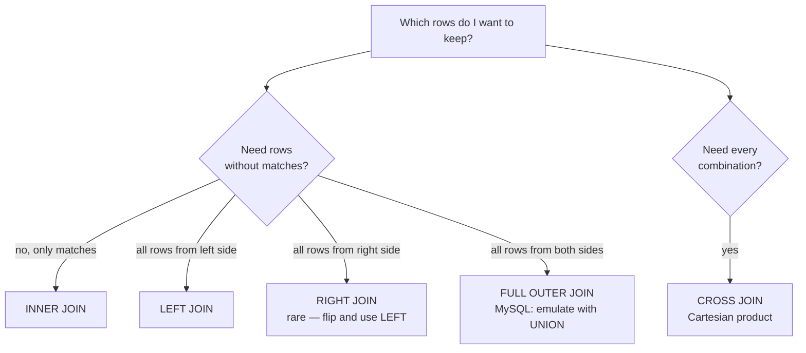

# Section 3 — Joins: Multiple Tables

## Lectures covered
- Why do We Need Multiple Tables?
- SQL Joins (INNER, LEFT, RIGHT, FULL)
- Cross Join · Analytics on Tables
- Join More Than Two Tables
- Quiz

---

## In one sentence
A **JOIN** stitches two tables together on a shared column — like merging your contacts list with your call log on phone number — so you can ask questions that span both.

## Real-world analogy
You have a **customers** notebook (names + IDs) and an **orders** notebook (orders + customer ID). To answer "what did Alice buy?" you have to flip between both — matching her customer ID. A JOIN is SQL doing that flipping for you, automatically, by the linking column.

## The intuition (plain English)
Real data is split across many tables on purpose: it saves space and avoids contradictions. When a question crosses tables, you JOIN them on the column they share (a primary key on one side, a foreign key on the other). The four flavors — INNER, LEFT, RIGHT, FULL — differ only in *what to do with rows that have no match*. INNER drops them; LEFT keeps everyone on the left; RIGHT keeps everyone on the right; FULL keeps everyone. Picking the wrong flavor silently changes your answer, so the choice is the whole game.

## Mini worked example — joining customers and orders

Two tiny tables:

```
customers                       orders
id | name                       id | customer_id | amount
---+-------                     ---+-------------+-------
 1 | Alice                       101 |          1 |    50
 2 | Bob                         102 |          1 |    20
 3 | Cleo                        103 |          2 |   100
                                 104 |          4 |    35   <- orphan, no matching customer
```

INNER JOIN — only matched rows on both sides:

```sql
SELECT c.name, o.amount
FROM customers c
INNER JOIN orders o ON c.id = o.customer_id;
```

Result (Cleo and the orphan are both dropped):

```
name  | amount
------+-------
Alice |     50
Alice |     20
Bob   |    100
```

LEFT JOIN — keep every customer; orders are NULL if missing:

```sql
SELECT c.name, o.amount
FROM customers c
LEFT JOIN orders o ON c.id = o.customer_id;
```

Result:

```
name  | amount
------+-------
Alice |     50
Alice |     20
Bob   |    100
Cleo  |  NULL    <- Cleo had no orders, but we keep her
```

Same data, different question. That's why join choice matters.

## At-a-glance — pick the right join



## Why this matters
- 80% of analyst SQL is multi-table — a single-table query rarely answers a real business question.
- The classic A/B test data shape (users, events, conversions) is three tables — JOIN is the only way to compute conversion rate per cohort.
- The pandas equivalent is `df.merge(...)` with `how='inner'/'left'/'right'/'outer'` — same four flavors, same trade-offs. See [../../01-python/01-basics/07-eda-pandas-matplotlib-seaborn.md](../../01-python/01-basics/07-eda-pandas-matplotlib-seaborn.md).

---

## 1. Why multiple tables — quick refresher on normalization

If you store a movie *and* its actors in one wide table, every movie repeats actor info. Updates become messy, storage inflates, integrity slips.

Solution: split into related tables (`movies`, `actors`, `movie_actor`) and **join them when needed**. This is **normalization**.

The Movies dataset has:
```
movies   ─┐                         ┌─  actors
          ├─ movie_actor ──────────┘     (many-to-many junction)
          ├─ financials              (1-to-1)
          └─ studios / languages     (lookup tables)
```

---

## 2. The 5 join types

### Sample setup
```sql
-- imagine
-- A: customers (id, name)
-- B: orders    (id, customer_id, amount)
```

### INNER JOIN — only matches
```sql
SELECT a.name, b.amount
FROM customers a
INNER JOIN orders b ON a.id = b.customer_id;
```
Rows where `a.id` exists in `b.customer_id`. Customers with no orders **disappear**.

### LEFT JOIN — keep everyone on the left
```sql
SELECT a.name, b.amount
FROM customers a
LEFT JOIN orders b ON a.id = b.customer_id;
```
All customers; `b.amount` is `NULL` if they have no orders.

> Most common join in analytics. "Show all customers, with their order info if any."

### RIGHT JOIN — keep everyone on the right
Mirror image of LEFT JOIN. Rarely used — flip the table order and use LEFT JOIN instead for readability.

### FULL OUTER JOIN — keep everyone on both sides
MySQL doesn't support `FULL OUTER JOIN` directly. Emulate via UNION:
```sql
SELECT a.name, b.amount FROM customers a LEFT JOIN orders b ON a.id = b.customer_id
UNION
SELECT a.name, b.amount FROM customers a RIGHT JOIN orders b ON a.id = b.customer_id;
```

### CROSS JOIN — Cartesian product
```sql
SELECT a.id, b.color FROM sizes a CROSS JOIN colors b;
```
Every combination. Useful for generating: dates × products, treatment × control matrices.

### Visualizing — the Venn diagrams

```
           A           B
         ┌───┐       ┌───┐
INNER →  │ ∩ │       │   │       only the overlap
         └───┘       └───┘

LEFT  →  ┌─────┐     ┌───┐
         │ A∪∩ │     │   │       all of A + overlap
         └─────┘     └───┘

RIGHT →  ┌───┐       ┌─────┐
         │   │       │ B∪∩ │     all of B + overlap
         └───┘       └─────┘

FULL  →  ┌─────────────────┐
         │ A ∪ ∩ ∪ B       │    everything
         └─────────────────┘
```

---

## 3. Joining the Movies dataset

### Movie + studio (1-to-1ish)
```sql
SELECT m.title, s.city
FROM movies m
INNER JOIN studios s ON m.studio = s.studio;
```

### Movie + financials (1-to-1)
```sql
SELECT m.title, f.budget, f.revenue, f.revenue - f.budget AS profit
FROM movies m
INNER JOIN financials f ON m.movie_id = f.movie_id;
```

### Movie + actors (many-to-many via junction table)
```sql
SELECT m.title, a.name AS actor
FROM movies m
JOIN movie_actor ma ON m.movie_id = ma.movie_id
JOIN actors a       ON ma.actor_id = a.actor_id
ORDER BY m.title;
```

> Junction tables resolve many-to-many: each row in `movie_actor` is one (movie, actor) pair.

### Movie + everything
```sql
SELECT m.title,
       m.industry,
       l.name        AS language,
       s.city        AS studio_city,
       f.budget,
       f.revenue
FROM movies m
LEFT JOIN languages l   ON m.language_id = l.language_id
LEFT JOIN studios s     ON m.studio = s.studio
LEFT JOIN financials f  ON m.movie_id = f.movie_id;
```

### Aliases — always use them
Saves typing + avoids ambiguity when columns share names across tables.

---

## 4. Analytics on joined tables

### Highest-grossing movies, with industry context
```sql
SELECT m.title, m.industry, f.revenue
FROM movies m
JOIN financials f ON m.movie_id = f.movie_id
ORDER BY f.revenue DESC
LIMIT 10;
```

### Average profit per industry
```sql
SELECT m.industry, ROUND(AVG(f.revenue - f.budget), 2) AS avg_profit
FROM movies m
JOIN financials f ON m.movie_id = f.movie_id
GROUP BY m.industry;
```

### Top 5 actors by movie count
```sql
SELECT a.name, COUNT(*) AS movie_count
FROM actors a
JOIN movie_actor ma ON a.actor_id = ma.actor_id
GROUP BY a.name
ORDER BY movie_count DESC
LIMIT 5;
```

### Movies with no financial data (LEFT JOIN diagnostic)
```sql
SELECT m.title
FROM movies m
LEFT JOIN financials f ON m.movie_id = f.movie_id
WHERE f.movie_id IS NULL;
```

> A common audit pattern: LEFT JOIN, then `WHERE right_pk IS NULL` to find unmatched rows.

---

## 5. Joining 3+ tables

The pattern repeats: chain JOINs, each with its own `ON`.

```sql
SELECT m.title, a.name AS actor, l.name AS language, s.city AS studio_city
FROM movies m
JOIN movie_actor ma ON m.movie_id = ma.movie_id
JOIN actors a       ON ma.actor_id = a.actor_id
JOIN languages l    ON m.language_id = l.language_id
JOIN studios s      ON m.studio = s.studio
WHERE m.industry = "Bollywood"
ORDER BY m.title;
```

Build queries **incrementally** — start with two tables, verify, then add a third.

---

## 6. USING clause (when join columns share a name)

```sql
-- if both tables have a column named movie_id:
SELECT m.title, f.revenue
FROM movies m
JOIN financials f USING (movie_id);
```

Equivalent to `ON m.movie_id = f.movie_id` but shorter. Some teams prefer the explicit `ON`.

### NATURAL JOIN — auto-match on same-named columns
```sql
SELECT * FROM movies NATURAL JOIN financials;
```
Convenient but **risky** — if a future migration adds a same-named column, your join silently changes meaning. Avoid in production.

---

## 7. Self joins — joining a table to itself

For hierarchical / paired data within one table:
```sql
-- pair employees with their managers (both stored in the same table)
SELECT e.name AS employee, m.name AS manager
FROM employees e
LEFT JOIN employees m ON e.manager_id = m.id;
```

The trick: alias the table twice so the engine treats it as two tables.

---

## 8. Common pitfalls

| Mistake | Effect | Fix |
|---|---|---|
| Forgetting `ON` clause | Cartesian explosion (millions of rows) | always specify `ON` |
| INNER when you needed LEFT | unmatched rows silently dropped | always confirm join cardinality |
| Multiplying rows unintentionally | one-to-many join inflates aggregates | sanity-check `SELECT COUNT(*)` before/after |
| `WHERE` on right table after LEFT JOIN | converts LEFT JOIN to INNER JOIN | move filter to `ON` clause: `LEFT JOIN orders b ON a.id = b.cid AND b.status = "paid"` |
| Ambiguous column names | "column 'id' is ambiguous" | always alias: `a.id`, `b.id` |

## Self-check

- [ ] Difference between INNER and LEFT JOIN — and when does it matter?
- [ ] How does MySQL emulate FULL OUTER JOIN?
- [ ] What's a junction table and why do we need one?
- [ ] How do I find rows in A that don't have a match in B?
- [ ] Write a query: top 3 most prolific actors (by movie count) in Hollywood.
- [ ] Why is `LEFT JOIN ... WHERE b.col = X` often a bug?
- [ ] Difference between `ON` and `USING` in a JOIN clause?
- [ ] What's a self join and when is it useful?

---

## Glossary

| Term | Plain meaning |
|------|---------------|
| **JOIN** | Combine two tables side by side using a shared column |
| **ON** | The matching rule for a JOIN: `ON a.id = b.customer_id` |
| **USING** | Shorthand `ON` when both tables use the same column name: `USING (movie_id)` |
| **INNER JOIN** | Keep only rows that match in both tables. Default when you write just `JOIN` |
| **LEFT JOIN** | Keep every row from the left table; NULL where the right side has no match |
| **RIGHT JOIN** | Mirror of LEFT — most teams flip and use LEFT for readability |
| **FULL OUTER JOIN** | Keep all rows from both sides. MySQL emulates with `LEFT JOIN UNION RIGHT JOIN` |
| **CROSS JOIN** | Every combination of rows from two tables. Output rows = rows(A) x rows(B) |
| **Self join** | A table joined to itself — needed for hierarchies (employee -> manager) |
| **NATURAL JOIN** | Auto-joins on every same-named column. Risky — avoid in production |
| **Primary key (PK)** | The column that uniquely identifies each row in a table |
| **Foreign key (FK)** | A column that points to another table's primary key |
| **Junction table** | A small table that resolves a many-to-many relationship (e.g., `movie_actor`) |
| **Many-to-many (N:M)** | Each side links to many on the other (movies have many actors; actors are in many movies) |
| **One-to-many (1:N)** | One row on one side links to many on the other (one customer, many orders) |
| **One-to-one (1:1)** | Exactly one matching row on each side (movie -> financials) |
| **Cardinality of a join** | How many rows come out per input row. Joining a 1:N table inflates row counts |
| **Cartesian product** | All combinations — what you get when you forget the `ON` clause |
| **Alias** | A short name for a table inside a query: `FROM movies m` |
| **Ambiguous column** | "column X exists in both tables" error — fix by qualifying: `m.id`, `f.id` |
| **Orphan row** | A row whose foreign key points to nothing. INNER JOIN drops it; LEFT JOIN exposes it |
| **Audit pattern (LEFT JOIN + IS NULL)** | Find rows with no match: `LEFT JOIN ... WHERE other.pk IS NULL` |

## Further reading
- Next: [04-final-quiz.md](04-final-quiz.md) — drill on basics
- Then: [../02-advanced/01-subqueries-cte.md](../02-advanced/01-subqueries-cte.md) — same logic, more layers
- Pandas equivalent: [../../01-python/01-basics/07-eda-pandas-matplotlib-seaborn.md](../../01-python/01-basics/07-eda-pandas-matplotlib-seaborn.md) — `df.merge(...)` is JOIN
- ML feature engineering: [../../06-machine-learning/01-foundations/05-preprocessing-encoding.md](../../06-machine-learning/01-foundations/05-preprocessing-encoding.md) — most ML training data is built by joining several source tables
