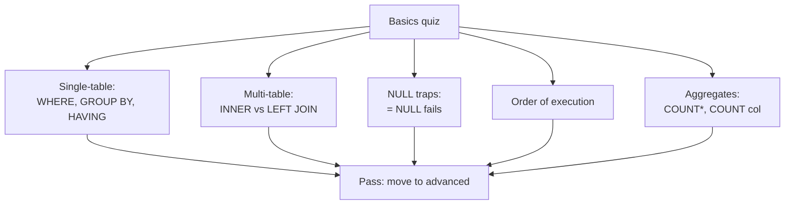

# Section 4 — Final Quiz (Basics) + Transition

---

## In one sentence
This is a self-test: if you can answer ten basics-level questions in under two minutes each, you're ready to move on; if you stumble, the relevant lecture link is right there.

## Real-world analogy
Like a driving test before getting on the highway. Each drill is a parallel-park or three-point-turn — you should be able to do it without thinking. Then the highway (advanced SQL, stats, ML) is safe to enter.

## The intuition (plain English)
Basics-level SQL is mostly muscle memory: order of execution, `WHERE` vs `HAVING`, when an INNER JOIN should have been a LEFT, why `WHERE col = NULL` returns zero rows. None of these are hard ideas — but they trip beginners every interview. This file gives you canonical answers and the seven query templates you should be able to write from a blank screen.

## Mini worked example — the pattern that breaks beginners

A LEFT JOIN that secretly becomes an INNER JOIN:

```sql
-- buggy — looks like LEFT JOIN, behaves like INNER
SELECT c.name, o.amount
FROM customers c
LEFT JOIN orders o ON c.id = o.customer_id
WHERE o.status = "paid";   -- this drops every customer with NO orders
```

The fix: move the filter to the ON clause:

```sql
SELECT c.name, o.amount
FROM customers c
LEFT JOIN orders o ON c.id = o.customer_id AND o.status = "paid";
```

If you can spot bugs like this, you'll pass the basics checkpoint.

## At-a-glance — the basics quiz menu



## Why this matters
- Codebasics gates the advanced module behind this quiz; passing it means you can self-direct.
- These exact patterns show up in technical screens for analyst roles.
- Stuck on a question? The next module (Math & Stats) builds on the same "translate question -> code" muscle.

---

## Quiz prep — what to drill

The basics-level checkpoint usually covers:

1. Order of clauses (`FROM → WHERE → GROUP BY → HAVING → SELECT → ORDER BY → LIMIT`)
2. `WHERE` vs `HAVING`
3. `COUNT(*)` vs `COUNT(col)` (NULL behavior)
4. `LIKE` wildcards (`%` vs `_`)
5. Join types and which one to use when
6. Why `SELECT title, AVG(rating) GROUP BY industry` fails
7. `IN` vs multiple `OR`s
8. `ORDER BY` with `LIMIT`
9. Identifying when an `INNER JOIN` should have been a `LEFT JOIN`
10. Reading a 3-table join and predicting row count

---

## Drill set — answer these in 60 seconds each

### A. Single table
```sql
-- Q1: Top 3 highest-rated Bollywood movies released after 2010
SELECT title, imdb_rating
FROM movies
WHERE industry = "Bollywood" AND release_year > 2010
ORDER BY imdb_rating DESC
LIMIT 3;
```

```sql
-- Q2: Industries with average rating > 7
SELECT industry, AVG(imdb_rating) AS avg_r
FROM movies
GROUP BY industry
HAVING avg_r > 7;
```

```sql
-- Q3: Movies whose title starts with "The"
SELECT title FROM movies WHERE title LIKE "The%";
```

```sql
-- Q4: Bucket movies into "Recent" / "Old" / "Classic"
SELECT title, release_year,
       CASE
         WHEN release_year >= 2015 THEN "Recent"
         WHEN release_year >= 2000 THEN "Old"
         ELSE "Classic"
       END AS era
FROM movies;
```

### B. Multi-table
```sql
-- Q5: Top 5 actors by movie count
SELECT a.name, COUNT(*) AS n
FROM actors a
JOIN movie_actor ma ON a.actor_id = ma.actor_id
GROUP BY a.name
ORDER BY n DESC
LIMIT 5;
```

```sql
-- Q6: Movies missing financial data
SELECT m.title
FROM movies m
LEFT JOIN financials f ON m.movie_id = f.movie_id
WHERE f.movie_id IS NULL;
```

```sql
-- Q7: Total revenue per language
SELECT l.name AS language, SUM(f.revenue) AS total_rev
FROM movies m
JOIN languages l   ON m.language_id = l.language_id
JOIN financials f  ON m.movie_id = f.movie_id
GROUP BY l.name
ORDER BY total_rev DESC;
```

If any of these take >2 minutes to write, drill that pattern in the practice room.

---

## Conceptual trick questions

### Why does this return 0 rows?
```sql
SELECT * FROM movies WHERE imdb_rating = NULL;
```
Because `= NULL` is *itself* `NULL` (unknown), not TRUE. Use `IS NULL`.

### Why does this give the same result as INNER JOIN?
```sql
SELECT * FROM customers c LEFT JOIN orders o ON c.id = o.cid
WHERE o.status = "paid";
```
Because the `WHERE` is filtering after the LEFT JOIN — any row where `o.status` is NULL (no order) gets dropped. Move the filter into the `ON` clause:
```sql
LEFT JOIN orders o ON c.id = o.cid AND o.status = "paid"
```

### Why does this aggregate look wrong?
```sql
SELECT m.title, SUM(f.revenue)
FROM movies m
JOIN financials f ON m.movie_id = f.movie_id
JOIN movie_actor ma ON m.movie_id = ma.movie_id
GROUP BY m.title;
```
Because joining `movie_actor` multiplies rows for movies with multiple actors. Revenue gets summed *N* times. Either drop the actor join, or use `SUM(DISTINCT f.revenue)` (hacky) or compute per-movie totals in a subquery first.

---

## Performance intuition (cheap previews of advanced)

- An index on `movies.industry` makes `WHERE industry = "Bollywood"` O(log n) instead of O(n)
- Joins use indexes on the join columns
- `LIKE 'foo%'` can use an index; `LIKE '%foo'` cannot
- `EXPLAIN <query>` tells you how the engine plans to run it

We dive into indexes properly in the advanced subfolder.

---

## Transition to Math & Statistics (Module 5)

After the SQL Basics quiz, the bootcamp moves to **Math and Statistics**. The motivation: SQL gets you the data; stats turns it into decisions. The two modules together cover what a data **analyst** does end-to-end.

Reasons stats comes *before* ML:
- ML evaluation = stats (confidence intervals, hypothesis tests on metric differences)
- A/B testing is ~all the stats a working analyst needs
- Distribution intuition prevents naive feature engineering later
- The AtliQo Bank project (Math/Stats module) puts SQL + stats together

Open `core/05-math-statistics/README.md` for the full plan.

---

## Pre-quiz checklist

- [ ] I can write the 7 drill queries above in <2 min each
- [ ] I know `WHERE` vs `HAVING`
- [ ] I can predict the row count of a multi-table join
- [ ] I know why `WHERE col = NULL` is wrong
- [ ] I can spot the LEFT-becomes-INNER bug
- [ ] I can map a business question to SQL in real time

If any are shaky → re-watch the relevant lecture before taking the quiz.

---

## Glossary

| Term | Plain meaning |
|------|---------------|
| **Drill query** | A small canonical query you should be able to write in under 2 minutes |
| **Order of execution** | FROM -> WHERE -> GROUP BY -> HAVING -> SELECT -> ORDER BY -> LIMIT |
| **WHERE** | Filter on individual rows (before grouping) |
| **HAVING** | Filter on grouped buckets (after `GROUP BY`) |
| **GROUP BY** | Bucket rows by a column to compute per-bucket stats |
| **NULL** | Missing/unknown value. Compare with `IS NULL`, never `= NULL` |
| **COUNT(*)** | Counts all rows including NULLs |
| **COUNT(col)** | Counts only rows where `col` is not NULL |
| **LIKE** | Pattern match. `%` = any chars, `_` = single char |
| **JOIN** | Combine tables on a shared column |
| **INNER JOIN** | Keep matched rows only |
| **LEFT JOIN** | Keep all left rows, NULL-fill the right when no match |
| **LEFT-to-INNER bug** | When `WHERE` on the right table after a LEFT JOIN drops the unmatched rows you wanted to keep |
| **Row inflation** | When joining a one-to-many table multiplies rows and breaks aggregates |
| **CASE WHEN** | If/else branching inside a SELECT |
| **EXPLAIN** | Show how the engine plans to run a query — uses indexes? scans? |
| **Index** | A pre-sorted lookup that speeds `WHERE` and JOIN by orders of magnitude |
| **Cardinality of join** | The output row count relative to inputs — sanity-check before trusting aggregates |
| **Pre-quiz checklist** | The minimum set of moves you should have memorized before sitting the test |
| **Practical significance** | Whether a result *matters* in business terms (preview of stats module) |

## Further reading
- Recap: [02-single-table-retrieval.md](02-single-table-retrieval.md) and [03-multiple-tables-joins.md](03-multiple-tables-joins.md)
- Next module: [../../05-math-statistics/README.md](../../05-math-statistics/README.md) — turning data into decisions
- Advanced SQL: [../02-advanced/01-subqueries-cte.md](../02-advanced/01-subqueries-cte.md)
- Pandas drill set: [../../01-python/01-basics/07-eda-pandas-matplotlib-seaborn.md](../../01-python/01-basics/07-eda-pandas-matplotlib-seaborn.md) — same drills with `df` syntax
