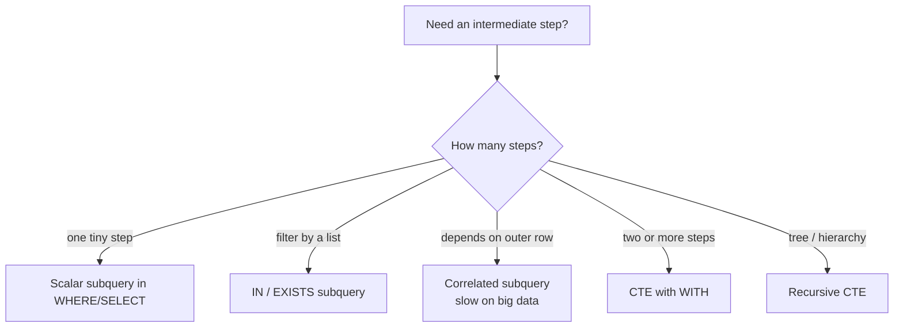

# Advanced 1 — Subqueries & CTEs

## Lectures covered
- Subqueries · `ANY`, `ALL` operators · Correlated Subquery
- Common Table Expression (CTE) · CTE benefits & other applications

---

## In one sentence
A **subquery** is a query nested inside another query, and a **CTE** is the same idea but named at the top so the outer query reads top-down like English instead of inside-out.

## Real-world analogy
Both let you answer multi-step questions in one shot. A subquery is like saying "give me the customers whose orders are bigger than (let me first find the average order...)" — the parentheses interrupt your sentence. A CTE is like writing on a sticky note first: *"avg_order = the average. Now, customers with orders bigger than avg_order."* Same answer; far easier to read.

## The intuition (plain English)
Some questions need an intermediate calculation before the final answer ("movies whose rating is above their industry's average"). You have two ways to write that: stuff the intermediate step in parentheses inside `WHERE` or `FROM` (a subquery), or name it with `WITH ... AS` and use it like a temporary table (a CTE). CTEs win on readability every time, support recursion (for hierarchies), and let you debug step-by-step. Use subqueries for one-liners; reach for CTEs the moment your query has two or more intermediate steps.

## Mini worked example — movies above their industry average

A 5-row `movies` table:

```
movie_id | title         | industry  | imdb_rating
---------+---------------+-----------+------------
       1 | Sholay        | Bollywood |         8.5
       2 | 3 Idiots      | Bollywood |         8.4
       3 | Race 3        | Bollywood |         5.0
       4 | The Godfather | Hollywood |         9.2
       5 | Cats          | Hollywood |         3.0
```

Industry averages: Bollywood = 7.3, Hollywood = 6.1. Question: "Which movies beat their industry average?"

**Correlated subquery version:**

```sql
SELECT m.title, m.industry, m.imdb_rating
FROM movies m
WHERE m.imdb_rating > (
    SELECT AVG(imdb_rating) FROM movies WHERE industry = m.industry
);
```

**CTE version (cleaner):**

```sql
WITH industry_avg AS (
    SELECT industry, AVG(imdb_rating) AS avg_r
    FROM movies
    GROUP BY industry
)
SELECT m.title, m.industry, m.imdb_rating
FROM movies m
JOIN industry_avg a USING (industry)
WHERE m.imdb_rating > a.avg_r;
```

Result either way:

```
title         | industry  | imdb_rating
--------------+-----------+------------
Sholay        | Bollywood |         8.5
3 Idiots      | Bollywood |         8.4
The Godfather | Hollywood |         9.2
```

The CTE reads top-down: "first compute industry averages, then filter."

## At-a-glance — when to use what



## Why this matters
- Top-N-per-group, "compared to group average," and rolling windows all start as subquery or CTE patterns.
- Recursive CTEs are the standard tool for org charts, category trees, and date-range generators.
- The CTE form maps directly to dbt models — when you graduate to a real warehouse, every model is essentially a named CTE.

---

## 1. Subqueries — query inside a query

### Three positions
```sql
-- 1. In SELECT
SELECT title,
       (SELECT AVG(imdb_rating) FROM movies) AS overall_avg
FROM movies;

-- 2. In FROM (a "derived table")
SELECT industry, AVG(rating_diff) AS avg_diff
FROM (
    SELECT industry, imdb_rating - 7 AS rating_diff
    FROM movies
) AS t
GROUP BY industry;

-- 3. In WHERE
SELECT title FROM movies
WHERE imdb_rating > (SELECT AVG(imdb_rating) FROM movies);
```

### Three flavors

#### Scalar subquery — returns one value
```sql
SELECT title, imdb_rating
FROM movies
WHERE imdb_rating = (SELECT MAX(imdb_rating) FROM movies);
```

#### Multi-value subquery — returns a list
```sql
SELECT * FROM movies
WHERE studio IN (
    SELECT studio FROM studios WHERE city = "Los Angeles"
);
```

#### Correlated subquery — references the outer query
```sql
-- movies whose rating exceeds the average of their industry
SELECT m.title, m.industry, m.imdb_rating
FROM movies m
WHERE m.imdb_rating > (
    SELECT AVG(imdb_rating) FROM movies WHERE industry = m.industry
);
```

> Correlated subqueries run *once per outer row*. They're powerful but can be slow on large data — often the same logic runs faster with a `JOIN` to a pre-aggregated table.

### `ANY` and `ALL`

Compare a value to a *set* of values returned by a subquery.

```sql
-- ANY (a.k.a. SOME) — true if comparison holds for at least one
SELECT * FROM movies
WHERE imdb_rating > ANY (SELECT imdb_rating FROM movies WHERE industry = "Bollywood");
-- "rated higher than at least one Bollywood movie"

-- ALL — true only if comparison holds for every value
SELECT * FROM movies
WHERE imdb_rating > ALL (SELECT imdb_rating FROM movies WHERE industry = "Bollywood");
-- "rated higher than every Bollywood movie"
```

### `EXISTS` — does the subquery return any row?
```sql
SELECT * FROM customers c
WHERE EXISTS (SELECT 1 FROM orders o WHERE o.customer_id = c.id AND o.status = "paid");
```

`EXISTS` short-circuits — it stops at the first matching row. Often faster than `IN` for large subqueries.

---

## 2. CTE — Common Table Expression

A **CTE** names a query result and lets you use it like a temporary table within the next statement.

### Basic shape — `WITH ... AS (...)`
```sql
WITH bollywood_movies AS (
    SELECT * FROM movies WHERE industry = "Bollywood"
)
SELECT title, imdb_rating
FROM bollywood_movies
WHERE imdb_rating > 7;
```

### Why CTEs beat subqueries (in many cases)

| | Subquery | CTE |
|---|---|---|
| Readability | nested → hard to follow | top-down → like prose |
| Reuse | computed each time it's referenced | computed once |
| Recursion | impossible | supported |
| Debugging | harder to extract | can run each `WITH` block in isolation |

### Multiple CTEs in one query
```sql
WITH high_rated AS (
    SELECT * FROM movies WHERE imdb_rating > 8
),
big_revenue AS (
    SELECT movie_id FROM financials WHERE revenue > 100000000
)
SELECT h.title, h.imdb_rating
FROM high_rated h
JOIN big_revenue b ON h.movie_id = b.movie_id;
```

### Using a CTE in the same query as itself (chaining)
```sql
WITH industry_stats AS (
    SELECT industry, AVG(imdb_rating) AS avg_r, COUNT(*) AS n
    FROM movies GROUP BY industry
),
top_industries AS (
    SELECT * FROM industry_stats WHERE n >= 5 ORDER BY avg_r DESC LIMIT 3
)
SELECT m.title, m.industry, t.avg_r
FROM movies m
JOIN top_industries t ON m.industry = t.industry;
```

### Recursive CTE — for hierarchies / sequences

For org charts, category trees, graph traversals, generating date ranges.

#### Generate a date sequence
```sql
WITH RECURSIVE date_seq AS (
    SELECT DATE("2025-01-01") AS d
    UNION ALL
    SELECT DATE_ADD(d, INTERVAL 1 DAY) FROM date_seq WHERE d < "2025-01-31"
)
SELECT * FROM date_seq;
```

#### Org-chart traversal
```sql
WITH RECURSIVE org AS (
    SELECT id, name, manager_id, 0 AS level
    FROM employees WHERE manager_id IS NULL              -- anchor: top of tree
    UNION ALL
    SELECT e.id, e.name, e.manager_id, o.level + 1        -- recursive: children
    FROM employees e
    JOIN org o ON e.manager_id = o.id
)
SELECT * FROM org ORDER BY level, name;
```

The recursive CTE has two parts:
1. **Anchor** — the seed row(s)
2. **Recursive part** — joins itself, generating one level per iteration

> MySQL has a default recursion limit of 1000. Override with `SET cte_max_recursion_depth = 10000;`.

---

## 3. Practice — picking the right tool

### Q: "Customers who spent more than the average customer."
```sql
-- Subquery shape
SELECT c.name
FROM customers c
JOIN (SELECT customer_id, SUM(amount) AS total FROM orders GROUP BY customer_id) o
  ON c.id = o.customer_id
WHERE o.total > (SELECT AVG(total) FROM (SELECT SUM(amount) AS total FROM orders GROUP BY customer_id) x);

-- CTE shape (much clearer)
WITH spend AS (
    SELECT customer_id, SUM(amount) AS total FROM orders GROUP BY customer_id
),
avg_spend AS (
    SELECT AVG(total) AS m FROM spend
)
SELECT c.name, s.total
FROM customers c
JOIN spend s     ON c.id = s.customer_id
CROSS JOIN avg_spend a
WHERE s.total > a.m;
```

The CTE version reads like an analyst's outline.

### Q: "Top 3 actors per industry by movie count."
This needs window functions — covered in `07-window-functions.md`.

---

## 4. Common pitfalls

| Mistake | Effect | Fix |
|---|---|---|
| Forgetting `AS` on derived table | "every derived table must have its own alias" error | always alias: `(...) AS t` |
| Correlated subquery on huge data | very slow | rewrite with JOIN to pre-aggregated CTE |
| Recursive CTE without termination | stack overflow / hits depth limit | ensure each recursive step strictly decreases distance to terminating condition |
| Reusing CTE multiple times expecting reuse | MySQL may inline (re-execute) | benchmark; consider a temporary table |

## Self-check

- [ ] Three places I can put a subquery?
- [ ] Difference between `IN` and `EXISTS`?
- [ ] When does `ANY` differ from `ALL`?
- [ ] What's a correlated subquery and what's its cost model?
- [ ] Write a CTE-based query for "products whose price exceeds their category's avg."
- [ ] Write a recursive CTE that lists all descendants of employee #1.
- [ ] When would you pick CTE over subquery?

---

## Glossary

| Term | Plain meaning |
|------|---------------|
| **Subquery** | A SELECT inside another SELECT — runs first and feeds its result to the outer query |
| **Scalar subquery** | A subquery returning exactly one value (one row, one column) |
| **Multi-value subquery** | A subquery returning a list of values, paired with `IN` or `NOT IN` |
| **Derived table** | A subquery in the `FROM` clause — must have an alias |
| **Correlated subquery** | A subquery that references the outer query's columns, runs once per outer row |
| **EXISTS** | "Does this subquery return any row?" — short-circuits at first match, often faster than IN |
| **NOT EXISTS** | "This subquery returns zero rows" — useful for "find unmatched" patterns |
| **ANY (a.k.a. SOME)** | True if comparison holds for *at least one* value in a set |
| **ALL** | True if comparison holds for *every* value in a set |
| **CTE (Common Table Expression)** | A named subquery introduced with `WITH name AS (...)` |
| **WITH** | The SQL keyword that starts a CTE block |
| **Recursive CTE** | A CTE that references itself — used for trees and sequences |
| **Anchor (in recursive CTE)** | The seed row(s) — the non-recursive part |
| **Recursive part** | The half that joins the CTE to itself, generating the next level |
| **cte_max_recursion_depth** | MySQL setting that caps recursion (default 1000) |
| **Inlining** | When the engine substitutes a CTE's SQL at every reference rather than computing once |
| **Top-N per group** | A common pattern: rank rows within a group, then keep the top N (often via window + CTE) |
| **Pre-aggregation** | Computing summaries upfront in a CTE to avoid repeated full scans |
| **Date sequence** | A generated list of dates (often via recursive CTE) for filling gaps in time series |
| **Hierarchy traversal** | Walking parent -> child -> grandchild relationships, typically with a recursive CTE |
| **Cost model** | How the engine estimates query expense — correlated subqueries are often the most expensive |

## Further reading
- Window functions (the natural next step): [07-window-functions.md](07-window-functions.md)
- Pandas equivalent: [../../01-python/01-basics/07-eda-pandas-matplotlib-seaborn.md](../../01-python/01-basics/07-eda-pandas-matplotlib-seaborn.md) — chained `.groupby().transform()` is the pandas way to express "compared to group average"
- ML data prep: [../../06-machine-learning/01-foundations/05-preprocessing-encoding.md](../../06-machine-learning/01-foundations/05-preprocessing-encoding.md) — feature engineering often relies on these patterns
- Style guide: [../../../BEGINNER-STYLE-GUIDE.md](../../../BEGINNER-STYLE-GUIDE.md)
