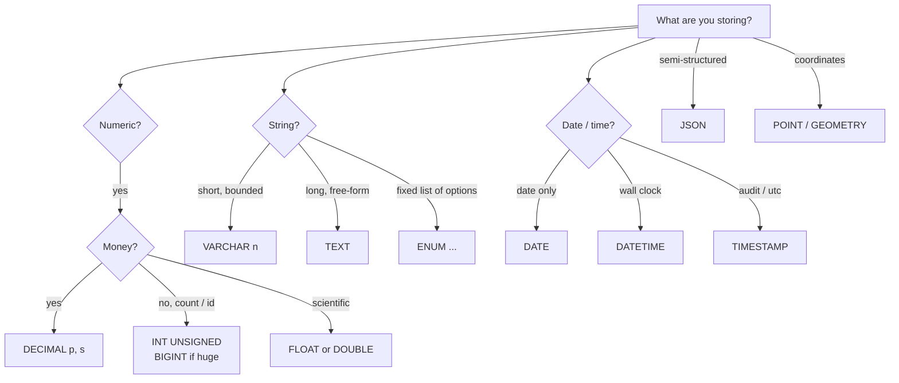

# Advanced 2 — MySQL Data Types

## Lectures covered
- Data Types: Numeric (`INT`, `DECIMAL`, `FLOAT`, `DOUBLE`)
- Data Types: String (`VARCHAR`, `CHAR`, `ENUM`)
- Data Types: Date / Time (`DATETIME`, `DATE`, `TIME`, `YEAR`, `TIMESTAMP`)
- Data Types: JSON, Spatial (`JSON`, `GEOMETRY`)

---

## In one sentence
A **data type** tells MySQL what kind of value lives in a column — number, text, date, JSON — and that single choice controls storage size, validation, and query speed.

## Real-world analogy
Picking column types is like choosing the right container in your kitchen: a small jar for spice, a wide tray for cookies, a sealed bottle for liquids. If you store milk in a colander or sugar in a glass, you'll regret it. Same here: pick `DECIMAL` for money, `VARCHAR` for names, `DATETIME` for timestamps — wrong container leads to silent bugs (rounding errors, truncation, slow queries).

## The intuition (plain English)
Every column you create has a type. Numbers come in flavors (`INT`, `BIGINT`, `DECIMAL`), strings come in flavors (`VARCHAR`, `TEXT`, `ENUM`), dates come in flavors (`DATE`, `DATETIME`, `TIMESTAMP`). Smaller types mean less disk space and faster index lookups; bigger types are safer but slower. Some choices have hidden traps: `FLOAT` for money quietly loses cents, `TIMESTAMP` overflows in 2038, `utf8` is broken for emoji. Learn the defaults that don't bite you, and you've handled 95% of schema design.

## Mini worked example — picking types for an `orders` table

You're storing customer orders. What goes in each column?

```sql
CREATE TABLE orders (
    id          INT UNSIGNED AUTO_INCREMENT PRIMARY KEY,   -- IDs: never go negative; auto-fill
    customer_id INT UNSIGNED NOT NULL,                     -- foreign key
    amount      DECIMAL(10, 2) NOT NULL,                   -- money: exact, never FLOAT
    status      ENUM("pending", "shipped", "delivered") DEFAULT "pending",
    notes       TEXT,                                       -- variable-length, can be long
    placed_at   DATETIME DEFAULT CURRENT_TIMESTAMP          -- timestamp, no timezone surprise
);
```

Sample data with the right types in action:

```
id | customer_id | amount  | status   | notes                  | placed_at
---+-------------+---------+----------+------------------------+--------------------
 1 |          12 |   49.99 | shipped  | "leave at door"        | 2026-05-10 09:14:22
 2 |          12 |  100.00 | pending  | NULL                   | 2026-05-10 10:01:55
 3 |           7 | 1234.50 | delivered| "second floor, ring 3" | 2026-05-09 17:42:08
```

If `amount` had been `FLOAT`, summing 100 such rows could give `49.989999...` instead of `4999.00` — a real bug at scale.

## At-a-glance — type picker cheat sheet



## Why this matters
- Wrong type for money = wrong totals on dashboards. This bug has cost teams real money.
- Right type means smaller indexes -> faster queries -> cheaper warehouse bills.
- ML training data often comes from SQL — the type of each column determines whether you need encoding, casting, or scaling. See [../../06-machine-learning/01-foundations/05-preprocessing-encoding.md](../../06-machine-learning/01-foundations/05-preprocessing-encoding.md).

---

## Why types matter

Types affect:
- **Storage size** — `BIGINT` vs `TINYINT` is 7 bytes per row
- **Index efficiency** — `VARCHAR(255)` indexes slower than `INT`
- **Correctness** — `FLOAT` for money is a bug
- **Validation** — `ENUM` rejects bad values at insert

Picking the right type is half schema design.

---

## 1. Numeric types

| Type | Bytes | Range (signed) | When to use |
|---|---|---|---|
| `TINYINT` | 1 | -128 to 127 | flags, very small counts |
| `SMALLINT` | 2 | -32k to 32k | medium counts |
| `MEDIUMINT` | 3 | -8M to 8M | rarely used |
| `INT` (`INTEGER`) | 4 | ±2.1B | default for IDs and counts |
| `BIGINT` | 8 | ±9.2 × 10^18 | huge IDs, sums of small values |
| `DECIMAL(p, s)` | varies | exact | money, percentages — anything where precision matters |
| `FLOAT` | 4 | approximate | scientific data; avoid for money |
| `DOUBLE` | 8 | approximate | scientific data |

### `DECIMAL` for money
```sql
CREATE TABLE orders (
    id INT PRIMARY KEY,
    amount DECIMAL(12, 2)         -- 12 digits, 2 after decimal point: up to 9,999,999,999.99
);
```

`FLOAT`/`DOUBLE` round (`0.1 + 0.2 ≠ 0.3`). Don't use them for money.

### `UNSIGNED` doubles the positive range
```sql
INT UNSIGNED         -- 0 to 4.2B (good for IDs)
TINYINT UNSIGNED     -- 0 to 255
```

### `AUTO_INCREMENT`
```sql
id INT UNSIGNED AUTO_INCREMENT PRIMARY KEY
```
Each insert without specifying `id` gets the next number.

---

## 2. String types

| Type | Storage | When to use |
|---|---|---|
| `CHAR(n)` | fixed n chars | rare; only for truly fixed-width (e.g., ISO codes) |
| `VARCHAR(n)` | variable, up to n | default for short strings (names, emails) |
| `TEXT` | variable, up to 64KB | long free-form text |
| `MEDIUMTEXT` | up to 16MB | very long content |
| `LONGTEXT` | up to 4GB | rarely needed; use a file/object store |
| `ENUM(...)` | 1–2 bytes | fixed set of allowed values |
| `SET(...)` | 1–8 bytes | multi-valued enum (like checkboxes) |
| `BINARY(n)` / `VARBINARY` / `BLOB` | byte data | files, hashes — but prefer object storage |

### `VARCHAR(255)` is *not* always best
- `VARCHAR(10)` for a 5-char column wastes nothing on disk
- But `VARCHAR(255)` indexes are bigger; pick the smallest reasonable cap
- For unbounded text → `TEXT` (allows full-text search via FULLTEXT index)

### `ENUM` — for restricted vocabularies
```sql
CREATE TABLE bookings (
    id INT PRIMARY KEY,
    status ENUM("pending", "confirmed", "cancelled") DEFAULT "pending"
);
```
- Stored as a small int internally
- Fast and safe — invalid values are rejected
- **Downside**: changing the list requires `ALTER TABLE`

### Charset & collation
- Use `utf8mb4` (real UTF-8, supports emoji)
- Default collation: `utf8mb4_0900_ai_ci` (accent-insensitive, case-insensitive)
- Avoid `utf8` (it's actually 3-byte UTF-8 — broken for emoji)

```sql
CREATE TABLE t (
    name VARCHAR(255) CHARACTER SET utf8mb4 COLLATE utf8mb4_0900_ai_ci
);
```

---

## 3. Date and time types

| Type | Format | Use |
|---|---|---|
| `DATE` | `YYYY-MM-DD` | calendar date |
| `TIME` | `HH:MM:SS` | time of day, no date |
| `DATETIME` | `YYYY-MM-DD HH:MM:SS` | full timestamp, no timezone |
| `TIMESTAMP` | UTC, range 1970–2038 | logging, "updated at" |
| `YEAR` | `YYYY` | year only |

### `DATETIME` vs `TIMESTAMP` — important
- `DATETIME` stores wall-clock time **as you wrote it** (no timezone awareness)
- `TIMESTAMP` converts to UTC for storage and back to session timezone on read
- `TIMESTAMP` is bounded to 2038 (Y2038 problem) — for new schemas, `DATETIME` + explicit UTC is safer

### Auto-fill for created/updated
```sql
CREATE TABLE posts (
    id INT PRIMARY KEY AUTO_INCREMENT,
    title VARCHAR(255),
    created_at DATETIME DEFAULT CURRENT_TIMESTAMP,
    updated_at DATETIME DEFAULT CURRENT_TIMESTAMP ON UPDATE CURRENT_TIMESTAMP
);
```

### Common date functions (refresher)
```sql
NOW()                                  -- current datetime
CURDATE() / CURRENT_DATE               -- today's date
CURTIME() / CURRENT_TIME               -- current time
YEAR(d), MONTH(d), DAY(d), HOUR(d)
DATE_ADD(d, INTERVAL 7 DAY)
DATE_SUB(d, INTERVAL 1 MONTH)
DATEDIFF(end, start)
TIMESTAMPDIFF(MINUTE, start, end)
DATE_FORMAT(d, "%Y-%m")               -- "2025-04"
STR_TO_DATE("2025-04-15", "%Y-%m-%d") -- parse string into DATE
```

---

## 4. JSON

Modern MySQL stores JSON natively (since 5.7) — typed, validated, and queryable.

```sql
CREATE TABLE events (
    id INT PRIMARY KEY,
    payload JSON
);

INSERT INTO events VALUES (1, '{"user": "Awais", "action": "login", "ip": "10.0.0.1"}');

-- access fields
SELECT payload->"$.user", payload->>"$.action"      -- ->> unquotes the string
FROM events;

-- filter
SELECT * FROM events WHERE payload->>"$.action" = "login";

-- update a field
UPDATE events SET payload = JSON_SET(payload, "$.user", "Awais Shah") WHERE id = 1;
```

Useful for semi-structured event logs / API responses. **Don't use it as a substitute for normalization** — if a field is queried often, give it its own column.

---

## 5. Spatial types — geometry & GIS

For maps, locations, polygons.

```sql
CREATE TABLE places (
    id INT PRIMARY KEY,
    name VARCHAR(100),
    location POINT,
    SPATIAL INDEX (location)
);

INSERT INTO places VALUES
    (1, "Lahore", ST_PointFromText("POINT(74.3587 31.5204)"));

-- distance in meters between two points
SELECT ST_Distance_Sphere(
    ST_PointFromText("POINT(74.3587 31.5204)"),    -- Lahore
    ST_PointFromText("POINT(67.0011 24.8607)")     -- Karachi
);
-- ~1027 km
```

For serious GIS, **PostGIS (PostgreSQL)** is the industry standard — but MySQL handles point-distance and bounding-box queries well enough for many apps.

---

## 6. Picking types — checklist for new tables

- [ ] IDs: `INT UNSIGNED AUTO_INCREMENT` (or `BIGINT` if you'll overflow ~2B rows)
- [ ] Money: `DECIMAL(p, s)` with explicit precision
- [ ] Names / emails: `VARCHAR(n)` with a sane `n`
- [ ] Status / category with fixed list: `ENUM`
- [ ] Big text: `TEXT`; mark for `FULLTEXT INDEX` if you'll search it
- [ ] Created/updated: `DATETIME DEFAULT CURRENT_TIMESTAMP [ON UPDATE ...]`
- [ ] Charset: `utf8mb4` everywhere; never plain `utf8`
- [ ] JSON only when truly schema-flexible — promote frequently-queried fields to columns

## Self-check

- [ ] What's the difference between `DECIMAL` and `FLOAT` and which for money?
- [ ] Why is `utf8mb4` preferred over `utf8`?
- [ ] When use `CHAR` vs `VARCHAR`?
- [ ] What's the Y2038 problem with `TIMESTAMP`?
- [ ] How do I extract a JSON field as a usable string?
- [ ] What's `AUTO_INCREMENT` and why is it useful?
- [ ] How would you store a user's "preferred languages" — array, JSON, separate table?

---

## Glossary

| Term | Plain meaning |
|------|---------------|
| **Data type** | The "kind of value" a column holds: number, text, date, JSON, etc. |
| **INT** | A 4-byte integer (about +/-2 billion). Default for IDs and counts |
| **BIGINT** | An 8-byte integer for huge IDs or sums |
| **TINYINT** | A 1-byte integer — often used for flags (0/1) |
| **UNSIGNED** | "No negative values" — doubles the positive range |
| **AUTO_INCREMENT** | MySQL fills in the next number for you when you don't specify one |
| **DECIMAL(p, s)** | Exact-precision number with `p` total digits and `s` after the decimal point. Use for money |
| **FLOAT / DOUBLE** | Approximate floating-point numbers. Fast, but they round — never use for money |
| **CHAR(n)** | Fixed-length string of exactly `n` characters. Pads with spaces |
| **VARCHAR(n)** | Variable-length string up to `n` characters |
| **TEXT** | Long string, up to 64KB. Stored separately from the row |
| **ENUM** | Column whose value must be from a fixed list (stored as a small int internally) |
| **SET** | Like ENUM but allows multiple values (checkboxes) |
| **BLOB** | Raw byte data — files, hashes. Prefer object storage for big binaries |
| **DATE** | A calendar date: `YYYY-MM-DD` |
| **TIME** | A time of day: `HH:MM:SS` |
| **DATETIME** | Date and time, no timezone — stored as written |
| **TIMESTAMP** | Stored in UTC, converted to session timezone on read. Limited to year 2038 |
| **YEAR** | Just a year, 1 byte |
| **JSON** | Native JSON column — typed, validated, queryable with `->` and `->>` |
| **GEOMETRY / POINT** | Spatial types for coordinates, polygons, distance queries |
| **utf8mb4** | The real 4-byte UTF-8 charset. Supports emoji. Always use this, never plain `utf8` |
| **Collation** | The sort/compare rule for a charset (e.g., case-insensitive, accent-insensitive) |
| **CHECK constraint** | A rule that rejects rows violating it: `CHECK (price >= 0)` |
| **NOT NULL** | "Missing values are not allowed in this column" |
| **DEFAULT** | The value used when an INSERT skips the column |
| **CURRENT_TIMESTAMP** | A default value meaning "right now" |
| **ON UPDATE CURRENT_TIMESTAMP** | Auto-updates a column to "now" every time the row changes — common for `updated_at` |
| **Y2038 problem** | TIMESTAMP can't store dates past 2038-01-19 — DATETIME doesn't have this limit |

## Further reading
- Next: [03-keys-erd-normalization.md](03-keys-erd-normalization.md) — how to wire types into a schema
- Then: [04-dml-statements.md](04-dml-statements.md) — INSERTing real values
- ML feature prep: [../../06-machine-learning/01-foundations/05-preprocessing-encoding.md](../../06-machine-learning/01-foundations/05-preprocessing-encoding.md) — types determine which encoder you need
- Pandas dtype mapping: [../../01-python/01-basics/07-eda-pandas-matplotlib-seaborn.md](../../01-python/01-basics/07-eda-pandas-matplotlib-seaborn.md) — `int64`, `float64`, `category`, `datetime64` mirror MySQL types
