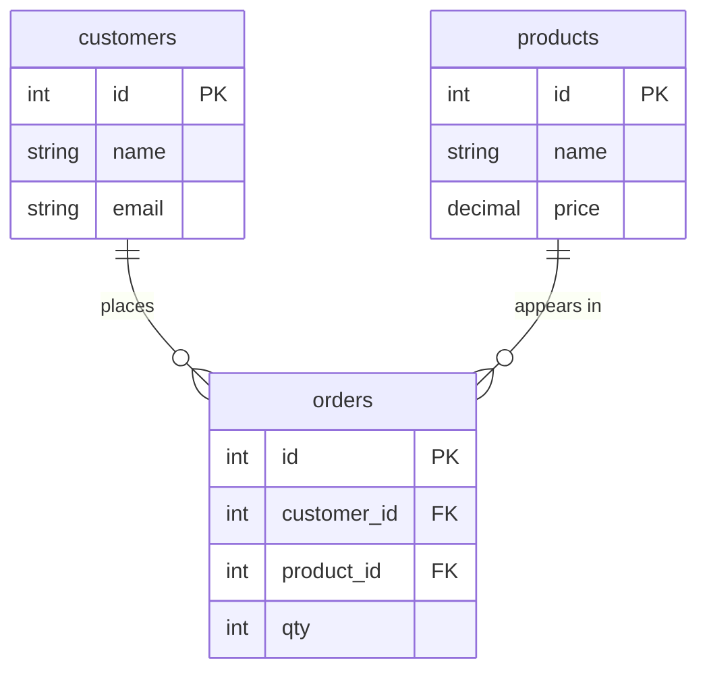

# Advanced 3 — Keys, ERDs, Normalization, Data Integrity

## Lectures covered
- Primary Key · Foreign Key
- Entity Relationship Diagram (ERD)
- Database Normalization · Data Integrity

---

## In one sentence
**Keys** identify rows and connect tables, an **ERD** is the diagram showing how those connections flow, and **normalization** is the discipline of splitting data so the same fact is stored in exactly one place.

## Real-world analogy
Imagine a library. Every book has a **call number** (primary key) — unique, never reused. The lending log uses that call number to point to the book it lent (foreign key). The **ERD** is the floor plan showing where the books, members, and loans connect. **Normalization** is why you don't paste a member's full address onto every loan slip — you write it once on their member card and reference it.

## The intuition (plain English)
A row needs a unique handle so you can find it again — that's the **primary key**. When one table needs to point at a row in another (orders -> customer), it stores that handle as a **foreign key**. The database can then enforce "no orphans" automatically. Normalization is the discipline of making sure each fact (customer name, product price) lives in exactly one row, in exactly one table — so updating it doesn't leave inconsistent copies. The classic levels (1NF, 2NF, 3NF) are progressive checks against three specific anomalies. After 3NF, most schemas are good enough.

## Mini worked example — splitting a denormalized table

You start with a single ugly table:

```
order_id | customer_name | customer_email     | product   | qty | price
---------+---------------+--------------------+-----------+-----+------
     101 | Alice         | alice@example.com  | Pen       |   3 |  2.00
     102 | Alice         | alice@example.com  | Notebook  |   1 |  6.00
     103 | Bob           | bob@example.com    | Pen       |   5 |  2.00
```

Problems: if Alice changes her email, you must update two rows. If she has no orders, she can't exist. If you delete order 102 and 101, Alice disappears entirely. These are the **update / insertion / deletion anomalies**.

Normalize into three tables:

```
customers                  products              orders
id | name  | email          id | name     | price   id | customer_id | product_id | qty
---+-------+-----------     ---+----------+------   ---+-------------+------------+----
 1 | Alice | alice@x.com     1 | Pen      | 2.00    101|           1 |          1 |   3
 2 | Bob   | bob@x.com       2 | Notebook | 6.00    102|           1 |          2 |   1
                                                    103|           2 |          1 |   5
```

Now Alice's email lives in one place; pricing lives in one place; orders point at both with foreign keys. To recover the wide view, you JOIN.

## At-a-glance — the schema you just built



## Why this matters
- Normalized OLTP schemas prevent contradictions and make updates safe.
- Most ML training data is built by JOINing several normalized tables — this is the upstream story to [../../06-machine-learning/01-foundations/05-preprocessing-encoding.md](../../06-machine-learning/01-foundations/05-preprocessing-encoding.md).
- Reading an ERD is half the job in any new analytics role — it shows you the join paths before you write a single query.

---

## 1. Primary Keys (PK)

A **primary key** uniquely identifies each row.

```sql
CREATE TABLE customers (
    id INT UNSIGNED AUTO_INCREMENT PRIMARY KEY,
    email VARCHAR(255) NOT NULL UNIQUE,
    name VARCHAR(100) NOT NULL
);
```

### Properties
- **Unique** across the table
- **Not NULL**
- Implicitly **indexed** (gives O(log n) lookup)
- Should be **stable** — don't change after creation

### Surrogate vs natural keys
- **Surrogate**: an artificial column (`id INT AUTO_INCREMENT`) — *recommended default*
- **Natural**: a real-world identifier (`email`, `ssn`) — risky if it can change

### Composite PK (multi-column)
```sql
CREATE TABLE order_items (
    order_id INT,
    line_no INT,
    product_id INT,
    quantity INT,
    PRIMARY KEY (order_id, line_no)
);
```

Each row identified by the *combination*. Common in junction tables.

---

## 2. Foreign Keys (FK)

A **foreign key** in one table references the PK of another, enforcing **referential integrity**.

```sql
CREATE TABLE orders (
    id INT PRIMARY KEY AUTO_INCREMENT,
    customer_id INT NOT NULL,
    amount DECIMAL(10, 2),
    FOREIGN KEY (customer_id) REFERENCES customers(id)
);
```

### What it enforces
- You can't insert an order with `customer_id = 999` if no customer 999 exists
- You can't delete a customer who still has orders (unless you allow cascade)

### Cascade options
```sql
FOREIGN KEY (customer_id) REFERENCES customers(id)
    ON DELETE CASCADE                  -- delete a customer → delete their orders
    ON UPDATE CASCADE                  -- change customer.id → propagate to orders.customer_id
```

Other options: `ON DELETE SET NULL`, `ON DELETE RESTRICT` (default — block).

### Why some teams skip FKs
- Performance: enforces extra checks on insert/delete
- Flexibility: easier ETL into the table
- Many-write systems sometimes enforce in app code

For OLTP and analytical sandboxes both: **start with FKs on**, turn off only if proven necessary.

---

## 3. Entity Relationship Diagrams (ERD)

A diagram showing tables (entities) and the relationships between them.

### Notation (Crow's foot)
```
customers ──╾─── orders
            ↑
        one customer has many orders (1:N)
```

### Cardinality
| Notation | Meaning |
|---|---|
| `1:1` | one-to-one (e.g. `users` ↔ `user_profiles`) |
| `1:N` | one-to-many (e.g. `customers` → `orders`) |
| `N:M` | many-to-many (e.g. `students` ↔ `courses`) — needs junction table |

### Drawing tools
- **MySQL Workbench** → File → New Model → reverse-engineer from existing schema → produces an ERD automatically
- **dbdiagram.io** — text-based, fast
- **Lucidchart, draw.io, Whimsical** — generic diagram tools

### Example for the Movies dataset

```
movies (movie_id PK)
   1 ─── 1   financials (movie_id PK, FK)
   1 ─── N   movie_actor (movie_id FK, actor_id FK) ── N ─── 1   actors (actor_id PK)
   N ─── 1   languages (language_id PK)
   N ─── 1   studios (studio PK)
```

Drawing this out before writing complex queries reveals the join paths.

---

## 4. Normalization — when to split tables

Normalization = organizing data to **eliminate redundancy** and **prevent anomalies**.

### The anomalies we're avoiding
- **Update anomaly** — changing a customer's name in 100 orders
- **Insertion anomaly** — can't add a product without an order
- **Deletion anomaly** — deleting the last order of a customer wipes the customer's data

### 1NF — atomic values, no repeating groups
**Bad** (a phone column with "555-1, 555-2"):
```
| id | name  | phones        |
| 1  | Alice | 555-1, 555-2  |
```

**1NF** — split into separate rows or a separate phone table:
```
phones: (customer_id, phone)
| 1 | 555-1 |
| 1 | 555-2 |
```

### 2NF — no partial dependency on part of a composite PK
If your PK is `(order_id, product_id)` and `product_name` depends only on `product_id`, that violates 2NF — `product_name` belongs in a `products` table.

### 3NF — no transitive dependency
If `zipcode` determines `city`, then in a `customers (id, zipcode, city)` table, `city` transitively depends on `id` *through* `zipcode` — split `zipcodes (zipcode, city)`.

### BCNF / 4NF / 5NF
Stricter forms. Rarely needed in practice.

### When to denormalize (intentionally)
For analytical / OLAP workloads, you **denormalize** for speed:
- Pre-join into a wide fact table
- Embed dimension attributes in the fact table
- Trade write-time cost for read-time speed

This is the **star schema** (covered in `05-data-warehouse-etl.md`).

---

## 5. Data integrity — the layers

### 1. Data type integrity
`age INT` rejects `"hello"`. `email VARCHAR(255) NOT NULL` rejects nulls.

### 2. Domain integrity (CHECK constraints)
```sql
CREATE TABLE orders (
    id INT PRIMARY KEY,
    quantity INT,
    CHECK (quantity > 0)
);
```

(MySQL fully honors `CHECK` since 8.0.16.)

### 3. Entity integrity
PK ensures each row is uniquely identifiable. `NOT NULL` + `UNIQUE`.

### 4. Referential integrity
FKs ensure relationships stay valid.

### 5. Application / business rule integrity
Things like "an order can't be cancelled if shipped" → enforced in app code or triggers.

---

## 6. A working example — designing a schema

### Requirement
Track customers, orders, order items, products.

### Tables
```sql
CREATE TABLE customers (
    id INT UNSIGNED AUTO_INCREMENT PRIMARY KEY,
    name VARCHAR(100) NOT NULL,
    email VARCHAR(255) NOT NULL UNIQUE,
    created_at DATETIME DEFAULT CURRENT_TIMESTAMP
);

CREATE TABLE products (
    id INT UNSIGNED AUTO_INCREMENT PRIMARY KEY,
    name VARCHAR(100) NOT NULL,
    price DECIMAL(10, 2) NOT NULL CHECK (price >= 0)
);

CREATE TABLE orders (
    id INT UNSIGNED AUTO_INCREMENT PRIMARY KEY,
    customer_id INT UNSIGNED NOT NULL,
    placed_at DATETIME DEFAULT CURRENT_TIMESTAMP,
    status ENUM("pending", "shipped", "delivered", "cancelled") DEFAULT "pending",
    FOREIGN KEY (customer_id) REFERENCES customers(id)
);

CREATE TABLE order_items (
    order_id INT UNSIGNED NOT NULL,
    line_no INT NOT NULL,
    product_id INT UNSIGNED NOT NULL,
    quantity INT NOT NULL CHECK (quantity > 0),
    unit_price DECIMAL(10, 2) NOT NULL,                  -- snapshot at order time
    PRIMARY KEY (order_id, line_no),
    FOREIGN KEY (order_id) REFERENCES orders(id) ON DELETE CASCADE,
    FOREIGN KEY (product_id) REFERENCES products(id)
);
```

This schema is in **3NF**, with full referential and domain integrity.

> Note `unit_price` snapshotted in `order_items` — even if `products.price` changes later, the historical order is preserved. Common pattern.

---

## 7. Common pitfalls

| Mistake | Effect | Fix |
|---|---|---|
| No PK on a table | hard to update specific rows; replication breaks | always have a PK |
| Using natural key for PK | breaks if value changes | surrogate `id` PK |
| FK without index | slow joins / cascade | MySQL auto-creates index for FKs (good) |
| Storing comma-separated values | violates 1NF; can't query | split into separate rows / table |
| Forgetting `NOT NULL` | accidental nulls leak in | require fields explicitly |
| Mixing units in one column | "100" — pounds? dollars? | one unit per column |

## Self-check

- [ ] Difference between PK and FK?
- [ ] What's a junction table and when do I need one?
- [ ] Walk through 1NF → 2NF → 3NF with an example.
- [ ] When is denormalization the right call?
- [ ] What does `ON DELETE CASCADE` do?
- [ ] Why would I snapshot `unit_price` in `order_items`?
- [ ] Draw an ERD for: `users`, `posts`, `comments`, `tags`, `post_tags`.

---

## Glossary

| Term | Plain meaning |
|------|---------------|
| **Primary key (PK)** | The column (or combination) that uniquely identifies each row. Always indexed and `NOT NULL` |
| **Foreign key (FK)** | A column that points to another table's primary key — enforces referential integrity |
| **Surrogate key** | An artificial PK column like `id INT AUTO_INCREMENT` — recommended default |
| **Natural key** | A real-world value used as PK (email, SSN). Risky if it can change |
| **Composite key** | A primary key made of two or more columns combined |
| **UNIQUE** | Constraint forcing every value in a column (or set) to be distinct |
| **NOT NULL** | "This column is required — missing values rejected" |
| **CHECK** | Constraint that rejects rows violating a condition (e.g., `quantity > 0`) |
| **Referential integrity** | The guarantee that a foreign key always points to an existing parent row |
| **ON DELETE CASCADE** | When the parent row is deleted, child rows are deleted too |
| **ON DELETE SET NULL** | Child rows survive but their FK column becomes NULL |
| **ON DELETE RESTRICT** | Default — block the parent delete while children exist |
| **ERD (Entity Relationship Diagram)** | A picture of tables and the relationships between them |
| **Entity** | A "thing" in your domain — a customer, a product, an order |
| **Cardinality** | How many rows on each side of a relationship: 1:1, 1:N, N:M |
| **Junction table** | A small table that turns a many-to-many into two one-to-many relationships |
| **Crow's foot notation** | The standard ERD style with branching lines that show "many" |
| **Normalization** | Splitting data so each fact lives in exactly one place |
| **1NF** | "Atomic columns, no repeating groups" — no comma-separated lists in a single cell |
| **2NF** | "No partial dependency on part of a composite PK" |
| **3NF** | "No transitive dependency" — non-key columns shouldn't depend on other non-key columns |
| **BCNF** | A stricter form of 3NF — rarely needed in practice |
| **Denormalization** | Intentionally adding redundancy back, for read speed (common in warehouses) |
| **Update anomaly** | Having to change the same fact in many rows because it was duplicated |
| **Insertion anomaly** | Can't add a new entity without inventing dummy values for unrelated columns |
| **Deletion anomaly** | Removing a row accidentally erases unrelated information |
| **Snapshot column** | A column that records a value at a point in time (e.g., `unit_price` on an order) — preserved even if the source value changes later |
| **Star schema** | A denormalized analytical pattern with one fact table joined to several dimensions |
| **Data integrity** | The collection of constraints (types, PK, FK, CHECK) that keep data valid |

## Further reading
- Next: [04-dml-statements.md](04-dml-statements.md) — actually inserting / updating with these constraints in place
- Star schema deep dive: [05-data-warehouse-etl.md](05-data-warehouse-etl.md) — when denormalization is the right choice
- ML data prep: [../../06-machine-learning/01-foundations/05-preprocessing-encoding.md](../../06-machine-learning/01-foundations/05-preprocessing-encoding.md) — joining normalized tables into a feature matrix
- Style guide: [../../../BEGINNER-STYLE-GUIDE.md](../../../BEGINNER-STYLE-GUIDE.md)
