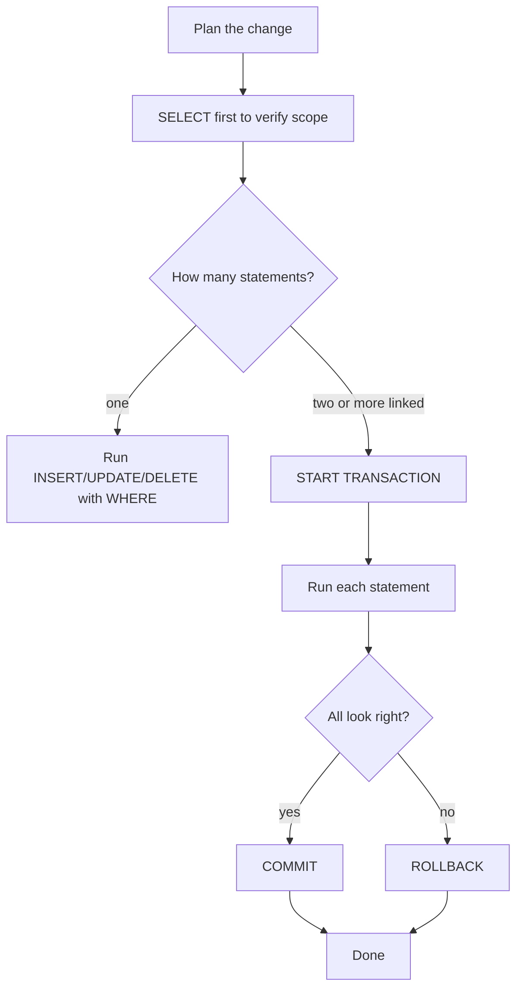

# Advanced 4 — DML: INSERT / UPDATE / DELETE + Transactions

## Lectures covered
- INSERT, UPDATE, DELETE Statement

---

## In one sentence
**DML** is the family of SQL commands that change the data — `INSERT` adds rows, `UPDATE` edits them, `DELETE` removes them — and **transactions** group several of these so they all succeed together or all roll back.

## Real-world analogy
Think of editing a shared spreadsheet. INSERT is adding a new row; UPDATE is changing a cell; DELETE is removing a row. A **transaction** is the "undo" wrapper: you start a transaction, make a few changes, and either save them all (`COMMIT`) or throw them all away (`ROLLBACK`). Bank transfers are the canonical example — you debit one account and credit another, and you absolutely never want one without the other.

## The intuition (plain English)
Reads (`SELECT`) are safe — they don't change anything. Writes (`INSERT`/`UPDATE`/`DELETE`) are scary because mistakes are permanent unless you wrap them in a transaction. The most expensive SQL bug in history is some variant of `UPDATE table SET col = X` without a `WHERE` — every row gets overwritten. The professional habit is: write a `SELECT` first to count what you're about to change, then run the DML, ideally inside `BEGIN ... COMMIT`. Transactions also give you ACID guarantees so concurrent writes don't corrupt each other.

## Mini worked example — a safe bank transfer

A two-row `accounts` table:

```
id | owner | balance
---+-------+--------
 1 | Alice |  500.00
 2 | Bob   |  100.00
```

Move $100 from Alice to Bob. Either both updates happen or neither does:

```sql
START TRANSACTION;

UPDATE accounts SET balance = balance - 100 WHERE id = 1;   -- Alice -> 400
UPDATE accounts SET balance = balance + 100 WHERE id = 2;   -- Bob   -> 200

-- final sanity check
SELECT id, balance FROM accounts WHERE id IN (1, 2);

COMMIT;     -- save everything
-- or, if anything went wrong:
-- ROLLBACK;  -- undo both updates
```

After COMMIT:

```
id | owner | balance
---+-------+--------
 1 | Alice |  400.00
 2 | Bob   |  200.00
```

If the server crashed between the two UPDATEs without a transaction, Alice's $100 would vanish. With a transaction, it can't.

## At-a-glance — the DML life cycle



## Why this matters
- This is the chapter where SQL gets dangerous. One missing `WHERE` can wipe a production table.
- ETL pipelines (next chapter) are pure DML — knowing transactions and idempotent inserts is the difference between robust and fragile pipelines.
- The same patterns work in pandas: `df.iloc[mask] = ...` is your UPDATE, but pandas has no rollback — so SQL transactions are the safer pattern when stakes are real.

---

## DDL vs DML vs DQL

| Family | What it does | Examples |
|---|---|---|
| **DDL** — Data Definition | structure | `CREATE`, `ALTER`, `DROP`, `TRUNCATE` |
| **DML** — Data Manipulation | rows | `INSERT`, `UPDATE`, `DELETE` |
| **DQL** — Data Query | reads | `SELECT` |
| **DCL** — Data Control | permissions | `GRANT`, `REVOKE` |
| **TCL** — Transaction Control | atomicity | `BEGIN`, `COMMIT`, `ROLLBACK` |

---

## 1. INSERT

### Single row
```sql
INSERT INTO customers (name, email)
VALUES ("Awais Shah", "a@b.com");
```

### Multiple rows (always faster than N inserts)
```sql
INSERT INTO customers (name, email) VALUES
    ("Alice", "alice@x.com"),
    ("Bob",   "bob@x.com"),
    ("Cleo",  "cleo@x.com");
```

### From a SELECT
```sql
INSERT INTO archived_orders (id, customer_id, amount)
SELECT id, customer_id, amount FROM orders WHERE placed_at < "2024-01-01";
```

### Insert + auto handle duplicates

#### `INSERT IGNORE` — skip rows that violate UNIQUE
```sql
INSERT IGNORE INTO customers (id, email) VALUES (1, "a@b.com");
```

#### `ON DUPLICATE KEY UPDATE` — upsert
```sql
INSERT INTO inventory (product_id, qty) VALUES (5, 100)
ON DUPLICATE KEY UPDATE qty = qty + VALUES(qty);
```

#### `REPLACE INTO` — delete then insert (avoid for FK'd rows)
```sql
REPLACE INTO products (id, name, price) VALUES (5, "New", 19.99);
```

---

## 2. UPDATE

### Basic
```sql
UPDATE customers
SET name = "Awais Shah", email = "a@b.com"
WHERE id = 1;
```

> **Always include a `WHERE` clause** unless you really mean to update every row. Updating without WHERE is the most common SQL disaster.

### Multiple columns + computed values
```sql
UPDATE products
SET price = price * 1.10                     -- 10% raise
WHERE category_id = 3;
```

### UPDATE with JOIN
```sql
UPDATE orders o
JOIN customers c ON o.customer_id = c.id
SET o.priority = "high"
WHERE c.tier = "gold";
```

### Safe-mode in MySQL Workbench
Workbench refuses an `UPDATE` without a key-based `WHERE` by default. Disable: Edit → Preferences → SQL Editor → uncheck "Safe Updates" (or override per-session: `SET SQL_SAFE_UPDATES = 0;`).

---

## 3. DELETE

### Basic
```sql
DELETE FROM customers WHERE id = 1;
```

> Same warning: missing `WHERE` deletes everything. **Test with `SELECT` first**:
> ```sql
> SELECT COUNT(*) FROM customers WHERE created_at < "2020-01-01";
> -- if the count looks right:
> DELETE FROM customers WHERE created_at < "2020-01-01";
> ```

### DELETE with JOIN
```sql
DELETE o FROM orders o
JOIN customers c ON o.customer_id = c.id
WHERE c.status = "banned";
```

### TRUNCATE — wipe the table fast
```sql
TRUNCATE TABLE log_events;
```
- Faster than `DELETE FROM log_events;` (no per-row logging)
- Resets `AUTO_INCREMENT`
- Cannot be rolled back inside a transaction
- Cannot be used if FKs reference the table from elsewhere

### Soft delete pattern
Instead of physically deleting, mark a row as deleted:
```sql
ALTER TABLE customers ADD COLUMN deleted_at DATETIME NULL;
UPDATE customers SET deleted_at = NOW() WHERE id = 1;

-- queries that ignore soft-deleted rows:
SELECT * FROM customers WHERE deleted_at IS NULL;
```

Pros: audit trail; recoverable.
Cons: every query must filter on `deleted_at`.

---

## 4. Transactions — atomic groups of changes

A **transaction** is a unit of work that either fully succeeds or fully rolls back. Either all the statements happen, or none of them.

```sql
START TRANSACTION;

UPDATE accounts SET balance = balance - 100 WHERE id = 1;
UPDATE accounts SET balance = balance + 100 WHERE id = 2;

COMMIT;            -- all changes saved
-- or
ROLLBACK;          -- all changes undone
```

### ACID properties
- **Atomicity** — all or nothing
- **Consistency** — leaves DB in a valid state (FKs, CHECKs honored)
- **Isolation** — concurrent transactions don't see each other's incomplete state
- **Durability** — once committed, survives crashes

### Savepoints (rollback to a checkpoint within a transaction)
```sql
START TRANSACTION;
INSERT INTO log VALUES (...);
SAVEPOINT before_update;
UPDATE accounts SET balance = balance - 100 WHERE id = 1;
-- oops:
ROLLBACK TO before_update;       -- undo the UPDATE but keep the INSERT
COMMIT;
```

### Auto-commit
By default, MySQL auto-commits each statement. Disable explicitly when you need a multi-step transaction:
```sql
SET autocommit = 0;
-- multiple statements...
COMMIT;
SET autocommit = 1;
```

---

## 5. Practical patterns

### Bulk insert from CSV
```sql
LOAD DATA INFILE "/var/lib/mysql-files/customers.csv"
INTO TABLE customers
FIELDS TERMINATED BY ","
LINES TERMINATED BY "\n"
IGNORE 1 LINES                      -- skip header
(name, email, country);
```

### Idempotent insert (won't error on re-run)
```sql
INSERT INTO settings (key_, value_) VALUES ("max_login_attempts", "5")
ON DUPLICATE KEY UPDATE value_ = VALUES(value_);
```

### Partial copy between tables
```sql
INSERT INTO orders_archive
SELECT * FROM orders WHERE placed_at < "2023-01-01";

DELETE FROM orders WHERE placed_at < "2023-01-01";
```

Wrap in a transaction so a crash mid-way doesn't lose data.

---

## 6. Common pitfalls

| Mistake | Effect | Fix |
|---|---|---|
| `UPDATE`/`DELETE` without `WHERE` | wipes / corrupts the whole table | always test with `SELECT` first |
| Forgetting `COMMIT` after `START TRANSACTION` | changes invisible to other sessions | always commit (or rollback) |
| Using `REPLACE INTO` on FK'd parent | deletes child rows via cascade | use `INSERT ... ON DUPLICATE KEY UPDATE` |
| `TRUNCATE` thinking it's reversible | not transactional | `DELETE FROM` if you need rollback |
| Concurrent updates on same row | last write wins / deadlocks | use `SELECT ... FOR UPDATE` or app-level locking |

## Self-check

- [ ] Difference between `INSERT IGNORE` and `ON DUPLICATE KEY UPDATE`?
- [ ] What does `TRUNCATE` do that `DELETE` doesn't?
- [ ] Why is "test with SELECT first" the right reflex?
- [ ] What's the difference between auto-commit on and off?
- [ ] Show a transaction transferring $100 between two accounts.
- [ ] When would soft-delete be safer than hard-delete?
- [ ] What's an "upsert" and when do I need one?

---

## Glossary

| Term | Plain meaning |
|------|---------------|
| **DML** | Data Manipulation Language — the SQL family that changes rows: INSERT, UPDATE, DELETE |
| **DDL** | Data Definition Language — changes structure: CREATE, ALTER, DROP, TRUNCATE |
| **DQL** | Data Query Language — reads only: SELECT |
| **DCL** | Data Control Language — permissions: GRANT, REVOKE |
| **TCL** | Transaction Control Language — atomicity: BEGIN, COMMIT, ROLLBACK |
| **INSERT** | Add new rows to a table |
| **UPDATE** | Change values in existing rows |
| **DELETE** | Remove rows |
| **TRUNCATE** | Wipe an entire table fast — not transactional, can't be rolled back |
| **WHERE clause** | The filter that decides which rows are affected — missing it usually means disaster |
| **INSERT IGNORE** | Skip rows that would violate UNIQUE constraints instead of erroring |
| **ON DUPLICATE KEY UPDATE** | "Insert if new, otherwise update" — the upsert pattern |
| **REPLACE INTO** | Delete the conflicting row, then insert the new one. Avoid when foreign keys reference the target |
| **Upsert** | Combined insert-or-update operation |
| **Idempotent** | Running it again gives the same final state — no errors, no duplicates |
| **Transaction** | A bundle of statements that either all commit or all roll back |
| **BEGIN / START TRANSACTION** | Open a transaction |
| **COMMIT** | Save every change in the open transaction |
| **ROLLBACK** | Undo every change in the open transaction |
| **Savepoint** | A named checkpoint inside a transaction; rollback can target it |
| **autocommit** | The default MySQL mode where each statement is its own transaction |
| **ACID** | Atomicity, Consistency, Isolation, Durability — the four guarantees a transactional DB provides |
| **Atomicity** | "All or nothing" — either every statement happens or none does |
| **Consistency** | The DB stays in a valid state — constraints honored at commit |
| **Isolation** | Concurrent transactions don't see each other's incomplete state |
| **Durability** | Once committed, the change survives a crash |
| **LOAD DATA INFILE** | Bulk-load a CSV into a table — much faster than per-row INSERT |
| **Soft delete** | Mark a row as deleted (with a `deleted_at` column) instead of removing it |
| **Hard delete** | Physically remove the row |
| **SQL_SAFE_UPDATES** | Workbench setting that blocks UPDATE/DELETE without a key-based WHERE |
| **SELECT FOR UPDATE** | Lock the rows you're about to update — prevents concurrent writes |

## Further reading
- Next: [05-data-warehouse-etl.md](05-data-warehouse-etl.md) — DML at scale (pipelines)
- Triggers and events: [08-triggers-events-indexes.md](08-triggers-events-indexes.md) — DML that runs automatically
- Pandas counterpart: [../../01-python/01-basics/07-eda-pandas-matplotlib-seaborn.md](../../01-python/01-basics/07-eda-pandas-matplotlib-seaborn.md) — `df.loc[...] = ...` is the pandas UPDATE
- Style guide: [../../../BEGINNER-STYLE-GUIDE.md](../../../BEGINNER-STYLE-GUIDE.md)
