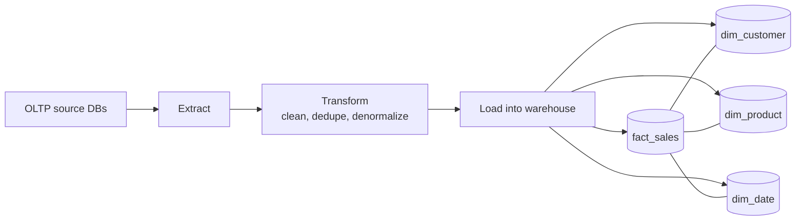

# Advanced 5 — Data Warehouse, ETL, OLAP/OLTP, Schemas

## Lectures covered
- ETL · Data Warehouse
- OLTP vs OLAP · Data Catalog
- Fact vs Dimension Table
- Star vs Snowflake Schema
- Data Import (recap)
- "Simplified: What is Kanban?"

---

## In one sentence
A **data warehouse** is a database optimized for analysis (reading lots, writing rarely), and **ETL** is the pipeline that copies data from operational databases into the warehouse — cleaning and reshaping it on the way.

## Real-world analogy
Your business runs on a checkout system that handles thousands of small transactions per second — that's **OLTP**. But the CEO wants quarterly trends, top customers, segmented dashboards. Asking those questions of the live checkout database would slow down the website. So you nightly **ETL** a copy of the data into a separate warehouse — like exporting transactions to a reporting database — and run analytics there. Same data, different room, different rules.

## The intuition (plain English)
**OLTP** databases are tuned for many small reads and writes (orders, logins). **OLAP** databases are tuned for big aggregations (`SUM`, `GROUP BY` over millions of rows). They have different schemas: OLTP is normalized for write safety; OLAP is denormalized into a **star schema** (one big fact table + small dimension tables) for read speed. **ETL** — Extract, Transform, Load — is the pipeline that moves data between them. Modern teams often do **ELT** instead: load raw, then transform inside the warehouse with SQL. The whole pattern enables clean separation: app teams own OLTP, analytics teams own the warehouse.

## Mini worked example — turning OLTP rows into a fact table

Source OLTP `orders` table (normalized):

```
order_id | customer_id | product_id | qty | placed_at
---------+-------------+------------+-----+--------------------
  100123 |          12 |          7 |   3 | 2026-05-09 14:22:01
  100124 |          12 |          9 |   1 | 2026-05-09 14:22:01
  100125 |          77 |          7 |   2 | 2026-05-10 09:15:33
```

After ETL, the warehouse `fact_sales` table (denormalized, with date_key + measures):

```
sale_id | date_key | customer_id | product_id | quantity | revenue
--------+----------+-------------+------------+----------+--------
 100123 | 20260509 |          12 |          7 |        3 |  150.00
 100124 | 20260509 |          12 |          9 |        1 |   25.00
 100125 | 20260510 |          77 |          7 |        2 |  100.00
```

Plus dimension tables (`dim_customer`, `dim_product`, `dim_date`) for descriptive attributes. Analyst questions like "revenue per product per month" become a single fact-to-dim join — fast.

## At-a-glance — the warehouse pattern



## Why this matters
- Most data analyst / data engineer roles are warehouse-side work. Understanding fact vs dim is interview-required.
- The **star schema** is the canonical answer to "how do I make this dashboard fast?"
- ETL/ELT is the bridge between raw operational data and the clean datasets ML models train on. See [../../06-machine-learning/01-foundations/05-preprocessing-encoding.md](../../06-machine-learning/01-foundations/05-preprocessing-encoding.md).

---

## 1. OLTP vs OLAP — two different worlds

| | OLTP | OLAP |
|---|---|---|
| **Purpose** | Run the business (writes) | Understand the business (reads) |
| **Workload** | Many small txns | Few large analytical queries |
| **Schema** | Highly normalized (3NF+) | Denormalized (star/snowflake) |
| **Latency** | Milliseconds | Seconds–minutes |
| **Examples** | MySQL behind a checkout, Postgres behind an app | Snowflake, BigQuery, Redshift, Databricks |

The same company often runs both: OLTP captures, OLAP analyzes. ETL bridges them.

---

## 2. ETL — Extract / Transform / Load

```
Sources             Staging               Warehouse
─────────           ───────               ─────────
ERP DB     ──┐
CRM DB     ──┤  E   raw tables   T   clean,    L   star schema
S3 files   ──┤ ───>            ───>  conformed ───>  facts + dims
APIs       ──┤      (sometimes  T               L
Logs       ──┘       skipped)
```

### Extract
Pull data from sources. Patterns: full snapshots (slow), incremental (CDC), event streams (Kafka).

### Transform
- Type cleaning (string → date, etc.)
- Deduplication
- Joining + denormalizing
- Aggregation
- Business-rule application (e.g., "exclude internal test orders")

### Load
Write into the warehouse, partitioned + indexed for analytical access.

### ETL vs ELT
- **ETL**: transform *before* loading. Classic. Used when warehouse compute is expensive.
- **ELT**: load raw, then transform inside the warehouse using SQL. Modern (Snowflake, BigQuery). Tools like dbt embody this.

For Codebasics' projects, you'll see ETL inside Python (pandas) writing to MySQL — small but real.

---

## 3. Data warehouse vs data lake vs data mart

| | Data warehouse | Data lake | Data mart |
|---|---|---|---|
| **Format** | structured (tables) | any (JSON, Parquet, CSV, images) | structured |
| **Scope** | enterprise-wide analytics | raw catch-all | one team / domain |
| **Tools** | Snowflake, BigQuery, Redshift | S3, ADLS, GCS | a slice of the warehouse |
| **Schema** | upfront (schema-on-write) | flexible (schema-on-read) | upfront |

**Data lakehouse** = lake + warehouse hybrid (Databricks, Iceberg, Delta Lake). Modern dominant pattern.

---

## 4. Star schema — the analytical default

### Layout
```
                 dim_customer
                       │
dim_date  ──── fact_sales ──── dim_product
                       │
                  dim_store
```

- **Fact table** in the middle: numerical, additive measures + foreign keys to dimensions
- **Dimension tables** around it: descriptive, denormalized

### Fact table
```sql
CREATE TABLE fact_sales (
    sale_id BIGINT PRIMARY KEY,
    date_id INT,
    customer_id INT,
    product_id INT,
    store_id INT,
    quantity INT,
    revenue DECIMAL(12, 2),
    discount DECIMAL(12, 2)
);
```

Measures (`quantity`, `revenue`, `discount`) are summable — that's the point of a fact table.

### Dimension table
```sql
CREATE TABLE dim_product (
    product_id INT PRIMARY KEY,
    sku VARCHAR(50),
    name VARCHAR(100),
    category VARCHAR(50),
    sub_category VARCHAR(50),
    brand VARCHAR(50),
    list_price DECIMAL(10, 2)
);
```

Descriptive attributes, low row count, denormalized (category + sub-category live in the same row).

### Why star wins for OLAP
- Few joins per query (just fact ↔ dim)
- Easy to understand
- Fast on columnar warehouses (each column compressed)

---

## 5. Snowflake schema — normalized dimensions

```
                              dim_subcategory
                                    │
dim_product ─── dim_category ───────┘
```

A `dim_product` references `dim_category`, which references `dim_subcategory`. More normalized; saves disk; harder to query.

### Star vs snowflake — pick which?
- **Star** (default for analytics): fewer joins, faster, more readable
- **Snowflake**: when dimension data is huge and changes often (e.g., complex product hierarchies)

Most teams default to star and only normalize where storage / change-frequency forces it.

---

## 6. Fact table flavors

### Transactional fact
One row per business event (`fact_sales`, `fact_clicks`). Most common.

### Periodic snapshot
One row per entity per period (`fact_account_balance_daily`). Useful for time-series.

### Accumulating snapshot
One row per process, updated as it progresses (`fact_order_lifecycle` with `placed`, `shipped`, `delivered`, `returned` timestamps).

### Factless fact table
A fact table with no measures, just FK relationships. Used to track *occurrences* (e.g., student attendance — what was attended, by whom, when).

---

## 7. Slowly Changing Dimensions (SCDs) — handling history in dim tables

| Type | Behavior | When |
|---|---|---|
| **SCD Type 1** | Overwrite (no history) | Typo fixes |
| **SCD Type 2** | New row per change, with `valid_from` / `valid_to` columns | Track history (most common) |
| **SCD Type 3** | One column for "previous value" | Rare; partial history |

### SCD2 example
```sql
CREATE TABLE dim_customer (
    customer_sk BIGINT PRIMARY KEY,            -- surrogate key (changes per version)
    customer_id INT,                            -- natural / business key (stable)
    name VARCHAR(100),
    tier VARCHAR(20),
    valid_from DATE,
    valid_to DATE,
    is_current BOOLEAN
);
```

When a customer's tier changes, insert a new row with the new tier and bump the previous row's `valid_to`. Fact rows reference `customer_sk` so a 2024 sale stays linked to the correct *historical* customer.

---

## 8. Data Catalog — knowing what's where

A **data catalog** is a metadata directory of every dataset in your org:
- Table name + schema + owner
- Column descriptions
- Data lineage (what feeds into what)
- Data classification (PII, financial, etc.)

Tools: **DataHub** (open-source), **Atlan**, **Alation**, **Collibra**.

For your bootcamp projects: even a `data_dictionary.md` in the repo is a starter catalog. Recruiters notice this.

---

## 9. "Simplified: What is Kanban?"

Codebasics drops in a 5-min Kanban primer here because their stats project (AtliQo Bank, Module 5) uses Kanban / JIRA.

### Kanban in 60 seconds
- A board with columns: **To Do · In Progress · Done**
- Cards (tasks) flow left → right
- WIP limits prevent multitasking
- Daily 10-minute standup: "what did I do yesterday / today / blockers?"

It's the lightest-weight project management framework — perfect for a personal bootcamp.

### Apply to your bootcamp
A simple Trello / Notion / GitHub Projects board with columns: **Up Next**, **Studying**, **Practicing**, **Done**. Add each module / project / practice room as a card.

---

## 10. Common pitfalls

| Mistake | Effect | Fix |
|---|---|---|
| Storing analytical metrics in OLTP | slows the app | replicate to a warehouse |
| Designing facts without grain | sums double-count | define exactly what one row means |
| Snowflaking dimensions prematurely | extra joins, slower queries | start star, snowflake only when needed |
| No data dictionary | "what does this column mean?" Discord questions | document at least every fact table |
| ETL with no monitoring | silent failures | log row counts, alert on anomalies |

## Self-check

- [ ] Difference between OLTP and OLAP?
- [ ] Walk through the ETL pipeline for a sales dashboard.
- [ ] Star vs snowflake — when to pick which?
- [ ] What's the "grain" of a fact table?
- [ ] Three types of SCD and when to use each?
- [ ] What's a data catalog and why do orgs need one?
- [ ] Set up a Kanban board for your bootcamp progress.

---

## Glossary

| Term | Plain meaning |
|------|---------------|
| **OLTP** | Online Transactional Processing — small, frequent writes from running apps. MySQL, Postgres |
| **OLAP** | Online Analytical Processing — big read-heavy queries for dashboards. Snowflake, BigQuery, Redshift |
| **Data warehouse** | A database tuned for analytical queries. Schema is denormalized for read speed |
| **Data lake** | Raw storage of any-format files (Parquet, JSON, images) — schema-on-read |
| **Data lakehouse** | Lake + warehouse hybrid (Databricks, Iceberg, Delta) — modern dominant pattern |
| **Data mart** | A slice of the warehouse for one team or domain (e.g., marketing mart) |
| **ETL** | Extract -> Transform -> Load. Transform happens before loading |
| **ELT** | Extract -> Load -> Transform. Load raw, then transform inside the warehouse with SQL/dbt |
| **CDC (Change Data Capture)** | Streaming only the changes since last load, instead of full re-extracts |
| **Staging area** | The intermediate "raw landing zone" between source and warehouse |
| **Star schema** | A fact table in the middle, dimension tables radiating out |
| **Snowflake schema** | Star schema where dimensions are further normalized |
| **Fact table** | The grid of measurements + foreign keys to dimensions. Rows are events |
| **Dimension table** | Descriptive attributes (customer, product, date). Few rows, many columns |
| **Measure** | A numeric column you can sum or average (revenue, quantity) |
| **Grain** | What one row of a fact table represents — e.g., "one sale of one product on one day" |
| **Transactional fact** | One row per business event (sale, click) |
| **Periodic snapshot** | One row per entity per period (daily account balance) |
| **Accumulating snapshot** | One row per process, updated as it progresses |
| **Factless fact** | A fact table with no measures, just relationships (e.g., attendance) |
| **SCD Type 1** | Overwrite the dimension column — no history kept |
| **SCD Type 2** | Insert a new dimension row per change with `valid_from`/`valid_to` — full history |
| **SCD Type 3** | Add a "previous value" column — partial history |
| **Surrogate key (sk)** | An artificial key per dimension version, separate from the natural business id |
| **Natural / business key** | The real-world id that doesn't change (customer_id, product_sku) |
| **Data catalog** | A metadata directory of every dataset — table names, owners, descriptions, lineage |
| **Lineage** | The map of "this table comes from these source tables" |
| **dbt** | A tool that turns SELECT statements into a managed warehouse-side ELT pipeline |
| **Kanban** | A simple project-management approach: cards flow across To Do -> In Progress -> Done columns |

## Further reading
- Next: [06-functions-procedures-views.md](06-functions-procedures-views.md) — packaging warehouse logic
- Project work: [09-projects.md](09-projects.md) — both projects build star-schema deliverables
- ML data prep: [../../06-machine-learning/01-foundations/05-preprocessing-encoding.md](../../06-machine-learning/01-foundations/05-preprocessing-encoding.md) — feature stores are warehouse outputs
- Style guide: [../../../BEGINNER-STYLE-GUIDE.md](../../../BEGINNER-STYLE-GUIDE.md)
