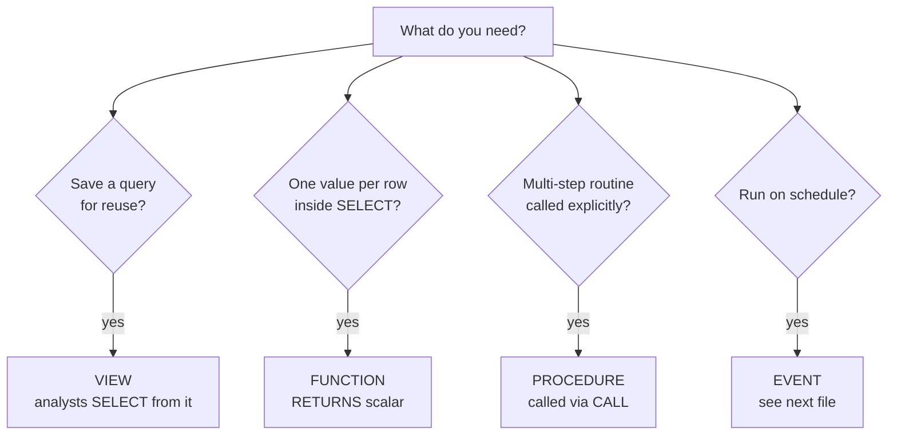

# Advanced 6 — User-Defined Functions, Stored Procedures, Views

## Lectures covered
- User-Defined Functions (UDF)
- Stored Procedures
- Database Views

---

## In one sentence
**Views**, **functions**, and **stored procedures** all save SQL for reuse — a view is a saved query you SELECT from, a function returns one value per call, and a procedure is a multi-step routine you `CALL`.

## Real-world analogy
- A **view** is a pre-set "saved search" in your inbox: every time you click it, it re-runs the filter live and shows current matches.
- A **function** is a single-button kitchen tool — you put one thing in, get one thing out (`movie_age(2010)` -> `16`).
- A **stored procedure** is a recipe card with multiple steps — you `CALL` it and the whole sequence runs server-side.

## The intuition (plain English)
Once your queries get complex, you don't want analysts copy-pasting the same 30-line JOIN. You package it. **Views** give analysts a clean "table-like" object that hides the joins and filters. **Functions** are reusable formulas — define `net_sales(gross, discount_pct)` once, use it everywhere. **Procedures** wrap up multi-step logic (compute, then update, then log) so callers run one `CALL`. Each has its sweet spot, and modern teams use all three sparingly — most business logic now lives in app code or dbt models, but for pure-SQL warehouses these are the right tools.

## Mini worked example — packaging "net sales" three ways

A 3-row `sales` table:

```
id | gross_amount | discount_pct
---+--------------+--------------
 1 |       100.00 |        10.00
 2 |       250.00 |         0.00
 3 |        80.00 |        20.00
```

**Function** — one line of formula, callable from anywhere:

```sql
DELIMITER $$
CREATE FUNCTION net_sales(gross DECIMAL(10,2), pct DECIMAL(4,2))
RETURNS DECIMAL(10,2) DETERMINISTIC NO SQL
BEGIN
    RETURN gross * (1 - pct / 100);
END$$
DELIMITER ;

SELECT id, net_sales(gross_amount, discount_pct) AS net FROM sales;
```

Result:

```
id |    net
---+-------
 1 |  90.00
 2 | 250.00
 3 |  64.00
```

**View** — saved SELECT analysts can re-query:

```sql
CREATE VIEW v_sales_with_net AS
SELECT id, gross_amount, discount_pct,
       net_sales(gross_amount, discount_pct) AS net_amount
FROM sales;

SELECT * FROM v_sales_with_net WHERE net_amount > 80;
```

**Procedure** — multi-step routine:

```sql
DELIMITER $$
CREATE PROCEDURE refresh_sales_report(IN min_net DECIMAL(10,2))
BEGIN
    SELECT id, net_amount FROM v_sales_with_net WHERE net_amount > min_net;
END$$
DELIMITER ;

CALL refresh_sales_report(80);
```

## At-a-glance — pick the right wrapper



## Why this matters
- This is how warehouse teams expose clean "data products" to analysts without exposing raw tables.
- Views are the security layer that lets you grant access to non-PII columns without touching the underlying table permissions.
- Functions encapsulate formulas (net sales, BMI, fiscal week) so the same number is computed identically everywhere.

---

## 1. Views — saved queries you can SELECT from

A **view** is a stored `SELECT` statement that you can query like a table.

### Creating
```sql
CREATE VIEW v_top_movies AS
SELECT m.title, m.imdb_rating, f.revenue
FROM movies m
JOIN financials f ON m.movie_id = f.movie_id
WHERE m.imdb_rating > 8;
```

### Using
```sql
SELECT * FROM v_top_movies WHERE revenue > 100000000;
```

### Dropping / replacing
```sql
DROP VIEW v_top_movies;
CREATE OR REPLACE VIEW v_top_movies AS ...;
```

### Why use views
- **Encapsulate complex joins** — analysts SELECT from views, not raw tables
- **Security** — give a user access to a view that filters PII out
- **Stable interface** — underlying tables can change, view stays the same

### Materialized views
A **materialized view** stores the result on disk (refreshed on schedule or on demand). Fast reads, stale writes.

MySQL doesn't support materialized views natively. Workarounds:
- A scheduled `INSERT INTO summary_table SELECT ...` job
- An event (covered in `08-triggers-events-indexes.md`)
- A real warehouse (Snowflake, Postgres+pg_cron) supports them natively

---

## 2. Stored Procedures — saved SQL blocks (no return value)

```sql
DELIMITER $$

CREATE PROCEDURE get_top_movies(IN min_rating DECIMAL(2,1))
BEGIN
    SELECT title, imdb_rating
    FROM movies
    WHERE imdb_rating >= min_rating
    ORDER BY imdb_rating DESC;
END$$

DELIMITER ;

CALL get_top_movies(8.5);
```

### Why `DELIMITER $$`?
Inside the procedure, statements end with `;`. We need a different delimiter for the *outer* `CREATE PROCEDURE` to know when the body ends.

### Parameter modes
- `IN` — read-only input (default)
- `OUT` — written by the procedure, returned to caller
- `INOUT` — both

```sql
DELIMITER $$
CREATE PROCEDURE add_two(IN a INT, IN b INT, OUT result INT)
BEGIN
    SET result = a + b;
END$$
DELIMITER ;

CALL add_two(2, 3, @sum);
SELECT @sum;          -- 5
```

### Conditional logic + loops
```sql
DELIMITER $$
CREATE PROCEDURE classify(IN movie_id INT)
BEGIN
    DECLARE r DECIMAL(2,1);
    SELECT imdb_rating INTO r FROM movies WHERE movie_id = movie_id;

    IF r >= 9 THEN
        SELECT "excellent" AS rating;
    ELSEIF r >= 7 THEN
        SELECT "good" AS rating;
    ELSE
        SELECT "average" AS rating;
    END IF;
END$$
DELIMITER ;
```

### When to use stored procedures
- **Reusable analytics** — same complex query called from many places
- **Encapsulating business rules** in one place
- **Performance** — server-side; no round-trips for multi-step logic
- **Permission control** — grant CALL access without granting raw table reads

### When *not* to use them
- Application logic that should live in app code (Python, Node)
- Anything that needs to be tested with unit tests
- Anything that crosses microservice boundaries

Modern teams keep procedures for **pure-SQL workflows** (data warehousing) and put business logic in app code.

---

## 3. User-Defined Functions (UDFs)

A **function** in SQL is like a procedure but **returns a single value** and can be used inside SELECT.

```sql
DELIMITER $$
CREATE FUNCTION movie_age(release_year INT)
RETURNS INT
DETERMINISTIC
READS SQL DATA
BEGIN
    RETURN YEAR(CURDATE()) - release_year;
END$$
DELIMITER ;

SELECT title, movie_age(release_year) AS age FROM movies;
```

### Required clauses
- `RETURNS <type>` — the return type
- `DETERMINISTIC` — same input always gives same output (lets MySQL cache)
- `READS SQL DATA` / `MODIFIES SQL DATA` / `NO SQL` — what side effects, if any

### When to use UDFs
- Reusable column calculations (e.g., "fiscal week" from a date)
- Domain-specific formulas (BMI, tax, profit margin)

---

## 4. Procedure vs Function vs View — which to use

| You want to... | Use |
|---|---|
| Save a complex SELECT for reuse | View |
| Compute one value per row in a SELECT | Function |
| Encapsulate a multi-step DML routine | Procedure |
| Filter sensitive columns from analysts | View |
| Run on a schedule | Event (next file) |

---

## 5. Real example — Codebasics' "Finance Top-N" project preview

A typical advanced-SQL project shape:

### Step 1 — A view for clean, joined data
```sql
CREATE VIEW v_sales_clean AS
SELECT s.sale_id, s.date, s.amount, c.name AS customer, p.name AS product
FROM sales s
JOIN customers c ON s.customer_id = c.id
JOIN products p ON s.product_id = p.id
WHERE s.status = "confirmed";
```

### Step 2 — A procedure for top-N by category
```sql
DELIMITER $$
CREATE PROCEDURE top_n_per_category(IN n INT)
BEGIN
    SELECT category, name, total
    FROM (
        SELECT p.category, p.name, SUM(s.amount) AS total,
               ROW_NUMBER() OVER (PARTITION BY p.category ORDER BY SUM(s.amount) DESC) AS rk
        FROM v_sales_clean s
        JOIN products p ON s.product = p.name
        GROUP BY p.category, p.name
    ) t
    WHERE rk <= n;
END$$
DELIMITER ;

CALL top_n_per_category(3);
```

This is the kind of build that's portfolio-worthy and walks the line between SQL and "data engineering."

---

## 6. Common pitfalls

| Mistake | Effect | Fix |
|---|---|---|
| Forgot `DELIMITER` change | "no statement after BEGIN" | wrap procedure body with `DELIMITER $$ ... $$ DELIMITER ;` |
| Procedure with side effects + `DETERMINISTIC` | wrong cache | be honest about side effects |
| View with `ORDER BY` | useless — the consumer can re-order | drop the ORDER BY in the view |
| Procedure too large | hard to test | split into smaller procedures |
| Returning multiple result sets from a function | not supported | use a procedure |

## Self-check

- [ ] Difference between view, function, procedure?
- [ ] When would you use a procedure over a view?
- [ ] What does `DELIMITER` do in CREATE PROCEDURE?
- [ ] What's the difference between `IN`, `OUT`, `INOUT` parameters?
- [ ] What's `DETERMINISTIC` and why does it matter?
- [ ] Write a function `discount(amount DECIMAL, pct DECIMAL)` that returns the post-discount amount.
- [ ] Why doesn't MySQL have native materialized views, and how do teams emulate them?

---

## Glossary

| Term | Plain meaning |
|------|---------------|
| **View** | A saved SELECT statement you can query like a table |
| **Materialized view** | A view whose result is stored on disk and refreshed periodically. MySQL doesn't support natively — emulate with a summary table + scheduled INSERT |
| **Stored procedure** | A named block of SQL with parameters, called with `CALL name(args)` |
| **User-defined function (UDF)** | A function returning one value, usable inside SELECT |
| **DELIMITER** | Temporarily change the statement terminator from `;` so multi-statement bodies parse correctly |
| **CALL** | The keyword that invokes a stored procedure |
| **IN parameter** | Read-only input to a procedure |
| **OUT parameter** | A value the procedure writes back to the caller |
| **INOUT parameter** | Both input and output |
| **DETERMINISTIC** | "Same input always gives same output" — lets MySQL cache results safely |
| **READS SQL DATA** | The function reads tables but doesn't write |
| **MODIFIES SQL DATA** | The function or procedure changes tables |
| **NO SQL** | The function uses no database tables — pure computation |
| **CREATE OR REPLACE VIEW** | Replace an existing view's definition without dropping/recreating |
| **SECURITY DEFINER / INVOKER** | Whether a procedure runs with the *creator's* or *caller's* privileges |
| **Encapsulation** | Hiding implementation details behind a stable interface (the view name, the function name) |
| **Permission control** | Granting `EXECUTE` on a procedure without granting raw table access |
| **Top-N per group** | A common pattern: rank within a group, then keep the top N — usually wrapped in a procedure |
| **YoY (Year over Year)** | A view that compares this year's measure to last year's — uses `LAG` window function |
| **Fiscal week** | A custom week-numbering scheme — the kind of thing UDFs encode |

## Further reading
- Next: [07-window-functions.md](07-window-functions.md) — the engine behind top-N and rolling metrics
- Then: [08-triggers-events-indexes.md](08-triggers-events-indexes.md) — automation and speed
- Project applications: [09-projects.md](09-projects.md) — both projects build views + procedures
- Style guide: [../../../BEGINNER-STYLE-GUIDE.md](../../../BEGINNER-STYLE-GUIDE.md)
