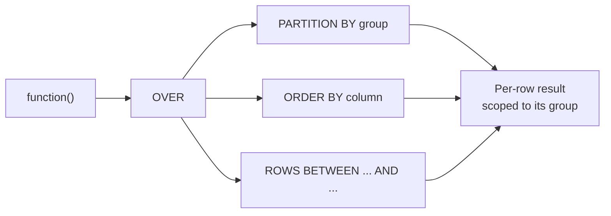

# Advanced 7 — Window Functions

## Lectures covered
- Window Functions `OVER` clause
- `ROW_NUMBER`, `RANK`, `DENSE_RANK`

---

## In one sentence
A **window function** computes a value across a related set of rows (a "window") *without collapsing them* like `GROUP BY` does — so you keep every row but can also see its rank, running total, or comparison to its group's average.

## Real-world analogy
Imagine an Excel sheet of test scores by class. A `GROUP BY` is "give me one row per class with the average." A window function is "leave every student row alone, but **add a column** showing their class's average next to them, AND their rank within the class." You see the trees and the forest at the same time.

## The intuition (plain English)
Window functions answer questions like *"how does each row compare to its group?"* or *"running total over time"* in a single SELECT. The magic is the `OVER()` clause: `PARTITION BY` says "what's a group?", `ORDER BY` (inside `OVER`) says "in what order?", and the **frame** (`ROWS BETWEEN ...`) says "which rows count for this row's calculation?". Once you internalize that, every famous interview pattern — top-N per group, year-over-year change, 7-day moving average, percentile — is the same shape with different functions.

## Mini worked example — top-2 movies per industry

A 6-row `movies` table:

```
movie_id | title         | industry  | imdb_rating
---------+---------------+-----------+------------
       1 | The Godfather | Hollywood |         9.2
       2 | Inception     | Hollywood |         8.8
       3 | Cats          | Hollywood |         3.0
       4 | Sholay        | Bollywood |         8.5
       5 | 3 Idiots      | Bollywood |         8.4
       6 | Race 3        | Bollywood |         5.0
```

Question: "Top 2 highest-rated movies in each industry."

```sql
WITH ranked AS (
    SELECT industry, title, imdb_rating,
           ROW_NUMBER() OVER (PARTITION BY industry ORDER BY imdb_rating DESC) AS rk
    FROM movies
)
SELECT industry, title, imdb_rating, rk
FROM ranked
WHERE rk <= 2;
```

Result:

```
industry  | title         | imdb_rating | rk
----------+---------------+-------------+---
Bollywood | Sholay        |         8.5 |  1
Bollywood | 3 Idiots      |         8.4 |  2
Hollywood | The Godfather |         9.2 |  1
Hollywood | Inception     |         8.8 |  2
```

You kept every row's identity AND added a per-group rank — that's the power of windows.

## At-a-glance — the OVER clause anatomy



## Why this matters
- "Top-N per group" appears in nearly every analyst interview — the window-function template is the canonical answer.
- Year-over-year, moving average, percentiles, "first event per user" — all use the same `OVER()` pattern.
- pandas equivalents (`groupby().rank()`, `groupby().rolling()`, `groupby().shift()`) work the same way conceptually — see [../../01-python/01-basics/07-eda-pandas-matplotlib-seaborn.md](../../01-python/01-basics/07-eda-pandas-matplotlib-seaborn.md).

---

## What window functions do

A window function computes a value across a **window** (a set of related rows) **without collapsing rows** like `GROUP BY` does.

```sql
SELECT industry,
       title,
       imdb_rating,
       AVG(imdb_rating) OVER (PARTITION BY industry) AS industry_avg
FROM movies;
```

You get every original movie row PLUS its industry's average — no aggregation collapse.

This is the most asked SQL topic in modern data interviews. Drill it.

---

## 1. Anatomy of OVER()

```
function() OVER (
    PARTITION BY ...     -- split rows into groups (optional)
    ORDER BY ...         -- order within each partition (optional)
    ROWS BETWEEN ...     -- frame within the partition (optional)
)
```

- **PARTITION BY**: like `GROUP BY` but doesn't collapse rows
- **ORDER BY** (inside `OVER`): defines order within each partition; required for ranking and running totals
- **Frame**: which rows within the partition are visible to the function

---

## 2. Ranking functions

### `ROW_NUMBER()` — sequential 1, 2, 3, ... (no ties)
```sql
SELECT industry, title, imdb_rating,
       ROW_NUMBER() OVER (PARTITION BY industry ORDER BY imdb_rating DESC) AS rn
FROM movies;
```
Within each industry, the highest rated gets `rn=1`, next `rn=2`, etc. Ties broken arbitrarily.

### `RANK()` — same value → same rank, gaps after ties
```
imdb_rating  RANK
9.0          1
8.5          2
8.5          2
8.2          4   ← gap
```

### `DENSE_RANK()` — same value → same rank, no gaps
```
imdb_rating  DENSE_RANK
9.0          1
8.5          2
8.5          2
8.2          3   ← no gap
```

### `NTILE(n)` — split partition into n approximately-equal buckets
```sql
SELECT title, imdb_rating, NTILE(4) OVER (ORDER BY imdb_rating) AS quartile
FROM movies;
```
Quartile 1 = bottom 25%, quartile 4 = top 25%.

---

## 3. The Top-N Per Group pattern (interview gold)

> "Top 3 movies per industry by IMDB rating."

```sql
SELECT industry, title, imdb_rating
FROM (
    SELECT industry, title, imdb_rating,
           ROW_NUMBER() OVER (PARTITION BY industry ORDER BY imdb_rating DESC) AS rk
    FROM movies
) t
WHERE rk <= 3;
```

Or with a CTE for clarity:
```sql
WITH ranked AS (
    SELECT industry, title, imdb_rating,
           ROW_NUMBER() OVER (PARTITION BY industry ORDER BY imdb_rating DESC) AS rk
    FROM movies
)
SELECT * FROM ranked WHERE rk <= 3;
```

This is *the* template — memorize it.

---

## 4. LAG and LEAD — peek at neighbors

### `LAG(col, n)` — value from `n` rows before
### `LEAD(col, n)` — value from `n` rows after

```sql
-- Year-over-year revenue change
SELECT release_year,
       SUM(revenue) AS rev,
       LAG(SUM(revenue)) OVER (ORDER BY release_year) AS prev_year_rev,
       SUM(revenue) - LAG(SUM(revenue)) OVER (ORDER BY release_year) AS yoy_change
FROM movies m
JOIN financials f ON m.movie_id = f.movie_id
GROUP BY release_year;
```

---

## 5. Running aggregates (cumulative)

### Running total
```sql
SELECT release_year, SUM(revenue) AS yearly,
       SUM(SUM(revenue)) OVER (ORDER BY release_year) AS cumulative_revenue
FROM movies m
JOIN financials f ON m.movie_id = f.movie_id
GROUP BY release_year;
```

### Moving average (last 3 years)
```sql
SELECT release_year, SUM(revenue) AS yearly,
       AVG(SUM(revenue)) OVER (
           ORDER BY release_year
           ROWS BETWEEN 2 PRECEDING AND CURRENT ROW
       ) AS rolling_3yr_avg
FROM movies m
JOIN financials f ON m.movie_id = f.movie_id
GROUP BY release_year;
```

### Frame clauses
- `ROWS BETWEEN UNBOUNDED PRECEDING AND CURRENT ROW` — running total (default with ORDER BY)
- `ROWS BETWEEN N PRECEDING AND CURRENT ROW` — last N rows
- `ROWS BETWEEN CURRENT ROW AND UNBOUNDED FOLLOWING` — from now to end
- `ROWS BETWEEN UNBOUNDED PRECEDING AND UNBOUNDED FOLLOWING` — entire partition (default without ORDER BY)

---

## 6. FIRST_VALUE, LAST_VALUE, NTH_VALUE

```sql
-- For each industry, what's its highest-rated movie?
SELECT DISTINCT
       industry,
       FIRST_VALUE(title) OVER (PARTITION BY industry ORDER BY imdb_rating DESC) AS top_title
FROM movies;
```

> `LAST_VALUE` is tricky — its default frame is `UNBOUNDED PRECEDING TO CURRENT ROW`, so it gives the *current row's value*. Override the frame to get the *partition's* last:
> ```sql
> LAST_VALUE(...) OVER (
>     PARTITION BY ... ORDER BY ...
>     ROWS BETWEEN UNBOUNDED PRECEDING AND UNBOUNDED FOLLOWING
> )
> ```

---

## 7. PERCENT_RANK and CUME_DIST

```sql
SELECT title, imdb_rating,
       PERCENT_RANK() OVER (ORDER BY imdb_rating) AS pct_rank,
       CUME_DIST() OVER (ORDER BY imdb_rating) AS cume_dist
FROM movies;
```

- `PERCENT_RANK` — `(rank - 1) / (total_rows - 1)`. Range 0 to 1.
- `CUME_DIST` — fraction of rows ≤ current. Range >0 to 1.

Use to find percentile of each row within the dataset.

---

## 8. Common patterns to recognize on sight

### "Rank within group"
```sql
ROW_NUMBER() / RANK() / DENSE_RANK() OVER (PARTITION BY group_col ORDER BY metric DESC)
```

### "Compared to group average"
```sql
metric - AVG(metric) OVER (PARTITION BY group_col)
```

### "Year over year"
```sql
metric - LAG(metric) OVER (ORDER BY date_col)
```

### "Running total"
```sql
SUM(metric) OVER (ORDER BY date_col)
```

### "Moving average"
```sql
AVG(metric) OVER (ORDER BY date_col ROWS BETWEEN N PRECEDING AND CURRENT ROW)
```

### "First / latest event per user"
```sql
ROW_NUMBER() OVER (PARTITION BY user_id ORDER BY event_time ASC|DESC)
-- then WHERE rn = 1
```

---

## 9. Window functions vs GROUP BY

| | GROUP BY | Window function |
|---|---|---|
| Output rows | one per group | one per input row |
| Use when | summary needed | per-row + group context needed |
| Computational cost | low | moderate |

If your interview question contains "show each row, but compare to its group's value," reach for windows.

---

## 10. Common pitfalls

| Mistake | Effect | Fix |
|---|---|---|
| Using `WHERE rn = 1` directly | windows aren't yet computed at WHERE | wrap in subquery / CTE |
| Forgot `ORDER BY` inside `OVER()` for ranking | error / undefined order | always `ORDER BY` for rank functions |
| `LAST_VALUE` returns wrong thing | default frame is short | extend frame to `UNBOUNDED PRECEDING AND UNBOUNDED FOLLOWING` |
| Window over very large partitions | slow | partition more aggressively / use index on partition column |

## Self-check

- [ ] Difference between `ROW_NUMBER`, `RANK`, `DENSE_RANK`?
- [ ] Why can't you use `WHERE rn = 1` directly when `rn` is a window function?
- [ ] Write the "top 2 highest-paid employees per department" query.
- [ ] Write a 7-day moving average of daily sales.
- [ ] What does `LAG(col, 1)` return?
- [ ] Why does `LAST_VALUE` need an explicit frame?
- [ ] How do `PERCENT_RANK` and `NTILE(100)` differ?

---

## Glossary

| Term | Plain meaning |
|------|---------------|
| **Window function** | A function called with `OVER (...)` that computes per row but uses a "window" of related rows |
| **OVER** | The keyword that turns a function into a window function |
| **PARTITION BY** | "Define a group" — like GROUP BY but rows aren't collapsed |
| **ORDER BY (inside OVER)** | The order within each partition. Required for ranking and running totals |
| **Frame** | The exact slice of rows visible to the window function for the current row |
| **ROWS BETWEEN** | Specifies the frame in row counts: `2 PRECEDING AND CURRENT ROW` |
| **UNBOUNDED PRECEDING** | "From the start of the partition" |
| **UNBOUNDED FOLLOWING** | "To the end of the partition" |
| **CURRENT ROW** | The row being processed right now |
| **ROW_NUMBER()** | 1, 2, 3, ... no ties — even for equal values |
| **RANK()** | Same value -> same rank, with gaps after ties (1, 2, 2, 4) |
| **DENSE_RANK()** | Same value -> same rank, no gaps (1, 2, 2, 3) |
| **NTILE(n)** | Splits the partition into `n` approximately equal buckets |
| **LAG(col, n)** | Value from `n` rows before in the partition |
| **LEAD(col, n)** | Value from `n` rows after in the partition |
| **FIRST_VALUE / LAST_VALUE** | First or last value in the frame. Be careful with LAST_VALUE's default frame |
| **NTH_VALUE(col, n)** | The Nth value in the frame |
| **PERCENT_RANK()** | `(rank - 1) / (total_rows - 1)`. Range 0 to 1 |
| **CUME_DIST()** | Fraction of rows at or below the current value |
| **Running total** | `SUM(col) OVER (ORDER BY date)` — cumulative sum over time |
| **Moving average** | `AVG(col) OVER (ORDER BY date ROWS BETWEEN 6 PRECEDING AND CURRENT ROW)` — rolling window |
| **Top-N per group** | The pattern: rank within group with `ROW_NUMBER`, then filter `WHERE rk <= N` (in a CTE/subquery) |
| **Year over Year (YoY)** | `metric - LAG(metric) OVER (ORDER BY year)` |
| **First event per user** | `ROW_NUMBER() OVER (PARTITION BY user_id ORDER BY event_time)` then `WHERE rn = 1` |
| **Frame default** | Without ORDER BY, the frame is the whole partition; with ORDER BY, it's `UNBOUNDED PRECEDING TO CURRENT ROW` |

## Further reading
- Often paired with: [01-subqueries-cte.md](01-subqueries-cte.md) — CTEs are how you filter by window results
- Performance: [08-triggers-events-indexes.md](08-triggers-events-indexes.md) — indexes on PARTITION BY columns matter
- Pandas equivalent: [../../01-python/01-basics/07-eda-pandas-matplotlib-seaborn.md](../../01-python/01-basics/07-eda-pandas-matplotlib-seaborn.md) — `groupby().rolling()`, `groupby().rank()`, `groupby().shift()` mirror window functions
- ML feature engineering: [../../06-machine-learning/01-foundations/05-preprocessing-encoding.md](../../06-machine-learning/01-foundations/05-preprocessing-encoding.md) — rolling features (last-7-day spend) often start as window-function SQL
