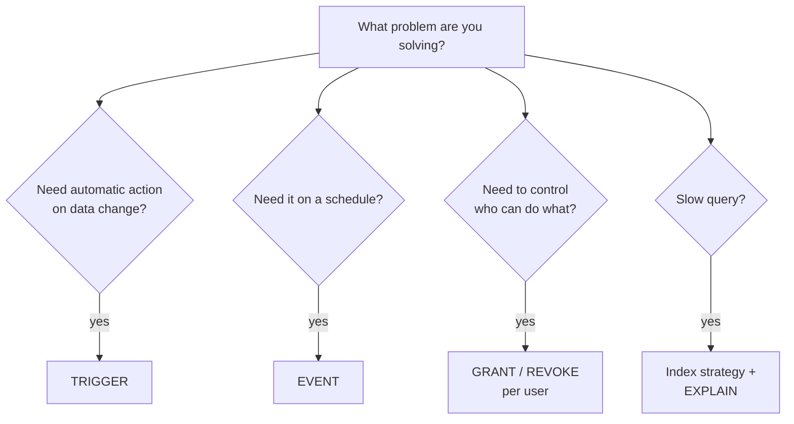

# Advanced 8 — Triggers, Events, Privileges, Indexes

## Lectures covered
- Database Triggers
- Database Events
- User Accounts and Privileges
- Database Indexes

---

## In one sentence
**Triggers** are SQL that auto-runs on inserts/updates/deletes, **events** are SQL that runs on a schedule, **privileges** decide who can do what, and **indexes** are the speed knob that makes queries fast.

## Real-world analogy
- A **trigger** is a motion sensor: someone walks past (a row is inserted), the light flips on automatically.
- An **event** is a Roomba on a timer: every night at 2am it cleans the floor, no human involved.
- **Privileges** are house keys — read-only spare key for the cleaner, master key for the owner.
- An **index** is the alphabetical tabs on a giant address book: instead of scanning every page, you flip straight to "K" and find Kim in seconds.

## The intuition (plain English)
The first three are about **automation and security**: triggers keep audit logs and summary tables fresh; events run nightly cleanups; privileges keep junior analysts from accidentally dropping a production table. Indexes are about **speed**: without them MySQL scans every row to answer `WHERE customer_id = 42`; with one, it jumps straight to the right rows. Indexes cost you on writes (every insert must update the index) and on disk space, so you add them deliberately to columns that show up in `WHERE`, `JOIN`, and `ORDER BY`.

## Mini worked example — the speed difference an index makes

A `movies` table with 5 sample rows (imagine 5 million in production):

```
movie_id | title         | industry  | release_year | imdb_rating
---------+---------------+-----------+--------------+------------
       1 | Sholay        | Bollywood |         1975 |         8.5
       2 | The Godfather | Hollywood |         1972 |         9.2
       3 | Inception     | Hollywood |         2010 |         8.8
       4 | 3 Idiots      | Bollywood |         2009 |         8.4
       5 | Dangal        | Bollywood |         2016 |         8.3
```

Query without an index — full table scan:

```sql
EXPLAIN SELECT * FROM movies WHERE industry = "Bollywood";
-- type: ALL  rows: ~5,000,000  (scan everything)
```

Add an index, re-run:

```sql
CREATE INDEX idx_movies_industry ON movies(industry);

EXPLAIN SELECT * FROM movies WHERE industry = "Bollywood";
-- type: ref  rows: ~2,500  (jumps via index)
```

Same query, milliseconds instead of seconds.

## At-a-glance — when to use which feature



## Why this matters
- Triggers and events power "always-fresh" summary tables — the kind dashboards depend on.
- Privileges keep multi-team databases safe; without them, every analyst is one typo from a disaster.
- Indexes are the difference between a query that runs in 3ms and one that times out — interview-required knowledge.

---

## 1. Triggers — code that runs automatically on DML

A **trigger** fires on `INSERT` / `UPDATE` / `DELETE`, before or after the operation.

```sql
DELIMITER $$

CREATE TRIGGER orders_audit_after_update
AFTER UPDATE ON orders
FOR EACH ROW
BEGIN
    INSERT INTO orders_audit (order_id, old_status, new_status, changed_at)
    VALUES (NEW.id, OLD.status, NEW.status, NOW());
END$$

DELIMITER ;
```

### `OLD` and `NEW`
- `NEW.col` — the new (post-change) value (available in INSERT, UPDATE)
- `OLD.col` — the previous value (available in UPDATE, DELETE)

### Common uses
- Auditing — log every change
- Maintain summary tables — refresh aggregates on insert
- Enforce business rules — reject `NEW.balance < 0`
- Cascade-style updates that FK can't express

### When *not* to use triggers
- Complex business logic — gets invisible and hard to debug
- Rules better expressed in app code
- Anything that fans out across many tables (cascading triggers are notoriously hard to reason about)

> Modern teams use triggers sparingly. Most workflows are clearer in app code or a CDC pipeline.

### Listing / dropping
```sql
SHOW TRIGGERS;
DROP TRIGGER orders_audit_after_update;
```

---

## 2. Events — scheduled SQL

A **scheduled event** runs SQL on a recurring schedule. Like cron, but inside MySQL.

### Enable the event scheduler
```sql
SET GLOBAL event_scheduler = ON;
```

### Create
```sql
DELIMITER $$

CREATE EVENT cleanup_old_logs
ON SCHEDULE EVERY 1 DAY
STARTS "2025-01-01 02:00:00"
DO
BEGIN
    DELETE FROM logs WHERE created_at < DATE_SUB(NOW(), INTERVAL 90 DAY);
END$$

DELIMITER ;
```

### One-time event
```sql
CREATE EVENT one_off_archive
ON SCHEDULE AT "2025-12-31 23:59:00"
DO
INSERT INTO archive SELECT * FROM events WHERE year = 2025;
```

### Use cases
- Refresh manual materialized-view tables nightly
- Archive old rows
- Roll up daily aggregates
- Cleanup soft-deleted rows after retention period

### Listing
```sql
SHOW EVENTS;
DROP EVENT cleanup_old_logs;
```

---

## 3. User accounts and privileges

### Create a user
```sql
CREATE USER 'analyst'@'%' IDENTIFIED BY 'a-strong-password';
```

The `'analyst'@'%'` form means: user `analyst` connecting from *any host*. Restrict to `'localhost'` for app-server users that aren't supposed to come from elsewhere.

### Grant privileges
```sql
-- read-only on a single DB
GRANT SELECT ON moviesdb.* TO 'analyst'@'%';

-- full on a single table
GRANT ALL PRIVILEGES ON moviesdb.movies TO 'analyst'@'%';

-- everything (admin) — be careful
GRANT ALL PRIVILEGES ON *.* TO 'admin'@'localhost' WITH GRANT OPTION;
```

### Common privileges
- `SELECT`, `INSERT`, `UPDATE`, `DELETE` — DML
- `CREATE`, `DROP`, `ALTER`, `INDEX` — DDL
- `EXECUTE` — call a procedure / function
- `REFERENCES` — create FKs
- `ALL PRIVILEGES` — everything

### Revoke / drop
```sql
REVOKE INSERT ON moviesdb.* FROM 'analyst'@'%';
DROP USER 'analyst'@'%';
```

### See who has what
```sql
SHOW GRANTS FOR 'analyst'@'%';
```

### Best practices
- One user per app / role — never share credentials
- Least privilege — don't grant ALL by default
- Strong passwords + force expire
- For analysts: a dedicated read-only user
- For backups: a user with just `SELECT, LOCK TABLES, EVENT, TRIGGER`
- App users: only the DBs / tables they need

---

## 4. Indexes — the speed knob

An **index** is a separate, sorted data structure that lets MySQL find rows by a column value in O(log n) instead of scanning the whole table.

### Create
```sql
CREATE INDEX idx_movies_industry ON movies(industry);
CREATE INDEX idx_movies_industry_year ON movies(industry, release_year);
```

PKs are automatically indexed. UNIQUE columns are too. FKs get auto-indexed in MySQL.

### Drop
```sql
DROP INDEX idx_movies_industry ON movies;
```

### See existing indexes
```sql
SHOW INDEXES FROM movies;
```

### Composite (multi-column) indexes
```sql
CREATE INDEX idx_industry_year ON movies(industry, release_year);
```

A composite index on `(A, B)` helps queries that filter on:
- `WHERE A = ?`
- `WHERE A = ? AND B = ?`

It does **not** help queries that filter only on `B` — index columns are used **left-to-right** ("leftmost prefix rule").

### Covering index
If all columns a query reads are in the index, MySQL can answer entirely from the index without touching the table. Add columns selectively to make this happen:
```sql
CREATE INDEX idx_movies_industry_year_title ON movies(industry, release_year, title);
-- now: SELECT title FROM movies WHERE industry=? AND release_year=? is index-only.
```

### Index types
- **B-tree** — default; range + equality queries
- **Hash** — equality only; rare in MySQL (in-memory tables)
- **Full-text** — for `MATCH(col) AGAINST("search term")`
- **Spatial** — for GEOMETRY columns

### When indexes hurt
- Each index slows down `INSERT` / `UPDATE` / `DELETE` (must update the index too)
- Indexes use disk space
- Bad indexes (rarely-used composites) waste both

### EXPLAIN — see what the planner does
```sql
EXPLAIN SELECT * FROM movies WHERE industry = "Bollywood";
```

Output tells you:
- which index was used (if any)
- approximate rows scanned
- whether a filesort happened
- whether a temp table was needed

> **Always EXPLAIN a slow query before guessing.** The planner often surprises.

### Patterns where indexes help
- Equality on a high-cardinality column (`WHERE user_id = 42`)
- Range on a high-cardinality column (`WHERE created_at > "2025-01-01"`)
- Order-by + limit (`ORDER BY rating DESC LIMIT 10`)
- Joins on the join column

### Patterns where indexes don't help
- Functions on the column (`WHERE YEAR(date) = 2025`) — wraps the column, index can't be used. Rewrite as `WHERE date >= "2025-01-01" AND date < "2026-01-01"`.
- Leading `%` in `LIKE` (`LIKE '%foo'`) — index doesn't anchor
- Low-cardinality columns (`WHERE gender = "F"`) — half the table; full scan often faster
- Implicit type conversion — `WHERE id = '5'` when `id` is INT can disable the index

---

## 5. Common pitfalls

| Mistake | Effect | Fix |
|---|---|---|
| Trigger that calls another trigger | cascading, hard to debug | keep triggers single-purpose |
| Event scheduler off | scheduled events silently never run | `SET GLOBAL event_scheduler = ON;` |
| Granting `ALL PRIVILEGES *.*` to app user | security disaster | least privilege per DB/table |
| Many redundant indexes | bloats writes | review with `SHOW INDEXES` periodically |
| Functional WHERE blocking index | slow queries | rewrite to range/equality on the raw column |
| Trusting `EXPLAIN ANALYZE` row counts blindly | estimates, not real | run `EXPLAIN ANALYZE` (MySQL 8.0+) for actuals |

## Self-check

- [ ] Difference between trigger and event?
- [ ] What's `OLD.col` vs `NEW.col` inside a trigger?
- [ ] How do I create a read-only analyst user for one database?
- [ ] What's the leftmost-prefix rule for composite indexes?
- [ ] Why can `WHERE YEAR(date) = 2025` disable an index, and how do I fix it?
- [ ] When is a covering index worth creating?
- [ ] What does `EXPLAIN` tell you, and when do you reach for it?

---

## Glossary

| Term | Plain meaning |
|------|---------------|
| **Trigger** | SQL that auto-runs before or after INSERT, UPDATE, or DELETE on a table |
| **NEW (in trigger)** | The post-change row values (available in INSERT, UPDATE) |
| **OLD (in trigger)** | The pre-change row values (available in UPDATE, DELETE) |
| **BEFORE / AFTER trigger** | Whether the trigger runs before or after the DML it watches |
| **FOR EACH ROW** | Trigger fires once per affected row |
| **Cascading trigger** | A trigger that causes another trigger to fire — usually a maintenance nightmare |
| **Event** | A scheduled SQL block that runs at a time or on a recurrence |
| **event_scheduler** | The MySQL global setting that turns the event runner on |
| **ON SCHEDULE** | Clause that defines when an event runs (every N units, or at a date) |
| **GRANT** | Give a user a privilege |
| **REVOKE** | Take a privilege away |
| **Privilege** | A specific permission: SELECT, INSERT, UPDATE, EXECUTE, ALL PRIVILEGES, etc. |
| **Least privilege** | Grant only the privileges actually needed — never more |
| **Read-only user** | An analyst account with only SELECT on the relevant DBs |
| **Index** | A sorted lookup structure that lets MySQL find rows by a column value in O(log n) |
| **B-tree index** | The default index type — handles equality and range queries |
| **Hash index** | Equality-only, used in MEMORY tables — rare in MySQL |
| **Full-text index** | Lets you search text with `MATCH ... AGAINST` |
| **Spatial index** | Indexes GEOMETRY/POINT columns for location queries |
| **Composite index** | An index over multiple columns: `(industry, release_year)` |
| **Leftmost-prefix rule** | A composite index helps queries that filter on its leading columns left-to-right |
| **Covering index** | Index that includes every column the query needs — answers entirely from the index |
| **EXPLAIN** | Shows the planner's chosen strategy: which index, estimated rows, joins, sorts |
| **EXPLAIN ANALYZE** | Runs the query and returns actual timings (MySQL 8.0+) |
| **Cardinality** | How many distinct values a column has — high cardinality benefits more from indexes |
| **Filesort** | A sort step that doesn't use an index — slow on big data |
| **Index selectivity** | The fraction of rows an indexed value matches — the lower, the better |
| **Implicit type conversion** | Comparing `id = '5'` when `id` is INT — disables the index |
| **Functional WHERE** | `WHERE YEAR(date) = 2025` — wraps the column, blocks index use. Rewrite as a range |

## Further reading
- Project applications: [09-projects.md](09-projects.md) — Project B uses triggers + indexes for performance
- Recap on DML: [04-dml-statements.md](04-dml-statements.md) — triggers fire on these
- Pandas indexing differs but the cost-of-scan idea is the same: see [../../01-python/01-basics/07-eda-pandas-matplotlib-seaborn.md](../../01-python/01-basics/07-eda-pandas-matplotlib-seaborn.md)
- ML application: [../../06-machine-learning/01-foundations/05-preprocessing-encoding.md](../../06-machine-learning/01-foundations/05-preprocessing-encoding.md) — feature stores need fast lookups, indexes are the foundation
