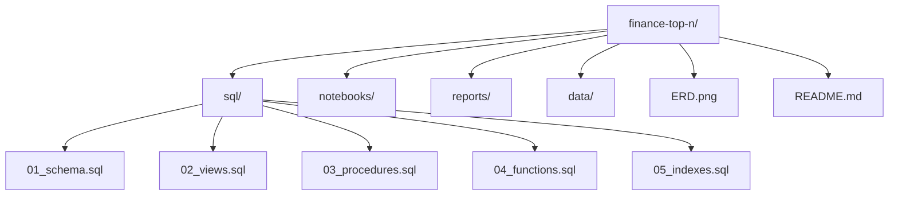

# Advanced 9 — SQL Projects

---

## In one sentence
You build two portfolio-worthy projects on the AtliQ Hardware dataset — Project A wires up views/procedures/UDFs for finance reporting, Project B uses helper tables, triggers, and indexes to make a supply-chain dashboard fast.

## Real-world analogy
These are like the cooking-school finals: you've learned every technique, now you cook a real dish. Project A is "build the analyst toolkit a finance team uses every Monday morning." Project B is "make the supply-chain dashboard load in under a second when the manager opens it."

## The intuition (plain English)
By this point you know joins, CTEs, window functions, types, normalization, DML, views, procedures, UDFs, triggers, events, and indexes. The projects force you to **wire all of those together** on a real-shaped dataset. You won't invent new SQL — you'll combine what you know to deliver a small data product. Both projects come with a recommended deliverable list (views + procedures + UDFs + ERD + README). That's the same shape recruiters look for in a portfolio repo.

## Mini worked example — what one deliverable looks like

A snippet from Project A's "top customers per market" procedure, applied to a 5-row sample:

```
fact_sales_monthly                            dim_customer
date       | customer_id | market | gross   id  | name           | discount_pct
-----------+-------------+--------+------   ----+----------------+--------------
2025-01-15 |          12 | India  | 1000     12 | Reliance Retail|         5.00
2025-02-10 |          12 | India  | 2000     14 | Croma Stores   |         3.00
2025-01-22 |          14 | India  |  800     21 | BestBuy LATAM  |         2.00
2025-03-05 |          21 | LATAM  |  600
2025-03-08 |          21 | LATAM  |  400
```

Calling the top-2 procedure for 2025:

```sql
CALL top_customers_per_market(2, 2025);
```

Returns the leaderboard per market, computed via window-function ranking on net sales:

```
market | customer_id | total_net_sales | rk
-------+-------------+-----------------+---
India  |          12 |         2850.00 |  1
India  |          14 |          776.00 |  2
LATAM  |          21 |          980.00 |  1
```

That's a deliverable. Six similar deliverables = a project.

## At-a-glance — repo structure for either project



## Why this matters
- A finished project on GitHub beats any certificate — recruiters look for the README + ERD + sample CALLs.
- Project A maps cleanly to "data analyst" roles in CPG / retail / finance.
- Project B maps cleanly to "supply chain analyst" and "BI engineer" roles.
- Both projects are the natural setup for the next module: feeding clean SQL outputs into [../../06-machine-learning/01-foundations/05-preprocessing-encoding.md](../../06-machine-learning/01-foundations/05-preprocessing-encoding.md) for predictive models.

---

## Two projects in this module

1. **Finance & Top-N Insights** — UDFs, stored procedures, views in a CPG / consumer-goods finance context
2. **Supply Chain Analytics & Model Optimisation** — helper tables, triggers, query tuning

Both come from Codebasics' **AtliQ Hardware** dataset (or a comparable CPG schema).

---

## Project A — Finance & Top-N Insights

### Domain
A consumer goods company sells through multiple channels (retailers, e-commerce, direct). They need:
- Net sales and gross margin per market and per quarter
- Top-N customers / products per market
- Year-over-year growth metrics
- Automated, refreshed reports

### Skills demonstrated
- Building a star-shaped analytical schema (or working on AtliQ's existing one)
- Encapsulating "net sales" formula in a UDF
- Stored procedures for parameterized reports
- Views as the analyst-facing layer
- Window functions for top-N + YoY

### Sample artifacts you'll build

#### A UDF for "net sales"
```sql
DELIMITER $$
CREATE FUNCTION net_sales(gross DECIMAL(12,2), discount_pct DECIMAL(4,2))
RETURNS DECIMAL(12,2)
DETERMINISTIC
NO SQL
BEGIN
    RETURN gross * (1 - discount_pct / 100);
END$$
DELIMITER ;
```

#### A view of clean transactions
```sql
CREATE OR REPLACE VIEW v_sales_clean AS
SELECT s.date, s.product_id, s.customer_id, s.market,
       net_sales(s.gross_price * s.quantity, c.discount_pct) AS net_sales
FROM fact_sales_monthly s
JOIN dim_customer c ON s.customer_id = c.customer_id;
```

#### A procedure for top-N customers per market
```sql
DELIMITER $$
CREATE PROCEDURE top_customers_per_market(IN n INT, IN year_in INT)
BEGIN
    WITH ranked AS (
        SELECT market, customer_id,
               SUM(net_sales) AS total,
               ROW_NUMBER() OVER (PARTITION BY market ORDER BY SUM(net_sales) DESC) AS rk
        FROM v_sales_clean
        WHERE YEAR(date) = year_in
        GROUP BY market, customer_id
    )
    SELECT * FROM ranked WHERE rk <= n;
END$$
DELIMITER ;

CALL top_customers_per_market(5, 2025);
```

#### A YoY growth view
```sql
CREATE VIEW v_yoy_market AS
SELECT market,
       YEAR(date) AS yr,
       SUM(net_sales) AS total_net_sales,
       LAG(SUM(net_sales)) OVER (PARTITION BY market ORDER BY YEAR(date)) AS prev,
       (SUM(net_sales) - LAG(SUM(net_sales)) OVER (PARTITION BY market ORDER BY YEAR(date)))
            / LAG(SUM(net_sales)) OVER (PARTITION BY market ORDER BY YEAR(date)) * 100 AS yoy_pct
FROM v_sales_clean
GROUP BY market, YEAR(date);
```

### Deliverables
- 4–6 views
- 2–4 stored procedures
- 1–2 UDFs
- A `README.md` documenting each (purpose, parameters, sample query)
- Sample output screenshots
- ERD of the schema

This is a strong "data analyst" portfolio piece. Recruiters in retail/CPG read it.

---

## Project B — Supply Chain Analytics & Optimisation

### Domain
The same company tracks **forecast accuracy** — how well demand was predicted vs. actual sales. They need:
- Forecast Error % per product per month
- Net Error and Absolute Error metrics
- Aggregations across different hierarchies (market, segment, region)
- Helper tables to speed up dashboards
- Triggers to keep them fresh
- Query plans tuned for sub-second response

### Skills demonstrated
- Helper / aggregation tables
- Triggers (or scheduled events) for refresh
- Index strategy + EXPLAIN-based tuning
- Window functions for moving averages of error
- Performance comparisons (before/after benchmarks)

### Sample artifacts

#### Forecast error calculation
```sql
SELECT customer_id, product_id, date,
       sold_quantity, forecast_quantity,
       forecast_quantity - sold_quantity AS net_error,
       ABS(forecast_quantity - sold_quantity) AS abs_error,
       ABS(forecast_quantity - sold_quantity) / NULLIF(sold_quantity, 0) * 100 AS abs_error_pct
FROM fact_act_est;
```

#### A helper table for fast dashboard reads
```sql
CREATE TABLE helper_forecast_accuracy_monthly AS
SELECT YEAR(date) AS yr, MONTH(date) AS mn, market,
       SUM(forecast_quantity) AS forecast_units,
       SUM(sold_quantity) AS sold_units,
       SUM(ABS(forecast_quantity - sold_quantity)) AS abs_error_units
FROM fact_act_est
GROUP BY YEAR(date), MONTH(date), market;

CREATE INDEX idx_yr_mn_market ON helper_forecast_accuracy_monthly(yr, mn, market);
```

#### Trigger to refresh on insert
(In practice you'd batch this — but as a teaching pattern):
```sql
DELIMITER $$
CREATE TRIGGER refresh_helper_after_insert
AFTER INSERT ON fact_act_est
FOR EACH ROW
BEGIN
    -- naive: re-aggregate the (year, month, market) slice
    DELETE FROM helper_forecast_accuracy_monthly
    WHERE yr = YEAR(NEW.date) AND mn = MONTH(NEW.date) AND market = NEW.market;

    INSERT INTO helper_forecast_accuracy_monthly
    SELECT YEAR(date), MONTH(date), market,
           SUM(forecast_quantity), SUM(sold_quantity),
           SUM(ABS(forecast_quantity - sold_quantity))
    FROM fact_act_est
    WHERE YEAR(date) = YEAR(NEW.date) AND MONTH(date) = MONTH(NEW.date) AND market = NEW.market
    GROUP BY YEAR(date), MONTH(date), market;
END$$
DELIMITER ;
```

#### Query optimisation steps
1. Run `EXPLAIN <query>` — find the bottleneck
2. Add an index on the highest-cardinality filter column
3. Re-run; compare row scans
4. Move repeated subqueries into CTEs / views
5. Pre-aggregate hot dashboards into helper tables (with refresh strategy)
6. Document the before/after timings in your README

### Deliverables
- Helper tables + triggers / events
- Indexes added (with rationale)
- `EXPLAIN` outputs before / after, side by side
- Stored procedure for the main forecast accuracy report
- A `performance.md` documenting the optimization journey

Recruiters in **supply chain analytics** specifically value this kind of project — it's exactly what working analysts do.

---

## Repo template (for either project)

```
finance-top-n/
├── data/
│   └── seed.sql                        # schema + sample data
├── sql/
│   ├── 01_schema.sql
│   ├── 02_views.sql
│   ├── 03_procedures.sql
│   ├── 04_functions.sql
│   └── 05_indexes.sql
├── notebooks/                          # optional pandas verification
│   └── verify.ipynb
├── reports/
│   └── insights.md                     # business answers from running the procedures
├── README.md
└── ERD.png
```

---

## Self-check

- [ ] Project A: have I defined at least one UDF + 2 procedures + 3 views?
- [ ] Project A: do my views encapsulate the "net sales" formula so analysts don't reinvent it?
- [ ] Project B: do I have a helper table and a refresh strategy?
- [ ] Project B: did I document an EXPLAIN before-and-after?
- [ ] Both: do my READMEs include sample CALL / SELECT statements with output?
- [ ] Both: posted on LinkedIn with screenshot and 3-bullet "what I learned"?
- [ ] Both: ERD image included in the repo?

---

## Glossary

| Term | Plain meaning |
|------|---------------|
| **AtliQ Hardware** | Codebasics' fictional consumer-goods company — the dataset both projects use |
| **CPG** | Consumer Packaged Goods — the industry sector AtliQ models |
| **Net sales** | Gross sales minus discounts: `gross * (1 - pct/100)` |
| **Gross margin** | Net sales minus cost of goods, expressed as a percentage |
| **Top-N per group** | "Top 5 customers per market" — uses window-function ranking inside a CTE |
| **YoY (Year over Year)** | This year's metric vs last year's, often via `LAG()` window function |
| **MoM (Month over Month)** | Same idea, monthly granularity |
| **Forecast accuracy** | How well predicted demand matched actual sales |
| **Net error** | `forecast - actual` (signed) — direction of bias |
| **Absolute error** | `|forecast - actual|` — magnitude regardless of direction |
| **Absolute error %** | Absolute error divided by actual, as a percentage |
| **Helper table** | A pre-computed summary table used to speed up dashboard reads |
| **Refresh strategy** | The plan for keeping a helper table in sync (trigger, scheduled event, or batch job) |
| **EXPLAIN before/after** | Documenting the query plan before tuning and after — proves the index helped |
| **Star schema** | The dim/fact layout these projects use (see [05-data-warehouse-etl.md](05-data-warehouse-etl.md)) |
| **fact_sales_monthly** | Sample fact table used in Project A — one row per (customer, product, month) |
| **fact_act_est** | Sample fact table used in Project B — actual + estimated demand by row |
| **dim_customer / dim_product** | Dimension tables in AtliQ's star schema |
| **UDF (User-Defined Function)** | A reusable formula like `net_sales(...)` |
| **Stored procedure** | Multi-step SQL routine called via `CALL` |
| **Surrogate key (sk)** | An artificial primary key per dimension version (used for SCD Type 2) |
| **Snapshot column** | Column that records a value at the time of the fact event (e.g., price snapshot) |
| **Index strategy** | Which columns get indexed, and why — documented with EXPLAIN evidence |
| **Performance.md** | A short markdown file documenting before/after query timings |
| **data_dictionary.md** | A file describing every column in every fact/dim table — the lightest catalog |
| **LinkedIn post** | The recommended way to publicize your finished project for recruiters |

## Further reading
- Window-function patterns these projects rely on: [07-window-functions.md](07-window-functions.md)
- Procedures and views: [06-functions-procedures-views.md](06-functions-procedures-views.md)
- Performance tools: [08-triggers-events-indexes.md](08-triggers-events-indexes.md)
- Schema design behind the data: [05-data-warehouse-etl.md](05-data-warehouse-etl.md) and [03-keys-erd-normalization.md](03-keys-erd-normalization.md)
- Where the data goes next: [../../06-machine-learning/01-foundations/05-preprocessing-encoding.md](../../06-machine-learning/01-foundations/05-preprocessing-encoding.md) — feeding ML models from these views
- Style guide: [../../../BEGINNER-STYLE-GUIDE.md](../../../BEGINNER-STYLE-GUIDE.md)
