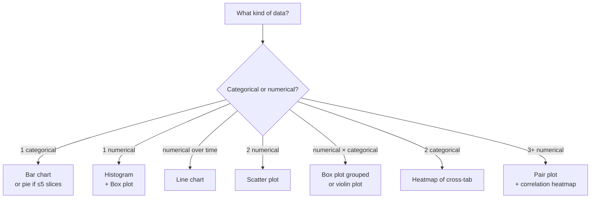

# Section 2 — Data & Visualization Basics

## Lectures covered
- Types of Data
- Pie Chart and Bar Chart · Quiz
- Histograms and Line Chart · Quiz
- Scatter and Bubble Plot · Quiz
- Univariate vs. Bivariate vs. Multivariate Analysis
- Chapter Summary

---

## In one sentence
Charts are how the human eye does statistics — picking the right chart type for your data type is half the battle of any analysis.

## Real-world analogy
Imagine you walk into a doctor's office. They could either show you a wall of numbers or a single chart of your blood pressure over time. Same data — but the chart is the only one that makes you go *"oh, it's been climbing since March."* Visualization compresses thousands of rows into something your brain can process in 2 seconds.

## The intuition (plain English)
Two ideas drive every chart choice:

1. **What type of data do I have?**
   - **Categorical** (labels): "city", "tier", "color" → bar charts, pie (rarely)
   - **Numerical** (numbers): "price", "age", "latency" → histograms, box plots, scatter
2. **How many variables am I looking at at once?**
   - **One** → just the distribution (histogram, bar chart)
   - **Two** → the relationship (scatter, grouped box)
   - **Three+** → faceted plots, pair plots, heatmaps

Get those two right and 90% of plotting decisions become automatic.

## Mini worked example — same data, three chart choices

You have monthly sales for 12 months: `[120, 135, 150, 145, 160, 175, 200, 210, 195, 180, 165, 150]`.

| Chart | What it tells you | When to use |
|-------|-------------------|-------------|
| **Bar chart** | Which months had highest sales | Comparing 12 specific values |
| **Line chart** | Sales went up summer, dipped in fall | Showing **trend over time** |
| **Histogram** | Most months had sales in 150–180 range | Showing the *distribution* of values |

The line chart wins here because the data is **time-ordered**. Picking the bar chart isn't *wrong* but loses the trend story.

## At-a-glance — pick the right chart



## What "reading a chart well" means

Looking at a histogram — you should see four things in two seconds:
- Where's the **center**? (mean / median)
- How **spread out**? (skinny vs wide)
- Is it **symmetric** or **skewed**?
- Are there **outliers** or **multiple peaks**?

That's the visual version of central tendency, dispersion, skewness, and outliers — which the next files formalize with numbers.

## Why this matters
Every later chapter starts with "look at the data first." Skipping EDA is the #1 cause of bad ML models, broken A/B tests, and dashboards no one trusts. The plotting skills here are what makes that possible.

---

## 1. Types of data

### Categorical (qualitative)
- **Nominal** — categories with no order: gender, country, blood type
- **Ordinal** — categories *with* order: T-shirt size (S, M, L), star rating, education level

### Numerical (quantitative)
- **Discrete** — countable: number of children, click count
- **Continuous** — measurable: height, weight, temperature

### Why this matters
Type drives which chart, which summary statistic, which test:
- Mean is meaningless on nominal data
- Bar chart is for categorical; histogram for continuous
- t-test for continuous; chi-squared for categorical

---

## 2. Univariate vs bivariate vs multivariate

| | What | Examples |
|---|---|---|
| **Univariate** | one variable | "what's the distribution of customer age?" |
| **Bivariate** | two variables | "is there a relationship between age and spend?" |
| **Multivariate** | 3+ variables | "how do age + region + tier predict churn?" |

The full EDA workflow climbs this ladder: describe each variable → relate pairs → model joint behavior.

---

## 3. The visualization toolkit

### Univariate — one variable

#### For categorical
- **Bar chart** — frequency per category. Always preferred over pie when comparing values.
- **Pie chart** — share of whole. Use only with ≤5 slices, and even then prefer bar.

```python
import seaborn as sns
sns.countplot(data=df, x="city")
```

#### For continuous
- **Histogram** — distribution shape. Tune `bins` (10–50 typical).
- **Box plot** — median, IQR, outliers. Compare groups side-by-side.
- **KDE / density plot** — smoothed histogram.

```python
sns.histplot(df["age"], bins=30, kde=True)
sns.boxplot(data=df, x="city", y="age")
```

### Bivariate — two variables

#### Continuous × Continuous
- **Scatter plot** — relationship, outliers
- **Bubble plot** — scatter with a third variable as point size
- **Hexbin / 2D density** — when scatter is too dense

```python
sns.scatterplot(data=df, x="age", y="income")
```

#### Continuous × Categorical
- **Box plot** (continuous on Y, category on X)
- **Violin plot** — box + KDE
- **Strip / swarm plot** — for small samples

#### Categorical × Categorical
- **Stacked / grouped bar**
- **Heatmap of cross-tab**

```python
ct = pd.crosstab(df["city"], df["tier"])
sns.heatmap(ct, annot=True, fmt="d")
```

#### Time on X-axis
- **Line chart** — trend over time

```python
sns.lineplot(data=df, x="date", y="revenue")
```

### Multivariate — three or more

- **Pair plot** — scatter matrix of all numeric vars (great quick scan)
- **Correlation heatmap** — pairwise correlations
- **Faceted plots** — small multiples by a category

```python
sns.pairplot(df, hue="tier")
sns.heatmap(df.corr(numeric_only=True), annot=True, cmap="coolwarm")

g = sns.FacetGrid(df, col="city", height=4)
g.map(sns.scatterplot, "age", "income")
```

---

## 4. Reading a histogram — the four shapes

```
   Symmetric / bell             Right-skewed              Left-skewed                   Bimodal
       ▁▂▄▆▆█▆▆▄▂▁                 ████▆▄▂▁                       ▁▂▄▆████             ▆██▂▁▁▂██▆
        Normal-ish               long right tail              long left tail        two peaks
```

| Shape | Mean vs median | Common cause |
|---|---|---|
| Symmetric | mean ≈ median | "well-behaved" data |
| Right-skewed | mean > median | salaries, revenues — bounded below by 0, no upper bound |
| Left-skewed | mean < median | exam scores capped at 100 |
| Bimodal | two peaks | a hidden subgroup (e.g., two clusters) |

### Why this matters for ML
- Heavy skew → log-transform feature
- Bimodal → maybe split into two segments / add a categorical flag
- Outliers visible in box plot → decide treatment before modeling

---

## 5. Reading a scatter — what to look for

- **Direction**: positive (↗) vs negative (↘)
- **Strength**: tight cloud vs scattered
- **Form**: linear vs curved
- **Outliers**: isolated points
- **Subgroup structure**: separate clouds (color by a category to see)

> Correlation captures only **linear** relationships. A perfect U-shape has correlation ≈ 0 but is highly related. Always *look* at a scatter before trusting a correlation number.

---

## 6. Pie chart — the only honest use case

A pie chart works only when:
- You're showing **shares of a whole** that sum to 100%
- There are **≤5 slices**
- Slices are **noticeably different in size**

In every other case → bar chart.

> "Three quarters were positive" works as a pie. "Top 10 countries by GDP" doesn't.

---

## 7. Plot-anti-patterns

| Bad | Why | Fix |
|---|---|---|
| 3D pie chart | distorts perceived sizes | flat pie, or bar chart |
| Y axis truncated to exaggerate differences | misleading | start Y at 0 (for comparisons of magnitudes) |
| Dual y-axes | visually implies a relationship | two separate plots |
| Rainbow colormap | non-perceptually uniform | `viridis`, `cividis`, `coolwarm` |
| Pie chart with 12 slices | cognitive overload | sorted bar chart |
| Stacked bar comparing tiny middle slices | hard to read | grouped bar or 100% stacked |

---

## 8. Concrete EDA — when starting any new dataset

```python
import pandas as pd, seaborn as sns

df = pd.read_csv("data.csv")

# 1. Shape, types
print(df.shape, df.dtypes)
df.describe(include="all").T

# 2. Missingness
df.isna().sum() / len(df) * 100

# 3. Univariate — every column
for col in df.select_dtypes(include="number"):
    sns.histplot(df[col], kde=True); plt.show()
for col in df.select_dtypes(include="object"):
    sns.countplot(data=df, x=col); plt.xticks(rotation=45); plt.show()

# 4. Bivariate — pairwise
sns.pairplot(df, diag_kind="kde")
sns.heatmap(df.corr(numeric_only=True), annot=True, cmap="coolwarm")
```

This EDA pass is the prerequisite to *any* downstream analysis or model.

---

## 9. Common pitfalls

| Mistake | Effect | Fix |
|---|---|---|
| Using a bar chart for time series | breaks trend perception | use line chart |
| 30-bin histogram on 50 data points | jagged noise | 5–10 bins |
| Reading correlation as causation | classic mistake | "correlation ≠ causation" — always |
| Not labeling axes | unreadable | always label + title |
| One scatter plot for 5 subgroups | masks subgroup structure | color by group, or facet |

## Self-check

- [ ] Difference between nominal and ordinal data?
- [ ] When should I pick a histogram over a bar chart?
- [ ] What does a right-skewed distribution mean for the mean and median?
- [ ] Name 3 things to look for in a scatter plot.
- [ ] When is a pie chart appropriate?
- [ ] Difference between univariate and bivariate analysis?
- [ ] What's a faceted plot, and when use it?

---

## Glossary

| Term | Plain meaning |
|------|---------------|
| **Categorical data** | Labels with no inherent number meaning (city, color, tier) |
| **Nominal** | Categorical with no order (gender, country) |
| **Ordinal** | Categorical with order but no fixed gaps (T-shirt size: S<M<L) |
| **Numerical data** | Actual numbers you can do math on |
| **Discrete** | Numerical and countable (number of children, click count) |
| **Continuous** | Numerical and measurable on a smooth scale (height, latency) |
| **Univariate** | Looking at one variable at a time |
| **Bivariate** | Looking at two variables and their relationship |
| **Multivariate** | Three or more variables together |
| **Bar chart** | Categorical comparison — one bar per category |
| **Histogram** | Numerical distribution — bars represent ranges (bins) of values |
| **Bin** | A range of values lumped together as one bar in a histogram |
| **Box plot** | Median, IQR, whiskers, outlier markers — robust distribution summary |
| **Whiskers** | The lines extending out of the box, usually to 1.5 × IQR |
| **KDE (Kernel Density Estimate)** | A smoothed histogram showing the underlying density curve |
| **Scatter plot** | Each row is a dot positioned by two numeric columns |
| **Bubble plot** | Scatter plot where dot size encodes a third variable |
| **Hexbin / 2D density** | Used when scatter has too many overlapping dots |
| **Violin plot** | Box plot crossed with KDE — shows full distribution shape per group |
| **Pair plot** | Grid of scatter plots for every pair of numeric variables |
| **Heatmap** | Color-coded grid — used for correlation matrices and cross-tabs |
| **Cross-tab** | A frequency table counting joint occurrences of two categorical variables |
| **Faceted plot / small multiples** | Same chart repeated across categories (e.g., one scatter per city) |
| **EDA (Exploratory Data Analysis)** | The "look first, model later" phase — descriptive stats + visualization |
| **Anti-pattern** | A common mistake that looks reasonable but distorts the message (e.g., 3D pie chart) |

## Further reading
- Next: [02-central-tendency-dispersion.md](02-central-tendency-dispersion.md) — the *numbers* behind the shapes you see
- Then: [03-probability-theory.md](03-probability-theory.md) and [04-distributions.md](04-distributions.md)
- Practical EDA in code: [../../01-python/01-basics/07-eda-pandas-matplotlib-seaborn.md](../../01-python/01-basics/07-eda-pandas-matplotlib-seaborn.md)
