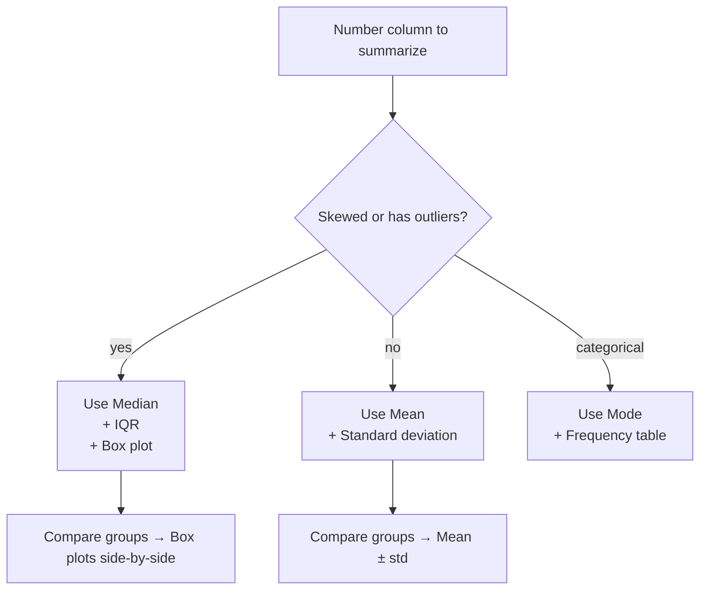

# Section 3 — Measures of Central Tendency and Dispersion

## Lectures covered
- Descriptive vs. Inferential Statistics
- Measures of Central Tendency: Mean, Median, Mode · Percentile · Shoe Sales analysis
- Measures of Dispersion: Range, IQR · Box plot · Outlier treatment using IQR + Box plot
- Measures of Dispersion: Variance, Std Dev · Stock Returns volatility analysis
- Correlation · Correlation vs Causation
- Quizzes & Exercises · Chapter Summary

---

## In one sentence
**Central tendency** is "where's the middle of my data?" and **dispersion** is "how spread out is it?" — together they're the smallest summary that tells you anything useful.

## Real-world analogy
Imagine two basketball teams that both average 80 points per game. Team A always scores between 78 and 82. Team B swings between 50 and 110. Their **central tendency** (average) is identical, but their **dispersion** (consistency) is wildly different. If you bet on a team's *minimum* score, you'd care way more about Team A. That difference — same middle, different spread — is what this chapter teaches you to measure.

## The intuition (plain English)
You'll always need to answer two questions about any number column:

1. **Where's the typical value?** → Mean, Median, Mode
2. **How much do values vary?** → Range, IQR, Variance, Std deviation
3. (Bonus) **Do two columns move together?** → Correlation

The "right" tool depends on whether your data is symmetric or skewed, and whether you have outliers. Pick wrong and your summary lies.

## Mini worked example — when mean lies

A startup of 5 people. Salaries:

```
[40k, 45k, 50k, 55k, 1,000k]   ← founder makes $1M
                                    ↑ outlier!
```

| Metric | Value | What it says |
|--------|-------|--------------|
| Mean | 238k | "Avg salary at this startup is $238k" — technically true, totally misleading |
| Median | 50k | "Half make above 50k, half below" — actually informative |
| Std deviation | ~382k | Huge — flags the outlier |
| IQR (Q3 − Q1) | 7.5k | Middle 50% is tightly clustered |

When data has outliers or is skewed, **median + IQR** describe reality. **Mean + std dev** get hijacked by a single extreme value. This is why news outlets prefer "median household income" over "average household income."

## Mini worked example — measuring spread

Two classes of test scores, both averaging 75:

```
Class A:   [73, 74, 75, 76, 77]    →   mean = 75,  std dev ≈ 1.4
Class B:   [50, 60, 75, 90, 100]   →   mean = 75,  std dev ≈ 18.0
```

Same average, **completely different teaching outcomes**. Std dev is the difference. A teacher reporting just "average" hides the second story.

## At-a-glance — pick the right summary



## Why this matters in practice
- **Backend monitoring**: latency uses **p95 / p99** (percentiles), not average — because the slow tail is where users churn.
- **Finance**: stock risk = std dev of returns. Two stocks with the same average return have very different risks.
- **ML preprocessing**: Decisions about outlier removal and feature scaling all depend on what you find in this chapter.

---

## 1. Descriptive vs Inferential statistics

| | Descriptive | Inferential |
|---|---|---|
| **What** | summarize *the sample you have* | infer about *a larger population from a sample* |
| **Tools** | mean, median, std dev, charts | hypothesis tests, confidence intervals |
| **Example** | "the mean salary in this dataset is $52k" | "I'm 95% confident the population mean is between $48k and $56k" |

This chapter (and most of EDA) = descriptive. The CLT/hypothesis-testing chapters = inferential.

---

## 2. Central tendency — "what's a typical value?"

### Mean (arithmetic average)
$$\text{mean} = \frac{1}{n}\sum x_i$$

```python
df["age"].mean()
```

- Influenced strongly by outliers (one billionaire shifts the mean a lot)
- Best on roughly symmetric data with no extreme outliers

### Median (middle value when sorted)
```python
df["age"].median()
```

- Robust to outliers
- Best on skewed data (income, house prices, durations)

### Mode (most frequent value)
```python
df["age"].mode()
```

- Useful for categorical data
- Continuous data may have no clear mode (or many)

### When mean lies — the classic example
> "The average salary at our company is $250k!"
> — true; but the CEO makes $20M and 99 others make $50k. **Median** ($50k) tells the truth.

### Quick rule
- Symmetric data → mean ≈ median ≈ mode → use any
- Skewed data → use **median** (and report mode for context)
- Categorical data → use **mode**

### "Shoe sales" analysis (Codebasics example)
Shoe-size data is often bimodal (men's vs women's distributions). Mean / median can both be misleading; **mode** (most-sold size in each segment) drives stocking decisions.

---

## 3. Percentile

The **k-th percentile** is the value below which k% of the data falls.

- **25th percentile (Q1)** — first quartile
- **50th percentile** — median
- **75th percentile (Q3)** — third quartile
- **90th, 95th, 99th** — common in latency / SLO reporting

```python
df["latency_ms"].quantile(0.95)        # P95 latency
df["age"].describe()                    # auto includes 25/50/75
```

> In production engineering, the "p99" of latency matters more than the average.

---

## 4. Range and IQR

### Range
$$\text{range} = \max - \min$$
Crude. Sensitive to outliers (one bad row blows it up).

### IQR (Interquartile Range)
$$\text{IQR} = Q_3 - Q_1$$
The width of the middle 50% of the data. Robust to outliers.

```python
q1, q3 = df["age"].quantile([0.25, 0.75])
iqr = q3 - q1
```

---

## 5. Box plot

Visualizes Q1, Q3, median, and outlier candidates.

```
        |  whisker (≤ 1.5×IQR below Q1)
   ──┬──
   ┌─┴─┐
   │   │
   │ • │ median
   │   │
   └─┬─┘
   ──┴──
        |  whisker (≤ 1.5×IQR above Q3)

   °  outliers (beyond 1.5×IQR)
```

The "1.5 × IQR" rule is convention; tighter (1.0) or looser (3.0) is sometimes used.

```python
sns.boxplot(data=df, x="city", y="income")
```

Compare distributions across categories at a glance.

---

## 6. Outlier treatment — IQR method

```python
def iqr_bounds(s, k=1.5):
    q1, q3 = s.quantile([0.25, 0.75])
    iqr = q3 - q1
    return q1 - k * iqr, q3 + k * iqr

low, high = iqr_bounds(df["income"])
df_clean = df[(df["income"] >= low) & (df["income"] <= high)]
```

### Three options when you find outliers
1. **Drop** them — easy, but loses real data
2. **Cap (Winsorize)** — replace beyond-bound values with the bound
3. **Investigate** — many "outliers" are *real* signals (high-value customers, fraud, etc.)

> Always look at outlier rows before deciding. A typo (`age = 999`) gets dropped; a real billionaire gets kept.

---

## 7. Variance and standard deviation

### Variance
Average squared distance from the mean:

$$\text{Var}(x) = \frac{1}{n}\sum_i (x_i - \bar{x})^2$$

(For a *sample*, use $n - 1$ in the denominator — Bessel's correction.)

### Standard deviation
$$\sigma = \sqrt{\text{Var}(x)}$$

In the original units of the variable. Easier to interpret than variance.

```python
df["age"].std()           # sample std dev (n-1)
df["age"].std(ddof=0)     # population std dev (n)
df["age"].var()
```

### Quick interpretation
- **Low std dev**: values cluster near the mean
- **High std dev**: values spread out

### "Stock returns volatility" (Codebasics example)
Two stocks both average +10%/year. Stock A's daily returns std dev is 0.5%; Stock B's is 4%. Stock B is much riskier despite the same average. Volatility = std dev of returns. This is exactly how risk is measured in finance.

---

## 8. Correlation

### Pearson correlation
Measures the **linear** relationship between two numeric variables.

$$r = \frac{\sum (x_i - \bar{x})(y_i - \bar{y})}{\sqrt{\sum(x_i - \bar{x})^2}\sqrt{\sum(y_i - \bar{y})^2}}$$

Range: −1 (perfect negative) to +1 (perfect positive). 0 = no linear relationship.

```python
df[["age", "income"]].corr()
df.corr(numeric_only=True)
sns.heatmap(df.corr(numeric_only=True), annot=True, cmap="coolwarm")
```

### Spearman correlation
Same idea, but on **ranks**. Captures any monotonic relationship (linear or not). Robust to outliers.

```python
df.corr(method="spearman")
```

### Rules of thumb (Pearson)
| |r| | Interpretation |
|---|---|
| 0.0–0.2 | very weak |
| 0.2–0.4 | weak |
| 0.4–0.6 | moderate |
| 0.6–0.8 | strong |
| 0.8–1.0 | very strong |

These are domain-dependent — in physics 0.95 is mediocre; in psychology 0.4 is great.

---

## 9. Correlation ≠ causation

| Statement | OK? |
|---|---|
| "Ice cream sales correlate with drowning deaths." | ✅ true |
| "Eating ice cream causes drowning." | ❌ no — both caused by *summer* (lurking variable) |

### Why this matters
Almost every "data finding" needs to ask: **could a third variable explain this?**

### How to (start to) move toward causation
- Randomized controlled trial / A/B test (gold standard)
- Difference-in-differences
- Instrumental variables
- Causal inference frameworks (DoWhy, EconML)

**The bootcamp's later A/B testing chapter is the closest practical tool here.**

---

## 10. Concrete pandas reference

```python
df.describe()                            # mean, std, min, percentiles, max
df["age"].agg(["mean", "median", "std", "var", "min", "max"])
df["age"].quantile([0.25, 0.5, 0.75])
df.corr(numeric_only=True)
df.cov()
```

---

## 11. Common pitfalls

| Mistake | Effect | Fix |
|---|---|---|
| Reporting only mean for skewed data | misleading | also report median |
| Treating all outliers as errors | loses real data | investigate first |
| Reading correlation as causation | bad decisions | always consider lurking variables |
| Using `.var()` without checking `ddof` | sample vs population mismatch | be explicit |
| Heatmap colors not centered at 0 | hides positive vs negative | use `cmap="coolwarm", center=0` |

## Self-check

- [ ] When does mean lie and median tell the truth?
- [ ] What's IQR and how does it define outliers?
- [ ] Difference between variance and standard deviation — which is in the variable's units?
- [ ] Why use Spearman over Pearson?
- [ ] Walk through interpreting a correlation matrix on a 5-variable dataset.
- [ ] Give 2 examples of correlation that's NOT causation.
- [ ] How would you outlier-treat a `salary` column with both real high earners and obvious typos?

---

## Glossary

| Term | Plain meaning |
|------|---------------|
| **Descriptive statistics** | Summarize the data you have ("our 1000 customers spend $42 on avg") |
| **Inferential statistics** | Generalize from a sample to a larger population ("we're 95% confident average customer spend is between $39 and $45") |
| **Mean** | Arithmetic average — sensitive to outliers |
| **Median** | Middle value when sorted — robust to outliers |
| **Mode** | Most frequent value — best for categorical data |
| **Percentile** | The k-th percentile is the value below which k% of data falls |
| **Quartile** | 25th, 50th, 75th percentiles (Q1, Q2/median, Q3) |
| **P95 / P99** | 95th and 99th percentiles — used heavily in latency monitoring |
| **Range** | max − min. Crude — one outlier ruins it. |
| **IQR (Interquartile Range)** | Q3 − Q1 = width of the middle 50% of data. Robust outlier-resistant measure. |
| **Variance** | Average squared distance from the mean. In *squared units*. |
| **Standard deviation (σ, std)** | √variance. In *original units* — easier to interpret. |
| **Bessel's correction** | Using `n-1` instead of `n` when computing sample variance, to make it an unbiased estimate |
| **Box plot** | Picture showing median, IQR, and outlier candidates beyond 1.5 × IQR whiskers |
| **Outlier** | A value extreme enough that it's likely an error or distinct phenomenon |
| **Winsorize / cap** | Replace extreme values with the threshold instead of dropping them |
| **Correlation** | A number from −1 to +1 showing how strongly two variables move together |
| **Pearson correlation** | Measures *linear* relationship |
| **Spearman correlation** | Measures *monotonic* (rank-based) relationship — robust to outliers and curves |
| **Correlation ≠ causation** | Two variables moving together doesn't mean one causes the other (lurking third variable is common) |
| **Lurking variable** | A hidden variable (like "season") explaining a spurious correlation between two others |
| **Volatility** | In finance, std deviation of returns — the standard risk measure |

## Further reading
- Next: [03-probability-theory.md](03-probability-theory.md) — moves from describing data to reasoning about chance
- Then: [04-distributions.md](04-distributions.md) — what shapes datasets actually have
- Practical EDA workflow: [01-data-visualization-basics.md](01-data-visualization-basics.md)
