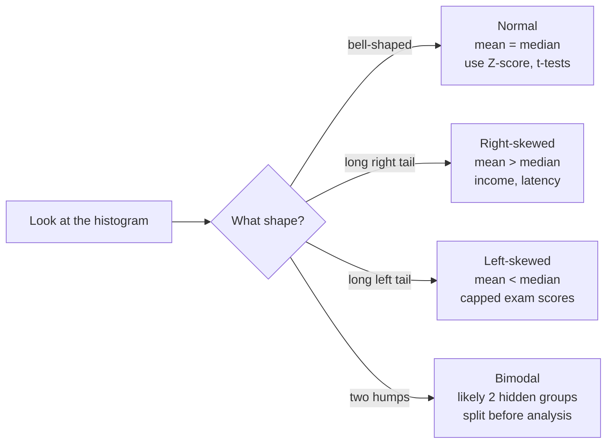

# Section 5 — Distributions

## Lectures covered
- What Is a Distribution?
- Skewness · Normal Distribution
- Detect Outliers Using Normal Distribution
- Z Score · Standard Normal Distribution (SND)
- Quizzes & Exercises · Chapter Summary

---

## In one sentence
A **distribution** is a picture of *how often* each value shows up in your data — and most of statistics is built on recognizing the shape of that picture.

## Real-world analogy
Imagine you measure the height of every adult in your city and stack them up by height. Most people land near 5'7", a few are very short, a few very tall. Drawing a bar for each height-range gives you a **bell-shaped** picture — that's a distribution. If instead you measured *income*, most people earn around the median, but a few billionaires create a long right tail — a different shape, but still a distribution.

## The intuition (plain English)
- Data has **shape**. The shape tells you what's "normal" and what's "weird."
- A **distribution** is just the rulebook for that shape.
- Two numbers usually summarize it: a **center** (where most values are) and a **spread** (how stretched out they are).
- Once you know the shape, you can answer questions like *"what's the chance a random person earns over $200k?"* without surveying everyone.

## Mini worked example — making your first distribution

Test scores from 10 students:

```
[55, 62, 70, 70, 73, 75, 78, 82, 85, 95]
```

Bucket them into ranges of 10:

```
50–59:  █                     (1 student)
60–69:  █                     (1)
70–79:  █████                 (5)
80–89:  ██                    (2)
90–99:  █                     (1)
```

That bar shape **is** the distribution. Center sits around 73 (most students). Spread is from 55 to 95. With more students you'd see a smoother curve — and if it's bell-shaped, it's a **Normal distribution**.

## At-a-glance — the four shapes you'll see



## Why this matters for everything that follows
- The **Central Limit Theorem** chapter explains *why* averages tend to look Normal.
- **Hypothesis testing** assumes the data (or its average) is roughly Normal.
- **Z-score outlier detection** is just "how far from the bell's center?" measured in standard deviations.

If you understand distributions, the next 5 chapters are mostly mechanics on top.

---

## 1. What is a distribution?

A **distribution** describes how the values of a variable are spread.

- **Discrete** distribution: each possible value has a probability mass (PMF). Σ probs = 1.
- **Continuous** distribution: probabilities are densities (PDF). ∫ density = 1; probability of any single point is 0; probability is over *ranges*.

Visually: a histogram (sample) approximates the underlying PDF (population).

---

## 2. Common distributions you'll see in DS

### Bernoulli
One trial, two outcomes (success/failure). $P(X=1) = p$.
- Example: "did the user click? (1 = yes)"

### Binomial
Number of successes in $n$ Bernoulli trials.
- Example: "how many of 100 visitors clicked?"

### Poisson
Number of events in a fixed interval, when events are rare and independent.
- Example: customers arriving per hour; goals per match

### Uniform
All values equally likely between $a$ and $b$.
- Example: random number between 0 and 1

### Normal (Gaussian)
The bell curve. Defined by mean $\mu$ and standard deviation $\sigma$.

### Exponential
Time until a Poisson event.
- Example: time between API requests

### Log-normal
$\log(X)$ is Normal. Heavy right tail.
- Example: incomes, file sizes, latencies

> The bootcamp focuses on Normal because it's the foundation for hypothesis testing — but real-world data is often skewed (log-normal, Poisson, etc.). Knowing the family changes which test you'd use.

---

## 3. Skewness

A measure of asymmetry of a distribution.

```
Right-skewed                  Symmetric                   Left-skewed
    ████▆▄▂▁                    ▁▂▄▆██▆▄▂▁                       ▁▂▄▆████
   skew > 0                    skew ≈ 0                          skew < 0
   mean > median               mean ≈ median                     mean < median
```

| Skewness range | Severity |
|---|---|
| −0.5 to 0.5 | approximately symmetric |
| −1 to −0.5 / 0.5 to 1 | moderately skewed |
| < −1 / > 1 | heavily skewed |

```python
df["income"].skew()
```

### What to do when skewed
- Consider **log-transform** for right-skewed positive data: `np.log1p(x)`
- Use **median + IQR** rather than mean + std dev for summary
- Some ML models (linear regression, neural nets pre-batch-norm) prefer roughly Normal features — transform first

---

## 4. Normal distribution

PDF:
$$f(x) = \frac{1}{\sigma \sqrt{2\pi}} \exp\left(-\frac{(x - \mu)^2}{2\sigma^2}\right)$$

Defined by:
- $\mu$ — mean (center)
- $\sigma$ — standard deviation (spread)

### The 68–95–99.7 rule (empirical rule)
For Normal data:
- ~68% of values within $\mu \pm 1\sigma$
- ~95% within $\mu \pm 2\sigma$
- ~99.7% within $\mu \pm 3\sigma$

This is the foundation of "3σ outlier" detection.

### Why Normal shows up everywhere
Two reasons:
1. **Many natural quantities** are sums of small effects → CLT (next chapter) → Normal
2. **Statistical tests** assume Normal residuals → so we *try* to engineer Normal features

---

## 5. Detect outliers using Normal distribution (3σ rule)

If your data is approximately Normal:
```python
mean = df["age"].mean()
std = df["age"].std()
mask = (df["age"] < mean - 3 * std) | (df["age"] > mean + 3 * std)
outliers = df[mask]
```

### When 3σ rule is appropriate
- Data is approximately Normal (check histogram + skewness)
- No bimodality
- Reasonably large sample (≥30 ideally)

### When 3σ rule fails
- Heavy-tailed data (incomes, latencies) — IQR is better
- Bimodal data — split first
- Very small samples (<10) — neither method is reliable

---

## 6. Z-score (standardization)

The Z-score of a value $x$:
$$z = \frac{x - \mu}{\sigma}$$

It says: *how many standard deviations is x from the mean?*

```python
from scipy import stats
df["age_z"] = stats.zscore(df["age"])
# alternatively:
df["age_z"] = (df["age"] - df["age"].mean()) / df["age"].std()

# typical outlier filter
df_clean = df[df["age_z"].abs() < 3]
```

### Why standardize
- Make features on the **same scale** for distance-based ML (k-NN, k-means, SVM)
- Compute "how unusual is this value?" interpretably
- Bring features into roughly Normal centered at 0

### sklearn equivalent
```python
from sklearn.preprocessing import StandardScaler
scaler = StandardScaler()
X_scaled = scaler.fit_transform(X)        # mean 0, std 1
```

---

## 7. Standard Normal Distribution (SND)

The Normal distribution with $\mu = 0$ and $\sigma = 1$.

If $X \sim N(\mu, \sigma^2)$, then $Z = (X - \mu)/\sigma \sim N(0, 1)$.

That's why we standardize: to use universal Z-tables / Z-tests regardless of original units.

### Reading a Z-table (for the curious)
- Find the row matching the integer + first decimal of Z
- Find the column matching the second decimal
- Cell gives $P(Z \le z)$, the cumulative probability up to that z

Modern code:
```python
from scipy.stats import norm
norm.cdf(1.96)         # 0.975  (95% one-sided)
norm.ppf(0.975)        # 1.96   (the inverse)
```

### Why 1.96 is famous
- 95% of values fall within ±1.96 std devs of the mean in a Normal distribution
- → most "95% confidence intervals" are mean ± 1.96 × SE

---

## 8. Distribution-checking workflow on real data

```python
import seaborn as sns
import scipy.stats as stats

# 1. Histogram + KDE
sns.histplot(df["age"], kde=True)

# 2. Skewness + kurtosis
print("skew:", df["age"].skew(), "kurtosis:", df["age"].kurtosis())

# 3. Q-Q plot — visual normality check
stats.probplot(df["age"], dist="norm", plot=plt)

# 4. Statistical normality test (only meaningful for n < 5000)
stat, p = stats.shapiro(df["age"].dropna().sample(min(5000, len(df))))
print(f"Shapiro p-value: {p:.4f}")    # p > 0.05 → can't reject normality
```

> **Don't blindly trust normality tests** on huge samples — they detect tiny deviations as "non-normal" even when the data is normal *enough* for downstream methods.

---

## 9. Common pitfalls

| Mistake | Effect | Fix |
|---|---|---|
| Assuming any bell-ish histogram is Normal | wrong test choice | check Q-Q + skew |
| Using 3σ on heavy-tailed data | drops too many real points | use IQR or domain rule |
| Standardizing with stats from train + test combined | data leakage | fit `StandardScaler` on train only |
| Confusing PMF and PDF | one's discrete, one continuous | discrete: prob *of* a value; continuous: density *at* a value |
| Forgetting Z-score is unitless | mixing with raw values | always scale to z, then back |

## Self-check

- [ ] State the 68-95-99.7 rule.
- [ ] What's the Z-score and what does it mean intuitively?
- [ ] Why does standardization help k-NN but not tree-based models?
- [ ] When use IQR-based outlier detection vs 3σ?
- [ ] State the difference between PDF and PMF.
- [ ] Why is the Normal distribution so common (preview of CLT)?
- [ ] If a value has Z = 2.5, is it an outlier? Justify.
- [ ] What's a Q-Q plot used for?

---

## Glossary

| Term | Plain meaning |
|------|---------------|
| **Distribution** | A picture (or rule) of how often each value of a variable shows up |
| **Discrete** | Values come in clean steps you can count: 0, 1, 2, 3 (children, clicks) |
| **Continuous** | Values come from a smooth range — any decimal possible (height, weight) |
| **PMF** (Probability Mass Function) | For discrete data: the chance of each specific value. All chances add to 1. |
| **PDF** (Probability Density Function) | For continuous data: the *density* at each value. Area under the curve adds to 1. The chance of any *exact* point is 0; we only ask about *ranges*. |
| **Bernoulli** | One coin flip: success (1) or fail (0) with probability `p` |
| **Binomial** | Counting successes in many Bernoulli trials |
| **Poisson** | Counting how many rare events happen in a fixed window (calls per hour) |
| **Normal / Gaussian** | The bell curve. Defined by mean (center) and std dev (spread). |
| **Skewness** | A number measuring asymmetry. 0 = symmetric, positive = right tail, negative = left tail |
| **Right-skewed** | Most data on the left, long tail extending right (income, latency) |
| **Left-skewed** | Most data on the right, long tail extending left (capped exam scores) |
| **Bimodal** | Two peaks — usually means two hidden subgroups in your data |
| **Mean** | Arithmetic average |
| **Median** | Middle value when data is sorted — not affected by extreme values |
| **Mode** | Most frequent value |
| **Standard deviation (σ)** | Typical distance of a value from the mean, in original units |
| **Variance (σ²)** | Standard deviation squared. Same idea, but in squared units. |
| **68-95-99.7 rule** | For Normal data: 68% of values within 1σ, 95% within 2σ, 99.7% within 3σ |
| **3σ outlier rule** | Flag any value more than 3 standard deviations from the mean as an outlier |
| **IQR** | Interquartile Range = 75th percentile − 25th percentile. Robust outlier detector. |
| **Z-score** | How many standard deviations a value is from the mean: `z = (x - μ) / σ` |
| **Standardization** | Subtract the mean, divide by std dev — turns any Normal into a Standard Normal |
| **Standard Normal Distribution (SND)** | Normal with mean = 0, std dev = 1. The reference table everyone uses. |
| **CDF** (Cumulative Distribution Function) | "What fraction of the distribution is at or below this value?" |
| **Q-Q plot** | A scatter plot of your data's quantiles vs the Normal's. Straight line = Normal. |
| **Log-transform** | Replacing `x` with `log(x)` to squeeze a right-skewed variable into roughly Normal shape |

## Further reading
- Next chapter: [03-inferential/01-central-limit-theorem.md](../03-inferential/01-central-limit-theorem.md) — *why* Normal shows up everywhere
- Then: [03-inferential/02-hypothesis-testing.md](../03-inferential/02-hypothesis-testing.md) — using distributions to make decisions
- Module guide: [BEGINNER-STYLE-GUIDE.md](../../../BEGINNER-STYLE-GUIDE.md) — the layered teaching pattern this file follows
