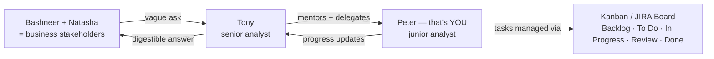

# Section 6 — AtliQo Bank: Kickoff & Project Management

## Lectures covered
- Chapter Overview
- Bashneer Grower's Bank Venture
- AtliQo Credit Card Launch: Problem Statement
- Project Kick-off Meeting
- Project Management Using Kanban
- Tasks Breakdown and JIRA Board Setup
- Meeting: Tony, Peter, Natasha

---

## In one sentence
Real analytics work starts with a **vague business ask** ("launch a credit card better than competitors"), and Kanban + JIRA is how a working data team turns that into 30 trackable tasks across the 4 phases of the project.

## Real-world analogy
Think of Kanban as a **kitchen ticket rail** in a busy restaurant. Each ticket is a task. It moves from "ordered" → "cooking" → "ready" → "served". The chef can see the whole queue at a glance and nothing gets dropped. Your AtliQo analysis is exactly that, but each ticket is a SQL query, a cleaning step, or a stakeholder slide.

## At-a-glance — the AtliQo team and the Kanban flow



## Mini worked example — a Phase-1 task on the board

```
Card title: "Clean & treat outliers in Annual Income"
Description:
  - Drop NULLs (1.2% of rows)
  - Detect outliers via IQR (k=1.5)
  - Cap (Winsorize) instead of drop — preserve real high earners
  - Document decision in cleaning_log.md
Assignee: Peter
Status: In Progress
Estimate: 4 hours
Acceptance criteria:
  - [ ] Cleaned dataset saved as data/clean/income.csv
  - [ ] Before/after histograms in notebook
  - [ ] One-line decision log entry
```

That's a real ticket from Phase 1. Multiply by 30 to get the full board.

## Why this matters
- **Stakeholder management** is half the job — Phase 1 ends with a meeting where you defend choices to Bashneer.
- **Kanban discipline** is what keeps a 90-day project from sliding into chaos.
- **JIRA / Trello / Notion** are interchangeable; the *technique* matters more than the tool.
- **You'll be using these in every job after this** — analytics teams universally run on tickets.

---

## 1. The story (Codebasics' cinematic setup)

**Bashneer Grower** runs **AtliQo Bank**. The business wants to launch a new **credit card** in a competitive market. Rather than a generic launch, leadership asks the data team to identify the right **target market segment** — customers most likely to convert, profitably.

The data team:
- **Tony** — senior analyst (mentor figure)
- **Peter** — junior analyst (the learner stand-in — that's *you*)
- **Natasha** — project manager / business stakeholder

The narrative is fictional but the **shape is real**. Every working analytics team has these dynamics: ambiguous brief, time pressure, stakeholder questions you didn't expect, recovering from "you're answering the wrong question."

---

## 2. The business problem statement

> **Goal**: Launch AtliQo's new credit card. Identify a **target customer segment** with the best balance of:
> - Spend-volume potential (will they use the card?)
> - Repayment reliability (creditworthiness)
> - Demographic fit (existing relationship / branch reach)

> **Deliverable (Phase 1)**: A data-backed recommendation of one or two target segments, with supporting analysis.

---

## 3. Why this is the perfect Math & Stats project

It forces you to apply *every* stats topic from this module:

| Topic | Where it's used |
|---|---|
| Visualization basics | initial EDA — distributions of age, income, spending |
| Mean / median / mode | summarizing customer demographics |
| Percentile / IQR | outlier detection on income |
| Correlation | does income drive credit-score? |
| Probability | "what fraction of segment X is high-credit?" |
| Distributions / Normal | testing if income is roughly Normal |
| Z-score | standardizing for outlier detection |
| Hypothesis testing (later in the module) | "do these segments truly differ?" |
| A/B test design (later) | the launch strategy itself |

You can see why this project sits *inside* Math & Stats — it's the integration test.

---

## 4. The dataset (typical Codebasics shape)

You'll receive 4 CSV files (or MySQL tables). Approximate:

| Table | Approx rows | Key columns |
|---|---|---|
| `customers` | 50,000 | customer_id, age, gender, location, occupation, annual_income |
| `credit_profiles` | 50,000 | customer_id, credit_score, credit_utilization, outstanding_debt, credit_inquiries_last_year |
| `transactions` | 200,000+ | tran_id, customer_id, tran_date, tran_amount, platform, product_category |
| `dim_date` | ~1,500 | date, weekday, month, quarter |

The volume is real-world-ish — large enough that pandas needs care, small enough that it fits in memory.

---

## 5. Project management — Kanban + JIRA

### Why bother with PM as an analyst
- Stakeholders ask "where are you?" mid-week. A board answers without you typing.
- Splitting work into cards forces clarity.
- Done-column visibility makes your contribution legible to reviewers.

### Kanban basics (recap from SQL module)
Three columns: **To Do · In Progress · Done**. Each task is a card. Cards flow left → right.

### Tasks breakdown for AtliQo Phase 1 (typical)
1. Get raw data + verify counts vs spec
2. Set up MySQL schema + import CSVs
3. Initial EDA in Jupyter
4. Data cleaning — annual income (NULLs, outliers)
5. Data cleaning — credit score table (NULLs, outliers)
6. Data cleaning — transactions (NULLs, IQR-based outliers)
7. Visualizations: age, gender, location distributions
8. Correlation analysis on credit-profile variables
9. Identify outlier strategy (IQR vs std-dev) — defend the choice
10. Initial target-segment hypothesis
11. Stakeholder feedback meeting (Phase 1 wrap)

Each becomes a JIRA / Trello card with:
- Title + 1-line description
- Acceptance criteria ("done" definition)
- Estimate (S / M / L hours)

### JIRA setup steps (from the lecture)
1. Atlassian → free JIRA Cloud account
2. Create project: "AtliQo Credit Card Phase 1"
3. Choose Kanban template
4. Add backlog items (use the 11 above)
5. Drag the first 1–2 to "In Progress"
6. As you finish, drag to Done

Modern alternatives if you don't want JIRA:
- **GitHub Projects** (free, integrated with the repo)
- **Trello** (lightweight)
- **Notion / Linear** (if you already use them)

> The tool matters less than the habit. Pick one and use it for *every* later project.

---

## 6. The "Tony, Peter, Natasha" meeting — what to take from it

The kickoff meeting in the lecture demonstrates:
- **Asking clarifying questions** — Peter starts with "what does target mean here?"
- **Aligning on success metrics** — credit-utilization? approval-rate? spend?
- **Negotiating scope** — Phase 1 (data prep + segment hypothesis) vs Phase 2 (test, validate)
- **Managing expectations** — what's realistic in 2 weeks vs 2 months

In your real career: every kickoff goes better if you ask these. Don't leave the room until they're answered.

---

## 7. Repo structure for this project

```
atliqo-bank/
├── data/
│   ├── customers.csv
│   ├── credit_profiles.csv
│   ├── transactions.csv
│   └── dim_date.csv
├── sql/
│   ├── schema.sql
│   └── import.sql
├── notebooks/
│   ├── 01-data-validation.ipynb
│   ├── 02-cleaning-customers.ipynb
│   ├── 03-cleaning-credit.ipynb
│   ├── 04-cleaning-transactions.ipynb
│   ├── 05-eda-segments.ipynb
│   └── 06-target-segment-hypothesis.ipynb
├── reports/
│   ├── phase-1-summary.md
│   └── stakeholder-deck.pdf
├── images/
└── README.md
```

---

## 8. Self-check

- [ ] Can I state the AtliQo problem in one sentence?
- [ ] Have I set up a Kanban board (any tool) for this project?
- [ ] Are my 11 task cards in the backlog?
- [ ] Have I imported the CSVs into MySQL or pandas?
- [ ] Do I know who the stakeholders are and what they expect at Phase 1 wrap?

---

## Glossary

| Term | Plain meaning |
|------|---------------|
| **AtliQo Bank** | Fictional bank in the bootcamp's case-study universe — the project client |
| **Bashneer Grower** | Fictional founder of AtliQo — the executive sponsor |
| **Tony / Peter / Natasha** | Codebasics' recurring characters (senior analyst, junior, project manager) |
| **Brief** | The original business request — usually vague, your job is to clarify |
| **Stakeholder** | Anyone who has a say in the project's direction or outcome |
| **Kickoff meeting** | Project's first formal meeting — sets goals, owners, success criteria |
| **Kanban** | A visual workflow system: cards move across columns (To Do → In Progress → Done) |
| **JIRA** | Atlassian's issue / project management tool — common in tech companies |
| **Trello / Notion / Linear** | Lightweight Kanban alternatives — same technique, different tool |
| **Backlog** | The pile of tasks not yet started |
| **WIP limit** | Cap on how many cards can be "In Progress" at once — prevents thrashing |
| **Acceptance criteria** | Bullet list defining "done" for a task |
| **Story / ticket / card** | Different names for one task on a Kanban board |
| **Sprint** | A fixed-length work cycle (1-2 weeks) — Scrum concept, often layered on top of Kanban |
| **Standup** | 15-min daily team check-in: yesterday / today / blockers |
| **Phase** | A logical group of tasks with a stakeholder check-point at the end |
| **MVP (Minimum Viable Product)** | The smallest version that delivers value — used to prioritize Phase 1 scope |
| **Risk register** | List of things that could derail the project, with mitigations |
| **CSV / fact / dim tables** | Raw data formats and warehouse schema components — covered in Module 1 |
| **Phase-1 wrap** | The stakeholder meeting where you defend Phase-1 conclusions and propose Phase 2 |

## Further reading
- Next: [02-phase-1-find-target-market.md](02-phase-1-find-target-market.md)
- Cleaning + outlier techniques: [../01-foundations/02-central-tendency-dispersion.md](../01-foundations/02-central-tendency-dispersion.md)
- Distributions for outlier rules: [../01-foundations/04-distributions.md](../01-foundations/04-distributions.md)
- Hypothesis testing for Phase 2: [../03-inferential/02-hypothesis-testing.md](../03-inferential/02-hypothesis-testing.md)
