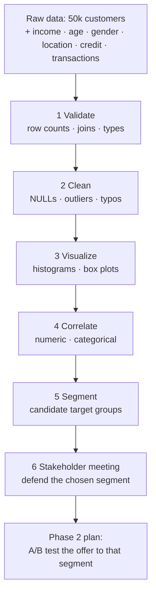

# Section 7 — AtliQo Bank Phase 1: Find Target Market

## Lectures covered (21 lectures)
- Data Validation of Acquired Data
- Data Understanding · MySQL Setup · Data Import in Jupyter
- Cleaning: Annual Income (NULLs, outliers)
- Visualization: Annual Income, Age, Gender, Location
- Exercise: Treat Outliers in Age (with solution)
- "Peter's Nightmare"
- Cleaning: Credit Score Table (parts 1 & 2)
- Correlation Among Credit Profile Variables
- Exercise: Handle NULLs in Transactions Table (with solution)
- "Peter's Confusion: IQR or Std Dev?"
- Cleaning: Transactions Table outliers (IQR)
- Visualization: Transactions Table
- Finalize the Target Group
- Phase 1 Feedback Meeting With Stakeholders
- Get Ready For Phase 2

---

## In one sentence
Phase 1 is **6 weeks of cleaning + EDA + segmentation** that ends with one defensible recommendation: *"Here's the target customer segment for the new credit card, and here's the data evidence."*

## Real-world analogy
Think of yourself as a **detective working a case** with 50,000 witnesses (rows). You can't interrogate them all — so you triage: throw out lying witnesses (data errors), corner the unusual ones (outliers), spot patterns across groups (segmentation), then build a story that holds up in the courtroom (stakeholder meeting). Phase 1 is the "build the case" phase. Phase 2 is the trial (A/B test).

## Mini worked example — one Phase-1 cleaning decision

You're cleaning the `Annual_Income` column. Quick scan:

```
Total rows:                    50,000
NULL income:                    600 rows  → drop (1.2% — small)
Income < ₹0:                    12 rows   → typo / data error → drop
Income > ₹50 lakhs:             145 rows  → real high earners? typo? → INVESTIGATE

Investigation result:
  - 130 are real (cross-check: matches their credit-score profile)
  - 15 are clearly typos (e.g., ₹50 cr — only 3 people in India earn that)

Decision:
  - Drop the 15 typos
  - Keep the 130 real high earners
  - Cap them at ₹50 lakhs ONLY in models that assume Normal — but keep raw values for segmentation
```

Document this in `cleaning_log.md`. Stakeholders WILL ask why you dropped 15 customers.

## At-a-glance — the Phase-1 funnel



## Why this matters
- **Cleaning is 70% of the work** — every later step depends on it.
- **Defensible decisions** beat clever ones — Bashneer will challenge you.
- **The data dictionary + cleaning log** are the artifacts that make your work reproducible.
- **Phase 1 → Phase 2 handoff** is where many real teams fall apart — a clean handoff is a senior-level skill.

---

## 1. The full Phase-1 workflow (what you'll execute)

```
Validate → Clean → Visualize → Correlate → Segment → Defend
```

Each step is a notebook (or section of one).

---

## 2. Data validation

### Why first
Before any analysis: confirm what you have. Wrong assumptions here propagate downstream.

### Checklist
```python
# row counts
for tbl in [customers, credit_profiles, transactions]:
    print(tbl.shape)

# expected joins exist
assert customers["customer_id"].isin(credit_profiles["customer_id"]).all()

# unexpected duplicates
assert customers["customer_id"].is_unique

# date ranges sensible
print(transactions["tran_date"].min(), transactions["tran_date"].max())

# obvious type errors
print(customers["age"].describe())            # any negatives? 1000s?
print(customers["annual_income"].describe())
```

> Good analysts spend ~10–20% of project time here. It feels boring but catches expensive bugs early.

---

## 3. Cleaning — annual income

### Detect NULLs
```python
customers["annual_income"].isna().sum()
customers["annual_income"].isna().mean() * 100      # % missing
```

### Decide treatment
- If <5% missing → drop or impute with median
- If 5–30% → impute with median, add a flag column `is_income_missing`
- If >30% → consider whether the column is salvageable

For incomes, **median imputation** is safer than mean (right-skewed data).

```python
median_income = customers["annual_income"].median()
customers["income_was_missing"] = customers["annual_income"].isna()
customers["annual_income"] = customers["annual_income"].fillna(median_income)
```

### Outlier treatment (income — right-skewed → IQR is wiser)
```python
q1, q3 = customers["annual_income"].quantile([0.25, 0.75])
iqr = q3 - q1
low, high = q1 - 1.5 * iqr, q3 + 1.5 * iqr
customers = customers[(customers["annual_income"] >= low) & (customers["annual_income"] <= high)]
```

> Always **inspect** outlier rows before dropping. Some are typos (₹ misplaced), some are real high earners.

---

## 4. Visualization — demographics

### Income distribution (right-skewed expected)
```python
sns.histplot(customers["annual_income"], bins=40, kde=True)
sns.boxplot(x=customers["annual_income"])
```

### Age
```python
sns.histplot(customers["age"], bins=30)
print(customers["age"].describe())
```

### Gender split
```python
sns.countplot(x="gender", data=customers)
```

### Location (top N)
```python
sns.countplot(y="location",
              data=customers,
              order=customers["location"].value_counts().nlargest(10).index)
```

### What you're looking for
- Where's the bulk of customers? (this likely becomes your default segment)
- Are there obvious outlier groups (e.g., one city overrepresented)?
- Is the data consistent across genders / age groups?

---

## 5. Exercise — outliers in age (typical Codebasics task)

```python
# the lecture provides this
# typical task: detect + treat outliers in customers["age"]
# expected: ages outside ~[18, 75] are suspicious; some 200/300 typos exist

low, high = customers["age"].quantile([0.01, 0.99])    # use percentile cap
customers = customers[(customers["age"] >= 18) & (customers["age"] <= 75)]
```

The narrative aside ("Peter's Nightmare") emphasizes that outlier handling judgment calls aren't dictated by formulas alone — you blend stats + domain knowledge.

---

## 6. Cleaning credit score table

### Typical issues
- Credit scores in invalid ranges (e.g., < 300 or > 850 for FICO; varies by region)
- Negative outstanding-debt values (data entry errors)
- High `credit_inquiries_last_year` (>20 — suspicious)

### Pattern
```python
# clip credit score to valid range
credit["credit_score"] = credit["credit_score"].clip(lower=300, upper=900)

# investigate negative debt
neg_debt = credit[credit["outstanding_debt"] < 0]
# probably typo or refund — consult domain
```

---

## 7. Correlation among credit-profile variables

### Run the correlation matrix
```python
sns.heatmap(credit[["credit_score", "credit_utilization", "outstanding_debt",
                    "credit_inquiries_last_year"]].corr(),
            annot=True, cmap="coolwarm", center=0)
```

### Expected real-world patterns
- `credit_score` vs `credit_utilization`: strong **negative** correlation (high utilization hurts score)
- `credit_score` vs `outstanding_debt`: negative
- `credit_score` vs `credit_inquiries_last_year`: negative
- `credit_utilization` vs `outstanding_debt`: positive (mostly)

These confirm the dataset is consistent with finance domain knowledge.

---

## 8. Cleaning transactions table

### NULL strategy (different per column)
- `tran_amount` NULL → drop the row (transaction without amount = junk)
- `platform` NULL → impute with mode ("Online" usually)
- `product_category` NULL → "Unknown" category (visible in viz)

### Outlier strategy — "IQR or Std Dev?" (Peter's confusion)
The lecture explicitly addresses this question. Rule of thumb:

| Data shape | Use |
|---|---|
| Symmetric (Normal-ish) | std-dev (3σ rule) |
| Right-skewed (incomes, transactions) | IQR (1.5×) |
| Heavy-tailed | IQR (or domain-specific cap) |

Transaction amounts are typically right-skewed → use IQR.

```python
def iqr_clip(s, k=1.5):
    q1, q3 = s.quantile([0.25, 0.75])
    iqr = q3 - q1
    return s.clip(lower=q1 - k * iqr, upper=q3 + k * iqr)

transactions["tran_amount"] = iqr_clip(transactions["tran_amount"])
```

---

## 9. Transactions visualization

```python
# distribution of transaction amounts
sns.histplot(transactions["tran_amount"], bins=50)

# transactions per customer
per_customer = transactions.groupby("customer_id").size()
sns.histplot(per_customer, bins=40)

# top product categories
top_cat = transactions["product_category"].value_counts().nlargest(10)
sns.barplot(x=top_cat.values, y=top_cat.index)

# spend by platform
sns.boxplot(data=transactions, x="platform", y="tran_amount")
```

---

## 10. Finalizing the target segment

### Bring it together — segment scoring
Build a customer-level table:
```python
df = (customers
      .merge(credit, on="customer_id")
      .assign(
          total_spend=lambda d: d["customer_id"].map(
              transactions.groupby("customer_id")["tran_amount"].sum()
          ),
          n_transactions=lambda d: d["customer_id"].map(
              transactions.groupby("customer_id").size()
          )
      ))
```

### Define candidate segments (typical patterns)

```python
# young professionals with mid-high income and good credit
candidate_a = df.query(
    "25 <= age <= 40 and annual_income >= 600000 and credit_score >= 750"
)

# wealthy seniors with low utilization
candidate_b = df.query(
    "age >= 50 and annual_income >= 1500000 and credit_utilization < 0.30"
)
```

For each candidate compute:
- count + % of total customers
- avg transaction frequency
- avg total spend
- avg credit score
- gender / location split

The **best target segment** is one with high spend potential, good credit, and is large enough to justify a launch — *and* underserved by competitors (qualitative input).

---

## 11. The Phase 1 stakeholder feedback meeting

### What to bring
- A 5–10 slide deck (or notebook screenshots)
- Top 3 candidate segments with their numbers side by side
- Your recommended Phase 2 plan (validation via test campaign / A/B)

### Likely questions (and good answers)
- "Why this segment over another?" → numbers + the qualitative case
- "How sure are you?" → "We've cleaned the data, applied IQR-based outlier treatment; recommend a Phase 2 A/B test to validate"
- "What if we're wrong?" → "Our recommended Phase 2 design has a built-in fallback to Segment B"

### What to update post-meeting
- Stakeholder priorities may shift focus
- New constraints (budget, region) may filter segments
- Drag a card to "Done" only after stakeholders have signed off

---

## 12. Getting ready for Phase 2

Phase 2 (covered partially in the Hypothesis Testing chapter and partially as a Codebasics-extra) is about **validating** the chosen segment via a controlled experiment — typically an **A/B test** of two card variants or two acquisition campaigns.

Phase 2 needs:
- Power analysis to determine sample size
- Random assignment to treatment / control
- A pre-registered metric and decision rule
- Hypothesis test on the difference

You'll learn this in `core/05-math-statistics/03-inferential/`.

---

## 13. Deliverables for portfolio

### `reports/phase-1-summary.md`
- Problem statement
- Data summary (rows, columns, period)
- Cleaning decisions + rationale (e.g., "IQR over 3σ because income is right-skewed")
- Top 3 candidate segments
- Recommendation
- Phase 2 design proposal

### Repo
- All notebooks runnable end-to-end
- README with screenshots
- A `data_dictionary.md`

This project is **portfolio gold** for any data-analyst role in financial services.

---

## Self-check

- [ ] Have I validated row counts and key joins?
- [ ] Did I justify IQR vs std-dev for each numeric column based on its shape?
- [ ] Are my visualizations labeled and saved?
- [ ] Have I produced a candidate-segment comparison table?
- [ ] Is my Phase 1 summary a stakeholder-readable markdown report?
- [ ] Did I outline Phase 2's experimental plan?
- [ ] Have I posted a build-in-public update about this project?

---

## Glossary

| Term | Plain meaning |
|------|---------------|
| **Phase 1** | The 6-week analytical phase ending with target-segment recommendation |
| **Data validation** | Checking row counts, primary-key uniqueness, foreign-key joins before analysis |
| **Schema** | The structure of your tables — columns, types, relationships |
| **Primary key** | A column whose values uniquely identify each row |
| **Foreign key** | A column referencing another table's primary key |
| **Star schema** | A central fact table joined to multiple dimension tables — fast for analytics |
| **NULL** | Missing value in a database / pandas column |
| **NaN** | "Not a Number" — pandas' representation of missing numerical values |
| **Outlier** | A value far enough from the rest to suggest error or distinct behavior |
| **IQR (Interquartile Range)** | Q3 − Q1; robust outlier detector |
| **3σ rule** | Outlier if more than 3 standard deviations from mean — only valid for Normal data |
| **Winsorize / cap** | Replace extreme values with a threshold rather than dropping rows |
| **EDA (Exploratory Data Analysis)** | First-look analysis: shapes, distributions, correlations |
| **Histogram** | Bar chart of value frequencies — shows distribution shape |
| **Box plot** | Median + IQR + whiskers + outlier dots — robust comparison tool |
| **Correlation matrix** | Pairwise correlations across numeric columns; visualized as heatmap |
| **Segment** | A subgroup of customers grouped by behaviour, demographics, or value |
| **Target segment** | The chosen segment your product/launch is optimized for |
| **Persona** | A human-readable description of a segment ("High-income urban professional, age 28-45") |
| **Acceptance criteria** | The "done" checklist for each task — drives clean stakeholder reviews |
| **Cleaning log** | A document recording every cleaning decision and its justification |
| **Data dictionary** | A reference doc explaining every column, type, source, and gotcha |
| **Phase 1 wrap meeting** | Stakeholder review where you defend Phase 1's segment recommendation |
| **A/B test (Phase 2)** | The experiment that validates whether the chosen segment actually responds better |
| **Power analysis** | Computing required sample size before running an A/B test |

## Further reading
- Phase 2 mechanics: [../03-inferential/02-hypothesis-testing.md](../03-inferential/02-hypothesis-testing.md)
- Outlier methods: [../01-foundations/02-central-tendency-dispersion.md](../01-foundations/02-central-tendency-dispersion.md)
- Distribution shapes: [../01-foundations/04-distributions.md](../01-foundations/04-distributions.md)
- Visualization toolkit: [../01-foundations/01-data-visualization-basics.md](../01-foundations/01-data-visualization-basics.md)
