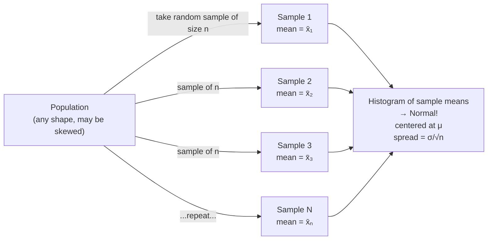

# Section 8 — Central Limit Theorem

## Lectures covered
- Random Sampling & Sample Bias
- The Law of Large Numbers
- Central Limit Theorem · Sampling Distribution
- Case Study: Solar Panels
- Standard Error · Quiz
- Z Score Table (Z-Table) · Quiz
- Confidence Interval · Confidence Interval: Estimate Car Miles · Exercise · Chapter Summary

---

## In one sentence
The **Central Limit Theorem (CLT)** says that if you take many random samples from *any* population and average each one, those averages form a **bell-shaped (Normal) curve** — and that single fact is what lets us make confident predictions from small samples.

## Real-world analogy
You want to know the average height of every adult in India (1+ billion people). You can't measure all of them — but you measure a random group of 100. The CLT promises that if a thousand other people did the same thing independently, the *thousand averages* would cluster tightly around the true country-wide average in a beautiful bell curve. So your one number is far more trustworthy than it seems.

## The intuition (plain English)
- **Population** = everyone you care about (1 billion people).
- **Sample** = the small group you actually measure (100 people).
- **Sample mean** = the average from your one sample.
- The CLT says: if you imagined repeating this many times, the **distribution of all those sample means** is approximately Normal — even if the population itself is wildly skewed.
- Why it matters: you can now build a **confidence interval** around your one measurement and say "the true average is probably in this range".

## Mini worked example — heights from a skewed population

Imagine the population is *very* skewed (a few extremely tall outliers):

```
Population values:    [...lots of 60–72... + a few 90s ...]    
Population mean:      66 inches  (skewed)
Population std dev:   8 inches
```

You repeatedly take samples of 36 people and record the average:

```
Sample 1 mean:  66.4
Sample 2 mean:  65.8
Sample 3 mean:  66.1
Sample 4 mean:  65.5
Sample 5 mean:  66.7
...
(do this 1000 times)
```

The histogram of these 1000 means looks like this — **bell-shaped**, despite the skewed source:

```
                      ▁▂▄▆█▆▄▂▁
                  ▁▁▂▃▆██████▆▃▂▁▁
                ▁▂▄▆██████████████▆▄▂▁
                  64    66    68
                   centered at 66 — the population mean!
                   with std dev = σ/√n = 8/6 ≈ 1.33
```

Two beautiful things happened:
1. The distribution of sample means is **Normal** even though the population was skewed.
2. The spread (called **standard error**) shrunk from 8 to 1.33 — getting more samples *averages out* the noise.

## At-a-glance — the CLT machine



## The two payoff numbers

For the sampling distribution of the mean:

| Quantity | What | Formula |
|----------|------|---------|
| **Center** | Where the bell sits | μ (population mean) |
| **Spread** | How wide the bell is | σ / √n  ← called **Standard Error** |

The square root in `σ/√n` has a brutal consequence: to halve your error, you need **4× the data**. To make it 10× more precise, **100× the data**. This is why "more data" has diminishing returns.

## Why this matters
- **Confidence intervals** ("the true mean is between A and B with 95% confidence") are built on the CLT.
- **Hypothesis tests** (next chapter) compare the observed sample mean to the bell-curve of "expected if no effect".
- **A/B testing** sample-size formulas come straight from this chapter.

If the CLT didn't hold, every claim about a population from a sample would be guesswork. With it, statistics becomes a quantitative science.

---

## 1. Random sampling — what makes a sample valid

### Random sample
Every member of the population has an *equal* chance of being selected.

### Why it matters
A non-random sample produces biased estimates that don't generalize. Examples:
- Polling at a sports stadium → biased toward sports fans
- Survey at 9am Monday → biased toward office workers
- Online survey → biased toward people who use the internet

### Common biases
| Bias | What | Example |
|---|---|---|
| **Selection bias** | not everyone could be sampled | airport survey misses non-flyers |
| **Non-response bias** | who responds differs from who doesn't | political polls skew toward people with strong opinions |
| **Survivorship bias** | only looking at "winners" | "successful startups all have X" — but failed ones did too |
| **Confirmation bias** | analyst chooses cuts that confirm expectation | not strictly sampling, but worth flagging |

### Practical sampling techniques
- **Simple random** — uniformly at random
- **Stratified** — sample within subgroups, by their share (preserves balance)
- **Cluster** — sample whole groups (cities), then sample within
- **Systematic** — every k-th element (risky if data has a period)

For DS work: prefer stratified when key subgroups exist (e.g., gender split for a demographic study).

---

## 2. Law of Large Numbers (LLN)

> As sample size grows, the sample mean converges to the population mean.

```python
import numpy as np
true_mean = 5.0
xs = np.random.normal(loc=true_mean, scale=2, size=10_000)
running_avg = np.cumsum(xs) / np.arange(1, 10_001)
# running_avg approaches 5.0 as n grows
```

### What LLN tells us
With enough data, sample mean is a reliable estimate. **It does NOT guarantee small samples are reliable.**

---

## 3. Central Limit Theorem (CLT) — the load-bearing theorem

> The sampling distribution of the **sample mean** approaches a Normal distribution as sample size grows, *regardless* of the population's underlying distribution.

Let $\bar{X}_n$ = mean of a random sample of size $n$. Then:

$$\bar{X}_n \xrightarrow{d} N\!\left(\mu, \frac{\sigma^2}{n}\right)$$

- $\mu$ = population mean
- $\sigma$ = population std dev
- $\sigma / \sqrt{n}$ = **standard error of the mean**

### Why this is incredible
- The original data can be Poisson, log-normal, weird bimodal — doesn't matter
- The *averages* of large-enough samples are Normal
- We can use Normal-based formulas (Z-tables, confidence intervals, Z-tests) on almost anything

### Rule of thumb for "large enough n"
- $n \ge 30$ — usually fine
- Strongly skewed data → larger n needed (50+)
- Bimodal / weird → may need 100+

### Demonstration
```python
import numpy as np
import matplotlib.pyplot as plt

# population: very skewed exponential
pop = np.random.exponential(scale=1, size=100_000)

# 1000 samples, each of size 50
sample_means = [np.mean(np.random.choice(pop, size=50)) for _ in range(1000)]

plt.hist(sample_means, bins=40)
# Looks Normal — even though source is highly skewed.
```

---

## 4. Sampling distribution

The distribution of a sample statistic (e.g., sample mean) across all possible samples of a given size.

### Key properties of the sampling distribution of the mean
- Center: $\mu$ (population mean)
- Spread: $\sigma / \sqrt{n}$ — the **standard error** (SE)

### Why standard error shrinks with $\sqrt{n}$
- Doubling sample size doesn't halve SE — it divides by √2 ≈ 1.41
- To halve SE, you need 4× the data
- This is why "more data" has diminishing returns

---

## 5. Standard Error (SE)

The standard deviation of the sampling distribution.

For the mean:
$$SE = \frac{\sigma}{\sqrt{n}}$$

If $\sigma$ is unknown (almost always), use the sample std dev $s$:
$$SE \approx \frac{s}{\sqrt{n}}$$

### What it tells you
- Smaller SE → more precise estimate
- Used inside confidence intervals, hypothesis tests

```python
import numpy as np
from scipy import stats

sample = np.array([23, 27, 30, 35, 22, 31, 28])
se = sample.std(ddof=1) / np.sqrt(len(sample))
print(se)
# or: stats.sem(sample)
```

---

## 6. Z-table refresher

For Standard Normal Distribution:
- 1.645 → 90% one-sided
- 1.96 → 95% two-sided
- 2.576 → 99% two-sided

```python
from scipy.stats import norm
norm.ppf(0.975)         # 1.96
norm.cdf(1.96)          # 0.975
```

These constants appear in every confidence interval / Z-test formula.

---

## 7. Confidence Interval (CI)

A range of plausible values for a parameter, with a confidence level (typically 95%).

For the population mean (assuming CLT applies):
$$\bar{x} \pm z_{\alpha/2} \cdot \frac{s}{\sqrt{n}}$$

For 95% CI:
$$\bar{x} \pm 1.96 \cdot SE$$

### Common interpretation mistakes (read twice)
- ❌ "95% probability the true mean is in this interval"
- ✅ "If we repeated this sampling process many times, ~95% of the constructed intervals would contain the true mean"

The true mean either is or isn't in the interval — once we've computed it, there's no probability over it. We just trust the *procedure*.

### Example — "Estimate average car miles"
Sample of 50 cars: $\bar{x} = 12,500$ miles, $s = 2,000$ miles.

```python
import numpy as np
mean = 12500
s = 2000
n = 50
se = s / np.sqrt(n)
z = 1.96
ci = (mean - z * se, mean + z * se)
# (~11946, ~13054)
```

We're 95% confident the true average miles per car (across the population) is between ~11,946 and ~13,054 miles.

### When n is small + σ unknown → t-distribution

For n < 30 or for tiny samples in general, use the **t-distribution** instead of Z. It has heavier tails (accounts for more uncertainty when σ is estimated from the sample).

```python
from scipy import stats
ci = stats.t.interval(0.95, df=n-1, loc=mean, scale=se)
```

---

## 8. CI shortcut with scipy

```python
import numpy as np
from scipy import stats

sample = np.array([12300, 11800, 13200, 12500, 12900, 11400, 13100])
mean = sample.mean()
se = stats.sem(sample)

# 95% CI using t-distribution (correct when σ unknown)
ci = stats.t.interval(0.95, df=len(sample)-1, loc=mean, scale=se)
print(ci)
```

---

## 9. Solar panels case study (Codebasics example)

Typical setup: a solar panel manufacturer claims average daily output of 5 kWh per panel (population claim). You install 100 panels, measure for a week, get $\bar{x} = 4.7$ kWh, $s = 0.6$ kWh.

```python
import scipy.stats as stats
mean = 4.7
s = 0.6
n = 100
se = s / np.sqrt(n)         # 0.06

ci = (mean - 1.96 * se, mean + 1.96 * se)        # (4.58, 4.82)
```

**The claim of 5 is *outside* the 95% CI.** That's evidence (not yet a hypothesis test) the claim might be false. Hypothesis testing — next chapter — formalizes this.

---

## 10. Common pitfalls

| Mistake | Effect | Fix |
|---|---|---|
| Using SE = σ instead of σ/√n | underestimates uncertainty | always divide by √n |
| Using Z-formula on n=10 | tails too narrow | use t-distribution |
| "95% probability the mean is in [a, b]" | classical mis-interpretation | "the procedure works 95% of the time" |
| CLT on highly skewed + small n | sampling distribution still skewed | take larger n or use bootstrap |
| Sampling without randomness | biased estimate, garbage CI | enforce randomization |

## Self-check

- [ ] State the CLT in your own words.
- [ ] Why does standard error scale with $1/\sqrt{n}$?
- [ ] What's the right confidence interval interpretation?
- [ ] When use t-distribution over Z?
- [ ] If you double your sample size, what happens to your CI width?
- [ ] Compute a 95% CI for $\bar{x}=10$, $s=2$, $n=25$. (Use t.)
- [ ] Why do skewed distributions need larger n for CLT to "kick in"?
- [ ] What's stratified sampling and when do you use it?

---

## Glossary

| Term | Plain meaning |
|------|---------------|
| **Population** | The entire group you want to learn about (every customer, every voter) |
| **Sample** | The smaller subset you actually measure |
| **Random sample** | Each member of the population had equal chance of being picked |
| **Selection bias** | Systematic flaw where some members couldn't be sampled (airport-only survey) |
| **Non-response bias** | Skew because the people who *did* answer differ from those who didn't |
| **Survivorship bias** | Studying only "winners" while ignoring the failures (most ML papers) |
| **Stratified sampling** | Sample within subgroups proportional to their share, to keep balance |
| **Cluster sampling** | Pick whole groups (cities) randomly, then sample within them |
| **Law of Large Numbers (LLN)** | The bigger your sample, the closer your sample mean is to the population mean |
| **Sampling distribution** | The distribution of a statistic (e.g., mean) across many imaginary samples |
| **Central Limit Theorem (CLT)** | Sample means are approximately Normal as n grows, regardless of population shape |
| **Standard error (SE)** | Standard deviation of the sampling distribution = σ / √n |
| **Confidence interval (CI)** | A range of plausible values for a parameter (e.g., 95% CI) |
| **95% CI** | If we ran this sampling-and-CI procedure many times, ~95% of the intervals would contain the true value |
| **Z-distribution** | Standard Normal — used when σ is known or n is large |
| **t-distribution** | Like Normal but with heavier tails — used when σ is estimated from a small sample |
| **Degrees of freedom (df)** | Roughly: number of independent pieces of info; for one-sample t-test, df = n − 1 |
| **Z-table** | Lookup table for cumulative probabilities under the Standard Normal |
| **1.96** | The famous z-score for 95% two-sided confidence — appears in every CI formula |
| **Margin of error** | Half the width of a CI: z × SE |
| **Bootstrap** | Computer-based alternative to CLT — resample with replacement to estimate the sampling distribution directly |

## Further reading
- Next: [02-hypothesis-testing.md](02-hypothesis-testing.md) — using these foundations to make data-driven decisions
- Visual review: [../01-foundations/04-distributions.md](../01-foundations/04-distributions.md)
- Bootstrap (advanced alt): see Bradley Efron's classic paper or `scipy.stats.bootstrap`
