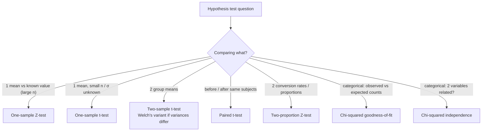

# Section 9 — Hypothesis Testing

## Lectures covered
- Null vs Alternate Hypothesis
- Z Test, Rejection Region · p-Value
- Statistical Power & Effect Size
- A/B Testing · A/B Testing Using Z Test
- T-test
- Chi-squared Distribution · Chi-squared Test of Goodness of Fit · Chi-squared Test of Independence

---

## In one sentence
**Hypothesis testing** is a court procedure: you assume "no effect" is true (H₀), look at the data, and ask *"how rare would this evidence be if H₀ were really true?"* — if rare enough, you reject H₀.

## Real-world analogy
Think of hypothesis testing as a **courtroom**:
- **H₀ (null)** = "The defendant is innocent" — the default assumption
- **H₁ (alternative)** = "The defendant is guilty" — what the prosecution wants to prove
- **Evidence** = your data
- **p-value** = "If the defendant were really innocent, how likely is this evidence?"
- **α (0.05)** = the bar for "beyond reasonable doubt"
- **Type I error** = convicting an innocent person (false positive)
- **Type II error** = letting a guilty person walk (false negative)

You never *prove* innocence — you can only fail to disprove it. Same in statistics.

## The intuition (plain English)
1. State a **boring default** (H₀) — usually "no effect, no difference."
2. Collect data.
3. Compute how surprising the data is **assuming H₀ is true** → that's the **p-value**.
4. If p-value is below your tolerance threshold (usually 0.05), reject H₀.
5. Otherwise, the data isn't strong enough — *fail to reject* H₀ (not the same as proving it).

That's the whole game. Different tests (Z, t, chi-squared) just compute the p-value differently for different data types.

## Mini worked example — is the new ad better?

You run an old ad for a week and a new ad for a week. Conversions:
```
Old ad:   500 clicks of 10,000 visitors  → 5.0% conversion
New ad:   600 clicks of 10,000 visitors  → 6.0% conversion
```

The new ad is 1pp better. But is it a *real* effect or random noise?

**Setup:**
- H₀: new ad = old ad (the 1pp lift is just luck)
- H₁: new ad ≠ old ad
- α = 0.05

**Compute the test (two-proportion Z-test):**
```
pooled rate    = (500 + 600) / 20000  = 0.055
SE             = √[ 0.055 × 0.945 × (1/10000 + 1/10000) ]  ≈ 0.00322
z              = (0.06 − 0.05) / 0.00322  ≈ 3.10
p-value        ≈ 0.0019
```

Since p (0.0019) < α (0.05), **reject H₀**. The 1pp lift is real, not chance.

But wait — is 1pp **practically** meaningful? That's where **effect size** comes in. p-value tells you *if* the effect exists; effect size tells you *how big* it is. Both matter.

## At-a-glance — pick the right test



## The four numbers you must always report

| Number | What it means |
|--------|---------------|
| **p-value** | "How surprising is the data under H₀?" — small = reject H₀ |
| **Effect size** (e.g., Cohen's d, lift) | "How big is the difference?" — independent of sample size |
| **Confidence interval** | "What's the plausible range for the true effect?" |
| **Sample size / power** | "Were we equipped to detect this effect?" — pre-computed before running the test |

A "p < 0.05" alone is **not** a complete result. Always pair it with the other three.

## Common traps that cost real money

- **Peeking**: stopping the A/B test the moment p < 0.05 → inflates your Type I rate (you'll see false wins).
- **Multiple metrics**: testing 20 metrics at α=0.05 → you expect 1 false positive *just by chance*.
- **Huge samples + tiny effects**: a 0.1% lift becomes "highly significant" but worthless to your business.
- **One-sided tests after seeing the data**: post-hoc cherry-picking masquerading as analysis.

If you internalize one thing from this chapter: **statistical significance ≠ practical significance**.

---

## 1. The framework — what hypothesis testing actually does

You have a claim ("the new ad performs better than the old"). You collect data. The data shows *some* difference. **Is the difference real, or could it have happened by chance?**

Hypothesis testing turns "is this real?" into a quantified probability — the **p-value** — and a decision rule.

---

## 2. H₀ and H₁

- **H₀** (null hypothesis): the boring default. "There's no effect / no difference."
- **H₁** (alternative hypothesis): what you'd like to prove. "There IS an effect."

You either **reject H₀** or **fail to reject H₀**. You never "accept" H₀ — absence of evidence ≠ evidence of absence.

### Examples

| Question | H₀ | H₁ |
|---|---|---|
| New drug works better than placebo? | drug = placebo | drug > placebo |
| New page CTR = old page CTR? | CTR_new = CTR_old | CTR_new ≠ CTR_old |
| Coin is fair? | p_heads = 0.5 | p_heads ≠ 0.5 |

### One-sided vs two-sided
- **Two-sided**: "different" (in either direction)
- **One-sided**: "better than" or "less than" (direction specified upfront)

Default to two-sided unless you have a strong directional reason. Don't pick one-sided after looking at the data.

---

## 3. Type I and Type II errors

|  | H₀ true | H₀ false |
|---|---|---|
| **Reject H₀** | Type I (false positive) | ✅ correct |
| **Fail to reject** | ✅ correct | Type II (false negative) |

- α (alpha) = P(Type I) — typically 0.05 (5%)
- β (beta) = P(Type II) — depends on effect size + sample size
- **Power** = 1 − β = P(detecting a real effect)

### α and the threshold
α = 0.05 means: "I'm willing to tolerate a 5% chance of falsely flagging a non-effect as an effect."

### Power
Targeted power: 80% (industry standard) or 90%. Higher power needs larger sample.

---

## 4. p-value

The probability of observing data **as extreme as ours, assuming H₀ is true**.

- Small p (< 0.05): "if H₀ were true, our data would be weird → reject H₀"
- Large p (≥ 0.05): "our data is consistent with H₀ → fail to reject"

### Common misinterpretations (every one of these is WRONG)
- ❌ "p = 0.03 means there's a 3% chance H₀ is true"
- ❌ "p = 0.03 means the effect is small / large"
- ❌ "p < 0.05 means the result is important"
- ❌ "p > 0.05 means H₀ is true"

### Right interpretation
> "Assuming H₀ is true, the probability of seeing data this extreme is p."

p-value answers a *very specific* question. It does NOT measure the magnitude of effect (use **effect size**) nor the *probability* of H₁.

---

## 5. Z-test (large samples, σ known or large n)

Test statistic:
$$Z = \frac{\bar{x} - \mu_0}{\sigma / \sqrt{n}}$$

Where:
- $\bar{x}$ = sample mean
- $\mu_0$ = the H₀ value
- $\sigma / \sqrt{n}$ = standard error

### Decision
Compare |Z| to critical value (e.g., 1.96 for two-sided α = 0.05). Or compute p-value from Z.

```python
from scipy import stats
z = (sample_mean - mu0) / (sigma / np.sqrt(n))
p = 2 * (1 - stats.norm.cdf(abs(z)))         # two-sided
# decide: if p < 0.05, reject H₀
```

### Solar panel example (continuing from CLT chapter)
$\bar{x} = 4.7$, $s = 0.6$, $n = 100$, claim $\mu_0 = 5$.

```python
z = (4.7 - 5) / (0.6 / np.sqrt(100))
# z = -5.0
# |z| = 5.0 → way beyond 1.96 → reject H₀
# p-value ≈ 5e-7 (essentially 0)
```

The manufacturer's 5 kWh claim is statistically rejected.

---

## 6. T-test

Same shape as Z-test, but uses t-distribution. Use when:
- Sample size is small (< 30) **and**
- Population σ is unknown (almost always)

### One-sample t-test
"Does my sample mean differ from a known value?"
```python
from scipy import stats
t_stat, p = stats.ttest_1samp(sample, popmean=5)
```

### Two-sample t-test (independent samples)
"Do these two groups have different means?"
```python
t_stat, p = stats.ttest_ind(group_a, group_b, equal_var=False)   # Welch's t-test
```

### Paired t-test
"Did the same subjects change?" (before/after)
```python
t_stat, p = stats.ttest_rel(before, after)
```

### Assumptions
- Approximately Normal samples (CLT helps for n ≥ 30)
- For independent two-sample: ideally similar variance (Welch's relaxes this)
- Paired version requires: paired observations, differences approximately Normal

---

## 7. Chi-squared tests

For **categorical** data.

### Test of goodness-of-fit
"Does my categorical data match a hypothesized distribution?"

Example: A die rolled 60 times. Expected 10 of each face. Observed: [12, 9, 11, 8, 13, 7]. Is the die fair?

```python
from scipy.stats import chisquare
observed = [12, 9, 11, 8, 13, 7]
expected = [10] * 6
stat, p = chisquare(observed, expected)
# p-value tells us if observed differs from expected significantly
```

### Test of independence
"Are two categorical variables related?"

Example: Is hire decision (hire/no-hire) independent of gender? Build a contingency table.

```python
import numpy as np
from scipy.stats import chi2_contingency

table = np.array([[40, 60],          # hired (men, women)
                  [10, 30]])         # not hired

chi2, p, dof, expected = chi2_contingency(table)
```

H₀: independent. p < 0.05 → reject; the variables are related.

### Assumptions
- Each expected count ≥ 5 (else use Fisher's exact)
- Independent observations

---

## 8. Effect size — what p-value won't tell you

p-value tells you "is there an effect?". **Effect size** tells you "how big is it?". Both matter.

### Cohen's d (for two-group means)
$$d = \frac{\bar{x}_1 - \bar{x}_2}{s_{pooled}}$$

| |d| | Interpretation |
|---|---|
| 0.2 | small |
| 0.5 | medium |
| 0.8 | large |

```python
import numpy as np
def cohens_d(a, b):
    pooled = np.sqrt((a.std(ddof=1)**2 + b.std(ddof=1)**2) / 2)
    return (a.mean() - b.mean()) / pooled
```

### Why this matters
With huge samples (millions of users), tiny differences become "statistically significant" (p < 0.05) but are **practically meaningless**. Always pair p with effect size.

---

## 9. A/B testing — putting it together

### Setup
- Randomly split users into A (control) and B (treatment)
- Both see the version, traffic identical otherwise
- Measure the outcome (CTR, conversion, revenue per user)

### Pre-launch checklist
- [ ] Define metric upfront (don't peek and decide later)
- [ ] Pre-register direction (one-sided vs two-sided)
- [ ] Pick α (usually 0.05) and power (usually 0.80)
- [ ] Compute required sample size

### Sample size calculation
For two-proportion z-test:
```python
import statsmodels.stats.power as smp

# we want to detect 2pp lift on a 10% baseline; α=.05, power=.80
n = smp.zt_ind_solve_power(effect_size=0.06,    # standardized effect (small lift)
                           alpha=0.05,
                           power=0.80,
                           ratio=1.0,
                           alternative="two-sided")
```

For two-sample t-test:
```python
n = smp.tt_ind_solve_power(effect_size=0.5,      # Cohen's d = 0.5 (medium)
                           alpha=0.05,
                           power=0.80)
```

> Don't run an A/B test without first computing required n. Otherwise you risk under-powered tests (waste time) or over-powered tests (catch trivial effects).

### A/B test using Z-test for proportions
H₀: p_a = p_b. H₁: p_a ≠ p_b.

```python
import numpy as np
from scipy.stats import norm

n_a, k_a = 5000, 510    # control: 5000 users, 510 conversions
n_b, k_b = 5000, 600    # treatment: 5000 users, 600 conversions

p_a = k_a / n_a
p_b = k_b / n_b
p_pooled = (k_a + k_b) / (n_a + n_b)
se = np.sqrt(p_pooled * (1 - p_pooled) * (1/n_a + 1/n_b))

z = (p_b - p_a) / se
p_value = 2 * (1 - norm.cdf(abs(z)))
print(f"lift: {p_b-p_a:.4f}, z={z:.2f}, p={p_value:.4f}")
```

### Common A/B testing mistakes
- **Peeking**: stopping the test early when p < 0.05 → inflates Type I error
- **Multiple metrics without correction**: 20 metrics × α=0.05 → expect 1 false positive
- **Selection effects**: treatment differs from control in ways unrelated to the change
- **Novelty effect**: short tests catch the "new shiny" lift that fades

---

## 10. Translating to AtliQo Bank Phase 2

The Phase-2 goal is to validate the chosen target segment via a controlled experiment:
- A/B: Variant A = standard offer; Variant B = tailored credit-card pitch to chosen segment
- Metric: application rate (or, lower-funnel: approval + activation)
- Sample size: power-analyzed up front
- Test: two-proportion Z-test
- Decision rule: H₀ rejected at α=0.05 + meaningful effect size (e.g., ≥ 1pp lift)

This is the bridge from this chapter to a real-world deliverable.

---

## 11. Common pitfalls (the cheat sheet)

| Mistake | Why it's wrong |
|---|---|
| Reading p < 0.05 as "result is true" | only "data unlikely under H₀" |
| Reading p > 0.05 as "no effect exists" | "we lacked evidence" |
| Multiple comparisons without correction | inflated Type I rate |
| Peeking + stopping early | also inflated Type I |
| Pure p-value reporting | always pair with effect size |
| Using Z when σ unknown + n small | use t |
| Chi-squared with cells < 5 | use Fisher's exact |
| Choosing one-sided after data | post-hoc cherry-pick |

## Self-check

- [ ] State H₀ and H₁ for "the new email subject line increases CTR."
- [ ] Define Type I and Type II errors.
- [ ] What does p = 0.04 actually mean?
- [ ] When use Z-test vs t-test?
- [ ] When use chi-squared goodness-of-fit vs chi-squared independence?
- [ ] What's Cohen's d and why is it important?
- [ ] Walk through the steps of designing an A/B test.
- [ ] Why is "peeking" at A/B test results a problem?
- [ ] Compute required n for an A/B test with baseline 10% conversion, MDE +2pp, 80% power, α 0.05.
- [ ] How does this connect back to AtliQo Phase 2?

---

## Glossary

| Term | Plain meaning |
|------|---------------|
| **Hypothesis test** | A formal procedure for deciding whether observed data contradicts a default assumption |
| **H₀ (null hypothesis)** | The "boring default" — usually "no effect, no difference, no change" |
| **H₁ (alternative)** | The thing you'd like to prove — the opposite of H₀ |
| **Reject H₀** | The data is too surprising under H₀; we conclude H₁ is more credible |
| **Fail to reject H₀** | Not enough evidence to overturn H₀ — *not* the same as "H₀ is true" |
| **One-sided test** | "A is greater than B" (direction specified upfront) |
| **Two-sided test** | "A differs from B" (either direction). Default unless you have a reason. |
| **Type I error (α)** | False positive: rejecting H₀ when it's actually true. Usually capped at 5%. |
| **Type II error (β)** | False negative: failing to reject H₀ when H₁ is actually true |
| **Power (1 − β)** | The chance of detecting a real effect. Industry default: 80%. |
| **p-value** | "Assuming H₀ is true, the probability of seeing data this extreme (or more)" |
| **α (significance level)** | The cutoff for p-value. Reject H₀ if p < α. Common: 0.05. |
| **Test statistic** | A number (z, t, χ²) summarizing how far the data is from H₀ |
| **Critical value** | The boundary value; if test statistic crosses it, we reject H₀ |
| **Rejection region** | The range of test-statistic values for which we'd reject H₀ |
| **Z-test** | Hypothesis test using the Standard Normal — works for known σ or large n |
| **t-test** | Z-test's small-sample sibling — uses t-distribution to handle estimated σ |
| **Welch's t-test** | Two-sample t-test that doesn't require equal variances |
| **Paired t-test** | Compares before/after on the *same* subjects |
| **Chi-squared (χ²) test** | For categorical data — tests fit to expected counts or independence between two categoricals |
| **Goodness-of-fit (χ²)** | Does this categorical distribution match what we expected? |
| **Test of independence (χ²)** | Are these two categorical variables related? |
| **Effect size** | A scale-free measure of magnitude (e.g., Cohen's d) — independent of sample size |
| **Cohen's d** | Standardized mean difference. 0.2 = small, 0.5 = medium, 0.8 = large. |
| **A/B test** | A randomized controlled experiment online — the gold standard for causal claims |
| **MDE (Minimum Detectable Effect)** | The smallest effect size your test is designed to detect with given power |
| **Peeking** | Checking results before the planned end and stopping early — inflates false-positive rate |
| **Bonferroni correction** | When testing many things, divide α by the number of tests to control overall false-positive rate |
| **Statistical significance ≠ practical significance** | A real effect can still be too small to matter |

## Further reading
- Previous: [01-central-limit-theorem.md](01-central-limit-theorem.md) — the math making all this possible
- AtliQo Bank context: [../02-atliqo-bank-project/02-phase-1-find-target-market.md](../02-atliqo-bank-project/02-phase-1-find-target-market.md)
- ML application: [../../06-machine-learning/02-classification/02-classification-metrics.md](../../06-machine-learning/02-classification/02-classification-metrics.md) (precision/recall use the same Type I/II framing)
