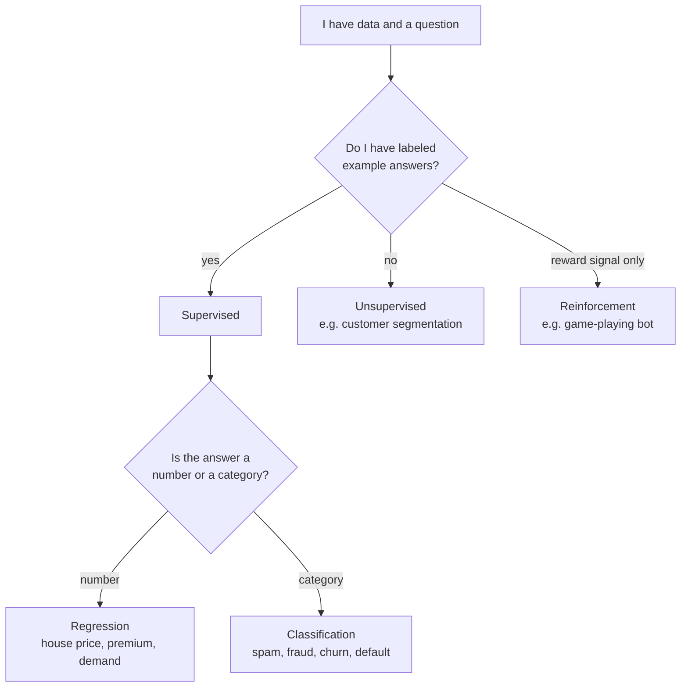

# Foundations 1 — Intro to ML & Problem Categories

## Lectures covered
- Introduction to Machine Learning
- Classification vs Regression
- Supervised vs Unsupervised Learning

---

## In one sentence
**Machine learning** is teaching a computer to find patterns in examples — instead of you writing the rules, the data writes them for the computer.

## Real-world analogy
Think of how a child learns to spot a dog. You don't hand them a 200-page rulebook ("ears must be triangular, fur length 2–8cm…"). You point at dozens of dogs and say "dog." After enough examples, they generalize to a new dog they've never seen. ML works the same way — show it 10,000 emails labeled spam/not-spam and it learns its own rule.

## The intuition (plain English)
- A model is a **function** `f(x) → y` that maps inputs (features) to outputs (predictions).
- Instead of you coding `if income > 50k and age < 30 then risky`, the model **learns the coefficients** from labeled examples.
- **Supervised learning** has answer keys (labels). **Unsupervised** has only the inputs and asks "what groups exist here?".
- Your job is to (1) frame the right problem, (2) feed clean data, (3) pick a sensible algorithm, (4) honestly evaluate.

## Mini worked example — house price vs spam email
You're a realtor. You have 1,000 past sales with `(sqft, bedrooms, age) → sale_price`. You want to predict the price of a new listing.
- Inputs `x` = (1500 sqft, 3 bedrooms, 12 years old)
- Output `y` = $345,000 (a continuous number → **regression**)

Now you're an email provider. You have 50,000 emails with `(words, sender) → spam? (yes/no)`.
- Inputs `x` = ("free money urgent", unknown_sender)
- Output `y` = "spam" (a category → **classification**)

Same recipe — different label type changes the algorithm and metric.

## At-a-glance — the ML problem family tree



## Why this matters
- **Frames every ML decision** — picking the wrong category (regression vs classification) means the wrong loss, wrong metric, wrong model.
- **Sets honest expectations** — ML works when patterns exist in the data; it can't conjure signal from noise.
- **Decides what data you collect** — supervised needs labels (often expensive); unsupervised doesn't.
- **Drives later module choice** — every later file (linear regression, logistic regression, k-means) is one *type* of model on this tree.

---

## 1. What is Machine Learning, in one paragraph

A **machine learning model** is a function `f(x) → y` whose parameters are learned from examples instead of being hand-coded. You give it inputs (features) and (for supervised learning) target outputs, and it tunes its parameters to minimize a loss between its predictions and the true outputs.

ML works when:
- The pattern *exists* in the data
- We have *enough* labeled examples
- The relationship is not easier to write as `if/else`

ML doesn't work when:
- The signal is too weak vs noise
- The task changes faster than data can be collected
- The cost of wrong predictions is too high to allow probabilistic answers

---

## 2. Supervised vs Unsupervised vs Reinforcement

| Type | Has labels? | Goal | Example |
|---|---|---|---|
| **Supervised** | yes | predict y from x | spam classifier, house price |
| **Unsupervised** | no | find structure | customer segmentation, anomaly detection |
| **Semi-supervised** | partial | leverage few labels + lots of unlabeled | medical imaging |
| **Self-supervised** | "labels" generated from data itself | pre-train large models | LLMs, BERT |
| **Reinforcement** | reward signal | learn a policy through trial-and-error | game-playing, robotics |

The bootcamp focuses heavily on **supervised** and dips into **unsupervised** (k-means).

---

## 3. Classification vs Regression (the two flavors of supervised)

### Regression — predicting a continuous number
- House price
- Stock return
- Insurance premium ← **healthcare project**
- Tomorrow's temperature

Output: any real number.
Loss: MSE / MAE.

### Classification — predicting a discrete category
- Spam / not spam (binary)
- Disease type (multiclass)
- Will the customer churn? (binary)
- Credit risk: default / not default ← **credit risk project**

Output: a category label (or, more precisely, probabilities over categories).
Loss: cross-entropy / log loss.

### Multi-label classification (same input, multiple labels)
- Tagging a photo with all objects it contains
- Multiple medical conditions for one patient

### Ordinal regression / classification (categories with order)
- Movie ratings (1–5 stars)
- Severity (mild / moderate / severe)

Could be modeled as either; ordinal-aware methods give better results when applicable.

---

## 4. Anatomy of a supervised problem

```
features X        target y
─────────         ────────
age, income       insurance_premium      ← regression
age, score        will_default            ← classification
words             spam_or_not             ← classification

         │
         ▼
   training set ──> model.fit(X, y)
         │
         ▼
   test set    ──> model.predict(X) → ŷ
         │
         ▼
   evaluation: compare y vs ŷ
```

- `X` is a 2D array (n_samples × n_features)
- `y` is 1D (n_samples)
- Splitting train/test honestly is non-negotiable

---

## 5. The minimum sklearn shape

```python
from sklearn.linear_model import LinearRegression
from sklearn.model_selection import train_test_split
from sklearn.metrics import mean_squared_error

X_train, X_test, y_train, y_test = train_test_split(X, y, test_size=0.2, random_state=42)

model = LinearRegression()
model.fit(X_train, y_train)
y_pred = model.predict(X_test)

print(mean_squared_error(y_test, y_pred))
```

Every sklearn estimator follows this pattern: `.fit(X, y)`, `.predict(X)`, `.score(X, y)`.

This consistency is the secret weapon of sklearn.

---

## 6. Train / Validation / Test — three splits, three purposes

| Split | Used for | When |
|---|---|---|
| **Train** | fitting model parameters | always |
| **Validation** | tuning hyperparameters | during model selection |
| **Test** | final, honest performance estimate | once, at the end |

### Common ratio
- 70 / 15 / 15 or 80 / 10 / 10
- Or: train + validation done by k-fold CV; test held out separately

### The cardinal rule
> **Never look at the test set during model development.** Once it's been used to inform a decision, it's contaminated and no longer "honest."

---

## 7. The full ML pipeline in one diagram

```
business problem
       │
       ▼
data acquisition  ── EDA  ── cleaning  ── feature engineering
       │
       ▼
train/val/test split
       │
       ▼
choose algorithm  ── fit  ── tune  ── evaluate
       │
       ▼
deploy  ──  monitor  ──  retrain
```

Codebasics covers all of this in the **AI Project Lifecycle** section (under `05-lifecycle-mlops/`).

---

## 8. How to frame a real problem as ML

Walk through these questions before fitting anything:

1. **What's the business question?** (Reduce credit defaults? Predict churn? Pick top customers?)
2. **What's the unit of prediction?** (one customer? one transaction? one day?)
3. **What's the target variable?** Is it continuous, binary, multiclass, or ordinal?
4. **What features are available *at prediction time*?** (Avoid leakage from the future.)
5. **What's the right metric?** (Accuracy is rarely the right answer.)
6. **What's the cost of false positive vs false negative?** (Asymmetric in fraud, healthcare, etc.)
7. **How will the prediction be used?** (Real-time API? Daily batch? Decision support tool?)
8. **What's the simplest baseline?** (Mean prediction? Logistic regression?)

Skip these and you'll end up training a beautiful model on the wrong problem.

---

## 9. Common pitfalls

| Mistake | Effect | Fix |
|---|---|---|
| Mixing train and test | inflated performance, useless model | strict split before any feature engineering |
| Using a feature that's only known *after* the prediction event | leakage | check timing of every feature |
| Forgetting to handle target in production format | model can't run | trace data flow end to end |
| Skipping baseline | can't tell if your fancy model is really better | always train a dumb baseline first |
| Optimizing accuracy on imbalanced data | useless model | use precision/recall/F1/ROC-AUC |

## Self-check

- [ ] Difference between supervised and unsupervised? Give an example of each.
- [ ] Difference between classification and regression?
- [ ] What does train/val/test serve?
- [ ] Why is "train_test_split before feature engineering" the right order?
- [ ] What's a baseline model and why train one?
- [ ] State 3 questions to ask before framing a problem as ML.
- [ ] What does sklearn's `.fit / .predict / .score` interface look like?

---

## Glossary

| Term | Plain meaning |
|------|---------------|
| **Machine learning (ML)** | Computer programs that learn rules from examples instead of being explicitly coded |
| **Model** | The learned function `f(x) → y`, captured in numbers (parameters/weights) |
| **Features (X)** | The inputs you feed the model — columns like age, income, sqft |
| **Target / label (y)** | The answer you want the model to predict (price, spam yes/no) |
| **Sample / row** | One example — one customer, one email, one transaction |
| **Supervised learning** | You have labeled examples; model learns to map x → y |
| **Unsupervised learning** | No labels; model finds structure (groups, anomalies) |
| **Semi-supervised** | Few labeled examples + many unlabeled ones |
| **Self-supervised** | The model invents its own labels from raw data (how LLMs are pre-trained) |
| **Reinforcement learning** | Model learns by trial-and-error from a reward signal (game-playing) |
| **Classification** | Predict a category (spam/not, default/not) |
| **Regression** | Predict a number (price, premium, demand) |
| **Multi-label classification** | One input gets multiple labels (a photo is both "dog" and "outdoor") |
| **Ordinal classification** | Categories that have a natural order (low/medium/high, 1–5 stars) |
| **Loss / cost function** | A number that says "how wrong are you?" — the model tries to make it small |
| **MSE (Mean Squared Error)** | Average of squared (predicted − actual). Standard regression loss. |
| **Cross-entropy / log loss** | Standard classification loss; punishes confident wrong predictions hard |
| **Train set** | Data the model fits on |
| **Validation set** | Data used to compare hyperparameter choices |
| **Test set** | Final, never-touched data used once to estimate real-world performance |
| **Train/test split** | Splitting your data so test stays untouched until the very end |
| **Baseline model** | The dumbest sensible model (predict the mean, predict majority class) — a sanity check before fancy models |
| **Data leakage** | Using info at training time that wouldn't be available at prediction time — fake high scores |
| **Feature engineering** | Hand-crafting new input columns (BMI, day-of-week, log of income) to help the model |
| **sklearn** | scikit-learn — the standard Python ML library; every estimator has `.fit()`, `.predict()`, `.score()` |
| **`.fit(X, y)`** | "Learn parameters from this data" |
| **`.predict(X)`** | "Make predictions for these inputs" |
| **Hyperparameter** | A knob you set before training (max tree depth, learning rate); not learned from data |

## Further reading
- Next: [02-linear-regression.md](02-linear-regression.md) — the simplest supervised model
- Then: [../02-classification/01-logistic-regression.md](../02-classification/01-logistic-regression.md) — the simplest classifier
- Style guide: [../../../BEGINNER-STYLE-GUIDE.md](../../../BEGINNER-STYLE-GUIDE.md)
