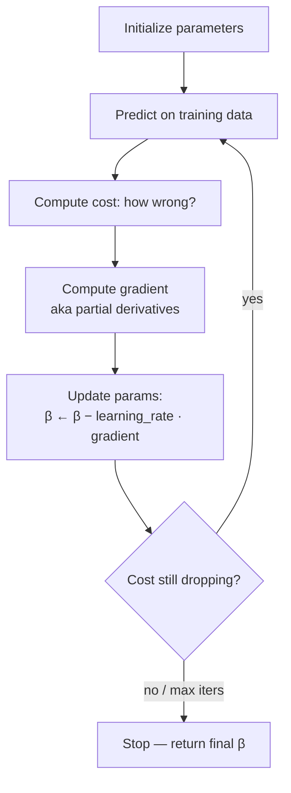

# Foundations 3 — Cost Function, Derivatives, Gradient Descent

## Lectures covered
- Cost Function
- Derivatives and Partial Derivatives
- Chain Rule
- Gradient Descent

---

## In one sentence
**Gradient descent** is how a model finds its best parameters by walking downhill on a "wrongness landscape" — a small step at a time, in the direction the slope says is steepest.

## Real-world analogy
You're blindfolded on a hill and want to reach the lowest point. You feel which way the ground tilts down most, take a small step, then feel again. Repeat until you stop sinking. The hill is the **cost function** (how wrong the model is for each parameter setting). The walking is **gradient descent**.

## The intuition (plain English)
1. The model has tunable parameters (e.g., the slope and intercept of a line).
2. For any setting of those parameters we can score "how wrong are you?" — that's the **cost** (or **loss**).
3. The **gradient** is just calculus's name for the direction of steepest *uphill*. Negate it to get the steepest *downhill*.
4. Repeatedly nudge each parameter by `−learning_rate × gradient` and the cost falls. When the cost stops dropping, you've reached a (good) bottom.

The whole reason calculus shows up in ML is to compute that gradient automatically — for any model, including neural networks with millions of parameters.

## Mini worked example — fitting a slope by hand

You're fitting `y = β · x` (no intercept) on three points:

```
x:  1, 2, 3
y:  2, 4, 6
```

True best β is 2 (the line `y = 2x` fits perfectly). Start at β = 0, learning rate η = 0.1.

Cost = `(1/3) Σ (yᵢ − β·xᵢ)²`. Gradient w.r.t. β = `−(2/3) Σ xᵢ(yᵢ − β·xᵢ)`.

```
step 0: β = 0.0
        residuals = (2, 4, 6); gradient = -(2/3)·(1·2 + 2·4 + 3·6) = -18.67
        β ← 0.0 − 0.1·(−18.67) = 1.87

step 1: β = 1.87
        residuals = (0.13, 0.26, 0.39); gradient ≈ -1.24
        β ← 1.87 − 0.1·(−1.24) = 1.99

step 2: β = 1.99
        residuals tiny; gradient ≈ -0.08
        β ← 1.99 − 0.1·(−0.08) = 2.00   ← converged
```

Three steps and we've found the answer. Neural networks do this same thing — just with millions of parameters and millions of steps.

## At-a-glance — the descent



## Why this matters
- **The universal training algorithm.** Linear regression, logistic regression, and every neural network are trained by some flavor of gradient descent.
- **Learning rate is the most important hyperparameter you'll ever tune.** Too big = cost explodes; too small = forever to train.
- **Chain rule = backpropagation.** When you stack functions (the layers of a neural net), the chain rule is what carries the gradient back through all of them.
- **Connects to math foundations**: derivatives → see [../../05-math-statistics/01-foundations](../../05-math-statistics/01-foundations) for the calculus refresher.

---

## 1. Cost (loss) function

The cost function tells us **how wrong** the model is — a number we minimize.

For linear regression, the standard cost is **Mean Squared Error**:
$$J(\beta) = \frac{1}{n}\sum_{i=1}^{n} (y_i - \hat{y}_i)^2$$

where $\hat{y}_i = \beta_0 + \beta_1 x_i$ (single-feature case).

### Why squared (not absolute)?
- Differentiable everywhere (calculus works)
- Penalizes big errors more (good for many domains)
- Gives the closed-form OLS solution

(MAE penalizes errors linearly — robust to outliers but not differentiable at 0; we'll meet it in evaluation.)

### Visualizing it
For one parameter, plot J as a function of β:
```
J(β)
│         •
│       •
│ •         <- minimum somewhere here
│   •
│     •
└───────────► β
```

In multi-D, you have a *cost surface* — gradient descent walks downhill on it.

---

## 2. Derivatives — the slope at a point

The derivative of $f(x)$ tells you how fast f changes as x changes:
$$f'(x) = \lim_{h \to 0} \frac{f(x+h) - f(x)}{h}$$

### Common derivatives
- $\frac{d}{dx}(x^n) = n x^{n-1}$
- $\frac{d}{dx}(e^x) = e^x$
- $\frac{d}{dx}(\ln x) = 1/x$
- $\frac{d}{dx}(\sin x) = \cos x$

### Why ML cares
Gradient descent uses the **derivative of the loss with respect to each parameter** to know which way to move.

---

## 3. Partial derivatives

For a function of multiple variables:
$$f(x, y) = x^2 + 3xy + y^2$$

$$\frac{\partial f}{\partial x} = 2x + 3y$$
$$\frac{\partial f}{\partial y} = 3x + 2y$$

You treat the *other* variables as constants when differentiating.

The **gradient** is the vector of all partial derivatives:
$$\nabla f = \left(\frac{\partial f}{\partial x}, \frac{\partial f}{\partial y}\right)$$

The gradient points in the direction of *steepest ascent*. Negative gradient → steepest descent. That's how gradient descent works.

---

## 4. Chain rule

If `y = f(g(x))`, then:
$$\frac{dy}{dx} = f'(g(x)) \cdot g'(x)$$

In words: derivative of outer × derivative of inner.

### Example
$y = (3x + 2)^4$
- Outer: $u^4$ → derivative $4u^3$
- Inner: $3x + 2$ → derivative $3$
- Combined: $4(3x+2)^3 \cdot 3 = 12(3x+2)^3$

### Why ML cares — backpropagation
Neural networks are stacked function compositions. The chain rule is what propagates gradients backward through the layers (covered in DL module).

---

## 5. Gradient descent — the algorithm

### Update rule
$$\beta_{t+1} = \beta_t - \eta \cdot \nabla J(\beta_t)$$

- $\eta$ — learning rate (step size)
- $\nabla J$ — gradient at current parameters

In words: take a step in the direction opposite to the gradient.

### For linear regression's MSE
$$\frac{\partial J}{\partial \beta_1} = -\frac{2}{n}\sum (y_i - \hat{y}_i) x_i$$
$$\frac{\partial J}{\partial \beta_0} = -\frac{2}{n}\sum (y_i - \hat{y}_i)$$

### Code (from scratch)
```python
import numpy as np

def gradient_descent(X, y, lr=0.01, n_iter=1000):
    n, p = X.shape
    X_b = np.c_[np.ones((n, 1)), X]                # add intercept column
    beta = np.zeros(p + 1)

    for _ in range(n_iter):
        y_pred = X_b @ beta
        residual = y - y_pred
        grad = -(2/n) * X_b.T @ residual           # gradient of MSE
        beta = beta - lr * grad

    return beta
```

This is *exactly* what `sklearn.linear_model.SGDRegressor` does under the hood.

---

## 6. The three flavors of gradient descent

| Flavor | Uses | Pros | Cons |
|---|---|---|---|
| **Batch GD** | the whole dataset per step | smooth convergence | slow, memory-heavy |
| **Stochastic GD (SGD)** | one sample per step | fast, online | noisy path |
| **Mini-batch GD** | a small batch per step | best of both | requires batch-size tuning |

Modern ML/DL almost always uses **mini-batch** (e.g., batch size 32 or 64).

---

## 7. Learning rate — the most important hyperparameter

| LR | Symptoms |
|---|---|
| Too small | very slow convergence, looks stuck |
| Just right | smooth descent, plateaus at minimum |
| Too large | oscillation, divergence (loss explodes) |

### Practical advice
- Start at 0.01 for linear models, 0.001 for neural nets
- Use a **learning rate scheduler** (decay over epochs) for DL
- Modern optimizers (Adam) adapt LR per parameter automatically

### Loss-curve sanity check
Plot training loss over iterations:
```python
import matplotlib.pyplot as plt
plt.plot(losses)
plt.xlabel("iteration"); plt.ylabel("loss")
```
- Decreasing smoothly → good
- Plateauing → maybe done; or LR too small
- Bouncing → LR too large
- Going up → LR way too large or NaN

---

## 8. Convex vs non-convex

For OLS linear regression, J is **convex** — a single global minimum, so gradient descent finds it.

For neural networks, J is **non-convex** — many local minima, saddle points, plateaus. Gradient descent finds *a* good minimum but rarely the global one. (Surprisingly, "good local minima" are usually fine in practice.)

---

## 9. Connecting to OLS closed form

For linear regression, why bother with gradient descent when we have the closed form $\beta = (X^TX)^{-1}X^Ty$?

| Method | Best when |
|---|---|
| **OLS closed form** | small n (computing $(X^TX)^{-1}$ scales O(p^3)), few features |
| **Gradient descent** | huge n or p, online learning, want regularization tricks, or extending to non-linear models |

For deep learning, no closed form exists — gradient descent is the *only* way.

---

## 10. Common pitfalls

| Mistake | Effect | Fix |
|---|---|---|
| LR too high | loss diverges | reduce LR |
| LR too low | training takes forever | raise LR; try LR scheduler |
| Not standardizing features | features at different scales mess up GD | scale before fitting |
| Bug in gradient | wrong direction → loss goes up | verify with numerical gradient |
| No convergence criterion | runs forever | stop when loss change < ε |

## Self-check

- [ ] Write MSE for linear regression.
- [ ] Why squared instead of absolute error?
- [ ] What's the gradient and why does it matter for optimization?
- [ ] State the chain rule and apply it to $y = \sin(3x^2)$.
- [ ] Write the gradient descent update rule.
- [ ] Difference between batch, stochastic, and mini-batch GD?
- [ ] What happens when LR is too high vs too low?
- [ ] Why is OLS exact for linear regression but not for neural nets?
- [ ] Can you implement gradient descent for linear regression in 20 lines of NumPy?

---

## Glossary

| Term | Plain meaning |
|------|---------------|
| **Cost function / loss function** | A single number that says "how wrong is this model right now?" — gradient descent minimizes it |
| **MSE (Mean Squared Error)** | Average of squared residuals — the cost used for linear regression |
| **MAE (Mean Absolute Error)** | Average of absolute residuals — alternative cost, robust to outliers |
| **Residual** | One row's gap: `y_actual − y_predicted` |
| **Parameter / weight** | A learnable number inside the model (e.g., a slope coefficient) |
| **Hyperparameter** | A knob you set before training (learning rate, batch size) — *not* learned from data |
| **Derivative** | The slope of a function at one point — "if I nudge x slightly, how much does y change?" |
| **Partial derivative** | The slope along one variable while pretending the others are constants |
| **Gradient (∇)** | Vector of all partial derivatives — points uphill in the steepest direction |
| **Negative gradient** | Same vector, flipped — the direction to step for steepest descent |
| **Chain rule** | Calculus rule for derivatives of nested functions; the engine of backpropagation |
| **Backpropagation** | Applying the chain rule repeatedly to push gradients backward through a neural net's layers |
| **Gradient descent** | Iteratively step in the direction of negative gradient until cost stops dropping |
| **Learning rate (η, lr)** | How big each step is. Too big = diverge; too small = slow |
| **Batch gradient descent** | Use *all* training data per step — smooth but slow |
| **Stochastic gradient descent (SGD)** | Use *one* sample per step — fast but noisy |
| **Mini-batch gradient descent** | Use a small batch (32, 64) per step — the modern default |
| **Epoch** | One full pass over all training data |
| **Iteration / step** | One parameter update |
| **Convergence** | When cost stops decreasing meaningfully — you're done |
| **Local minimum** | A bottom that isn't the deepest — gradient descent can get stuck here on non-convex losses |
| **Global minimum** | The deepest point of the cost landscape |
| **Convex function** | A bowl-shaped loss — exactly one minimum (e.g., MSE for linear regression) |
| **Non-convex function** | Many bumps, valleys, saddles (e.g., neural-net loss). Still tractable in practice. |
| **Saddle point** | A flat spot that's neither min nor max — gradient is zero but cost isn't bottomed out |
| **Adam** | A modern optimizer that adapts learning rate per parameter — most-used in deep learning |
| **LR scheduler** | Strategy that decreases the learning rate as training progresses |
| **Numerical gradient check** | Compute gradient by finite differences as a sanity check on your analytic gradient |

## Further reading
- Previous: [02-linear-regression.md](02-linear-regression.md) — the model whose cost we're minimizing here
- Next: [04-model-evaluation-regression.md](04-model-evaluation-regression.md) — measuring how well the trained model actually does
- Deep-learning sequel: [../../07-deep-learning](../../07-deep-learning) — chain rule unlocks backpropagation
- Calculus refresher: [../../05-math-statistics/01-foundations](../../05-math-statistics/01-foundations)
