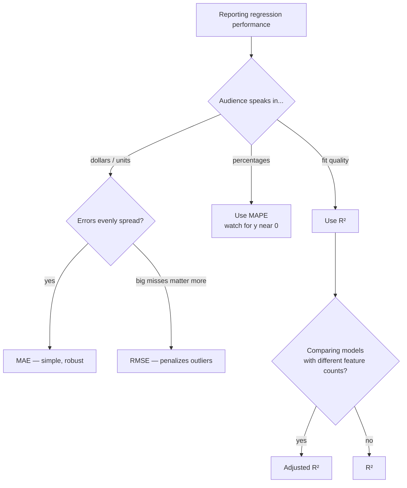

# Foundations 4 — Model Evaluation (Regression)

## Lectures covered
- Model Evaluation

---

## In one sentence
**Regression evaluation** turns "how good is my model?" into a few honest numbers (MAE, RMSE, R²) — and the right answer depends on whether you care about typical errors, big errors, or how much variance you explain.

## Real-world analogy
You buy a bathroom scale. You want to know how good it is. You can ask:
- "On average, how far off is each reading?" → **MAE** (mean absolute error).
- "How bad are the *worst* readings?" → **RMSE** (root mean squared error — punishes big misses harder).
- "Does it move with my actual weight at all, or is it useless?" → **R²** (correlation strength, kind of).

You wouldn't pick a scale on just one of those — and you don't pick an ML model on just one either.

## The intuition (plain English)
- **MAE** is "average mistake in the same units as y." Easiest to communicate ("we're off by $18k on average").
- **RMSE** is also in y's units, but big errors count quadratically — pick this when a $200k miss is way worse than ten $20k misses.
- **R²** is unitless; tells you the *fraction of variance* explained vs. always predicting the mean. Higher is better, max is 1.
- **MAPE** is percentage error — easy for execs but breaks when y is near 0.

You always look at both **train** and **test** numbers. A train-test gap reveals overfitting.

## Mini worked example — three predictions

You have 4 actual house prices and your model's predictions:

```
actual:    [200, 250, 300, 400]   (in thousands)
predicted: [210, 240, 320, 380]
errors:    [-10,  10, -20,  20]
```

```
MAE  = (|−10| + |10| + |−20| + |20|) / 4 = 60 / 4 = 15      → off by $15k typically
MSE  = (100 + 100 + 400 + 400) / 4       = 250
RMSE = √250                              ≈ 15.8             → similar to MAE here (errors balanced)
mean(actual) = 287.5
SS_res = 100+100+400+400 = 1000
SS_tot = (200−287.5)² + (250−287.5)² + (300−287.5)² + (400−287.5)² = 22,500
R²   = 1 − 1000/22500                    ≈ 0.956            → explains ~96% of variance
MAPE = (10/200 + 10/250 + 20/300 + 20/400) / 4 × 100 ≈ 5.4% → off by ~5% on average
```

Now imagine the prediction `380` was actually `100` (a $300k miss on a $400k house):

```
MAE  = (10 + 10 + 20 + 300) / 4 = 85
RMSE = √((100+100+400+90000)/4) = √22650 ≈ 150
```

RMSE jumped 10× while MAE only quintupled — that's the "RMSE punishes big errors" effect in action.

## At-a-glance — pick the right metric



## Why this matters
- **Picking the wrong metric mis-ranks models.** A model with great R² may have terrible MAE for your audience.
- **Train-test gap is your overfitting alarm.** Always print both.
- **Residual plots catch what numbers hide** — funnel shapes, U-curves, missing categorical features.
- **Healthcare project** reports MAE in dollars because that's what an underwriter cares about.

---

## 1. The evaluation question

After training, two questions:
1. **How wrong** is the model on average?
2. **How well** does it explain the variance in y?

Different metrics answer these differently. Pick the one matching your problem.

---

## 2. The four standard regression metrics

### MAE — Mean Absolute Error
$$\text{MAE} = \frac{1}{n}\sum |y_i - \hat{y}_i|$$
- Same units as y → directly interpretable ("off by $X dollars on average")
- Robust to outliers (linear penalty)
- Not differentiable at 0 (a quirk for optimization)

### MSE — Mean Squared Error
$$\text{MSE} = \frac{1}{n}\sum (y_i - \hat{y}_i)^2$$
- Penalizes big errors quadratically
- Units: y² (not directly interpretable)
- Differentiable everywhere → used as the **loss** during training

### RMSE — Root Mean Squared Error
$$\text{RMSE} = \sqrt{\text{MSE}}$$
- Same units as y
- Penalizes big errors more than MAE
- Default for "report a single number" in many contexts

### R² — Coefficient of Determination
$$R^2 = 1 - \frac{\sum (y_i - \hat{y}_i)^2}{\sum (y_i - \bar{y})^2}$$
- Range: ≤ 1 (1 = perfect; 0 = no better than mean; negative = worse than mean)
- "Fraction of variance explained"
- **Caveat**: high R² doesn't mean a useful model — it depends on baseline variance

### MAPE — Mean Absolute Percentage Error
$$\text{MAPE} = \frac{1}{n}\sum \left|\frac{y_i - \hat{y}_i}{y_i}\right| \times 100$$
- Easy to communicate ("we're off by 8%")
- Breaks when y is near 0 (division by ~0)

### sklearn shape
```python
from sklearn.metrics import (mean_absolute_error, mean_squared_error,
                              root_mean_squared_error, r2_score,
                              mean_absolute_percentage_error)

mae = mean_absolute_error(y_test, y_pred)
mse = mean_squared_error(y_test, y_pred)
rmse = root_mean_squared_error(y_test, y_pred)        # sklearn ≥1.4
r2 = r2_score(y_test, y_pred)
mape = mean_absolute_percentage_error(y_test, y_pred) * 100
```

---

## 3. Picking the right metric

| If... | use |
|---|---|
| You need a single, interpretable number | MAE or RMSE |
| Big errors are especially bad | RMSE / MSE |
| Outliers shouldn't dominate | MAE |
| The audience speaks in % | MAPE |
| You need "how good is this *vs* a constant baseline" | R² |
| Comparing models on the same data | any — pick one and stick with it |

> **For business reports, MAE in dollars/units is almost always the right choice.** R² is for academics.

---

## 4. Adjusted R² — when adding features

R² *always* goes up (or stays the same) when you add features, even garbage ones. Adjusted R² penalizes for free parameters:

$$R^2_{adj} = 1 - (1 - R^2) \cdot \frac{n - 1}{n - p - 1}$$

Where $p$ = number of features.

If adjusted R² goes up after adding a feature, the feature was probably useful.

---

## 5. Residual diagnostics — beyond a single number

A single metric can hide patterns. Always plot residuals.

### Residuals vs predicted
```python
residuals = y_test - y_pred
plt.scatter(y_pred, residuals); plt.axhline(0, color="red")
```

What you want: random cloud around 0.

What you don't want:
- **Funnel shape** → heteroscedasticity (variance grows with prediction)
- **U-shape / curve** → non-linearity, model is misspecified
- **Clusters** → missing categorical feature

### Residual histogram
```python
sns.histplot(residuals, kde=True)
```
Should be roughly Normal-ish around 0. Heavy skew → model is biased on certain ranges.

### Predicted vs actual
```python
plt.scatter(y_test, y_pred, alpha=0.5)
plt.plot([y.min(), y.max()], [y.min(), y.max()], "r--")     # 45° line
```
Points should hug the diagonal.

---

## 6. Train vs test metrics — the diagnostic

| Train metric | Test metric | Diagnosis |
|---|---|---|
| Good | Good | ✅ healthy model |
| Good | Bad (gap) | overfit — too complex |
| Bad | Bad | underfit — too simple, or bad data |
| Bad | Good | unusual; check for shuffling bug |

Always look at both — a test number alone hides overfitting.

```python
print("train R²:", model.score(X_train, y_train))
print("test  R²:", model.score(X_test, y_test))
```

---

## 7. Cross-validation — beyond a single split

A single train/test split has variance — your one number could be lucky/unlucky. Cross-validation averages over multiple splits.

```python
from sklearn.model_selection import cross_val_score
scores = cross_val_score(model, X, y, cv=5, scoring="r2")
print(scores.mean(), "±", scores.std())
```

We dive deep into CV in the **ensemble subfolder** (`03-cross-validation-tuning.md`).

---

## 8. Real example — interpreting an evaluation

You build a house-price model and report:
- MAE: $18,500
- RMSE: $32,000
- R²: 0.84
- MAPE: 9%

What this means:
- On average, prediction is off by $18.5k (MAE)
- A few large errors push RMSE to $32k (so heavy-tailed errors)
- Model captures 84% of price variance
- 9% mean percentage error → reasonable for real estate

**One-line summary**: "Our model predicts house prices with ~9% MAPE; performance degrades on luxury homes (>$2M)."

That's the kind of sentence stakeholders read. Lead with that, support with a chart.

---

## 9. Common pitfalls

| Mistake | Effect | Fix |
|---|---|---|
| Reporting train metric only | hides overfitting | always show train + test |
| Only R² | doesn't say the magnitude of error | pair with MAE / RMSE |
| MAPE on near-zero y | huge fluctuations | use SMAPE or absolute error |
| Comparing models on different splits | apples to oranges | use cross-val with `random_state` fixed |
| RMSE in different units across reports | can't compare | always include units |

## Self-check

- [ ] When use MAE vs RMSE?
- [ ] What does R² = 0.7 mean?
- [ ] Why does adding random features always raise R²?
- [ ] What does adjusted R² fix?
- [ ] How do you spot heteroscedasticity in a residual plot?
- [ ] How do you diagnose overfitting from train vs test scores?
- [ ] Why is MAPE risky when y can be near 0?
- [ ] Walk through how you'd present a regression model's performance to a non-technical exec.

---

## Glossary

| Term | Plain meaning |
|------|---------------|
| **MAE (Mean Absolute Error)** | Average of `|actual − predicted|` — same units as y; easy to communicate |
| **MSE (Mean Squared Error)** | Average of `(actual − predicted)²` — used as the loss in OLS; in y² units |
| **RMSE (Root Mean Squared Error)** | √MSE — back in y's units; penalizes big misses more than MAE |
| **R² (R-squared, coefficient of determination)** | Fraction of variance explained by the model. 1 = perfect; 0 = no better than mean. Negative = worse than mean. |
| **Adjusted R²** | R² penalized for free parameters — fair when comparing models with different numbers of features |
| **MAPE (Mean Absolute Percentage Error)** | Average percentage error — friendly for stakeholders, breaks when y ≈ 0 |
| **SMAPE** | Symmetric MAPE — handles near-zero y better than plain MAPE |
| **Residual** | One row's gap: `y − ŷ` |
| **Residual plot** | Scatter of (predicted, residual) — should look like a random horizontal cloud |
| **Heteroscedasticity** | Residual variance changes with the prediction (funnel shape) — model is biased on certain ranges |
| **Homoscedasticity** | Constant residual variance — the "good" pattern |
| **Train metric** | Score on the same data the model was fit on — overoptimistic if the model overfits |
| **Test metric** | Score on never-seen data — your honest performance estimate |
| **Train-test gap** | Difference between train and test scores — large gap signals overfitting |
| **Overfitting** | Model memorizes training data quirks; test score worse than train |
| **Underfitting** | Model too simple to capture patterns; both scores are bad |
| **Cross-validation (CV)** | Average score across multiple train/val splits — more stable than a single split |
| **k-fold CV** | Split data into k chunks; train on k−1, score on the held-out one; rotate; average |
| **Predicted vs actual plot** | Scatter `(y_true, y_pred)`; points should hug the 45-degree diagonal |
| **`.score()` (sklearn)** | For regressors, returns R² by default |
| **Variance explained** | What R² is measuring — how much of y's spread the model accounts for |
| **Baseline mean prediction** | Always-predict-the-mean — the model that gives R² = 0; benchmark for "is my model better than nothing?" |

## Further reading
- Previous: [03-gradient-descent-cost.md](03-gradient-descent-cost.md) — the loss function we minimize during training
- Next: [05-preprocessing-encoding.md](05-preprocessing-encoding.md) — preparing features so evaluation is fair
- CV deep-dive: [../03-ensemble/03-cross-validation-tuning.md](../03-ensemble/03-cross-validation-tuning.md)
- Healthcare project applies these metrics: [../06-projects/01-healthcare-premium-regression.md](../06-projects/01-healthcare-premium-regression.md)
