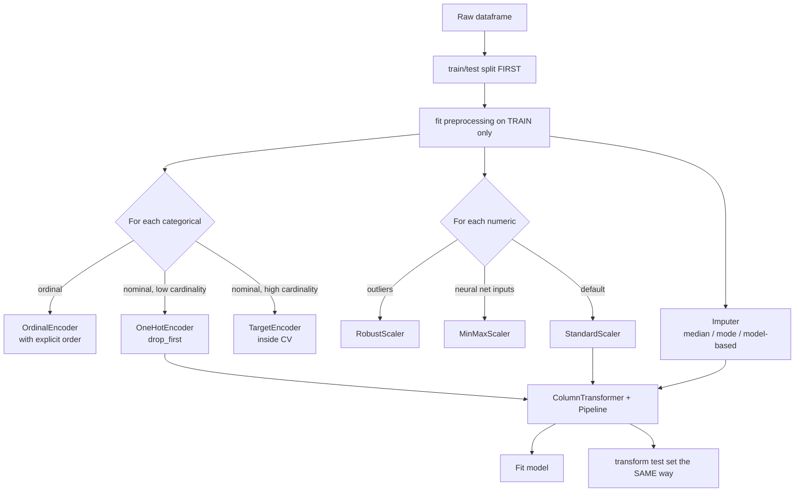

# Foundations 5 — Data Preprocessing: Encoding & Scaling

## Lectures covered
- Data Preprocessing: One Hot Encoding
- (referenced) Data Preprocessing: Scaling — covered fully in classification subfolder

---

## In one sentence
**Preprocessing** turns messy raw data (strings, missing values, mismatched scales) into a clean numeric matrix the algorithm can actually use — and how you do it directly decides whether your "great" model is honest or self-deceived.

## Real-world analogy
A blender can't make a smoothie out of unwashed, un-peeled fruit still in its plastic wrapper. You wash, peel, chop — *then* blend. ML algorithms are blenders. Preprocessing is the prep work. Skip it and you get junk; do it sloppily (e.g., wash the fruit *with the test set's water*) and you contaminate the result.

## The intuition (plain English)
Real-world columns come in shapes algorithms hate:
- Strings ("red", "blue") — most models need numbers.
- Wildly different magnitudes (income in 100,000s, age in 10s) — distance-based models think income is "more important" because the numbers are bigger.
- Missing values — `NaN` crashes most algorithms.
- Categorical with implicit order ("low" < "medium" < "high") vs. no order ("Bollywood" vs. "Hollywood").

Preprocessing is a small toolbox: **encode** (string → number), **scale** (different ranges → comparable), **impute** (fill missing), and **split-then-fit** (so test set never leaks into training).

## Mini worked example — three rows of customer data

```
   age     income     city        signed_up_on
0   25     45,000     "NY"        2024-03-15
1   34     1,200,000  "SF"        NaN
2   45     72,000     NaN         2024-07-20
```

After preprocessing (drop_first one-hot, StandardScaler on numerics, median imputation, date decomposition):

```
   age_z   income_z   city_NY  city_SF  signup_year  signup_month
0  -1.07   -0.69      1        0        2024         3
1  -0.13    1.36      0        1        2024         5     ← month imputed (median)
2   1.20   -0.65      0        0        2024         7     ← city_NY=0 + city_SF=0 → "other" (LA)
```

Now every cell is a number; no NaNs; features have similar magnitudes. *This* is what gets fed to the model.

## At-a-glance — the preprocessing pipeline



## Why this matters
- **Leakage from preprocessing kills models silently.** Fitting a scaler on combined train+test → impressive validation, terrible production.
- **Wrong encoder breaks the model.** LabelEncoder on "Bollywood/Hollywood" tells linear models that Hollywood is "more" than Bollywood — a meaningless inequality the model takes seriously.
- **Scaling unlocks distance-based methods.** k-NN, SVM, k-means, and neural networks all degrade badly without it.
- **Pipelines guarantee correctness.** Wrap preprocessing + model in one `Pipeline`; sklearn handles "fit on train, transform on test" automatically.

---

## 1. Why preprocessing exists

ML algorithms expect **numbers in ranges they can compare**. Real data has:
- Strings ("Bollywood", "Hollywood")
- Wildly different scales (income in 100k, age in 100)
- Missing values
- Outliers
- Date columns

Preprocessing turns messy data → clean numerical matrix.

---

## 2. Categorical encoding

### One-Hot Encoding (default for nominal categories)

Turns "color = red/green/blue" into 3 binary columns:
| color  | →   | red | green | blue |
|--------|-----|-----|-------|------|
| red    |     | 1   | 0     | 0    |
| blue   |     | 0   | 0     | 1    |

```python
import pandas as pd
df = pd.get_dummies(df, columns=["color"], drop_first=True)
```

Or with sklearn:
```python
from sklearn.preprocessing import OneHotEncoder
ohe = OneHotEncoder(drop="first", sparse_output=False)
encoded = ohe.fit_transform(df[["color"]])
```

### Why `drop_first=True`
Three colors → only 2 dummies needed. The third is implied by both being 0. Keeping all three creates **perfect multicollinearity** (the dummy variable trap), which breaks linear regression.

> Tree-based models (RF, XGBoost) don't care about the dummy trap — they handle it internally. Linear models do care.

### Label Encoding (for ordinal categories only)

Maps categories to integers: low/medium/high → 0/1/2.

```python
from sklearn.preprocessing import LabelEncoder
le = LabelEncoder()
df["size_encoded"] = le.fit_transform(df["size"])
```

> **Don't use Label Encoding on nominal categories.** It implies ordering ("Bollywood" = 1, "Hollywood" = 2 → algorithm thinks Hollywood > Bollywood) — bad for linear models, sometimes for tree models too.

### Ordinal Encoding (modern, more controllable)
```python
from sklearn.preprocessing import OrdinalEncoder
oe = OrdinalEncoder(categories=[["low", "medium", "high"]])
df["size"] = oe.fit_transform(df[["size"]])
```

You explicitly state the order — safer than `LabelEncoder`'s alphabetical default.

### Target Encoding (for high-cardinality categories)

Replace each category with the mean target value for that category.

| city | target_mean |
|---|---|
| NY | 0.42 |
| SF | 0.65 |
| LA | 0.38 |

Useful for high-cardinality columns (e.g., zip codes with 30k unique values). **Risk**: target leakage — must be done within cross-validation folds.

```python
from category_encoders import TargetEncoder
te = TargetEncoder()
df["zip_encoded"] = te.fit_transform(df["zip"], df["target"])
```

### Frequency / Count Encoding
Replace category with its frequency. Light, sometimes sufficient.

### Hashing Encoder
For very high cardinality (millions of unique values). Hashes to a fixed number of columns.

### Encoding decision tree

```
Is it ordinal? ── yes → OrdinalEncoder with explicit order
   │
   no
   │
Is cardinality < 50? ── yes → OneHotEncoder
   │
   no
   │
Tree-based model? ── yes → use category as-is (modern XGBoost) or label encode
   │
   no (linear / NN)
   │
   → TargetEncoder (with CV) or HashingEncoder
```

---

## 3. Scaling — bringing features to common range

Many algorithms care about feature magnitudes:
- **Distance-based** (k-NN, SVM with RBF, k-means) — yes, must scale
- **Linear models with regularization** (Ridge, Lasso) — yes, must scale
- **Linear models without regularization** — coefficients absorb scale, but standardize for interpretability
- **Tree-based** (Decision Tree, RF, XGBoost) — no, unaffected by monotonic transforms
- **Neural networks** — yes, helps optimization

### StandardScaler — z-score normalization
$$x' = \frac{x - \mu}{\sigma}$$
- Result: mean 0, std 1
- Default for most cases

```python
from sklearn.preprocessing import StandardScaler
scaler = StandardScaler()
X_scaled = scaler.fit_transform(X_train)
X_test_scaled = scaler.transform(X_test)             # transform — NOT fit
```

### MinMaxScaler — to [0, 1] range
$$x' = \frac{x - \min}{\max - \min}$$
- Use when you need a hard range (e.g., neural net inputs, image data)

```python
from sklearn.preprocessing import MinMaxScaler
scaler = MinMaxScaler()
X_scaled = scaler.fit_transform(X_train)
```

### RobustScaler — median and IQR
Uses median and IQR instead of mean / std. **Robust to outliers**.

```python
from sklearn.preprocessing import RobustScaler
```

### MaxAbsScaler — divide by max absolute value
Preserves sparsity. Used for sparse data (text, count features).

---

## 4. The cardinal rule — fit on train only

```python
# WRONG — fits on combined train+test
scaler.fit(X)
X_train_s = scaler.transform(X_train)
X_test_s = scaler.transform(X_test)

# RIGHT — fit on train, transform both
scaler.fit(X_train)
X_train_s = scaler.transform(X_train)
X_test_s  = scaler.transform(X_test)
```

If you fit on the test set's stats, you've leaked info from test → train and your evaluation is dishonest.

The same rule applies to **encoders, imputers, every preprocessing step**.

---

## 5. Pipeline — automate it cleanly

```python
from sklearn.pipeline import Pipeline
from sklearn.compose import ColumnTransformer
from sklearn.preprocessing import StandardScaler, OneHotEncoder
from sklearn.linear_model import LinearRegression

numeric_cols = ["age", "income"]
cat_cols = ["city", "tier"]

preprocess = ColumnTransformer([
    ("num", StandardScaler(), numeric_cols),
    ("cat", OneHotEncoder(handle_unknown="ignore"), cat_cols),
])

model = Pipeline([
    ("prep", preprocess),
    ("lr",   LinearRegression()),
])

model.fit(X_train, y_train)         # all preprocessing happens inside
y_pred = model.predict(X_test)      # transformations applied automatically
```

Why pipelines:
- Prevents leakage (fit happens only on train)
- Reproducible
- Single object to save/load
- Plugs cleanly into `cross_val_score`, `GridSearchCV`

---

## 6. Handling missing values

### Strategies
1. **Drop rows** — only if missing is rare (<5%)
2. **Drop columns** — if a column is mostly NA and not critical
3. **Impute** — replace with mean / median / mode / constant
4. **Model-based imputation** — train a small model to predict missing values
5. **Add an "is_missing" flag** — sometimes the *fact* of missing is informative

### sklearn imputer
```python
from sklearn.impute import SimpleImputer
imp = SimpleImputer(strategy="median")              # or "mean", "most_frequent", "constant"
X_imputed = imp.fit_transform(X)
```

### Inside a pipeline
```python
preprocess = ColumnTransformer([
    ("num", Pipeline([
        ("imp", SimpleImputer(strategy="median")),
        ("scale", StandardScaler()),
    ]), numeric_cols),
    ("cat", Pipeline([
        ("imp", SimpleImputer(strategy="most_frequent")),
        ("ohe", OneHotEncoder(handle_unknown="ignore")),
    ]), cat_cols),
])
```

---

## 7. Date features

Models can't consume `Timestamp("2025-04-15")`. Decompose:

```python
df["dt"] = pd.to_datetime(df["dt"])
df["year"]    = df["dt"].dt.year
df["month"]   = df["dt"].dt.month
df["day"]     = df["dt"].dt.day
df["dow"]     = df["dt"].dt.dayofweek
df["is_weekend"] = (df["dow"] >= 5).astype(int)
df["hour"]    = df["dt"].dt.hour
```

For cyclical features (hour, month) where 23 should be "close to" 0:
```python
df["hour_sin"] = np.sin(2 * np.pi * df["hour"] / 24)
df["hour_cos"] = np.cos(2 * np.pi * df["hour"] / 24)
```

---

## 8. Common pitfalls

| Mistake | Effect | Fix |
|---|---|---|
| `LabelEncoder` on nominal | implies false order | use OneHotEncoder |
| Forgetting `drop_first=True` (linear) | dummy trap | always drop one |
| Fitting scaler on test set | leakage | fit on train only |
| Encoding one-hot from `pd.get_dummies` separately on train and test | column mismatch | use sklearn OneHotEncoder + ColumnTransformer |
| Imputing then splitting | leakage | always split first |
| Target encoding without CV | severe leakage | use within-fold target encoding |

## Self-check

- [ ] Difference between One-Hot and Label Encoding — when use which?
- [ ] What's the dummy variable trap?
- [ ] When does scaling matter? Give 3 algorithms each way.
- [ ] StandardScaler vs MinMaxScaler vs RobustScaler — when use which?
- [ ] Why must scaler.fit run on training data only?
- [ ] Why use a Pipeline + ColumnTransformer instead of doing each step manually?
- [ ] Three strategies for handling missing values; when each is appropriate?
- [ ] How do you handle cyclical features like hour-of-day?

---

## Glossary

| Term | Plain meaning |
|------|---------------|
| **Preprocessing** | Turning raw data into clean numeric features the model can consume |
| **Encoding** | Converting non-numeric data (strings) to numbers |
| **One-hot encoding** | Each category becomes its own 0/1 column ("color = red" → red=1, blue=0, green=0) |
| **Dummy variable trap** | Keeping all one-hot columns produces perfect linear dependence — drop one |
| **Label encoding** | Map each category to an integer (0, 1, 2, …) — only safe for ordinal data |
| **Ordinal encoding** | Like label encoding but with you specifying the order — safer than `LabelEncoder` |
| **Target encoding** | Replace each category with the mean target value for that category — careful, leakage risk |
| **Frequency / count encoding** | Replace each category with how often it appears |
| **Hashing encoder** | Hash categories into a fixed number of columns — for very high cardinality |
| **High-cardinality** | A categorical column with many unique values (zip codes, user IDs) |
| **Ordinal vs nominal** | Ordinal has order ("low/med/high"); nominal doesn't ("red/blue/green") |
| **Scaling** | Adjusting numeric features to comparable magnitudes |
| **StandardScaler** | Subtract mean, divide by std dev — produces z-scores (mean 0, std 1) |
| **MinMaxScaler** | Squash each feature into [0, 1] — useful for neural net / image inputs |
| **RobustScaler** | Like StandardScaler but uses median and IQR — resistant to outliers |
| **MaxAbsScaler** | Divide by max absolute value — preserves sparsity; for sparse text features |
| **z-score** | `(x − mean) / std` — how many std devs from the mean |
| **Imputation** | Filling in missing values |
| **SimpleImputer** | sklearn class for mean/median/mode imputation |
| **Missing-indicator flag** | Extra binary column saying "this row was originally missing" — useful when missingness itself signals something |
| **Data leakage** | Letting test-set info influence training (often via preprocessing) — produces fake-good scores |
| **Pipeline** | sklearn class chaining preprocessing + model so `.fit` and `.transform` happen in order, only on train |
| **ColumnTransformer** | Apply different preprocessors to different columns inside a pipeline |
| **`fit_transform`** | Learn parameters AND apply them — call only on training data |
| **`transform`** | Apply already-learned parameters — call on test/new data |
| **Cyclical features** | Features that wrap around (hour, month, day-of-week) — encode with sin/cos so 23 is "near" 0 |
| **Sparsity** | Most entries are zero (e.g., one-hot encoded text) — efficient to store as sparse matrices |
| **handle_unknown="ignore"** | OneHotEncoder option that maps unseen categories to all-zero (avoids prediction-time crashes) |

## Further reading
- Previous: [04-model-evaluation-regression.md](04-model-evaluation-regression.md)
- Next: [06-overfit-underfit-bias-variance.md](06-overfit-underfit-bias-variance.md)
- Scaling for SVM: [../02-classification/03-svm.md](../02-classification/03-svm.md)
- Class imbalance preprocessing: [../02-classification/06-class-imbalance.md](../02-classification/06-class-imbalance.md)
- Math foundation — z-score & standard normal: [../../05-math-statistics/01-foundations/04-distributions.md](../../05-math-statistics/01-foundations/04-distributions.md)
