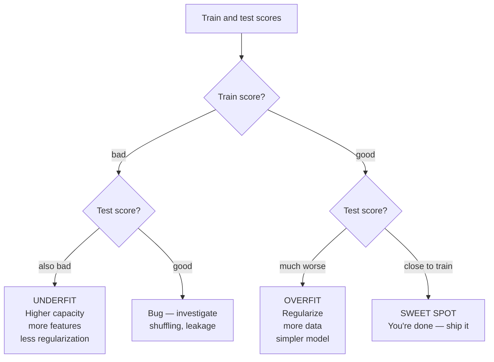

# Foundations 6 — Overfitting, Underfitting, Bias-Variance Tradeoff

## Lectures covered
- Overfitting and Underfitting
- Bias Variance Trade Off

---

## In one sentence
**Overfitting** is when your model memorizes the training data quirks, **underfitting** is when it's too dumb to learn the pattern, and the **bias-variance tradeoff** is the dial between them — the goal is the sweet spot in the middle.

## Real-world analogy
Two students prepare for an exam.
- **Aman** memorizes the practice paper word-for-word. He scores 100% on it. On the real exam (different questions, same topic) he scores 40%. → **overfit.**
- **Bina** glances at the practice paper for 5 minutes. She scores 30% on it and 32% on the real exam. → **underfit.**
- **Chen** studies the *concepts* behind the practice paper. He scores 85% on practice and 82% on the real thing. → **sweet spot.**

ML models do the same thing — and your job is to be Chen.

## The intuition (plain English)
- **Bias** = how badly the model gets things wrong on average (a too-simple model misses obvious patterns).
- **Variance** = how much the model wobbles when retrained on a different sample of data (a too-flexible model swings wildly).
- Total error = bias² + variance + irreducible noise. You can trade one for the other.
- A simple model has high bias / low variance (Bina). A super-flexible model has low bias / high variance (Aman). Pick the dial position with smallest *total* error (Chen).

## Mini worked example — fitting a curve to 7 points

```
true relationship:  y = 2x + noise
data:  (1, 2.1), (2, 4.0), (3, 5.8), (4, 8.2), (5, 9.9), (6, 11.7), (7, 14.3)
```

Three models:

| Model | Train MAE | Test MAE (new points) | Diagnosis |
|-------|-----------|-----------------------|-----------|
| `y = 5` (constant) | 4.5 | 5.0 | underfit — high bias |
| `y = 2.0x + 0.1` (linear) | 0.2 | 0.3 | sweet spot |
| `y = 0.001x⁹ − 0.05x⁸ + …` (degree-9 poly) | 0.001 | 14.7 | overfit — wiggles through every dot, generalizes terribly |

The middle model has the lowest *test* error — that's the only number that matters.

## At-a-glance — diagnosing the regime



## Why this matters
- **Most ML failures are overfitting in disguise.** Your model crushes the training set, then disappoints in production.
- **The gap between train and test scores is your single most important diagnostic.** Memorize: "small gap good, big gap bad."
- **Different algorithms have different overfit knobs:** tree depth (RF), learning rate (XGB), dropout (NN), alpha (Ridge/Lasso). Knowing them is most of the practical job.
- **More data doesn't fix bias.** A linear model on a curved problem stays bad regardless of dataset size.

---

## 1. Underfitting — model too simple

Symptoms:
- Train error: bad
- Test error: bad (similar to train)
- Predictions are "smooth" / barely-moving
- The model doesn't capture obvious patterns

Causes:
- Algorithm too simple (linear model on a curved relationship)
- Too few features
- Over-regularized

Fix:
- More expressive model (polynomial, tree, neural net)
- More features / engineered features
- Reduce regularization

---

## 2. Overfitting — model too flexible

Symptoms:
- Train error: very low
- Test error: high (big gap)
- Predictions look "wiggly" — fit every quirk in training data

Causes:
- Algorithm too flexible (deep tree, high-degree polynomial)
- Too few training samples for the model's complexity
- Training too long without regularization

Fix:
- Simpler model
- More data
- Regularization (L1, L2, dropout)
- Cross-validation to detect early
- Early stopping

---

## 3. Visualizing the three regimes

```
y
│        ──────                     │       /\  /\                  │     • • • • •
│      ─/                            │    /\/  \/  \                │    • • • • •
│    ─/                              │   /         \                │     • • • • •
│  ─/   underfit                     │  / overfit   \               │   sweet spot
│ ─                                  │ /             \              │
└────────────► x                     └──────────────► x             └────────────► x
```

Real data is noisy. The "right" model fits the *signal* but not the *noise*.

---

## 4. The bias-variance decomposition

For squared-error loss, expected test error decomposes into:

$$E[(y - \hat{f}(x))^2] = \underbrace{(\text{Bias}[\hat{f}(x)])^2}_{\text{systematic error}} + \underbrace{\text{Var}[\hat{f}(x)]}_{\text{model varies across train sets}} + \underbrace{\sigma^2}_{\text{irreducible noise}}$$

| Term | Meaning |
|---|---|
| **Bias²** | how off the average prediction is from truth |
| **Variance** | how much the prediction wobbles when retrained on different samples |
| **Irreducible noise** | inherent randomness; can't be reduced by any model |

### High bias, low variance → underfitting
- Predictions are wrong systematically
- Don't change much across train sets

### Low bias, high variance → overfitting
- Predictions are accurate on average across train sets
- But each specific model swings wildly with the data

### Goal: low total error
- Some bias is OK if it dramatically reduces variance
- Some variance is OK if it dramatically reduces bias

---

## 5. Visual intuition (the dartboard)

```
     ┌─────────┐    ┌─────────┐    ┌─────────┐    ┌─────────┐
     │   • • • │    │  • •    │    │ •     • │    │   • •   │
     │  •  •   │    │ •  • •  │    │•   •  • │    │  • • •  │
     │ • •  •  │    │  •  •   │    │  •  •   │    │   • •   │
     └─────────┘    └─────────┘    └─────────┘    └─────────┘
     low bias        high bias       low bias       high bias
     low variance    low variance    high variance  high variance
        ✅           underfit         overfit         worst
```

---

## 6. Diagnostic — train vs test learning curves

```python
from sklearn.model_selection import learning_curve
import numpy as np

train_sizes, train_scores, val_scores = learning_curve(
    model, X, y, cv=5, scoring="neg_mean_squared_error",
    train_sizes=np.linspace(0.1, 1.0, 10),
)

train_mean = -train_scores.mean(axis=1)
val_mean = -val_scores.mean(axis=1)

plt.plot(train_sizes, train_mean, label="train")
plt.plot(train_sizes, val_mean, label="validation")
plt.legend()
```

### Reading the curves

```
                      val
Underfit:  train ─────────  bad and val also bad; both flat
                      val           gap
Overfit:   train ──────────────     huge gap between train (low) and val (high)
                      val
Sweet:     train ────close───       both low, small gap
```

### Implications
- **Both bad, no gap** → underfit; need a richer model
- **Train good, val bad, big gap** → overfit; need regularization or more data
- **Both good, small gap** → done

---

## 7. Common levers per algorithm

| Algorithm | Reduce overfit | Reduce underfit |
|---|---|---|
| Linear / Logistic | Add L1 / L2 (Ridge / Lasso) | Add features / interactions |
| Decision Tree | Lower max_depth, higher min_samples | Higher max_depth |
| Random Forest | More trees + lower max_depth | Bigger trees |
| Gradient Boosting | Lower learning rate, lower max_depth, early stopping | More trees, deeper trees |
| Neural Net | Dropout, weight decay, smaller net, early stopping | Bigger net, more epochs |
| k-NN | Larger k | Smaller k |
| SVM | Smaller C, simpler kernel | Larger C, more complex kernel |

---

## 8. Cross-validation as the overfit detector

A single train/test split tells you a lot, but variance in that single number can mislead. Cross-validation averages multiple splits → more stable estimate, surfaces overfitting reliably.

(Detailed treatment in `03-ensemble/03-cross-validation-tuning.md`.)

---

## 9. Regularization — the standard lever

Adds a penalty for large weights to the loss. Forces simpler models. Covered in next file.

---

## 10. The "Why does my Kaggle score drop?" pattern

You overfit to the **public leaderboard** (which acts like a validation set). When the private leaderboard scores, your model's variance shows. Same pattern in production — models overfit to the test set you've been peeking at.

Fixes:
- Use proper CV
- Hold out a final, never-touched test set
- Limit hyperparameter trials

---

## 11. Common pitfalls

| Mistake | Effect | Fix |
|---|---|---|
| Calling early-stopping after seeing test results | not actually held out | hold out a final test set |
| Using grid-search over thousands of configs | overfit to validation set | use coarser search; nested CV |
| Diagnosing overfit by training-loss curve alone | misses variance | always look at val loss too |
| Adding features without checking | can increase overfit risk | always validate after each addition |

## Self-check

- [ ] Define overfitting and underfitting in your own words.
- [ ] State the bias-variance decomposition.
- [ ] Why is a simpler model often better even with worse training error?
- [ ] How do you tell from train vs val curves whether you're overfitting?
- [ ] What's the lever to reduce overfitting in: Random Forest, XGBoost, Neural Net?
- [ ] Why doesn't more training data fix bias?
- [ ] Why doesn't more regularization fix bias?
- [ ] Walk through how you'd diagnose and fix an overfitting model on a credit-default problem.

---

## Glossary

| Term | Plain meaning |
|------|---------------|
| **Underfitting** | Model too simple — bad on train *and* test, similar scores |
| **Overfitting** | Model memorizes train quirks — great on train, bad on test, big gap |
| **Sweet spot** | Both scores good, small gap between them |
| **Bias** | Systematic error: how far the average prediction is from truth |
| **Variance** | How much the prediction changes when retrained on a different sample |
| **Irreducible noise** | The randomness in data that no model can predict away (σ²) |
| **Bias-variance tradeoff** | The fundamental tension: more flexible model lowers bias but raises variance |
| **Bias-variance decomposition** | The math: `expected error = bias² + variance + noise²` |
| **Model capacity / complexity** | How flexible the model is (degree, depth, # of parameters) |
| **Generalization** | How well the model performs on unseen data |
| **Generalization gap** | Difference between train and test scores |
| **Train score** | Performance on the data you fit on — can lie if model overfits |
| **Validation score** | Performance on data held out for tuning — your honest reality check |
| **Test score** | Performance on never-touched data — final, honest report |
| **Learning curve** | Plot of train and val score vs. amount of training data — diagnoses the regime |
| **Regularization** | Adding a penalty for complexity to the loss — prevents overfitting (see next file) |
| **L1 regularization (Lasso)** | Penalize sum of absolute weights — zeros out unimportant features |
| **L2 regularization (Ridge)** | Penalize sum of squared weights — shrinks all weights toward zero |
| **Dropout** | Neural-net trick: randomly disable neurons during training to prevent over-reliance |
| **Early stopping** | Stop training when validation score stops improving — built-in overfit defense |
| **`max_depth`** | Tree-model knob: deeper = more flexible = more overfit-prone |
| **`min_samples_leaf`** | Tree-model knob: bigger = more conservative splits = less overfitting |
| **Cross-validation (CV)** | Average performance across multiple train/val splits — more stable than one split |
| **Capacity** | Same as model complexity — vague umbrella term for "flexibility" |
| **Public/private leaderboard** | In Kaggle: hidden test set ("private") punishes models that overfit the public one |

## Further reading
- Previous: [05-preprocessing-encoding.md](05-preprocessing-encoding.md)
- Next: [07-regularization.md](07-regularization.md) — the standard lever for fighting overfitting
- CV deep-dive: [../03-ensemble/03-cross-validation-tuning.md](../03-ensemble/03-cross-validation-tuning.md)
