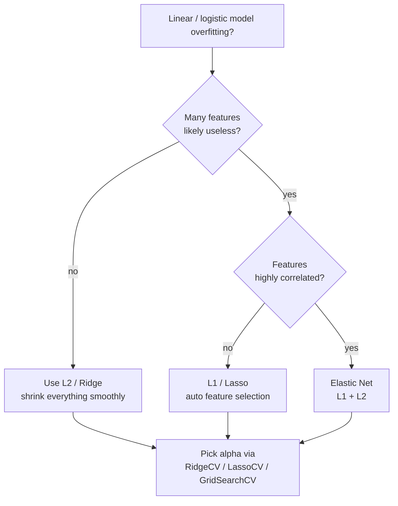

# Foundations 7 — Regularization (L1 / L2)

## Lectures covered
- L1 and L2 Regularization

---

## In one sentence
**Regularization** adds a "tax on complexity" to your model's loss so it can't go wild fitting noise — L2 (Ridge) gently shrinks all coefficients, L1 (Lasso) shrinks *and* zeros out unimportant ones, and Elastic Net mixes both.

## Real-world analogy
Imagine a chef whose only goal is to maximize compliments. Without rules, she dumps in every spice in the pantry — some dishes are amazing, most are weird. Now you tax her by `total grams of spice used`. Suddenly she only reaches for the spices that genuinely help. That tax is regularization. **L2** taxes the *square* of each spice gram (so big amounts hurt a lot, small amounts barely register — she shrinks every spice down). **L1** taxes the *absolute* amount (so dropping a spice to zero saves the same as cutting it from 5g to 4g — she'll set rare spices to exactly zero).

## The intuition (plain English)
Without regularization, an over-flexible linear model can put massive coefficients on noisy features just because it helps the training fit. The model now treats junk as signal.

Regularization changes the loss to `error + λ × penalty(weights)`. Higher λ means "complexity is more expensive" → smaller, simpler weights → less overfitting. Set λ via cross-validation; never guess.

- **L2 (Ridge)** keeps every feature, just shrinks the coefficient sizes. Stable when features are correlated.
- **L1 (Lasso)** kills useless features outright (coefficient = 0) — automatic feature selection.
- **Elastic Net** is L1 + L2 — best of both, especially when features are correlated *and* you want sparsity.

## Mini worked example — credit-risk model

You fit a logistic regression on 50 features. Without regularization, every coefficient is non-zero, training accuracy is 92%, test accuracy 73% — overfit.

```
Plain OLS / no penalty:    coef sizes range from −12 to +18
Ridge (alpha=1.0):         coef sizes range from −2.1 to +2.8     all features kept
Lasso (alpha=0.1):         32 of 50 coefs = exactly 0             feature selection!
ElasticNet (alpha=0.1, l1_ratio=0.5):   18 of 50 coefs = 0
```

| Model | Train acc | Test acc | Notes |
|-------|-----------|----------|-------|
| Plain | 92% | 73% | overfit, 50 features |
| Ridge | 88% | 84% | smaller coefs, no feature selection |
| Lasso | 87% | 85% | 18 features kept — easier to explain |

Lasso buys you a smaller, more honest model. Ridge buys you stability. Elastic Net buys you both.

## At-a-glance — pick a regularizer



## Why this matters
- **The cheapest, safest overfit fix** for any linear/logistic model. One line of code, big payoff.
- **Lasso = automatic feature selection.** Ship a 7-feature model instead of a 50-feature one — easier to explain to regulators (banking, healthcare).
- **Always scale features first.** Without scaling, the regularizer unfairly punishes whichever feature has bigger units.
- **Same idea, different names everywhere:** weight decay (NN), shrinkage (boosting), pruning (trees) — all variations on "constrain the model."

---

## 1. The idea

Add a penalty for **large weights** to the loss function. The model can no longer freely assign huge coefficients to fit noise — it pays a tax.

$$J_{\text{reg}}(\beta) = \underbrace{\frac{1}{n}\sum (y_i - \hat{y}_i)^2}_{\text{fit term}} + \underbrace{\lambda \cdot \text{penalty}(\beta)}_{\text{regularization}}$$

Higher $\lambda$ → simpler model (more shrinkage). Lower $\lambda$ → closer to plain OLS.

---

## 2. L2 — Ridge regression

Penalty: sum of squared weights.

$$J = \text{MSE} + \lambda \sum \beta_j^2$$

- Shrinks coefficients toward 0 but rarely to *exactly* 0
- Reduces variance, increases (a bit of) bias
- Stable on multicollinear features

```python
from sklearn.linear_model import Ridge
ridge = Ridge(alpha=1.0)             # alpha == λ
ridge.fit(X_train, y_train)
```

---

## 3. L1 — Lasso regression

Penalty: sum of absolute weights.

$$J = \text{MSE} + \lambda \sum |\beta_j|$$

- Shrinks AND **zeros out** some coefficients → automatic feature selection
- Useful when you suspect many irrelevant features
- Can be unstable when features are highly correlated (picks one, drops the other)

```python
from sklearn.linear_model import Lasso
lasso = Lasso(alpha=0.1)
lasso.fit(X_train, y_train)
```

---

## 4. Elastic Net — L1 + L2

$$J = \text{MSE} + \lambda \left(\rho \sum |\beta_j| + (1-\rho) \sum \beta_j^2 \right)$$

- $\rho$ controls the L1 / L2 mix (0 → Ridge, 1 → Lasso)
- Best of both: feature selection + stability

```python
from sklearn.linear_model import ElasticNet
en = ElasticNet(alpha=0.1, l1_ratio=0.5)
```

---

## 5. Why L1 zeros out and L2 shrinks — the geometric intuition

```
L1 (diamond)                          L2 (circle)
                                      
       │                                     │
       ╱╲                                  ─────
      ╱  ╲     <-- coefficient                │
     ╱    ╲        constraint                 │
    ╱      ╲                                  │
                                      
   Sharp corners at axes:           Smooth curve everywhere:
   minimum often hits a corner      minimum lands on the curve
   → β_j = 0                        → β_j is small but non-zero
```

The L1 constraint region has corners where one of the coefficients is exactly 0. The MSE-minimizing point inside that constraint often lands on a corner → exact zero coefficients.

The L2 region is smooth, no corners → coefficients shrink toward but rarely *equal* 0.

---

## 6. Picking $\lambda$ (alpha) — cross-validation

```python
from sklearn.linear_model import RidgeCV, LassoCV, ElasticNetCV
import numpy as np

ridge = RidgeCV(alphas=np.logspace(-3, 3, 25))
ridge.fit(X_train, y_train)
print(ridge.alpha_)                  # best alpha by CV
```

Or manually with `GridSearchCV`.

---

## 7. Always scale before regularizing

L1 and L2 penalize coefficients by *magnitude*. If `income` is in millions and `age` in 10s, the algorithm will unfairly penalize income's coefficient.

```python
from sklearn.pipeline import Pipeline
from sklearn.preprocessing import StandardScaler

pipe = Pipeline([
    ("scale", StandardScaler()),
    ("ridge", Ridge(alpha=1.0)),
])
```

---

## 8. Real workflow on a regression problem

```python
import numpy as np
from sklearn.pipeline import Pipeline
from sklearn.preprocessing import StandardScaler
from sklearn.linear_model import LinearRegression, Ridge, Lasso
from sklearn.model_selection import cross_val_score

X, y = ...   # your features and target

models = {
    "OLS":   Pipeline([("s", StandardScaler()), ("m", LinearRegression())]),
    "Ridge": Pipeline([("s", StandardScaler()), ("m", Ridge(alpha=1.0))]),
    "Lasso": Pipeline([("s", StandardScaler()), ("m", Lasso(alpha=0.1))]),
}

for name, m in models.items():
    score = cross_val_score(m, X, y, cv=5, scoring="r2").mean()
    print(f"{name}: R² = {score:.3f}")
```

If Ridge / Lasso outperform OLS → you had overfitting. If they hurt → you had underfitting.

---

## 9. Regularization in classification

Same idea applies:
```python
from sklearn.linear_model import LogisticRegression
LogisticRegression(penalty="l2", C=1.0)        # C = 1/λ — bigger C = less regularization
LogisticRegression(penalty="l1", solver="liblinear")
LogisticRegression(penalty="elasticnet", solver="saga", l1_ratio=0.5)
```

> Note: `C` is the *inverse* of regularization strength. Smaller C = more regularization. Confusing but consistent across logistic regression, SVM, etc.

---

## 10. Regularization in tree-based / NN models

Different mechanisms, same purpose:

| Family | "Regularization" |
|---|---|
| Decision Tree | `max_depth`, `min_samples_leaf`, `max_leaf_nodes` |
| Random Forest | tree depth + ensemble averaging |
| Gradient Boosting | `learning_rate` (shrinkage), tree depth, early stopping |
| Neural Net | weight decay (L2), dropout, early stopping |

The principle is universal: **constrain the model to prevent it from memorizing the training set.**

---

## 11. Common pitfalls

| Mistake | Effect | Fix |
|---|---|---|
| Forgetting to scale before L1/L2 | unfair penalization across scales | StandardScaler in pipeline |
| Setting alpha way too high | underfit | use CV to find sweet spot |
| Lasso on highly correlated features | picks one arbitrarily | use Elastic Net |
| Comparing alphas across different scales | inconsistent units | log-spaced grid: `np.logspace(-3, 3, 25)` |
| Confusing C with alpha (sklearn classifiers) | wrong direction | C = 1 / λ |

## Self-check

- [ ] Why does L1 zero out coefficients but L2 doesn't?
- [ ] When use Ridge vs Lasso vs Elastic Net?
- [ ] Why must features be scaled before regularization?
- [ ] What does `alpha=0` mean in Ridge / Lasso?
- [ ] What is `C` in LogisticRegression and how does it relate to alpha?
- [ ] How do you pick `alpha` automatically?
- [ ] What's the equivalent of regularization in random forest? In XGBoost? In neural nets?
- [ ] If your training and test errors are both high, will adding more regularization help? Why or why not?

---

## Glossary

| Term | Plain meaning |
|------|---------------|
| **Regularization** | Adding a penalty for model complexity to the loss — fights overfitting |
| **Penalty term** | The piece added to the loss (`λ × Σ|β|` for L1, `λ × Σβ²` for L2) |
| **λ (lambda) / alpha** | Strength of the penalty. Higher = simpler model. Pick via cross-validation. |
| **L1 regularization (Lasso)** | Penalty = sum of absolute weights — produces sparse models (some β = 0) |
| **L2 regularization (Ridge)** | Penalty = sum of squared weights — shrinks all weights, rarely to zero |
| **Elastic Net** | Mix of L1 and L2; `l1_ratio` controls the blend |
| **Sparsity** | Many coefficients exactly zero — Lasso's defining property |
| **Feature selection** | Picking which features to keep — Lasso does it automatically |
| **Shrinkage** | Pulling coefficients toward zero — what regularization does to them |
| **Coefficient** | The β value the model assigns to each feature |
| **Bias-variance tradeoff** | Regularization adds bias to reduce variance (often a net win) |
| **Multicollinearity** | Highly correlated features — Lasso picks one arbitrarily, Ridge spreads weight; Elastic Net handles both |
| **Standardization** | Scaling features to mean 0, std 1 — required before regularizing |
| **`alpha` (sklearn Ridge/Lasso)** | The λ knob — bigger = more regularization |
| **`C` (sklearn LogisticRegression/SVM)** | Inverse of regularization: `C = 1/λ` — bigger C = less regularization |
| **RidgeCV / LassoCV** | sklearn helpers that pick the best alpha via built-in cross-validation |
| **`np.logspace(-3, 3, 25)`** | A grid of 25 alphas spread on a log scale from 0.001 to 1000 — the standard search range |
| **Weight decay** | Neural-network name for L2 regularization |
| **Dropout** | Neural-network regularizer: randomly disable neurons during training |
| **Early stopping** | Boosting/NN regularizer: stop training when validation stops improving |
| **OLS (Ordinary Least Squares)** | Linear regression with no regularization — the unconstrained baseline |
| **Pipeline** | sklearn object chaining preprocessing + regularized model so scaling happens before penalty |
| **Pruning** | Tree-based "regularization" — cut back branches that don't justify their complexity |

## Further reading
- Previous: [06-overfit-underfit-bias-variance.md](06-overfit-underfit-bias-variance.md) — the problem regularization solves
- Next: [../02-classification/01-logistic-regression.md](../02-classification/01-logistic-regression.md) — uses the same L1/L2 levers
- Multicollinearity check: [../04-unsupervised/02-vif.md](../04-unsupervised/02-vif.md)
- Tuning alpha via CV: [../03-ensemble/03-cross-validation-tuning.md](../03-ensemble/03-cross-validation-tuning.md)
