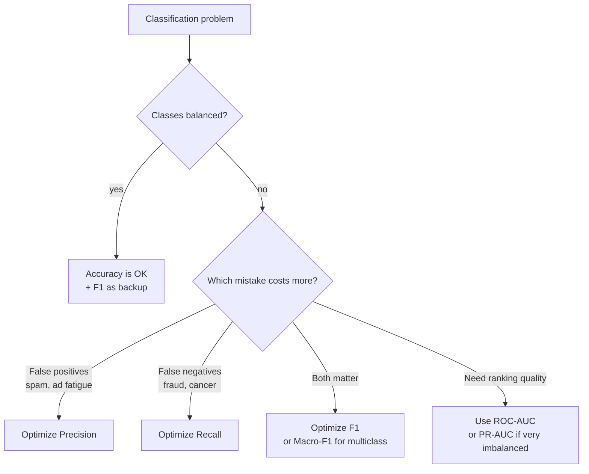

# Classification 2 — Metrics: Confusion Matrix, Precision, Recall, F1

## Lectures covered
- Model Evaluation: Accuracy, Precision and Recall, F1 Score, Confusion Matrix

---

## In one sentence
**Classification metrics** translate "did the model get it right?" into different flavors of correctness — and which flavor matters depends entirely on whether **false alarms** or **missed cases** hurt your business more.

## Real-world analogy
A smoke detector goes off in your kitchen. There are two kinds of mistakes:
- **False alarm**: it beeps when there's no fire (you pull the battery out of frustration).
- **Missed fire**: it stays silent when the toaster is actually burning (your kitchen burns down).

A detector tuned for **high precision** rarely false-alarms but might miss small fires. A detector tuned for **high recall** catches every fire but cries wolf often. The right tradeoff depends on whether you'd rather hear false beeps or risk fire.

Same idea everywhere in classification — fraud detection, cancer screening, spam filters, credit risk.

## The intuition (plain English)
The **confusion matrix** counts four things from your test set:
- **TP** (true positive) — correctly flagged
- **FP** (false positive) — wrongly flagged (false alarm)
- **FN** (false negative) — missed
- **TN** (true negative) — correctly ignored

Every metric below is just a ratio of these four numbers:
- **Accuracy** = (TP + TN) / total — overall correctness; lies on imbalanced data.
- **Precision** = TP / (TP + FP) — "of those I flagged, how many were real?" (combat false alarms)
- **Recall** = TP / (TP + FN) — "of all real positives, how many did I catch?" (combat misses)
- **F1** = harmonic mean of precision and recall — single number when you want both decent.

## Mini worked example — fraud detector on 1,000 transactions

A bank has 1,000 transactions. 50 are actual fraud (5% positive — imbalanced). The model flags 80 of them as fraud:

```
                    Predicted Fraud   Predicted OK
Actual Fraud (50)        TP = 40         FN = 10
Actual OK   (950)        FP = 40         TN = 910
```

Compute:
```
Accuracy   = (40 + 910) / 1000        = 95.0%   ← sounds great!
Precision  = 40 / (40 + 40)            = 50%    ← half of flags are false alarms
Recall     = 40 / (40 + 10)            = 80%    ← caught 80% of real fraud
F1         = 2 · 0.5 · 0.8 / (0.5 + 0.8) = 0.615
```

A "predict everything OK" model would also get 95% accuracy — but precision/recall/F1 = 0. That's why **never report accuracy alone on imbalanced data**.

For fraud, missing a fraud (FN) costs much more than a false alarm (FP) — so you'd accept lower precision to push recall higher (lower the decision threshold).

## At-a-glance — pick the right metric



## Why this matters
- **Accuracy is the most-misused metric in industry.** "We got 99% accuracy!" usually means "our 99% majority class is unmoved."
- **Picking the wrong metric mis-ranks models.** A model that maximizes accuracy can be useless for catching fraud.
- **Threshold tuning is free leverage.** Same trained model + different threshold = totally different precision/recall tradeoff. Always tune.
- **Connects to Type I / II errors** — Type I = false positive, Type II = false negative. Same ideas as the [hypothesis testing](../../05-math-statistics/03-inferential/02-hypothesis-testing.md) chapter.

---

## 1. Confusion matrix — the source of all classification metrics

For binary classification:

|  | Predicted Negative | Predicted Positive |
|---|---|---|
| **Actual Negative** | TN (true negative) | FP (false positive / Type I error) |
| **Actual Positive** | FN (false negative / Type II error) | TP (true positive) |

```python
from sklearn.metrics import confusion_matrix
print(confusion_matrix(y_test, y_pred))
```

Plot it:
```python
from sklearn.metrics import ConfusionMatrixDisplay
ConfusionMatrixDisplay.from_estimator(model, X_test, y_test)
```

Every metric below derives from these four numbers.

---

## 2. Accuracy

$$\text{Accuracy} = \frac{TP + TN}{TP + TN + FP + FN}$$

"Of all predictions, how many were correct?"

### When accuracy lies
With a 99% / 1% class split, predicting "always majority" gives 99% accuracy and zero usefulness. **Never use accuracy alone on imbalanced data.**

```python
from sklearn.metrics import accuracy_score
accuracy_score(y_test, y_pred)
```

---

## 3. Precision — "of those I flagged, how many are truly positive?"

$$\text{Precision} = \frac{TP}{TP + FP}$$

High precision → few false alarms.
Use when **false positives are costly**:
- Email spam filter (don't junk legit email)
- Recommending high-cost interventions

```python
from sklearn.metrics import precision_score
precision_score(y_test, y_pred)
```

---

## 4. Recall (Sensitivity, True Positive Rate)

$$\text{Recall} = \frac{TP}{TP + FN}$$

"Of all true positives, how many did I catch?"

High recall → few missed cases.
Use when **false negatives are costly**:
- Cancer screening (don't miss a sick patient)
- Fraud detection
- Security threats

```python
from sklearn.metrics import recall_score
recall_score(y_test, y_pred)
```

---

## 5. The precision-recall tradeoff

Lower decision threshold → more positives flagged:
- Recall ↑
- Precision ↓ (some flags are wrong)

Higher threshold → fewer positives flagged:
- Precision ↑
- Recall ↓ (miss some true positives)

You can't have both. Pick the side that matters for your business.

---

## 6. F1 Score — harmonic mean of precision and recall

$$F_1 = 2 \cdot \frac{\text{precision} \cdot \text{recall}}{\text{precision} + \text{recall}}$$

A single number that punishes imbalance between P and R. Used when you want both to be reasonable.

```python
from sklearn.metrics import f1_score
f1_score(y_test, y_pred)
```

### F-beta — weighted variant
$$F_\beta = (1 + \beta^2) \cdot \frac{P \cdot R}{\beta^2 P + R}$$

- β = 0.5 → emphasize precision
- β = 2 → emphasize recall

Use when one matters more but you still care about both.

---

## 7. classification_report — the cheat sheet

```python
from sklearn.metrics import classification_report
print(classification_report(y_test, y_pred))
```

Output (multiclass example):
```
              precision    recall  f1-score   support

           0       0.95      0.97      0.96       350
           1       0.78      0.71      0.74        50

    accuracy                           0.94       400
   macro avg       0.87      0.84      0.85       400
weighted avg       0.93      0.94      0.93       400
```

- **support**: # of true samples per class
- **macro avg**: average across classes (each class equally weighted)
- **weighted avg**: weighted by support (large classes dominate)

For imbalanced problems, **macro F1** is usually the metric to optimize.

---

## 8. Multiclass — confusion matrix at scale

For k classes:
```python
from sklearn.metrics import confusion_matrix
import seaborn as sns
cm = confusion_matrix(y_test, y_pred, labels=class_labels)
sns.heatmap(cm, annot=True, fmt="d", xticklabels=class_labels, yticklabels=class_labels)
```

Each row sums to the number of true samples in that class. Diagonal = correct.

### Per-class metrics
- **Macro precision**: avg of per-class precision
- **Weighted precision**: avg weighted by support
- **Micro precision**: aggregate TP/FP across classes (= accuracy in single-label classification)

---

## 9. Picking the right metric — flowchart

```
Is the dataset balanced?
   │
   ├─ yes → accuracy is fine, F1 nice as backup
   │
   └─ no
        │
        Is one error type far more costly?
           │
           ├─ FP costly → optimize precision
           │
           ├─ FN costly → optimize recall
           │
           └─ both matter → F1 (or macro-F1 for multiclass)
```

If you can't pick: use **ROC-AUC** for ranking, **PR-AUC** for imbalanced.

---

## 10. Threshold tuning workflow

```python
import numpy as np
from sklearn.metrics import precision_recall_curve

y_prob = model.predict_proba(X_test)[:, 1]
precisions, recalls, thresholds = precision_recall_curve(y_test, y_prob)

# pick threshold that maximizes F1
f1s = 2 * precisions * recalls / (precisions + recalls + 1e-12)
best_idx = np.argmax(f1s[:-1])
best_threshold = thresholds[best_idx]
y_pred_best = (y_prob >= best_threshold).astype(int)
```

In production, often you'd pick the threshold that hits a *business target* ("we can review 200 cases/day → set threshold so ~200 flagged").

---

## 11. Common pitfalls

| Mistake | Effect | Fix |
|---|---|---|
| Reporting accuracy on imbalanced data | misleadingly high | report precision, recall, F1 |
| Confusing FP and FN | wrong tradeoff chosen | draw the confusion matrix |
| Comparing two models on different thresholds | noise | compare at same threshold or use AUC |
| Optimizing recall to 100% | precision crashes | balance via F1 or business cost |
| Multiclass `precision_score` without `average` | sklearn picks "binary" → error | pass `average="macro"` or `"weighted"` |

## Self-check

- [ ] Write out the confusion matrix and label TN/FP/FN/TP.
- [ ] Define precision and recall in plain English.
- [ ] When optimize precision vs recall? Give a concrete example for each.
- [ ] What does F1 measure? When use F-beta instead?
- [ ] When do you NOT use accuracy?
- [ ] What's the difference between macro and weighted average precision?
- [ ] How do you tune the decision threshold?
- [ ] You're building a fraud classifier. Which metric is the north star?

---

## Glossary

| Term | Plain meaning |
|------|---------------|
| **Confusion matrix** | 2×2 table of TP/FP/FN/TN — every classification metric derives from it |
| **TP (true positive)** | Predicted positive, actually positive — correctly caught |
| **FP (false positive)** | Predicted positive, actually negative — false alarm (Type I error) |
| **FN (false negative)** | Predicted negative, actually positive — missed (Type II error) |
| **TN (true negative)** | Predicted negative, actually negative — correctly ignored |
| **Type I error** | Statistician's name for FP — see [hypothesis testing](../../05-math-statistics/03-inferential/02-hypothesis-testing.md) |
| **Type II error** | Statistician's name for FN |
| **Accuracy** | (TP + TN) / total — overall correctness; misleading on imbalanced data |
| **Precision** | TP / (TP + FP) — "of those flagged, how many real?" |
| **Recall / Sensitivity / TPR** | TP / (TP + FN) — "of all positives, how many caught?" |
| **Specificity** | TN / (TN + FP) — "of all negatives, how many correctly ignored?" |
| **F1 score** | Harmonic mean of precision and recall — single number when both matter |
| **F-beta score** | Weighted harmonic mean — `β > 1` favors recall, `β < 1` favors precision |
| **F2 score** | F-beta with β=2 — emphasizes recall (medical screening) |
| **Class imbalance** | Classes have very different counts (95/5) — accuracy lies; use F1/AUC |
| **Decision threshold** | Cutoff probability for predicting positive (default 0.5) — tune for business cost |
| **Precision-recall tradeoff** | Lower threshold → recall up, precision down; higher → opposite |
| **`classification_report`** | sklearn function printing precision/recall/F1/support per class |
| **Support** | Number of actual samples per class in the test set |
| **Macro average** | Average metric across classes, each class equally weighted (good for imbalance) |
| **Micro average** | Pool TP/FP/FN across classes — equals accuracy for single-label problems |
| **Weighted average** | Macro average but weighted by support — large classes dominate |
| **`average="macro"`** | sklearn parameter for macro averaging in multiclass |
| **PR-AUC / Average Precision** | Area under the precision-recall curve — better than ROC-AUC for very imbalanced data |
| **ROC-AUC** | Area under the receiver-operating-characteristic curve — measures ranking quality (next file) |
| **Confusion matrix display** | sklearn helper to plot the matrix as a heatmap |
| **Cost-sensitive learning** | Letting the algorithm know that FP and FN cost different amounts |

## Further reading
- Previous: [01-logistic-regression.md](01-logistic-regression.md) — produces the probabilities behind these metrics
- Next: [03-svm.md](03-svm.md)
- ROC/AUC and threshold tuning: [07-roc-auc.md](07-roc-auc.md)
- Class imbalance: [06-class-imbalance.md](06-class-imbalance.md)
- Statistics roots: [../../05-math-statistics/03-inferential/02-hypothesis-testing.md](../../05-math-statistics/03-inferential/02-hypothesis-testing.md) (Type I / II framing)
