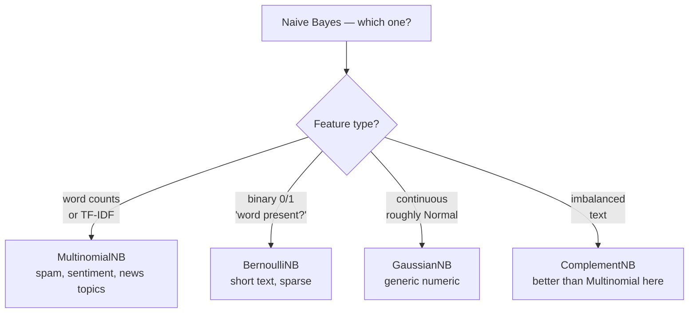

# Classification 4 — Naive Bayes

## Lectures covered
- Naive Bayes

---

## In one sentence
**Naive Bayes** uses Bayes' theorem and the (intentionally naive) assumption that features are independent given the class — to compute, "for each possible class, how likely is this particular input?" then picks the most likely.

## Real-world analogy
A doctor sees a patient with three symptoms: fever, cough, runny nose. She asks herself: "Of patients with the *flu*, how often did each symptom show up? Same for COVID? Same for plain cold?" She multiplies those frequencies together for each disease, multiplies by how common each disease is in general, and picks the disease with the highest combined number. That's Naive Bayes — fast, intuitive, and surprisingly hard to beat as a baseline for text classification.

The "naive" part is **assuming the symptoms are independent given the disease** — pretending fever and cough don't correlate beyond what the disease causes. They're obviously not really independent, but the math works fine despite the lie.

## The intuition (plain English)
Bayes' theorem says: `P(class | features) ∝ P(features | class) · P(class)`.

For text: `P(spam | "free money urgent") ∝ P("free" | spam) · P("money" | spam) · P("urgent" | spam) · P(spam)`.

Three steps:
1. Count how often each word appears in spam vs. ham (training).
2. For a new email, multiply those probabilities for every word — once per class.
3. Pick the class with the bigger product. Done.

Why it's "naive": multiplying word probabilities pretends "free" and "money" are independent. They're not — but the *ranking* of classes still ends up right most of the time.

## Mini worked example — spam filter on 4 training emails

```
Training:
  "free money now"      → spam       (3 spam emails total)
  "free trial offer"    → spam
  "money money money"   → spam
  "lunch tomorrow"      → ham        (1 ham email)
```

Word counts in spam:
```
free=2, money=4, now=1, trial=1, offer=1     (9 words total)
```

Word counts in ham: `lunch=1, tomorrow=1` (2 words total).

P(spam) = 3/4 = 0.75. P(ham) = 1/4 = 0.25.

New email: "free money tomorrow"

```
P("free"|spam)·P("money"|spam)·P("tomorrow"|spam)·P(spam)
= (2/9) · (4/9) · (0/9 → with Laplace smoothing α=1: 1/(9+vocab_size))
```

That zero in the middle would zero everything out — that's why **Laplace smoothing** adds 1 to every count. With smoothing, both spam and ham get non-zero scores, and you compare them.

In log space (avoids tiny numbers): take logs and *add* instead of multiplying. Final ranking unchanged.

## At-a-glance — pick the right NB flavor



## Why this matters
- **The strongest cheap baseline for text classification.** Spam, sentiment, topic — Naive Bayes finishes in seconds and is hard to beat at zero compute.
- **Tiny memory footprint.** Just a table of word-counts per class. Runs on toy hardware.
- **Online learning friendly.** New email comes in → bump counts → done; no retraining.
- **Builds your Bayesian intuition.** Understanding NB makes Bayesian inference easier later.

---

## 1. The Bayesian intuition

For classification, we want $P(y = c \mid x)$. By Bayes' theorem:
$$P(y = c \mid x) = \frac{P(x \mid y = c) \cdot P(y = c)}{P(x)}$$

For each class, compute the right-hand side; pick the class with the highest probability. The denominator $P(x)$ is the same across classes, so we can ignore it for ranking.

---

## 2. The "naive" assumption

Computing $P(x \mid y = c)$ for vector $x = (x_1, x_2, \dots, x_p)$ is hard — joint distributions in high dimensions are nasty.

**Naive Bayes assumes feature independence** *given the class*:
$$P(x_1, x_2, \dots, x_p \mid y) = \prod_j P(x_j \mid y)$$

This is wildly unrealistic in real data — but works surprisingly well, especially for text.

---

## 3. Three flavors

### Gaussian NB (continuous features)
Assumes $x_j \mid y$ is Normally distributed.

```python
from sklearn.naive_bayes import GaussianNB
GaussianNB().fit(X, y)
```

### Multinomial NB (count / TF features)
Designed for word counts in document classification.

```python
from sklearn.naive_bayes import MultinomialNB
MultinomialNB().fit(X_counts, y)
```

### Bernoulli NB (binary features)
Each feature is 0/1 — "did this word appear at all?"

```python
from sklearn.naive_bayes import BernoulliNB
```

### Complement NB (variant of Multinomial — better on imbalanced text data)
```python
from sklearn.naive_bayes import ComplementNB
```

---

## 4. Spam classifier walk-through

```python
import pandas as pd
from sklearn.feature_extraction.text import CountVectorizer
from sklearn.naive_bayes import MultinomialNB
from sklearn.pipeline import Pipeline
from sklearn.metrics import classification_report

# data: emails with "text" column and "spam" 0/1 label
df = pd.read_csv("emails.csv")

pipe = Pipeline([
    ("vec", CountVectorizer(stop_words="english", ngram_range=(1, 2))),
    ("nb",  MultinomialNB()),
])

pipe.fit(df["text"], df["spam"])
print(classification_report(df["spam"], pipe.predict(df["text"])))
```

That's a fully-functional spam classifier in 10 lines.

---

## 5. Strengths

- **Fast** — train and predict in seconds even on millions of examples
- **Tiny memory footprint**
- Surprisingly effective on text classification (the canonical baseline)
- Naturally handles online / incremental learning

## 6. Weaknesses

- The independence assumption is wrong — model overconfident probabilities
- Not great with continuous features unless they're roughly Normal
- Can't capture feature interactions

---

## 7. Smoothing — handling unseen feature combos

Without smoothing, if a word never appeared in spam in training, $P(\text{word} \mid \text{spam}) = 0$ → entire posterior is 0. Bad.

**Laplace / additive smoothing** adds a small constant α (default 1) to all counts:
```python
MultinomialNB(alpha=1.0)
```

Lower α → tighter to data; higher α → smoother priors.

---

## 8. Use Naive Bayes when

- You need a **strong baseline** for text classification
- Speed matters more than top accuracy
- You have very little training data
- Simple, interpretable model is valued

For modern text problems, fine-tuned BERT / sentence-transformers usually outperform — but NB is the right starting line.

---

## 9. Common pitfalls

| Mistake | Effect | Fix |
|---|---|---|
| Using GaussianNB on count data | wrong distribution assumption | use MultinomialNB |
| MultinomialNB on data with negatives | invalid (counts must be ≥ 0) | use GaussianNB or scale to 0+ |
| Using probabilities as well-calibrated | NB probs are often miscalibrated | use `CalibratedClassifierCV` if you need true probs |
| Skipping stop-words removal in text | noisy features | `stop_words="english"` in `CountVectorizer` |

## Self-check

- [ ] What's the "naive" assumption?
- [ ] When use Multinomial vs Gaussian NB?
- [ ] Why is smoothing important?
- [ ] Why is Naive Bayes a great baseline for text?
- [ ] Why are NB probabilities often poorly calibrated?
- [ ] Build a sentiment classifier on tweets in 15 lines.
- [ ] What's the difference between Multinomial NB and Bernoulli NB?

---

## Glossary

| Term | Plain meaning |
|------|---------------|
| **Bayes' theorem** | Rule for updating beliefs given evidence: `P(class|x) = P(x|class)·P(class) / P(x)` |
| **Prior P(class)** | How common each class is overall, before seeing the input |
| **Likelihood P(x|class)** | How typical the input looks for each class |
| **Posterior P(class|x)** | Updated belief about the class after seeing the input |
| **Naive Bayes** | Bayes classifier with the simplifying assumption that features are independent given the class |
| **Independence assumption** | "Knowing one feature gives no info about another, once class is fixed" — usually false but workable |
| **GaussianNB** | Naive Bayes assuming each numeric feature is normally distributed within each class |
| **MultinomialNB** | Naive Bayes for count features (word counts, term frequencies) |
| **BernoulliNB** | Naive Bayes for binary features (word present yes/no) |
| **ComplementNB** | MultinomialNB variant — often better on imbalanced text |
| **Laplace / additive smoothing** | Add α=1 to every count so unseen feature/class combos don't zero out the product |
| **`alpha`** | Smoothing strength; default 1 |
| **Log-probabilities** | Take logs to avoid underflow when multiplying many small numbers |
| **Bag of words** | Representing a document as word counts, ignoring order |
| **CountVectorizer** | sklearn class converting text to word-count matrix |
| **TF-IDF** | Term-frequency × inverse document frequency — weights rare words higher |
| **n-gram** | Sequence of n adjacent words (2-grams: "free money", "money urgent") |
| **stop words** | Common words ("the", "is", "and") usually removed before vectorizing |
| **Calibration** | How well predicted probabilities match real frequencies; NB is often poorly calibrated |
| **`CalibratedClassifierCV`** | sklearn helper to recalibrate any classifier's probabilities |
| **Online / incremental learning** | Updating the model as new data streams in, without full retraining |
| **Generative model** | A model that learns `P(x|y)` (NB does this) — opposite of discriminative (logistic regression) |
| **Discriminative model** | A model that directly learns `P(y|x)` (logistic regression, SVM) |

## Further reading
- Previous: [03-svm.md](03-svm.md)
- Next: [05-decision-tree.md](05-decision-tree.md)
- Bayes theorem foundation: [../../05-math-statistics/02-probability](../../05-math-statistics/02-probability)
- Distributions used: [../../05-math-statistics/01-foundations/04-distributions.md](../../05-math-statistics/01-foundations/04-distributions.md)
