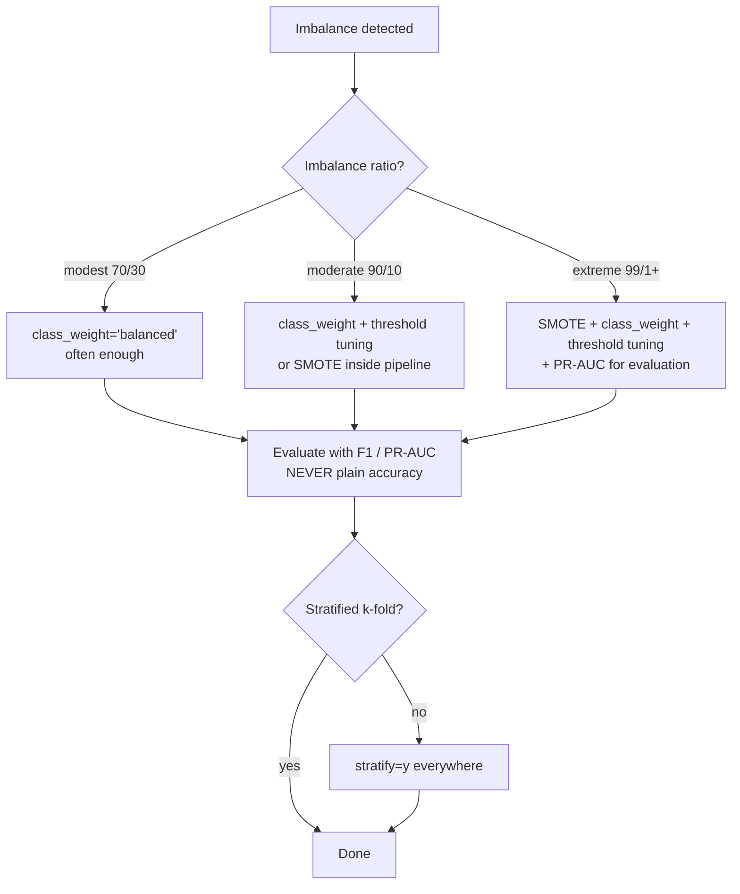

# Classification 6 — Handling Class Imbalance

## Lectures covered
- Handle Class Imbalance

---

## In one sentence
**Class imbalance** is when one class is rare (1% fraud, 5% defaults) — your model will happily predict "not rare" for everything and look 99% accurate while being useless, so you fight back with class weights, resampling (SMOTE), or threshold tuning.

## Real-world analogy
Imagine a security guard at an airport. 99.9% of bags are harmless; only 0.1% are dangerous. A guard who waves *every* bag through has a 99.9% accuracy rate — and zero usefulness. To do the actual job, you have to make the guard care more about catching the rare dangerous bag than about the boring 99.9%. That's exactly what class-weighting and SMOTE do for ML models.

## The intuition (plain English)
Three families of fixes — pick one or combine:

1. **Algorithmic** — reweight the *loss* so a minority mistake costs more. One line of code: `class_weight="balanced"`.
2. **Data-level** — change the *data* the model sees:
   - Undersample the majority (toss data — fast, lossy).
   - Oversample the minority (duplicate or synthesize — keeps data, but new data leakage risks if done wrong).
   - **SMOTE** — generate synthetic minority points by interpolating between real ones.
3. **Threshold-level** — train normally, then *lower the decision threshold* (from 0.5 to 0.2, say) so more cases get flagged.

The right choice depends on data size, the imbalance ratio, and whether you can quantify the dollar cost of FN vs. FP.

## Mini worked example — fraud detection on 10,000 transactions

```
not fraud: 9,900   (99%)
fraud:        100   (1%)

Naive logistic regression → predicts "not fraud" for all 10,000.
Accuracy = 99%. Recall on fraud = 0%. Useless.
```

Apply `class_weight="balanced"`:
```
sklearn auto-weights:  not_fraud = 1.0,  fraud ≈ 49.5  (= 9900/200 / 99/2)
The model is now 49.5× more "afraid" of missing a fraud than of false-flagging a non-fraud.
Recall on fraud jumps from 0% to ~75%. Precision drops to ~30%.
```

Or use SMOTE:
```
After SMOTE: 9,900 not-fraud + 9,900 (real + synthetic) fraud = balanced.
Train logistic regression as usual.
Recall on fraud ~80%. Precision ~28%.
```

Or threshold tune:
```
Default threshold 0.5 → recall 0%, precision N/A
Lower threshold to 0.05 → recall 70%, precision 35%
Lower to 0.02 → recall 90%, precision 18%
Pick threshold based on dollar cost (next: ROC-AUC chapter).
```

## At-a-glance — strategy decision



## Why this matters
- **Ignoring imbalance is the #1 silent ML failure.** "99% accuracy!" is meaningless if 99% of your data is the boring class.
- **Always use stratified splits** (`stratify=y`, `StratifiedKFold`) so every fold has the same class ratio.
- **SMOTE must go *inside* a pipeline**, applied only on training folds — otherwise you leak synthetic points into validation.
- **Pair imbalance handling with the right metric** — F1, PR-AUC, recall@precision — never accuracy alone.
- **Credit-risk and fraud projects** all hinge on this chapter.

---

## 1. The problem

Real datasets often have **skewed class distributions**:
- 99% non-fraud, 1% fraud
- 95% non-default, 5% default
- 99% healthy, 1% diseased

A naive model predicts "majority always" and gets 99% accuracy — useless. We need techniques to make the model attend to the minority.

---

## 2. Three strategy families

1. **Algorithmic** — change the model's loss function via class weights
2. **Data-level** — resample (oversample minority, undersample majority)
3. **Threshold-level** — tune the decision threshold using calibrated probabilities

You can combine them.

---

## 3. Class weights (the easiest first move)

Most sklearn classifiers accept `class_weight`:

```python
from sklearn.linear_model import LogisticRegression

LogisticRegression(class_weight="balanced")              # auto: inversely proportional to class freq
LogisticRegression(class_weight={0: 1, 1: 10})           # manual: minority gets 10x weight
```

Same for `RandomForestClassifier`, `SVC`, etc.

Effect: the loss penalizes minority-class mistakes more heavily, biasing the model toward catching them.

---

## 4. Random under/oversampling

### Undersample majority
Drop random rows from the majority class until classes balance.
- Pro: fast, smaller dataset
- Con: throws away real data

### Oversample minority (random)
Duplicate minority rows.
- Pro: keeps all data
- Con: minority points repeated → may overfit

### imbalanced-learn
```bash
pip install imbalanced-learn
```
```python
from imblearn.over_sampling import RandomOverSampler
from imblearn.under_sampling import RandomUnderSampler

ros = RandomOverSampler(random_state=42)
X_res, y_res = ros.fit_resample(X_train, y_train)
```

---

## 5. SMOTE — Synthetic Minority Oversampling

Instead of duplicating minority points, **synthesize new ones** by interpolating between existing minority points and their neighbors.

```python
from imblearn.over_sampling import SMOTE
sm = SMOTE(random_state=42, k_neighbors=5)
X_res, y_res = sm.fit_resample(X_train, y_train)
```

### Variants
- **SMOTE** — standard
- **BorderlineSMOTE** — focuses on minority points near decision boundary
- **ADASYN** — generates more synthetic samples in harder regions

> **Always SMOTE only on the training set, never on test.** Inside a pipeline:
> ```python
> from imblearn.pipeline import Pipeline as ImbPipeline
> pipe = ImbPipeline([("smote", SMOTE()), ("lr", LogisticRegression())])
> ```
> (This pipeline applies SMOTE only on `.fit`, not `.transform`/`.predict` — correct behavior.)

---

## 6. Combining over- and under-sampling

```python
from imblearn.combine import SMOTETomek
ovsmt = SMOTETomek(random_state=42)
X_res, y_res = ovsmt.fit_resample(X_train, y_train)
```

Often gives the best balance.

---

## 7. Threshold tuning instead of resampling

Many problems can be solved without changing the data — just lower the decision threshold.

```python
from sklearn.metrics import precision_recall_curve
import numpy as np

y_prob = model.predict_proba(X_val)[:, 1]
prec, rec, thr = precision_recall_curve(y_val, y_prob)

# pick threshold for, say, 90% recall:
target_recall = 0.90
ix = np.where(rec >= target_recall)[0][-1]
threshold = thr[ix]

y_pred = (y_prob >= threshold).astype(int)
```

This is often **more honest** than resampling — you trained on the real distribution and just chose a different operating point.

---

## 8. Cost-sensitive learning

If you can quantify the actual *dollar cost* of false positives vs false negatives, optimize for total expected cost rather than accuracy:

```python
def expected_cost(y_true, y_pred, c_fp=10, c_fn=1000):
    fp = ((y_pred == 1) & (y_true == 0)).sum()
    fn = ((y_pred == 0) & (y_true == 1)).sum()
    return c_fp * fp + c_fn * fn
```

For fraud: a missed fraud costs $10,000; a false alarm costs $5 of analyst time. Threshold = where marginal cost of FN = marginal cost of FP.

---

## 9. Algorithm choices that handle imbalance well

- **Tree-based ensembles** with `class_weight` — robust
- **XGBoost / LightGBM** with `scale_pos_weight` (= negative_count / positive_count)
- **Anomaly detection** algorithms (IsolationForest, OneClassSVM) when the minority is truly anomalous
- **Focal loss** (originally from object detection; available in some DL libs) — down-weights easy examples

---

## 10. Real workflow on imbalanced data

```python
from imblearn.pipeline import Pipeline as ImbPipeline
from imblearn.over_sampling import SMOTE
from sklearn.preprocessing import StandardScaler
from sklearn.linear_model import LogisticRegression
from sklearn.model_selection import StratifiedKFold, cross_val_score

pipe = ImbPipeline([
    ("scale", StandardScaler()),
    ("smote", SMOTE(random_state=42)),
    ("lr",    LogisticRegression(max_iter=2000)),
])

cv = StratifiedKFold(n_splits=5, shuffle=True, random_state=42)
scores = cross_val_score(pipe, X, y, cv=cv, scoring="f1")
print(scores.mean(), "±", scores.std())
```

`StratifiedKFold` ensures each fold has the same class distribution.

---

## 11. Evaluation under imbalance

- **Don't use accuracy** as your metric
- **Do use** Macro F1, ROC-AUC, PR-AUC, recall at fixed precision
- **PR-AUC > ROC-AUC** when imbalance is extreme — ROC-AUC stays optimistic when most negatives are easy
- Always look at the **confusion matrix** at your chosen threshold

---

## 12. Common pitfalls

| Mistake | Effect | Fix |
|---|---|---|
| Applying SMOTE before train/test split | leakage | always inside a pipeline / after split |
| Reporting accuracy on imbalanced | inflated and useless | report F1 / AUC / PR-AUC |
| Oversampling test set too | optimistic test metrics | only resample train |
| Using ROC-AUC alone on extreme imbalance | misleading | also report PR-AUC |
| Forgetting `stratify=y` in train_test_split | uneven distribution per split | always stratify |

## Self-check

- [ ] Why is accuracy a bad metric on imbalanced data?
- [ ] Three families of strategies for handling imbalance.
- [ ] Difference between random oversampling and SMOTE?
- [ ] Why must SMOTE be applied only to training data?
- [ ] What's `class_weight="balanced"` doing under the hood?
- [ ] When use threshold tuning vs SMOTE?
- [ ] Why is PR-AUC often preferred over ROC-AUC for rare events?
- [ ] What's `scale_pos_weight` in XGBoost?

---

## Glossary

| Term | Plain meaning |
|------|---------------|
| **Class imbalance** | One class is rare; predicting majority gives high accuracy but no useful signal |
| **Imbalance ratio** | Ratio of majority to minority counts (e.g., 99:1) |
| **Minority class** | The rarer class — usually the one you actually care about (fraud, defaults) |
| **Majority class** | The common class — usually "negative" or "no event" |
| **Class weight** | Per-class loss multiplier — minority gets higher weight |
| **`class_weight="balanced"`** | sklearn auto-sets weights inversely proportional to class frequencies |
| **`scale_pos_weight`** | XGBoost's class-weight equivalent — set to `n_neg / n_pos` |
| **Resampling** | Changing the dataset's class proportions before training |
| **Undersampling** | Drop majority-class rows until balanced — fast, lossy |
| **Oversampling** | Duplicate or synthesize minority rows |
| **Random oversampling** | Duplicate minority rows at random — risk of overfitting on duplicates |
| **SMOTE** | Synthetic Minority Oversampling Technique — synthesizes new minority points by interpolating between real ones |
| **BorderlineSMOTE** | SMOTE variant focused on minority points near the decision boundary |
| **ADASYN** | Adaptive synthetic sampling — synthesizes more in hard regions |
| **SMOTETomek** | Combined over+under-sampling — often the best balance |
| **`imbalanced-learn` / `imblearn`** | Python library implementing SMOTE and friends |
| **`ImbPipeline`** | imblearn's Pipeline that applies resampling only on `.fit`, not `.transform/.predict` |
| **Stratified split** | Train/test split that preserves class proportions — `stratify=y` |
| **StratifiedKFold** | Cross-validation that keeps each fold's class ratio consistent |
| **Threshold tuning** | Lowering the probability cutoff (from 0.5 to e.g. 0.2) to trade precision for recall |
| **Cost-sensitive learning** | Training/evaluating with explicit costs of FP vs FN (in dollars) |
| **Anomaly detection** | Modeling the minority as "anomalies" via IsolationForest, OneClassSVM |
| **Focal loss** | Loss function (originally from object detection) that down-weights easy examples |
| **PR-AUC / Average Precision** | Area under precision-recall curve — preferred over ROC-AUC for rare events |
| **ROC-AUC** | Area under ROC curve — can stay misleadingly high under extreme imbalance |
| **Recall at fixed precision** | "What recall do we get when we hold precision at 90%?" — common business KPI |

## Further reading
- Previous: [05-decision-tree.md](05-decision-tree.md)
- Next: [07-roc-auc.md](07-roc-auc.md) — threshold tuning and cost-benefit analysis
- Boosting & `scale_pos_weight`: [../03-ensemble/02-boosting-adaboost-gbm-xgb.md](../03-ensemble/02-boosting-adaboost-gbm-xgb.md)
- Credit-risk project: [../06-projects/02-credit-risk-classification.md](../06-projects/02-credit-risk-classification.md)
