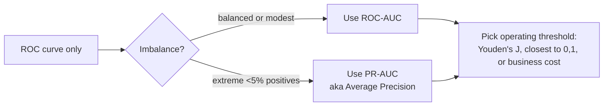

# Classification 7 — ROC Curve, AUC, Cost-Benefit Analysis

## Lectures covered
- Model Evaluation: ROC Curve & AUC
- Cost Benefit Analysis Using ROC in Sklearn

---

## In one sentence
The **ROC curve** plots how well your classifier separates positives from negatives across every possible threshold, and **AUC** distills that whole curve into one number — the probability that a random positive ranks higher than a random negative.

## Real-world analogy
Imagine a pile of resumes for one job opening. You give each one a "fit score" and want to invite the top few for interviews. A perfect ranker puts all the qualified candidates above all the unqualified ones — you'd invite the top 10 and never miss a good fit. **AUC = 1.0**. A random ranker mixes them — half your invites are wasted. **AUC = 0.5**. ROC and AUC measure how well a classifier *ranks* cases, regardless of where you draw the "invite/don't invite" line.

## The intuition (plain English)
1. Your classifier outputs a probability for each example, not just a label.
2. As you slide the decision threshold from 1.0 down to 0.0, you flag more positives. Both **TPR** (recall) and **FPR** (false-alarm rate) rise — the question is *how fast* TPR rises relative to FPR.
3. Plot (FPR, TPR) for every threshold. A great classifier shoots up the y-axis fast (catches positives) before FPR rises. A bad one rises diagonally (random).
4. **AUC** is the area under that curve. AUC = 0.5 random; AUC = 1.0 perfect.
5. **PR-AUC** (precision-recall AUC) is more honest under extreme imbalance — ROC can stay high while precision is awful.

## Mini worked example — 6 patients, 2 truly sick

```
patient   actual    model_prob
   A        sick      0.9
   B        sick      0.7
   C        healthy   0.6
   D        healthy   0.4
   E        sick      0.3
   F        healthy   0.1
```

Sweep threshold from 1.0 to 0.0. Each threshold gives one (FPR, TPR) point:

```
threshold   flagged       TP  FP  FN  TN     TPR=TP/2   FPR=FP/4
   0.95     none           0   0   2   4     0.0         0.0
   0.65     A              1   0   1   4     0.5         0.0
   0.55     A,B            2   0   0   4     1.0         0.0    ← perfect spot
   0.35     A,B,C          2   1   0   3     1.0         0.25
   0.20     A,B,C,D        2   2   0   2     1.0         0.50
   0.05     A,B,C,D,E,F    2   2   0   2 ... actually all 6 — TPR=1, FPR=1
```

The curve hugs the top-left corner up to threshold 0.55 — that's the sweet spot. Calculating AUC by trapezoid: ≈ 0.875. Strong model.

If patient E (sick, prob 0.3) had been ranked above patient C (healthy, prob 0.6), AUC would be 1.0. The curve sees ranking errors directly.

## At-a-glance — reading ROC

```
   TPR
    1 ┤             ╭─────────         <- great model, hugs top-left
      │           ╭/
      │         ╭/                      AUC area:
      │      ╭/                           1.0  perfect
      │    ╭/                             0.9  strong
      │  ╭/      ─ ─ ─ ─ ─ random         0.7  decent
    0 ┤╭/  ─ ─ ─ ─ ─                      0.5  random
      └──────────────────────► FPR
       0                       1
```



## Why this matters
- **Threshold-independent comparison.** Two models can both report "85% accuracy at threshold 0.5" but have very different AUCs — the one with higher AUC is genuinely better at ranking.
- **Real production decisions are about thresholds.** Operations teams set "review top 1000 cases per day" → translates to a threshold. AUC tells you how well your model would do at *any* such threshold.
- **Cost-benefit analysis** translates AUC into dollars: profit per TP, cost per FP, cost per FN — pick the threshold that maximizes expected profit.
- **Credit-risk project** reports both ROC-AUC and Gini (= 2·AUC − 1) because Gini is the regulator-standard metric.

---

## 1. The setup

A binary classifier outputs a probability for each example. To turn that into a 0/1 prediction, you choose a threshold.

Different thresholds → different (TPR, FPR) pairs. The **ROC curve** plots all these tradeoffs.

---

## 2. TPR and FPR

- **True Positive Rate** = Recall = TP / (TP + FN) — "of true positives, how many caught?"
- **False Positive Rate** = FP / (FP + TN) — "of true negatives, how many wrongly flagged?"

We want TPR high and FPR low.

---

## 3. The ROC curve

Y-axis: TPR (recall). X-axis: FPR. Sweep threshold from 0 → 1, plot the resulting (FPR, TPR) point.

```
TPR (recall)
1 ┤              ──────
  │           ──/
  │        ──/
  │     ──/
0 ┤  ──/  diagonal = random
  └──────────────────► FPR
  0                    1
```

- **Top-left corner (0, 1)** is perfection
- **Diagonal line** is random guessing
- **Better classifier** = curve hugs the top-left corner

```python
from sklearn.metrics import roc_curve
import matplotlib.pyplot as plt

fpr, tpr, thresholds = roc_curve(y_test, y_prob)
plt.plot(fpr, tpr); plt.plot([0,1], [0,1], "k--")
plt.xlabel("FPR"); plt.ylabel("TPR")
```

---

## 4. AUC — Area Under the ROC Curve

A single number summarizing the ROC curve.
- 0.5 = random
- 1.0 = perfect
- 0.7–0.8 = decent
- 0.8–0.9 = good
- > 0.9 = strong

```python
from sklearn.metrics import roc_auc_score
roc_auc_score(y_test, y_prob)
```

### What AUC actually measures
AUC = probability that a random positive is ranked higher than a random negative. **It's a ranking metric**, not a calibration metric.

### Why AUC is popular
- Threshold-independent — judges the model's ranking quality
- Single number, easy to compare across models
- Same value regardless of class distribution (mostly)

### Where AUC misleads
- **Severe imbalance**: AUC can stay high even when precision is poor
- **Different operating points** between models — AUC doesn't tell you which is better at *your* threshold
- For "PR-AUC > ROC-AUC at extreme imbalance" use `average_precision_score`

---

## 5. Precision-Recall curve & PR-AUC

When positives are rare, plot Precision (y) vs Recall (x).

```python
from sklearn.metrics import precision_recall_curve, average_precision_score
prec, rec, thr = precision_recall_curve(y_test, y_prob)
plt.plot(rec, prec)
print(average_precision_score(y_test, y_prob))
```

- AUC for this curve = **Average Precision**
- More informative than ROC-AUC when positives are <10%

---

## 6. Picking the operating point

### Geometric — closest to (0, 1)
```python
import numpy as np
distances = np.sqrt(fpr**2 + (1 - tpr)**2)
best_ix = np.argmin(distances)
best_threshold = thresholds[best_ix]
```

### Youden's J — TPR - FPR
```python
j_scores = tpr - fpr
best_ix = np.argmax(j_scores)
```

### Business-driven
"We can review 1000 cases per day." Set threshold so the top-1000 highest-probability cases are flagged.

```python
y_prob_sorted = np.sort(y_prob)[::-1]
threshold = y_prob_sorted[999]                 # 1000th-highest prob
```

---

## 7. Cost-benefit analysis using ROC

Codebasics walks through this. The idea:
- Each TP gives you **benefit** B (e.g., $100 saved per detected fraud)
- Each FP costs you C (e.g., $5 of review)
- Each FN costs you K (e.g., $10,000 of unrecovered fraud)
- Each TN is neutral (~0)

For each threshold:
$$\text{Profit} = TP \cdot B - FP \cdot C - FN \cdot K$$

Pick the threshold maximizing profit.

```python
import numpy as np
from sklearn.metrics import confusion_matrix

best_profit, best_threshold = -np.inf, 0.5
for t in np.linspace(0.01, 0.99, 99):
    y_pred = (y_prob >= t).astype(int)
    tn, fp, fn, tp = confusion_matrix(y_test, y_pred).ravel()
    profit = tp * 100 - fp * 5 - fn * 10000
    if profit > best_profit:
        best_profit, best_threshold = profit, t

print(best_threshold, best_profit)
```

This grounds threshold choice in **dollars**, which executives understand instantly.

---

## 8. Multiclass ROC

For k classes, compute ROC per class (One-vs-Rest):
```python
from sklearn.metrics import roc_auc_score
roc_auc_score(y_test, y_prob_matrix, multi_class="ovr", average="macro")
```

---

## 9. Calibration — when probabilities matter

ROC-AUC is about ranking. If you need probabilities to *match reality* (e.g., "30% chance of default" should mean ~30 of 100 such cases default), check **calibration**:

```python
from sklearn.calibration import calibration_curve
prob_true, prob_pred = calibration_curve(y_test, y_prob, n_bins=10)
plt.plot(prob_pred, prob_true, marker="o"); plt.plot([0,1],[0,1],"k--")
```

Curve hugging the diagonal = well-calibrated. SVMs and tree ensembles are often poorly calibrated → wrap in `CalibratedClassifierCV` for true probabilities.

---

## 10. Real workflow

```python
from sklearn.metrics import (roc_curve, roc_auc_score,
                              precision_recall_curve, average_precision_score)

y_prob = model.predict_proba(X_test)[:, 1]

print(f"ROC-AUC: {roc_auc_score(y_test, y_prob):.3f}")
print(f"PR-AUC:  {average_precision_score(y_test, y_prob):.3f}")

fpr, tpr, _ = roc_curve(y_test, y_prob)
prec, rec, _ = precision_recall_curve(y_test, y_prob)

fig, ax = plt.subplots(1, 2, figsize=(12, 4))
ax[0].plot(fpr, tpr); ax[0].plot([0,1],[0,1],"k--"); ax[0].set_title("ROC")
ax[1].plot(rec, prec); ax[1].set_title("Precision-Recall")
```

---

## 11. Common pitfalls

| Mistake | Effect | Fix |
|---|---|---|
| Reporting AUC on extreme imbalance | misleads about precision | also report PR-AUC |
| Reading AUC as "accuracy" | different concept | AUC = ranking quality |
| Assuming model probabilities are calibrated | downstream cost miscalc | calibrate explicitly |
| Different thresholds across models in same comparison | apples to oranges | compare at same operating point or via AUC |
| Plot ROC without zoom | hard to see differences | zoom into top-left corner |

## Self-check

- [ ] Define TPR and FPR.
- [ ] What does AUC = 0.85 actually mean (in ranking terms)?
- [ ] When prefer PR-AUC over ROC-AUC?
- [ ] How do you pick a decision threshold using cost-benefit?
- [ ] What's calibration and when does it matter?
- [ ] Why do tree ensembles often have poor calibration?
- [ ] Walk through a decision: "should we use threshold 0.3 or 0.5?" given a confusion matrix.
- [ ] Compute Youden's J and explain when use it.

---

## Glossary

| Term | Plain meaning |
|------|---------------|
| **ROC curve** | Plot of TPR (recall) vs FPR across all decision thresholds |
| **TPR (True Positive Rate)** | Same as recall: TP / (TP + FN) |
| **FPR (False Positive Rate)** | FP / (FP + TN) — how often we flag a true negative |
| **AUC (Area Under the ROC Curve)** | Single number summary of the ROC. 0.5 = random; 1.0 = perfect |
| **AUC interpretation** | Probability that a random positive ranks higher than a random negative |
| **Ranking metric** | A metric that grades the *order* of predictions, not their absolute values |
| **Calibration** | Whether predicted probabilities match real-world frequencies |
| **PR curve (Precision-Recall curve)** | Plot of precision vs recall across thresholds — better for rare events |
| **PR-AUC / Average Precision** | Area under the PR curve — preferred over ROC-AUC under extreme imbalance |
| **Decision threshold** | The probability cutoff for predicting positive (default 0.5) |
| **Operating point** | The (precision, recall) you actually deploy — pick via Youden's J or business cost |
| **Youden's J** | TPR − FPR — pick the threshold maximizing this for "balanced" tradeoff |
| **Closest to (0, 1)** | Geometric strategy: pick threshold minimizing distance to top-left corner |
| **Cost-benefit analysis** | Choose threshold by maximizing `TP·B − FP·C − FN·K` (dollars) |
| **Gini coefficient** | `2·AUC − 1` — banking-industry standard credit-risk metric |
| **KS statistic (Kolmogorov-Smirnov)** | Max gap between cumulative distributions of positives vs negatives — common in credit-risk |
| **Confusion matrix at threshold** | The 2×2 TP/FP/FN/TN counts at your chosen threshold |
| **`roc_curve` (sklearn)** | Function returning `(fpr, tpr, thresholds)` |
| **`roc_auc_score`** | Function returning AUC directly |
| **`precision_recall_curve`** | Returns `(precision, recall, thresholds)` |
| **`average_precision_score`** | Returns PR-AUC |
| **`predict_proba`** | Required for ROC/AUC — gives the score per sample |
| **`CalibratedClassifierCV`** | sklearn wrapper to fix poorly calibrated probabilities |
| **Multiclass ROC (OvR)** | Compute one ROC per class against the rest — average via `multi_class="ovr"` |

## Further reading
- Previous: [06-class-imbalance.md](06-class-imbalance.md)
- Next module: [../03-ensemble/01-bagging-random-forest.md](../03-ensemble/01-bagging-random-forest.md)
- Credit-risk project (uses AUC + Gini + KS): [../06-projects/02-credit-risk-classification.md](../06-projects/02-credit-risk-classification.md)
- Hypothesis-testing connection (Type I = FPR): [../../05-math-statistics/03-inferential/02-hypothesis-testing.md](../../05-math-statistics/03-inferential/02-hypothesis-testing.md)
